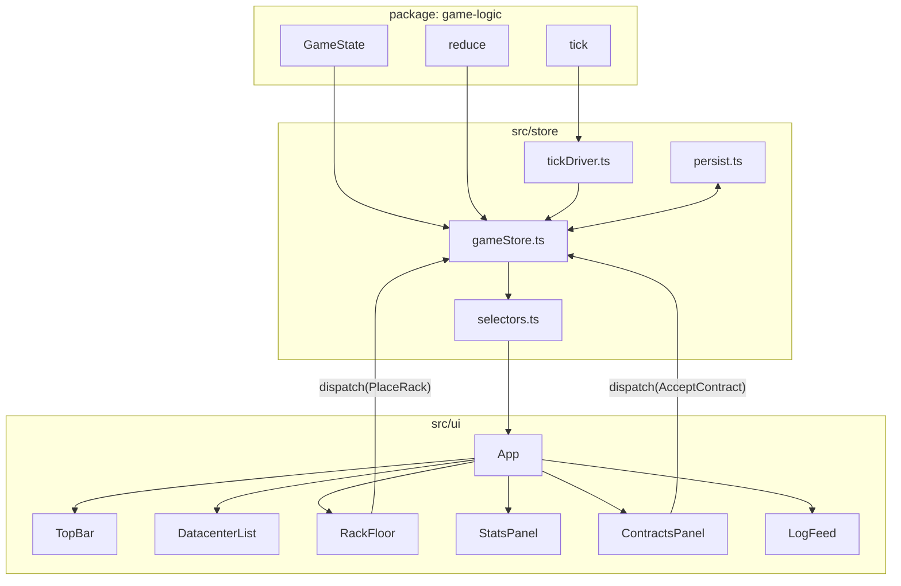
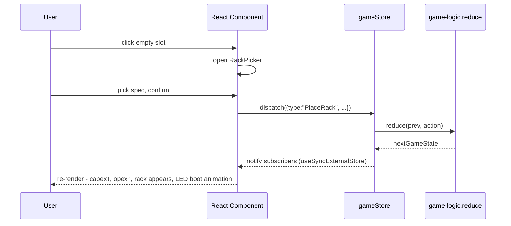
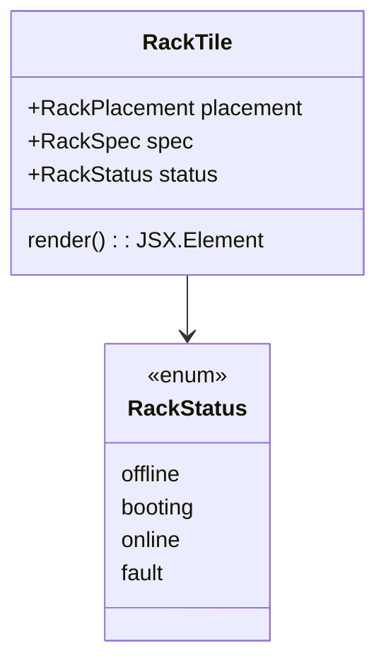

## Progress

- [x] **Phase 1 - Toolchain & framework decision**
  - [x] 1.1 Adopt React 18 + Vite + TypeScript (decision recorded in `AGENTS.md`)
  - [x] 1.2 Scaffold Vite project inside `packages/web` (preserve existing `package.json` fields, add deps)
  - [x] 1.3 Wire `dev` / `build` / `preview` / `typecheck` scripts; verify `@datacenter-tycoon/game-logic` import works
  - [x] 1.4 Add ESLint/Prettier config consistent with repo (or defer to root config if present)
- [x] **Phase 2 - Theme system (neon control center)**
  - [x] 2.1 Define CSS custom properties for color tokens, fonts, spacing, glow effects in `src/theme/tokens.css`
  - [x] 2.2 Global reset + base typography (monospace + display font) in `src/theme/global.css`
  - [x] 2.3 Reusable primitives: `Panel`, `StatTile`, `NeonButton`, `LedSegment`, `ProgressBar`
  - [x] 2.4 Storybook-lite playground route `/__theme` to eyeball primitives (no Storybook dep)
- [x] **Phase 3 - Game store (UI ↔ game-logic bridge)**
  - [x] 3.1 `src/store/gameStore.ts`: thin reactive wrapper around `reduce(state, action)` using `useSyncExternalStore`
  - [x] 3.2 Tick loop driver (real-time tick every N ms, pause/play/speed controls) - pure, testable
  - [x] 3.3 Selectors: `selectCash`, `selectDatacenter(id)`, `selectActiveContracts`, `selectMarket`, `selectOpexBreakdown`, `selectCapacity`, `selectFreeCapacity`, `selectMonthlyPnl`, `selectResourceUsage`
  - [x] 3.4 ID factory helpers (`nextDcId`, `nextRackPlacementId`) backed by `crypto.randomUUID`
  - [x] 3.5 Persist save to `localStorage` via `serialize`/`deserialize` from `game-logic/save`; autosave every 5 ticks + on every non-Tick dispatch
- [x] **Phase 4 — App shell & routing**
  - [x] 4.1 Top bar: company name, cash, monthly P&L, game date, tick speed controls (⏸ ▶ ▶▶ ▶▶▶)
  - [x] 4.2 Left rail: datacenter list + “New Datacenter” CTA
  - [x] 4.3 Main viewport: tabbed view per datacenter (Floor / Power / Contracts) — URL state via hash routing (no router dep)
  - [x] 4.4 Right rail: alerts/log feed (last 50 ledger entries, contract events)
- [ ] **Phase 5 - Datacenter onboarding flow**
  - [ ] 5.1 "New Datacenter" modal: pick spec from `DATACENTER_CATALOG`, see capex/staff/power preview, confirm
  - [ ] 5.2 Empty-state for floor view when no datacenter exists
  - [ ] 5.3 Insufficient-funds disabled state with explanatory tooltip
- [ ] **Phase 6 - Rack floor (the core interaction)**
  - [ ] 6.1 Grid renderer: CSS grid sized to `spec.rows × spec.positionsPerRow`
  - [ ] 6.2 Empty slot component: dashed neon outline, hover glow, click → opens "Buy Rack" picker
  - [ ] 6.3 Rack picker popover: filter by kind, show capex/power/heat/capacity per spec, disable invalid (power/cooling/funds)
  - [ ] 6.4 Rack component visual: vertical 1U-stack illustration with status LEDs (power, activity, fault), kind badge, tier pips
  - [ ] 6.5 Placement action dispatches `PlaceRack`; rack appears with subtle "boot-up" animation; LEDs animate
  - [ ] 6.6 Right-click / context menu: inspect rack, decommission (`RemoveRack`)
- [ ] **Phase 7 - Stats & resource panels**
  - [ ] 7.1 Datacenter header strip: power used/cap, cooling used/cap, bandwidth used/cap, slots used/cap (segmented neon bars)
  - [ ] 7.2 Capacity tiles: vCPU / RAM / Storage / GPU totals across all DCs and per-DC
  - [ ] 7.3 Opex breakdown card (power, cooling, bandwidth, staff, maintenance) updated each tick
  - [ ] 7.4 Capex/cash sparkline over last 60 ticks (canvas, no chart lib)
- [ ] **Phase 8 - Contracts panel**
  - [ ] 8.1 Market list: offered contracts with requirements vs. our free capacity, payment, term, expiry countdown
  - [ ] 8.2 Accept flow: select a target datacenter, confirm; dispatches `AcceptContract`
  - [ ] 8.3 Active contracts list: progress bars (months elapsed / term), status pill (active/breached), cancel button
  - [ ] 8.4 Upcoming/expiring banner in top bar when a contract is about to start or expire
- [ ] **Phase 9 - Polish, accessibility, and persistence**
  - [ ] 9.1 Keyboard nav across grid (arrow keys + enter to place), focus rings in neon style
  - [ ] 9.2 Sound-off-by-default LED hum + click SFX (single small audio sprite, optional)
  - [ ] 9.3 Save slot UI: New / Save / Load / Export JSON / Import JSON
  - [ ] 9.4 README with screenshots, dev instructions, theme tokens documented
- [ ] **Phase 10 - Testing**
  - [ ] 10.1 Unit tests for store reducer wrapper, selectors, tick driver (node:test)
  - [ ] 10.2 Component smoke tests for `RackTile`, `Grid`, `ContractCard` using `@testing-library/react` + `vitest` (or jsdom + node:test)
  - [ ] 10.3 Manual QA checklist in plan References

## Overview

We need the first playable **web** frontend for Datacenter Tycoon. The UI must feel like a **dark, neon-tinged operations control center** - think NORAD, EVE Online, or a `htop` rendered by a synthwave designer - with crisp typography, glowing edges, and live LED indicators.

Hard constraints from the user:
1. **No game engine** (no PixiJS / Phaser / Three / Babylon). Pure DOM + CSS + a tiny bit of canvas only where it earns its keep (sparklines).
2. The bulk of the UI is **textual / HUD-style** (numbers, bars, lists), so the DOM is a great fit and a11y comes for free.
3. **`game-logic` is the source of truth**: this package never reimplements rules, it only dispatches actions and renders selectors.

The flow we are wiring up end-to-end:

> _Start a datacenter → place racks on a grid (capex drops, opex grows, lights turn on) → see live capacity, power, cooling → browse contract market → accept contracts → watch monthly revenue and opex tick → manage cash._

## Architecture

### Stack decision

| Concern | Choice | Rationale |
|---|---|---|
| Framework | **React 18 + TypeScript** | Largest ecosystem, the team is most likely to know it, plays well with `useSyncExternalStore` for the game store, no engine baggage. |
| Bundler / dev | **Vite** | Fast HMR, native ESM, minimal config, matches repo's ESM-first stance. |
| Styling | **Vanilla CSS + CSS variables + CSS Modules** | Zero runtime, perfect for a tightly-curated theme. No Tailwind to keep the neon design intentional. |
| State | **Custom store** over `reduce()` from `game-logic` + `useSyncExternalStore` | Game state is already a pure reducer; we don't need Redux/Zustand bloat. |
| Routing | **Hash-based mini-router** (`#/dc/:id/floor`) | One screen app, no need for `react-router`. |
| Charts | **Hand-rolled `<canvas>` sparkline** | Avoids a chart lib for one tiny visualization. |
| Tests | **Vitest** (component) + repo's existing `node --test` for pure modules | Vitest is the de facto pairing for Vite. |

> Recorded in `packages/web/AGENTS.md` after Phase 1 lands.

### High-level component graph



### Data flow per user action



### Tick driver (real-time mapping)

The game's internal `Tick` is the abstract step from `game-logic`. The driver maps **real time → ticks**:

```ts
// 1× = 1 tick / 1000 ms; 2× = 500 ms; 3× = 250 ms; ⏸ = 0
type Speed = 0 | 1 | 2 | 3;

export function startTickDriver(store: GameStore, getSpeed: () => Speed) {
  let raf = 0, last = performance.now(), acc = 0;
  const loop = (now: number) => {
    const speed = getSpeed();
    const stepMs = speed === 0 ? Infinity : 1000 / speed;
    acc += now - last; last = now;
    while (acc >= stepMs) { store.dispatch({ type: "Tick" }); acc -= stepMs; }
    raf = requestAnimationFrame(loop);
  };
  raf = requestAnimationFrame(loop);
  return () => cancelAnimationFrame(raf);
}
```

### Theme tokens (excerpt)

```css
:root {
  --bg-0: #05070b;          /* deepest backdrop */
  --bg-1: #0a0e16;          /* panel surface */
  --bg-2: #11182a;          /* raised surface */
  --grid:  #1a2238;
  --fg-0:  #e6f1ff;
  --fg-1:  #8aa0c8;
  --fg-2:  #4a5a7a;

  --neon-cyan:    #5ef0ff;
  --neon-magenta: #ff4dd2;
  --neon-amber:   #ffb13c;
  --neon-lime:    #9bff5a;
  --neon-red:     #ff5470;

  --glow-cyan: 0 0 6px var(--neon-cyan), 0 0 18px rgba(94,240,255,.45);
  --glow-amber: 0 0 6px var(--neon-amber), 0 0 18px rgba(255,177,60,.4);

  --font-display: "Orbitron", "Rajdhani", system-ui, sans-serif;
  --font-mono:    "JetBrains Mono", ui-monospace, monospace;
}
```

### Rack visual (DOM-only)

A rack is a `<div>` column composed of:
- Top bezel with rack name + tier pips.
- 1U "blade" stripes (one per server slot - visual only for MVP).
- LED row at the bottom: `power` (cyan), `activity` (lime, blinks per tick), `fault` (red, only if `breached`/over-capacity).
- Kind badge (CPU / RAM / SSD / GPU) styled per kind color.



### URL / view state

```
/                      → redirects to first DC or empty state
#/dc/:dcId/floor       → grid + rack picker
#/dc/:dcId/power       → power & cooling deep view
#/contracts            → market + active contracts
#/log                  → ledger / events
#/__theme              → theme playground (dev only)
```

### Folder layout

```
packages/web/
├── index.html
├── vite.config.ts
├── tsconfig.json
├── src/
│   ├── main.tsx
│   ├── App.tsx
│   ├── theme/
│   │   ├── tokens.css
│   │   ├── global.css
│   │   └── primitives/   # Panel, StatTile, NeonButton, LedSegment, ProgressBar
│   ├── store/
│   │   ├── gameStore.ts
│   │   ├── tickDriver.ts
│   │   ├── selectors.ts
│   │   ├── persist.ts
│   │   └── ids.ts
│   ├── ui/
│   │   ├── topbar/
│   │   ├── left-rail/
│   │   ├── floor/        # Grid, Slot, RackTile, RackPicker
│   │   ├── stats/        # ResourceBars, CapacityTiles, OpexCard, CashSparkline
│   │   ├── contracts/    # MarketList, ActiveList, ContractCard
│   │   └── log/
│   ├── router/
│   │   └── hashRouter.ts
│   └── util/
└── public/
    └── fonts/            # Orbitron, JetBrains Mono subsets
```

## Phase 1 - Toolchain & framework decision

**Goal**: a runnable Vite + React + TS shell that imports `@datacenter-tycoon/game-logic` and prints `VERSION`.

### Step 1.1 - Record framework choice

- File: `packages/web/AGENTS.md`
- Replace the "framework choice not yet decided" line with a short ADR-style note: React 18 + Vite + TS + vanilla CSS, with rationale.
- Acceptance: file diff committed; root `AGENTS.md` unchanged.

### Step 1.2 - Scaffold Vite

- Files: `packages/web/package.json`, `vite.config.ts`, `tsconfig.json`, `index.html`, `src/main.tsx`, `src/App.tsx`.
- Add deps: `react`, `react-dom`. Dev deps: `vite`, `@vitejs/plugin-react`, `@types/react`, `@types/react-dom`, `vitest`, `jsdom`, `@testing-library/react`.
- Keep `"type": "module"` and ESM imports.
- Acceptance: `npm run dev -w @datacenter-tycoon/web` boots and shows "DCT v<VERSION>" pulled from game-logic.

### Step 1.3 - Scripts & typecheck

- File: `packages/web/package.json`.
- Replace placeholder `build`/`dev` with `vite build` / `vite`. Add `preview`. Keep `typecheck`. Add `test: vitest run`.
- Acceptance: all four scripts succeed in CI-like local run.

### Step 1.4 - Lint/format

- Adopt repo conventions; if no shared config, add minimal `.eslintrc.cjs` + `.prettierrc` matching the TS rules in root `AGENTS.md`.
- Acceptance: `npm run lint -w @datacenter-tycoon/web` clean.

## Phase 2 - Theme system

**Goal**: A small, opinionated set of primitives that every screen reuses, so screens look consistent without per-screen styling.

### Step 2.1 - Tokens

- File: `src/theme/tokens.css`
- Add palette, fonts, spacing scale, radii, shadows/glows, easing curves as CSS custom properties.
- Acceptance: imported once from `main.tsx`, visible via `getComputedStyle(:root)`.

### Step 2.2 - Global reset & base typography

- File: `src/theme/global.css`
- Reset margins, set `body` background `--bg-0`, base font `--font-mono`, `--font-display` for headings; subtle scanline overlay (`background-image: repeating-linear-gradient(...)` at 6% opacity) toggleable via `data-scanlines` on `<html>`.
- Acceptance: blank app already feels "control center".

### Step 2.3 - Primitives

- Files under `src/theme/primitives/`: `Panel.tsx`, `StatTile.tsx`, `NeonButton.tsx`, `LedSegment.tsx`, `ProgressBar.tsx` (segmented), each with co-located `.module.css`.
- Acceptance: each primitive has a `*.test.tsx` rendering smoke test.

### Step 2.4 - Theme playground

- File: `src/ui/theme-playground/index.tsx`, route `#/__theme`.
- Show every primitive in every state. Dev-only - render only when `import.meta.env.DEV`.
- Acceptance: visual sanity check page loads.

## Phase 3 - Game store

**Goal**: a thin, deterministic bridge between React and `reduce()`; nothing about game rules lives here.

### Step 3.1 - `gameStore.ts`

- Shape:

```ts
export interface GameStore {
  getState(): GameState;
  dispatch(action: Action): void;
  subscribe(cb: () => void): () => void;
}
export function createGameStore(initial: GameState): GameStore { /* ... */ }
```

- Wrap `reduce` from `game-logic`; notify subscribers synchronously after dispatch.
- Acceptance: unit tests cover dispatch / subscribe / unsubscribe.

### Step 3.2 - `tickDriver.ts`

- Implement the rAF-based driver from the Architecture section. Pure-ish: takes `dispatch` + `getSpeed`.
- Acceptance: unit test using fake timers verifies tick cadence per speed.

### Step 3.3 - Selectors

- File: `src/store/selectors.ts`. Each selector takes `GameState` and returns derived plain data.
- Use `aggregateCapacity`, `tickOpex` (or similar) helpers from `game-logic` - never recompute economy here.
- Acceptance: snapshot tests on a fixture state.

### Step 3.4 - IDs

- File: `src/store/ids.ts`. `nextDcId()`, `nextRackPlacementId()`, etc., backed by a simple counter persisted to the save.
- Acceptance: round-trip survives save/load.

### Step 3.5 - Persistence

- File: `src/store/persist.ts`. Auto-save to `localStorage` on every Nth tick + on action; load on boot.
- Use `serialize`/`deserialize` from `@datacenter-tycoon/game-logic/save`.
- Acceptance: refresh preserves state.

## Phase 4 - App shell & routing

**Goal**: the chrome around all gameplay screens.

### Step 4.1 - Top bar

- File: `src/ui/topbar/TopBar.tsx`.
- Shows: company name (editable), cash (large, neon, animated counter), monthly net (revenue - opex), tick / in-game date, speed controls (⏸ ▶ ▶▶ ▶▶▶).
- Acceptance: speed buttons change tick cadence visibly.

### Step 4.2 - Left rail

- File: `src/ui/left-rail/DatacenterList.tsx`.
- List of DCs with mini status (slots used, power %, online/fault). "+ New Datacenter" button at bottom.
- Acceptance: clicking a DC updates URL hash and main view.

### Step 4.3 - Main viewport tabs

- File: `src/ui/dc-view/DatacenterView.tsx`.
- Tabs: Floor / Power / Contracts. Default Floor.
- Acceptance: tab state in URL hash, deep-linking works.

### Step 4.4 - Right rail log feed

- File: `src/ui/log/LogFeed.tsx`.
- Renders last 50 ledger entries with type-specific neon color (capex=magenta, opex=amber, revenue=lime, penalty=red).
- Acceptance: entries appear in real time as ticks fire.

## Phase 5 - Datacenter onboarding

**Goal**: first-time and Nth-time path to spawn a DC.

### Step 5.1 - New Datacenter modal

- File: `src/ui/onboarding/NewDatacenterModal.tsx`.
- Lists `Object.values(DATACENTER_CATALOG)`; each card shows capex, monthly staff cost, power cap, cooling cap, grid size.
- Confirm dispatches `BuildDatacenter`.
- Acceptance: modal disabled cards when `cash < capex`, with reason tooltip.

### Step 5.2 - Empty state

- File: `src/ui/dc-view/EmptyState.tsx`.
- Shows "No datacenters online - build your first" with a single big neon CTA opening the modal.
- Acceptance: shown iff `state.datacenters.length === 0`.

### Step 5.3 - Insufficient funds UX

- Reusable `InsufficientFunds` component used by modal and rack picker.
- Acceptance: tooltip explains exact shortfall.

## Phase 6 - Rack floor

**Goal**: the headline interaction. Click empty slots → buy rack → it lights up.

### Step 6.1 - Grid renderer

- File: `src/ui/floor/Grid.tsx`.
- CSS grid `grid-template-columns: repeat(positionsPerRow, 1fr)` × `rows`; row labels A/B/C..., column labels 1..N.
- Acceptance: grid scales correctly for every DC spec in the catalog.

### Step 6.2 - Slot

- File: `src/ui/floor/Slot.tsx`.
- Empty: dashed `--neon-cyan` border at 30% opacity, `+` glyph on hover, click → `RackPicker`.
- Filled: render `RackTile`.
- Acceptance: hover/focus state visible; keyboard `Enter` opens picker.

### Step 6.3 - Rack picker

- File: `src/ui/floor/RackPicker.tsx`.
- Filter chips by kind (compute/memory/storage/gpu). Cards show capex, power, heat, capacity, monthly maintenance.
- Use `canPlaceRack(datacenter, spec, position)` from game-logic to disable invalid options with a precise reason.
- Acceptance: every `PlacementFailureReason` is human-readable.

### Step 6.4 - RackTile visual

- File: `src/ui/floor/RackTile.tsx` + `RackTile.module.css`.
- Vertical column with bezel, blade stripes, LED row, kind badge, tier pips. Pure CSS, no SVG required.
- LED states derived from selectors:
  - power LED: on iff DC has enough power budget for this rack.
  - activity LED: blinks every tick when assigned to an active contract.
  - fault LED: on iff contract serviced is `breached` or DC `slotsUsed > totalSlots` (shouldn't happen but defensive).
- Acceptance: visual passes the theme playground review.

### Step 6.5 - Place action

- Wire `RackPicker` confirm → `dispatch({type:"PlaceRack", ...})` with a freshly minted `placementId`.
- After dispatch: cash counter ticks down (capex), opex tile updates, rack tile mounts with a 600 ms boot animation (LEDs come on staggered).
- Acceptance: visible feedback within 1 frame.

### Step 6.6 - Decommission

- Right-click or context-menu icon → confirm → `dispatch({type:"RemoveRack", ...})`.
- Acceptance: rack disappears, opex drops, ledger entry appears.

## Phase 7 - Stats & resource panels

**Goal**: the player always knows their headroom.

### Step 7.1 - Resource header strip

- File: `src/ui/stats/ResourceBars.tsx`.
- Four segmented neon bars: Power, Cooling, Bandwidth, Slots. Color shifts cyan → amber → red as utilization climbs.
- Acceptance: numbers match `aggregateResourceUsage(datacenter)` from game-logic.

### Step 7.2 - Capacity tiles

- File: `src/ui/stats/CapacityTiles.tsx`.
- vCPU, RAM, Storage, GPU; show free vs allocated to active contracts.
- Acceptance: free = total - Σ(active contract requirements); never negative.

### Step 7.3 - Opex card

- File: `src/ui/stats/OpexCard.tsx`.
- Stacked horizontal bar of `OpexBreakdown` with tooltip per segment.
- Acceptance: total in card === `tickOpex(state).total` for the latest tick.

### Step 7.4 - Cash sparkline

- File: `src/ui/stats/CashSparkline.tsx` (canvas).
- Ring buffer of last 60 ticks of `player.cash`. Neon-cyan stroke, glow filter.
- Acceptance: redraws smoothly at 60 fps, no lib used.

## Phase 8 - Contracts panel

**Goal**: pick contracts that fit our capacity, accept them, watch them complete or breach.

### Step 8.1 - Market list

- File: `src/ui/contracts/MarketList.tsx`.
- Cards show: requirements (vCPU/RAM/Storage/GPU), monthly payment, term, penalty, expiry countdown.
- Inline indicator: ✅ fits / ⚠ partial / ❌ insufficient based on free capacity per DC.
- Acceptance: indicators recompute on every state change.

### Step 8.2 - Accept flow

- Button opens DC selector (only DCs with enough free capacity enabled).
- Dispatches `AcceptContract`.
- Acceptance: contract moves from market to active list, log shows revenue events at month boundaries.

### Step 8.3 - Active list

- Progress bar = `(currentTick - startedAtTick) / (termMonths × ticksPerMonth)`.
- Status pill colored per `ContractStatus`. Cancel button with confirm (incurs penalty per game rules - UI just dispatches `CancelContract`).
- Acceptance: completed contracts auto-archive after one tick.

### Step 8.4 - Banners

- Top-bar pill: "3 contracts expiring soon" / "Contract X breached".
- Acceptance: clicking jumps to `#/contracts`.

## Phase 9 - Polish, a11y, persistence UX

### Step 9.1 - Keyboard nav

- Arrow keys navigate the grid; `Enter` opens picker; `Esc` closes modals; `Space` pauses; `1/2/3` set speed.
- Acceptance: full happy path playable without mouse.

### Step 9.2 - Audio (optional, off by default)

- One small audio sprite (boot, click, alert). Toggle in settings menu.
- Acceptance: zero network audio if disabled.

### Step 9.3 - Save slots

- File: `src/ui/settings/SaveSlots.tsx`.
- New / Save / Load / Export JSON / Import JSON. 3 named slots in `localStorage`.
- Acceptance: import of an exported file restores state byte-for-byte.

### Step 9.4 - README

- File: `packages/web/README.md`.
- Run instructions, screenshot, theme tokens table, keybindings.
- Acceptance: someone can boot the app from a fresh clone using only README.

## Phase 10 - Testing

### Step 10.1 - Store tests

- `src/store/*.test.ts` using `node:test` + `tsx` (matches existing repo pattern).
- Cover dispatch ordering, subscriber notification, tick driver cadence, persistence round-trip.
- Acceptance: `npm test -w @datacenter-tycoon/web` green.

### Step 10.2 - Component tests

- Vitest + jsdom + Testing Library. One smoke test per primitive + per major panel (`Grid`, `RackTile`, `ContractCard`, `TopBar`).
- Acceptance: ≥ 60% statement coverage in `src/ui` and `src/store`.

### Step 10.3 - Manual QA checklist

- File: `packages/web/QA.md`.
- Steps to verify each user-flow listed in Overview end-to-end.
- Acceptance: a human can tick all boxes in < 5 minutes.

## Open questions

1. **Fonts**: ship Orbitron + JetBrains Mono locally (recommended for offline + Electron) vs. Google Fonts CDN?
2. **In-game time mapping**: how many ticks = 1 month? Need confirmation from `game-logic` constants before sparkline x-axis labels are accurate.
3. **Multiple datacenters in MVP**: confirm the user wants > 1 DC supported in this first pass (the plan assumes yes; reducing to 1 simplifies left rail).
4. **Cancel contract penalty**: is there an immediate cash hit, or only forfeited revenue? Wire the confirm dialog accordingly.

## References

- Root [`AGENTS.md`](../../AGENTS.md) - repo-wide rules (purity of `game-logic`, ESM, strict TS).
- [`packages/web/AGENTS.md`](../../packages/web/AGENTS.md) - package-local rules (no game rules here).
- [`.agents/plans/001-initial-game-logic.md`](./001-initial-game-logic.md) - types and reducer this UI consumes.
- React `useSyncExternalStore`: https://react.dev/reference/react/useSyncExternalStore
- Vite: https://vitejs.dev/

## Changelog

- 2026-05-01 - created.
