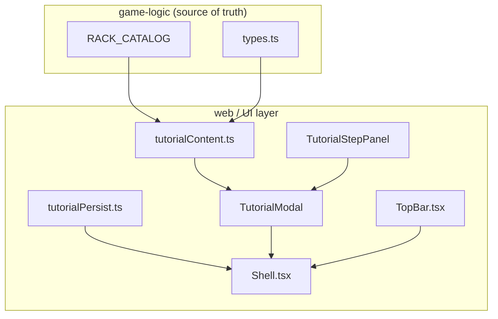

## Progress

- [x] **Phase 1 — Tutorial content model & persistence**
  - [x] 1.1 Define `TutorialStep` type and step content data structure
  - [x] 1.2 Add `tutorialSeen` flag to UI-local persistence layer
  - [x] 1.3 Unit tests for tutorial content and persistence helpers
- [x] **Phase 2 — Core tutorial UI components**
  - [x] 2.1 Build `TutorialModal` shell with step navigation (Next / Back / Skip)
  - [x] 2.2 Build `TutorialStepPanel` presentational component
  - [x] 2.3 Add CSS Module styles matching the neon theme
  - [x] 2.4 Unit tests for modal navigation and rendering
- [x] **Phase 3 — Step content implementation**
  - [x] 3.1 Step 1 — Types of Racks (compute, memory, storage, GPU)
  - [x] 3.2 Step 2 — Contracts (offered, active, requirements, penalties)
  - [x] 3.3 Step 3 — Datacenter Resources (power, cooling, bandwidth, floor space)
  - [x] 3.4 Step 4 — Making Money (fulfilling contracts, capex vs opex)
- [x] **Phase 4 — Integration & triggers**
  - [x] 4.1 Auto-open tutorial on first fresh game launch
  - [x] 4.2 Add "Help / How to Play" button to TopBar or Shell
  - [x] 4.3 Wire route or UI state so tutorial can be reopened
  - [x] 4.4 Manual QA: verify flow end-to-end

## Overview

New players currently land in an empty datacenter view with no guidance. This plan introduces a **step-by-step tutorial modal** that explains the four core gameplay pillars:

1. **Rack types** — what compute, memory, storage, and GPU racks provide.
2. **Contracts** — how the contract market works, requirements, term, and penalties.
3. **Datacenter resources** — power, cooling, bandwidth, and floor-space constraints.
4. **Revenue loop** — how fulfilling contracts generates revenue while capex and opex drain cash.

The tutorial auto-plays once on the very first launch (detected via a UI-local flag). A "Help" button in the shell lets players replay it at any time. All content is presentational — no game rules are duplicated; we import catalog data and types from `@datacenter-tycoon/game-logic`.

## Architecture



Key decisions:
- **Tutorial state is UI-local only** — whether the player has seen the tutorial is not part of `GameState`. It lives in a separate `localStorage` key (`datacenter-tycoon:tutorial-v1`). This keeps save/load and multiplayer semantics clean.
- **Content is data-driven** — each step is a plain object (`title`, `bodyMarkdown`, `illustration?`) rendered by a single `TutorialStepPanel`. Adding a fifth step later is a one-line data change.
- **No new routes** — the tutorial is a modal overlay, not a route. It can appear above any view.
- **Catalog-driven examples** — rack examples in Step 1 are pulled live from `RACK_CATALOG` so they stay accurate if balance changes.

```ts
// packages/web/src/ui/help/tutorialContent.ts
export interface TutorialStep {
  id: string;
  title: string;
  body: string;           // plain text / minimal HTML
  illustration?: "racks" | "contract" | "resources" | "money";
}

export const TUTORIAL_STEPS: TutorialStep[] = [ … ];
```

## Phase 1 — Tutorial content model & persistence

**Goal**: define the data structures and local-storage helpers so the UI knows *what* to show and *whether* it has already been shown.

### Step 1.1 — Define `TutorialStep` type and step content data structure

- File: `packages/web/src/ui/help/tutorialContent.ts`
- Create the `TutorialStep` interface (see Architecture).
- Create `TUTORIAL_STEPS` array with four steps. Step bodies should be concise (3–5 sentences each). Use game terminology from `game-logic` (`RackKind`, `ContractStatus`, etc.).
- For Step 1, import `RACK_CATALOG` from `@datacenter-tycoon/game-logic` and reference real rack names so examples stay in sync.
- Acceptance: `npm run typecheck -w @datacenter-tycoon/web` passes.

### Step 1.2 — Add `tutorialSeen` flag to UI-local persistence layer

- File: `packages/web/src/store/tutorialPersist.ts` (new)
- Export `hasSeenTutorial(): boolean` and `markTutorialSeen(): void`.
- Use a dedicated `localStorage` key (`datacenter-tycoon:tutorial-v1`).
- Keep it simple — no migration logic needed for a boolean flag.
- Acceptance: unit tests in `tutorialPersist.test.ts` verify read/write/reset behavior.

### Step 1.3 — Unit tests for tutorial content and persistence helpers

- Files:
  - `packages/web/src/ui/help/tutorialContent.test.ts` — assert `TUTORIAL_STEPS` has exactly 4 steps, each with non-empty `id`, `title`, `body`.
  - `packages/web/src/store/tutorialPersist.test.ts` — assert default is unseen, `markTutorialSeen` flips it, survives round-trip.
- Acceptance: `npm run test -w @datacenter-tycoon/web` passes.

## Phase 2 — Core tutorial UI components

**Goal**: build the modal shell and step renderer, styled to match the existing neon theme.

### Step 2.1 — Build `TutorialModal` shell with step navigation

- File: `packages/web/src/ui/help/TutorialModal.tsx`
- Props interface:
  ```ts
  interface TutorialModalProps {
    onClose: () => void;
    initialStep?: number;
  }
  ```
- State: current step index (0-based).
- Buttons: **Back** (disabled on step 0), **Next** (becomes "Finish" on last step), **Skip** (top-right corner).
- Calls `markTutorialSeen()` when the modal closes for any reason (Finish, Skip, or backdrop click).
- Acceptance: renders without crashing; `npm run typecheck` passes.

### Step 2.2 — Build `TutorialStepPanel` presentational component

- File: `packages/web/src/ui/help/TutorialStepPanel.tsx`
- Props:
  ```ts
  interface TutorialStepPanelProps {
    step: TutorialStep;
    stepNumber: number;
    totalSteps: number;
  }
  ```
- Renders title, body text, and an optional illustration placeholder div (colored block with an icon/emoji). Real illustrations can be added later; for now use CSS-styled placeholders.
- Acceptance: unit test asserts title and body are rendered, progress indicator shows correct fraction.

### Step 2.3 — Add CSS Module styles matching the neon theme

- File: `packages/web/src/ui/help/TutorialModal.module.css`
- Use existing CSS variables from `src/theme/` (e.g. `--color-panel-bg`, `--color-neon-cyan`, `--radius-lg`).
- Modal should be centered, semi-transparent backdrop, max-width ~640 px, responsive padding.
- Step content should have readable line-height and clear visual hierarchy.
- Acceptance: visual inspection in dev mode (`npm run dev`) shows a modal that matches the app's aesthetic.

### Step 2.4 — Unit tests for modal navigation and rendering

- File: `packages/web/src/ui/help/TutorialModal.test.tsx`
- Tests:
  - renders first step by default
  - clicking Next advances to step 2
  - clicking Back returns to step 1
  - clicking Skip calls `onClose`
  - clicking Finish on last step calls `onClose`
  - progress indicator updates
- Mock `markTutorialSeen` to avoid localStorage side effects.
- Acceptance: `npm run test -w @datacenter-tycoon/web` passes.

## Phase 3 — Step content implementation

**Goal**: write the actual educational copy for each of the four steps.

### Step 3.1 — Step 1 — Types of Racks

- File: `packages/web/src/ui/help/tutorialContent.ts`
- Content should explain the four `RackKind` values:
  - **Compute** — high vCPU, general-purpose workloads.
  - **Memory** — massive RAM for in-memory databases / caching.
  - **Storage** — huge disk capacity for archives and databases.
  - **GPU** — specialized FLOPS for AI/ML rendering.
- Mention tiers (1–3) and that higher tiers need liquid cooling.
- Pull one example rack per kind from `RACK_CATALOG` dynamically so stats are always current.
- Acceptance: copy is accurate against current catalog; no hard-coded stat numbers.

### Step 3.2 — Step 2 — Contracts

- File: `packages/web/src/ui/help/tutorialContent.ts`
- Content should cover:
  - Contracts appear in the **Market** with specific capacity requirements.
  - Accepting a contract makes it **Active** and reserves the demand against your datacenter capacity.
  - Each contract pays **monthly revenue** for the duration of its term.
  - If you fail to meet requirements, the contract becomes **Breached** and you pay a **penalty**.
- Acceptance: terminology matches `Contract`, `ContractStatus`, and `ContractRequirements` from `game-logic`.

### Step 3.3 — Step 3 — Datacenter Resources

- File: `packages/web/src/ui/help/tutorialContent.ts`
- Content should cover the four constraints checked by `canPlaceRack`:
  - **Power** — every rack draws kW; total must stay under the datacenter's power capacity.
  - **Cooling** — racks generate BTU/hr; air-cooled datacenters cannot host Tier-3 racks.
  - **Bandwidth** — network throughput is shared across all racks.
  - **Floor Space** — finite grid slots (rows × positions per row).
- Acceptance: references real `PlacementFailureReason` values conceptually, not code.

### Step 3.4 — Step 4 — Making Money by Fulfilling Contracts

- File: `packages/web/src/ui/help/tutorialContent.ts`
- Content should explain the loop:
  1. Buy racks (capex — one-time cost).
  2. Accept contracts that your aggregate capacity can satisfy.
  3. Receive monthly revenue while the contract is active.
  4. Pay monthly opex (power, cooling, staff, maintenance).
  5. Profit = revenue − opex. Breaches cost penalties.
- Mention that unused capacity earns nothing — efficiency matters.
- Acceptance: copy aligns with `OpexBreakdown`, `RevenueTickResult`, and ledger concepts in `game-logic`.

## Phase 4 — Integration & triggers

**Goal**: wire the tutorial into the app shell so it appears automatically for new players and can be reopened on demand.

### Step 4.1 — Auto-open tutorial on first fresh game launch

- File: `packages/web/src/App.tsx` or `packages/web/src/ui/shell/Shell.tsx`
- On bootstrap, if `hasSeenTutorial()` is **false** **and** the game is a fresh start (no save loaded), show `TutorialModal` immediately.
- Use a local React state flag in `Shell` (e.g. `showTutorial`) so it does not interfere with game state.
- Acceptance: starting a new game in an incognito window shows the tutorial; reloading an existing save does not.

### Step 4.2 — Add "Help / How to Play" button to TopBar or Shell

- File: `packages/web/src/ui/topbar/TopBar.tsx`
- Add a small "?" icon button (or text link) that opens the tutorial modal.
- Position it near the speed controls or cash display.
- Acceptance: button is visible and clickable in dev mode.

### Step 4.3 — Wire route or UI state so tutorial can be reopened

- File: `packages/web/src/ui/shell/Shell.tsx`
- Reuse the same `showTutorial` state flag; the Help button simply sets it to `true`.
- When reopened, the tutorial should start from step 0 (full replay).
- Acceptance: clicking Help opens the modal; finishing it closes it; clicking Help again reopens it.

### Step 4.4 — Manual QA: verify flow end-to-end

- Run `npm run dev` and perform the following checks:
  1. Clear localStorage, refresh — tutorial appears automatically.
  2. Click through all four steps, then Finish — modal closes, flag is set.
  3. Refresh — tutorial does **not** auto-appear.
  4. Click Help button — tutorial reopens from step 1.
  5. Click Skip — modal closes, flag is set.
  6. Resize browser to mobile width — modal remains readable.
- Acceptance: all six checks pass.

## References

- [AGENTS.md](../AGENTS.md)
- [packages/web/AGENTS.md](../packages/web/AGENTS.md)
- [packages/game-logic/AGENTS.md](../packages/game-logic/AGENTS.md)
- `packages/game-logic/src/catalog/racks.ts` — live rack catalog
- `packages/game-logic/src/types.ts` — domain types (`RackKind`, `Contract`, `OpexBreakdown`, etc.)
- `packages/web/src/ui/onboarding/NewDatacenterModal.tsx` — existing modal pattern to emulate
- `packages/web/src/store/persist.ts` — existing localStorage pattern

## Changelog

- 2026-05-01 — created.
