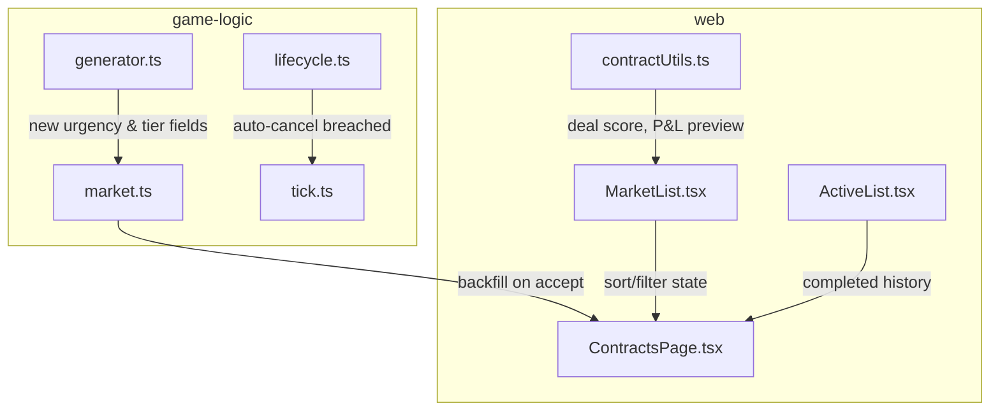

## Progress

- [x] **Phase 1 — Fix the offer window and early-game difficulty curve**
  - [x] 1.1 Increase `OFFER_DURATION_TICKS` from 3 → 6 and make it scale with game speed
  - [x] 1.2 Add early-game difficulty floor so first contracts are achievable with starter racks
  - [x] 1.3 Backfill market slot immediately on accept instead of waiting for next tick
  - [x] 1.4 Update unit tests for new expiry and difficulty behaviour
- [x] **Phase 2 — Add strategic contract mechanics**
  - [x] 2.1 Introduce `ContractTier` and `ContractUrgency` enums to generator
  - [x] 2.2 Rush contracts: higher payout, shorter decision window, shorter term
  - [x] 2.3 Long-term anchor contracts: lower per-month payout, longer term, softer penalties
  - [x] 2.4 Auto-cancel breached contracts after 1 penalty month instead of bleeding forever
  - [x] 2.5 Add unit tests for new contract types and lifecycle
- [x] **Phase 3 — Market UX: filtering, sorting, and deal quality**
  - [x] 3.1 Add "deal score" (monthlyPayment / aggregateRequirements) to each contract card
  - [x] 3.2 Add sort controls: Payment · Term · Expiry · Deal Score
  - [x] 3.3 Add filter pills: All · Fits now · High value · Rush · Long term
  - [x] 3.4 Add contract category icon/color badge (AI, Storage, Render, etc.)
  - [ ] 3.5 Unit tests for sort/filter UI state
- [x] **Phase 4 — Streamline accept flow and add financial preview**
  - [ ] 4.1 One-click "Accept to best DC" when only one datacenter can fulfill
  - [x] 4.2 Show estimated net P&L impact (revenue − estimated opex delta) before confirming
  - [x] 4.3 Replace 3-click flow with inline DC dropdown inside the contract card
  - [ ] 4.4 Keep full confirm step for contracts that would put player into negative cash
- [x] **Phase 5 — Active contract dashboard improvements**
  - [x] 5.1 Add "Completed" history tab with lifetime revenue/penalty totals
  - [x] 5.2 Show per-contract contribution margin (payment − attributed opex share)
  - [x] 5.3 Visual countdown timer for contracts nearing expiry
  - [x] 5.4 Breach early-warning: highlight contracts that will breach next tick if no action taken
- [ ] **Phase 6 — Integration polish and QA**
  - [x] 6.1 Update `game-logic` public API and README for new exports
  - [ ] 6.2 Update `AGENTS.md` with new contract vocabulary
  - [x] 6.3 Run full test suite across both packages
  - [ ] 6.4 Manual QA: verify accept → tick → breach → cancel → complete flow end-to-end

## Overview

Today’s contract system has several UX and design problems that frustrate new players and lacks strategic depth for experienced ones:

1. **Contracts expire in 3 ticks** — at any game speed, that’s barely enough time to read requirements, let alone compare against capacity. New players routinely miss offers.
2. **Early-game difficulty is ungated** — the market generator starts at difficulty 0.15 and scales linearly. A brand-new player with one C1 rack (128 vCPU) can be offered contracts demanding 200+ vCPU, making the first hour feel impossible.
3. **All-or-nothing fulfillment** — there is no partial credit, no "fulfill what you can" mechanic, and no way to scale into a contract over time.
4. **Breached contracts bleed forever** — a breached contract keeps charging penalties every tick until the player manually cancels or the term ends. This punishes inattention rather than rewarding strategy.
5. **Market UI is a static list** — 6 RNG-ordered cards with no sorting, filtering, or visual cue for "good deal vs bad deal."
6. **Accept flow is 3-click minimum** — Accept → Select DC → Confirm, even when only one DC exists and it clearly fits.
7. **No completed-contract history** — players lose visibility into their track record.

This plan overhauls the **backend lifecycle** (phases 1–2) and the **frontend market** (phases 3–5) to make contracts feel fair, readable, and strategically interesting.

## Architecture



Key decisions:
- **Difficulty now has a "starter mode"** — for ticks 0–5, the difficulty formula is clamped to a lower ceiling and themes that require GPU are suppressed. This guarantees achievable first contracts without making the whole game easy.
- **Urgency is data, not UI** — `ContractUrgency = "standard" | "rush" | "anchor"` lives in `game-logic` and affects `OFFER_DURATION_TICKS`, `termMonths`, and payout multipliers. The UI only styles it.
- **Backfill on accept** — when a contract is accepted, the market immediately generates one replacement (respecting `MARKET_REFRESH_SIZE`) so the UI never shows an empty slot mid-interaction.
- **Deal score is a pure frontend helper** — it uses existing `contract.requirements` and `monthlyPayment`; no backend changes needed.
- **Financial preview uses existing opex selectors** — we call `tickOpex` on a hypothetical "DC + contract" to show estimated margin before the player commits.

## Phase 1 — Fix the offer window and early-game difficulty curve

**Goal**: stop punishing new players with instant expiry and impossible starter contracts.

### Step 1.1 — Increase `OFFER_DURATION_TICKS` from 3 → 6 and make it scale with game speed

- File: `packages/game-logic/src/contracts/market.ts`
- Change `OFFER_DURATION_TICKS` from `3` to `6`.
- **Design note**: The web UI currently shows raw "ticks left." If we later want real-world time remaining, that calculation belongs in the frontend (`ticksLeft / speedSeconds`) and is out of scope for this plan.
- Acceptance: `npm run test -w @datacenter-tycoon/game-logic` passes; `tick.test.ts` updated to reflect new expiry values.

### Step 1.2 — Add early-game difficulty floor so first contracts are achievable with starter racks

- File: `packages/game-logic/src/contracts/market.ts`
- Update `marketDifficulty`:
  - For `currentTick <= 5`, clamp difficulty to `max(0.05, min(0.25, baseline + roll * 0.15))`.
  - For `currentTick > 5`, keep existing scaling but cap at `0.85` instead of `1.0` so end-game never demands unobtainable specs.
- File: `packages/game-logic/src/contracts/generator.ts`
- For `difficulty < 0.25`, suppress themes that require `gpuFlops > 0` (AI Training, Rendering Farm). Only vanilla compute/storage/memory themes appear early.
- Acceptance: integration test verifies that 10 contracts generated at tick 0 never demand more than 256 vCPU, 512 GB RAM, or any GPU.

### Step 1.3 — Backfill market slot immediately on accept instead of waiting for next tick

- File: `packages/game-logic/src/contracts/market.ts`
- In `acceptContract`, after removing the accepted contract, invoke `generateContract` once (if `contractMarket.length < MARKET_REFRESH_SIZE`) and append the new offer with `offeredAtTick = state.tick` and `expiresAtTick = state.tick + OFFER_DURATION_TICKS`.
- This keeps the market at full size and avoids the visual "card vanishes into empty slot" jank.
- Acceptance: unit test asserts that after `acceptContract`, market length remains `MARKET_REFRESH_SIZE`.

### Step 1.4 — Update unit tests for new expiry and difficulty behaviour

- Files:
  - `packages/game-logic/src/contracts/contracts.test.ts` — update expiry assertions from 3 → 6.
  - `packages/game-logic/src/sim/tick.test.ts` — update market assertions if they hard-code offer counts.
- Acceptance: `npm run test -w @datacenter-tycoon/game-logic` passes.

## Phase 2 — Add strategic contract mechanics

**Goal**: give contracts personality (rush vs anchor) and remove the "breached contracts bleed forever" trap.

### Step 2.1 — Introduce `ContractTier` and `ContractUrgency` enums to generator

- File: `packages/game-logic/src/types.ts`
- Add:
  ```ts
  export type ContractUrgency = "standard" | "rush" | "anchor";
  export type ContractTier = 1 | 2 | 3;
  ```
- Add fields to `Contract` interface:
  ```ts
  urgency: ContractUrgency;
  tier: ContractTier;
  ```
- **Save impact**: this changes persisted `Contract` shape. Update `src/save/serialize.ts` with a migration stub that defaults missing fields to `"standard"` and `1`.
- Acceptance: `npm run typecheck -w @datacenter-tycoon/game-logic` passes.

### Step 2.2 — Rush contracts: higher payout, shorter decision window, shorter term

- File: `packages/game-logic/src/contracts/generator.ts`
- When `rng.next() < 0.2` (20% chance), generate a **rush** contract:
  - `urgency = "rush"`
  - `OFFER_DURATION_TICKS = 2` (decision window halved)
  - `termMonths = 1 + floor(rng.next() * 2)` (1–2 months)
  - `monthlyPayment *= 1.4` (40% premium)
  - `penaltyPerMonth *= 1.2`
- Acceptance: unit test generates 100 contracts, asserts ~15–25% are rush, and all rush contracts have `termMonths <= 2`.

### Step 2.3 — Long-term anchor contracts: lower per-month payout, longer term, softer penalties

- File: `packages/game-logic/src/contracts/generator.ts`
- When `rng.next() < 0.15` (15% chance), generate an **anchor** contract:
  - `urgency = "anchor"`
  - `termMonths = 8 + floor(rng.next() * 6)` (8–13 months)
  - `monthlyPayment *= 0.75` (25% discount)
  - `penaltyPerMonth *= 0.6`
- Acceptance: unit test asserts anchor contracts have `termMonths >= 8` and `monthlyPayment < weightedValue * 1.0`.

### Step 2.4 — Auto-cancel breached contracts after 1 penalty month instead of bleeding forever

- File: `packages/game-logic/src/contracts/lifecycle.ts`
- Update `advanceContract`:
  - If status is `"breached"` and it has already been breached for **1 full tick** (i.e. `currentTick >= (startedAtTick ?? 0) + 1`), immediately transition to `"cancelled"`.
  - This gives the player one penalty tick to react, then stops the bleed.
- Alternative (simpler): if `contract.status === "breached"`, set `"cancelled"` right away and charge one final penalty in `tickRevenue`. The plan implementer should pick the cleaner of the two and document it.
- Acceptance:
  - `tick.test.ts` updated: a breached contract at tick N is cancelled by tick N+1, with exactly one penalty ledger entry.
  - `contracts.test.ts` updated: `advanceContract` tests reflect new auto-cancel.

### Step 2.5 — Add unit tests for new contract types and lifecycle

- File: `packages/game-logic/src/contracts/contracts.test.ts`
- Add tests:
  - `generateContract` produces all three urgency types over a large sample.
  - Rush contracts have shorter expiry and higher payment than a standard of same difficulty.
  - Anchor contracts have longer term and lower penalty.
  - Auto-cancel: breached contract becomes cancelled after exactly one additional tick.
- Acceptance: `npm run test -w @datacenter-tycoon/game-logic` passes.

## Phase 3 — Market UX: filtering, sorting, and deal quality

**Goal**: transform the market from a static RNG list into a scannable, sortable dashboard.

### Step 3.1 — Add "deal score" (monthlyPayment / aggregateRequirements) to each contract card

- File: `packages/web/src/ui/contracts/contractUtils.ts`
- Add `contractDealScore(contract): number` — a dimensionless ratio of monthlyPayment to the weighted sum of requirements (use the same `PRICING_WEIGHTS` from game-logic, or import them if exported; otherwise duplicate with a comment).
- Higher score = better deal.
- File: `packages/web/src/ui/contracts/MarketList.tsx`
- Render a small badge like "★ 1.4×" or "Deal: Great" next to the payment line.
- Acceptance: unit test for `contractDealScore` with known inputs returns expected ratio.

### Step 3.2 — Add sort controls: Payment · Term · Expiry · Deal Score

- File: `packages/web/src/ui/contracts/ContractsPage.tsx`
- Add a second control row below tabs: `[Sort: Payment ▼] [Filter: All ▼]`.
- State: `sortKey: "payment" | "term" | "expiry" | "score"` and `sortDir: "asc" | "desc"`.
- Pass sorted array into `MarketList` via props (keep `MarketList` presentational).
- File: `packages/web/src/ui/contracts/ContractsPage.module.css`
- Style sort controls to match tab bar.
- Acceptance: clicking a sort key reorders cards; clicking again toggles direction.

### Step 3.3 — Add filter pills: All · Fits now · High value · Rush · Long term

- File: `packages/web/src/ui/contracts/ContractsPage.tsx`
- Add filter pills as a row of toggle buttons.
- Filters:
  - **All** — no filter.
  - **Fits now** — `fitStatus === "fits"`.
  - **High value** — `dealScore >= 1.2`.
  - **Rush** — `urgency === "rush"`.
  - **Long term** — `urgency === "anchor"`.
- Multiple pills can be active (AND logic) or single-select; implementer should choose the simpler UX and document it.
- Acceptance: filters correctly reduce card count; "Fits now" only shows contracts the player can immediately accept.

### Step 3.4 — Add contract category icon/color badge (AI, Storage, Render, etc.)

- File: `packages/web/src/ui/contracts/MarketList.tsx`
- Map `contract.name` (or the theme name) to a two-letter abbreviation and a CSS color class:
  - "AI Model Training Job" → "AI" · purple
  - "Realtime Analytics Cluster" → "AN" · cyan
  - "Edge Compute Burst" → "EC" · lime
  - "Small Data Storage Startup" → "ST" · blue
  - "Rendering Farm" → "RF" · amber
  - "In-Memory Database Migration" → "DB" · pink
- Render as a small square badge on the contract card.
- This gives players instant visual scanning without reading full text.
- Acceptance: each of the 6 theme names renders the correct badge and color.

### Step 3.5 — Unit tests for sort/filter UI state

- File: `packages/web/src/ui/contracts/ContractsPage.test.tsx` (new)
- Assert that:
  - default sort is by expiry (soonest first)
  - clicking "Payment" reorders cards with highest payment first
  - selecting "Rush" pill hides non-rush contracts
- Mock contracts to avoid RNG dependence.
- Acceptance: `npm run test -w @datacenter-tycoon/web` passes.

## Phase 4 — Streamline accept flow and add financial preview

**Goal**: reduce friction from 3 clicks to 1 in simple cases, and show players the *real* financial impact before they commit.

### Step 4.1 — One-click "Accept to best DC" when only one datacenter can fulfill

- File: `packages/web/src/ui/contracts/MarketList.tsx`
- Before showing the DC selector, check:
  - If `datacenters.length === 1` and `canFulfill(free, reqs)`, skip selector and show Confirm directly.
  - If multiple DCs exist but **exactly one** can fulfill, also skip selector and pre-fill that DC.
- Only show the full DC list when 0 or 2+ datacenters can fulfill.
- Acceptance: manual QA — with 1 DC, accepting a contract is 2 clicks (Accept → Confirm).

### Step 4.2 — Show estimated net P&L impact (revenue − estimated opex delta) before confirming

- File: `packages/web/src/ui/contracts/contractUtils.ts`
- Add `estimateContractMargin(contract, datacenter, activeContracts): { revenue, addedOpex, net }`:
  - `revenue = contract.monthlyPayment`
  - `addedOpex = tickOpex(hypotheticalDcWithContract) − tickOpex(dcWithoutContract)`
  - For simplicity, estimate added opex as the rack maintenance share + a small power premium based on requirements; if too complex, approximate from existing `tickOpex`.
- File: `packages/web/src/ui/contracts/MarketList.tsx`
- In the confirm panel, show a mini P&L line: `"+ $12K/mo revenue  −  $4.5K/mo opex  =  +$7.5K/mo net"`.
- If net is negative, highlight in red and add a warning: `"This contract will lose money with current infrastructure."`
- Acceptance: unit test for `estimateContractMargin` with a known DC + contract returns plausible numbers.

### Step 4.3 — Replace 3-click flow with inline DC dropdown inside the contract card

- File: `packages/web/src/ui/contracts/MarketList.tsx`
- When the player clicks **Accept**, expand the card inline (instead of replacing the whole card with a selector).
- The expanded area shows:
  - DC dropdown (or buttons if <=3 DCs)
  - Estimated P&L from Step 4.2
  - **Confirm** / **Cancel** buttons
- This keeps context (requirements, deal score) visible while deciding.
- Acceptance: visual inspection — expanded card does not push other cards off-screen unnaturally.

### Step 4.4 — Keep full confirm step for contracts that would put player into negative cash

- File: `packages/web/src/ui/contracts/MarketList.tsx`
- Before dispatching `AcceptContract`, check if `player.cash < 0` after accounting for immediate capex (none for contracts) + first-month opex delta.
- If accepting would drive cash negative, show an extra "Are you sure?" dialog: `"Accepting this contract will leave you with $-X. You may breach and pay penalties."`
- This acts as a guardrail without preventing the action.
- Acceptance: manual QA — accept a money-losing contract triggers the warning; accepting a profitable one does not.

## Phase 5 — Active contract dashboard improvements

**Goal**: give players visibility into history, margins, and impending problems.

### Step 5.1 — Add "Completed" history tab with lifetime revenue/penalty totals

- File: `packages/web/src/ui/contracts/ContractsPage.tsx`
- Add third tab: **COMPLETED**.
- File: `packages/web/src/ui/contracts/CompletedList.tsx` (new)
- Render `activeContracts` filtered by `status === "completed"` or `"cancelled"`.
- Show: name, assigned DC, final status, total revenue earned (or penalty paid), term length.
- Aggregate footer: `"Lifetime contract revenue: $X  |  Penalties: $Y  |  Net: $Z"`.
- File: `packages/web/src/store/selectors.ts`
- Add `selectContractHistory(state): Contract[]` if needed.
- Acceptance: completed contracts appear here; cancelled ones also appear with red penalty totals.

### Step 5.2 — Show per-contract contribution margin (payment − attributed opex share)

- File: `packages/web/src/ui/contracts/ActiveList.tsx`
- For each active contract, compute an **attributed opex share**:
  - `dcOpex = tickOpex(datacenter).total`
  - `numContractsOnDc = activeContracts.filter(c => c.assignedDcId === dc.id && c.status === "active").length`
  - `attributedOpex = dcOpex / max(numContractsOnDc, 1)`
- Show margin: `"$12K/mo  −  $3K opex  =  $9K margin"`.
- This helps players identify which contracts are actually profitable vs which just look big.
- Acceptance: unit test for margin calculation with 2 contracts on same DC splits opex 50/50.

### Step 5.3 — Visual countdown timer for contracts nearing expiry

- File: `packages/web/src/ui/contracts/ActiveList.tsx`
- Already has a `ProgressBar`. Enhance it:
  - When `monthsLeft <= 2`, bar color pulses/animates (CSS keyframe) to draw attention.
  - Show "Expires next tick!" text when `monthsLeft === 1`.
- This is pure CSS + presentational logic.
- Acceptance: visual inspection.

### Step 5.4 — Breach early-warning: highlight contracts that will breach next tick if no action taken

- File: `packages/web/src/ui/contracts/ActiveList.tsx`
- For each active contract, compute whether the assigned DC *will* still satisfy requirements next tick.
- If `!canFulfill(freeCapacityAfterGrowth, requirements)` — actually, since capacity only changes on player action, this simplifies to: if `!canFulfill(dcFreeCapacity(dc, activeContracts), requirements)`, it is ALREADY breached.
- For a *future* breach warning, we need to check if the player is about to remove a rack that would drop capacity below requirements. This requires tracking pending actions, which is complex.
- **Simpler approach**: if a contract is currently `active` but `freeCapacity < requirements * 1.1` (within 10% of breach), show a yellow warning badge: `"Capacity buffer low"`.
- Acceptance: a contract with 0 remaining free capacity shows yellow warning; one with comfortable headroom does not.

## Phase 6 — Integration polish and QA

**Goal**: ship with updated docs and passing tests.

### Step 6.1 — Update `game-logic` public API and README for new exports

- File: `packages/game-logic/src/index.ts`
- Export `ContractUrgency`, `ContractTier` (or keep internal if only used by generator).
- File: `packages/game-logic/README.md`
- Document new contract urgency types and the improved difficulty curve.
- Acceptance: `npm run build -w @datacenter-tycoon/game-logic` passes.

### Step 6.2 — Update `AGENTS.md` with new contract vocabulary

- File: `packages/game-logic/AGENTS.md`
- Add `ContractUrgency` and `ContractTier` to the domain vocabulary section.
- Note the new auto-cancel behaviour for breached contracts.
- File: `packages/web/AGENTS.md`
- Mention new sort/filter UI patterns under the Framework Decision table.
- Acceptance: AGENTS.md files are consistent with code.

### Step 6.3 — Run full test suite across both packages

- Commands:
  ```bash
  npm run typecheck
  npm run test
  npm run build
  ```
- Acceptance: all three commands exit 0.

### Step 6.4 — Manual QA: verify accept → tick → breach → cancel → complete flow end-to-end

- Launch dev server (`npm run dev`).
- Perform the following scenario:
  1. Start new game → verify first market contracts are achievable (no impossible GPU demands).
  2. Accept a standard contract → market backfills immediately.
  3. Let it run for 3 ticks → verify revenue accrues and contract progresses.
  4. Accept a second contract that over-commits → verify breach warning appears.
  5. Let breached contract sit → verify it auto-cancels after exactly 1 penalty month.
  6. Let a healthy contract finish its term → verify it moves to Completed tab with correct total.
  7. Sort market by Payment → verify order changes.
  8. Filter by "Rush" → verify only rush contracts shown.
- Acceptance: all 8 checks pass.

## References

- [AGENTS.md](../AGENTS.md)
- [packages/game-logic/AGENTS.md](../packages/game-logic/AGENTS.md)
- [packages/web/AGENTS.md](../packages/web/AGENTS.md)
- `packages/game-logic/src/contracts/market.ts` — offer expiry, difficulty, backfill logic
- `packages/game-logic/src/contracts/generator.ts` — contract generation themes and pricing
- `packages/game-logic/src/contracts/lifecycle.ts` — breach/completion state machine
- `packages/game-logic/src/sim/tick.ts` — monthly revenue/penalty application
- `packages/web/src/ui/contracts/MarketList.tsx` — existing market UI
- `packages/web/src/ui/contracts/ActiveList.tsx` — existing active contract UI
- `packages/web/src/ui/contracts/contractUtils.ts` — capacity math helpers
- Plan `004-first-time-help-screen.md` — the tutorial plan references contract mechanics; if both plans are implemented, ensure tutorial copy reflects the new urgency types.

## Changelog

- 2026-05-01 — created.
