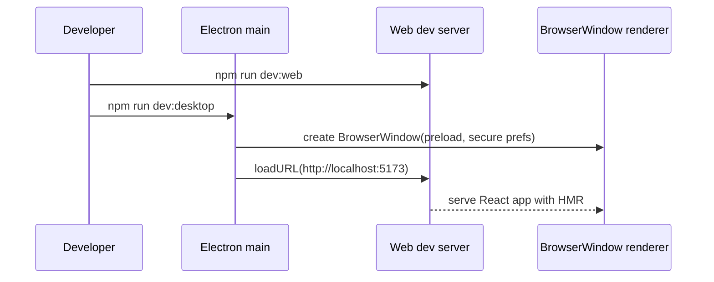
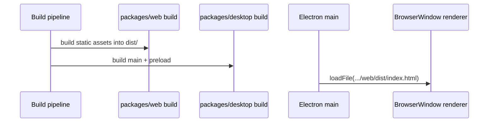

## Progress

- [x] **Phase 1 — Package foundation & tooling**
  - [x] 1.1 Define the desktop package runtime, dependencies, and scripts
  - [x] 1.2 Choose and configure the Electron build toolchain
  - [x] 1.3 Establish desktop source layout and TypeScript boundaries
- [x] **Phase 2 — Main process shell**
  - [x] 2.1 Implement Electron app lifecycle and window creation
  - [x] 2.2 Add development-vs-production renderer loading
  - [x] 2.3 Add platform-safe app behavior and desktop metadata
- [x] **Phase 3 — Secure preload bridge**
  - [x] 3.1 Add preload entrypoint with `contextBridge`
  - [x] 3.2 Define a typed renderer-facing desktop API
  - [x] 3.3 Add the first minimal IPC handlers and tests
- [x] **Phase 4 — Reuse the web app as renderer**
  - [x] 4.1 Decide how `packages/web` is built and consumed by desktop
  - [x] 4.2 Make the web app Electron-aware without forking the UI
  - [x] 4.3 Verify production asset loading from the desktop bundle
- [x] **Phase 5 — Workspace orchestration & developer experience**
  - [x] 5.1 Wire root and package scripts for local development
  - [x] 5.2 Wire build ordering so desktop depends on web output
  - [x] 5.3 Add debugging, smoke tests, and CI-safe validation
- [x] **Phase 6 — Packaging & distribution readiness**
  - [x] 6.1 Add installer/distribution configuration
  - [x] 6.2 Define desktop app assets, versioning, and output layout
  - [x] 6.3 Document release caveats and platform follow-ups

## Overview

We need to turn `packages/desktop/` from a stub into a real Electron application that wraps the existing React + Vite web frontend instead of duplicating it. The desktop app should own only Electron-specific concerns: the main process, the preload bridge, packaging, and workspace orchestration. The web package remains the renderer source of truth, while desktop loads the web app in development from the Vite dev server and in production from built static assets.

This plan is based on Electron security guidance and common Electron+Vite packaging patterns: use a `BrowserWindow` with secure defaults, expose only narrow APIs via a preload script, load the Vite dev server in development, and load built files in production. The result should preserve the existing browser app while enabling a native desktop wrapper with minimal duplication.

## Architecture

```mermaid
flowchart LR
    RootScripts[workspace scripts] --> WebBuild[@datacenter-tycoon/web build/dev]
    RootScripts --> DesktopBuild[@datacenter-tycoon/desktop build/dev]
    DesktopBuild --> Main[Electron main process]
    DesktopBuild --> Preload[Electron preload]
    WebBuild --> Renderer[Web app renderer assets]
    Main --> BrowserWindow
    Preload --> BrowserWindow
    Renderer --> BrowserWindow
    BrowserWindow --> User[Desktop player]
```





Key decisions:
- `packages/web` stays the only renderer codebase; `packages/desktop` must not reimplement UI.
- Desktop-specific capabilities are exposed only through preload APIs, not by enabling `nodeIntegration`.
- Use `contextIsolation: true` and `nodeIntegration: false` in the browser window.
- The first deliverable should be a thin wrapper that launches the existing game UI; native integrations can remain minimal at first.
- Build orchestration must respect monorepo boundaries: desktop depends on web build output, but web must not depend on desktop.

Illustrative main/preload contract:

```ts
// packages/desktop/src/preload.ts
contextBridge.exposeInMainWorld('desktop', {
  getAppVersion: () => ipcRenderer.invoke('app:getVersion')
});
```

```ts
// packages/web/src/types/desktop.d.ts
interface Window {
  desktop?: {
    getAppVersion(): Promise<string>;
  };
}
```

## Phase 1 — Package foundation & tooling

**Goal**: replace the placeholder desktop package with a concrete Electron toolchain and project structure that fits the npm workspace.

### Step 1.1 — Define the desktop package runtime, dependencies, and scripts

- Files: `packages/desktop/package.json`, root `package.json`
- Replace the stub `build` and `dev` scripts with real Electron-oriented commands.
- Add core dependencies/devDependencies needed for Electron development and packaging.
- Ensure root `build:desktop` and `dev:desktop` scripts remain the entrypoints used from the workspace root.
- Acceptance: `npm run dev:desktop` and `npm run build:desktop` resolve to real commands instead of placeholders.

### Step 1.2 — Choose and configure the Electron build toolchain

- Files: `packages/desktop/package.json`, `packages/desktop/electron.vite.config.ts` or equivalent build config
- Decide whether to use `electron-vite` as the package-local build tool for main/preload orchestration.
- Configure separate outputs for main and preload bundles and align them with the package's `dist/` layout.
- Keep the renderer rooted in `packages/web` rather than introducing a second renderer tree under `desktop`.
- Acceptance: a documented toolchain choice exists and desktop can build main/preload artifacts into predictable output folders.

### Step 1.3 — Establish desktop source layout and TypeScript boundaries

- Files: `packages/desktop/tsconfig.json`, `packages/desktop/src/**`
- Split the current stub into explicit areas such as `src/main/`, `src/preload/`, and optionally `src/shared/` or `src/ipc/`.
- Ensure Node/Electron-only code stays inside `packages/desktop` and is never imported by `web` or `game-logic` directly.
- Add any necessary type declarations for preload-exposed APIs that the web app will consume.
- Acceptance: the source layout clearly separates main process, preload, IPC, and shared desktop-only types.

## Phase 2 — Main process shell

**Goal**: create a minimal but production-shaped Electron shell that opens a secure application window and manages the app lifecycle.

### Step 2.1 — Implement Electron app lifecycle and window creation

- Files: `packages/desktop/src/main/index.ts` (or equivalent), `packages/desktop/src/main/window.ts`
- Implement `app.whenReady()` startup, `createWindow()`, and standard lifecycle handlers.
- Set sensible initial window dimensions, title, and basic desktop options.
- Keep the shell thin: it should launch the renderer, not host game logic.
- Acceptance: launching the desktop app creates a visible Electron window and quits/reopens correctly for supported platforms.

### Step 2.2 — Add development-vs-production renderer loading

- Files: `packages/desktop/src/main/index.ts`, desktop config/env helpers
- In development, load the web package's Vite dev server URL.
- In production, load the built `packages/web/dist/index.html` file path.
- Add environment detection and path resolution that work when running from the monorepo and when packaged.
- Acceptance: dev mode points to a live web dev server; build mode points to built static files without manual editing.

### Step 2.3 — Add platform-safe app behavior and desktop metadata

- Files: `packages/desktop/src/main/index.ts`, desktop package metadata/config files
- Implement standard macOS activate behavior and non-macOS `window-all-closed` quitting behavior.
- Set app name/product metadata and prepare icon placeholders if needed.
- Decide whether devtools open automatically in development only.
- Acceptance: app lifecycle matches normal Electron conventions across development platforms.

## Phase 3 — Secure preload bridge

**Goal**: add a preload boundary that keeps the renderer sandboxed while still allowing narrowly scoped desktop capabilities.

### Step 3.1 — Add preload entrypoint with `contextBridge`

- Files: `packages/desktop/src/preload/index.ts`, main window config
- Create a preload script and register it on the `BrowserWindow`.
- Ensure `contextIsolation: true` and `nodeIntegration: false` are set on the browser window.
- Expose only explicit functions rather than the raw `ipcRenderer` object.
- Acceptance: the renderer can access a controlled API on `window`, and Electron security settings are enforced.

### Step 3.2 — Define a typed renderer-facing desktop API

- Files: `packages/desktop/src/preload/index.ts`, `packages/web/src/**/*.d.ts` or a shared declaration file
- Start with a very small API surface such as `getAppVersion()`, `isDesktop`, or future-safe save/load helpers.
- Define the TypeScript contract the web app sees so desktop integrations are discoverable and type-safe.
- Keep the API additive and optional so the web app still works in a normal browser.
- Acceptance: browser builds compile without Electron globals, and desktop builds expose a typed `window.desktop` API.

### Step 3.3 — Add the first minimal IPC handlers and tests

- Files: `packages/desktop/src/main/ipc.ts`, `packages/desktop/src/**/*.test.ts`
- Implement one or two safe IPC handlers to validate the preload-to-main pattern.
- Prefer low-risk handlers first, such as app metadata or simple dialogs, not filesystem-heavy features.
- Add tests for any pure helpers and narrow unit coverage around IPC registration where feasible.
- Acceptance: at least one preload-exposed function round-trips through IPC successfully in development.

## Phase 4 — Reuse the web app as renderer

**Goal**: ensure the existing web package runs inside Electron with minimal renderer changes and no duplicated UI code.

### Step 4.1 — Decide how `packages/web` is built and consumed by desktop

- Files: `packages/web/package.json`, `packages/desktop/package.json`, root scripts/config
- Confirm that desktop will consume `packages/web/dist` as the production renderer output.
- If needed, add build-order guarantees so desktop packaging always runs after the web build.
- Avoid brittle assumptions about hashed asset names by loading `index.html` and letting Vite asset references resolve normally.
- Acceptance: the dependency between desktop and web build outputs is explicit and scriptable.

### Step 4.2 — Make the web app Electron-aware without forking the UI

- Files: `packages/web/src/**`
- Add minimal runtime detection for whether the app is running under Electron.
- Keep desktop-specific affordances optional, e.g. showing build/version info or enabling native save/load later.
- Do not move game logic or core UI out of the web package solely for Electron support.
- Acceptance: the same renderer code runs in browser and desktop, with desktop-only behavior guarded behind feature detection.

### Step 4.3 — Verify production asset loading from the desktop bundle

- Files: `packages/desktop/src/main/**`, optionally package build config
- Validate that the packaged or built desktop shell can find and load the web build output correctly.
- Resolve path issues related to `app.getAppPath()`, output directories, and packaged resources.
- Capture any required conventions for where web assets are copied or referenced during packaging.
- Acceptance: a production desktop build opens the real game UI without a white screen or missing asset errors.

## Phase 5 — Workspace orchestration & developer experience

**Goal**: make local development and CI predictable for a two-package desktop+web workflow.

### Step 5.1 — Wire root and package scripts for local development

- Files: root `package.json`, `packages/desktop/package.json`
- Add a dev workflow that starts the web Vite server and then launches Electron against it.
- Ensure ordering is reliable, e.g. wait for the Vite port before launching Electron.
- Keep commands compatible with the repo's existing npm workspace conventions.
- Acceptance: one documented command from the repo root launches the web renderer and Electron shell together.

### Step 5.2 — Wire build ordering so desktop depends on web output

- Files: root `package.json`, `packages/desktop/package.json`, build config files
- Make desktop build/package scripts depend on a fresh web build.
- Keep `npm run build` at the root working without manual per-package sequencing from the developer.
- Ensure `clean` behavior removes stale desktop and renderer artifacts.
- Acceptance: a root build produces desktop artifacts with the current web bundle, not stale files.

### Step 5.3 — Add debugging, smoke tests, and CI-safe validation

- Files: `packages/desktop/src/**/*.test.ts`, docs/scripts as needed
- Preserve fast unit tests for pure desktop helpers and add at least a smoke-level validation of config/path logic.
- Decide what CI can verify without needing full GUI interaction.
- Document manual QA expectations for opening the window, loading the game, and testing production mode.
- Acceptance: typecheck, unit tests, and a repeatable manual smoke checklist exist for desktop development.

## Phase 6 — Packaging & distribution readiness

**Goal**: produce installable or distributable desktop builds and document the platform-specific work that remains.

### Step 6.1 — Add installer/distribution configuration

- Files: `packages/desktop/package.json`, `packages/desktop/electron-builder.yml` or equivalent
- Configure packaging targets for the primary supported platforms.
- Set output directories and include the built main/preload code plus renderer assets.
- Keep the first pass focused on local distributables; code signing and auto-update can be follow-up work.
- Acceptance: a packaging command produces unpacked or installable desktop artifacts locally.

### Step 6.2 — Define desktop app assets, versioning, and output layout

- Files: desktop config/assets directories, package metadata
- Add placeholder icons and define how product name/version map into packaged output.
- Ensure packaged resources have a stable layout that main-process path resolution can rely on.
- Record any platform-specific requirements for icons or manifests.
- Acceptance: packaged app metadata is coherent and artifacts are organized consistently.

### Step 6.3 — Document release caveats and platform follow-ups

- Files: `packages/desktop/README.md` or plan references/follow-up docs
- Document what is complete versus what remains, such as code signing, notarization, auto-update, crash reporting, and native save dialogs.
- Capture any unresolved packaging issues discovered during implementation.
- Create follow-up tasks if distribution-hardening is intentionally deferred.
- Acceptance: another agent can ship or continue hardening the desktop app without rediscovering the same decisions.

## References

- `AGENTS.md`
- `packages/desktop/AGENTS.md`
- `packages/web/package.json`
- Electron security docs on preload scripts, `contextBridge`, `contextIsolation`, and narrowing IPC exposure.
- Electron process model and IPC tutorials for secure renderer-to-main communication.
- electron-vite docs on custom project structure, separate `main` / `preload` outputs, and packaging with `electron-builder`.
- Perplexity/web research summary from 2026-05-01 covering Electron+Vite wrapper patterns, dev/prod loading, and packaging workflow.

## Changelog

- 2026-05-01 — created.
- 2026-05-01 — implemented across `packages/desktop` and integrated with `packages/web` using a TypeScript + Electron + electronmon workspace workflow.
