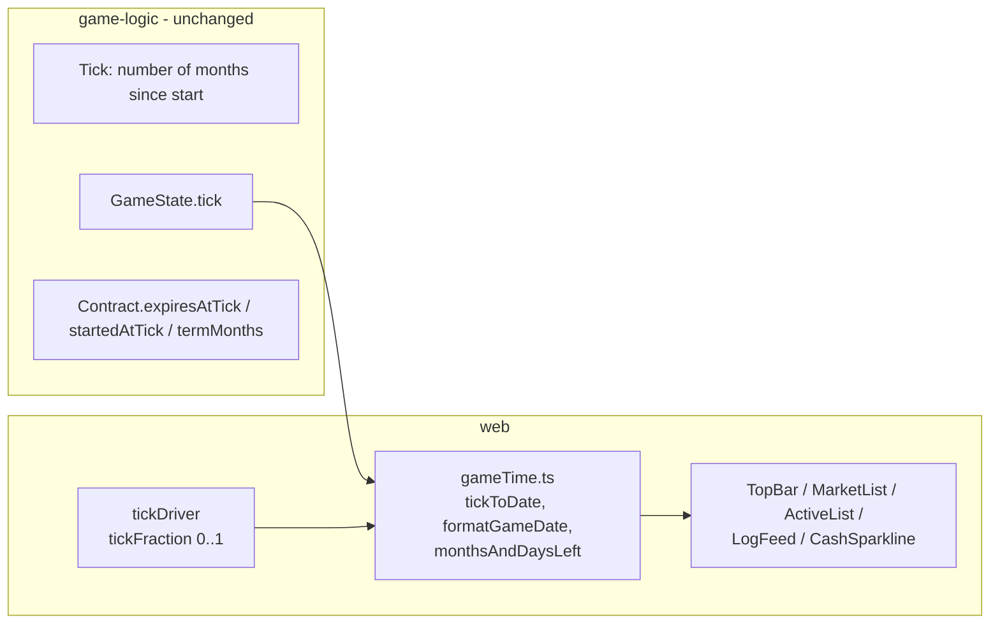

## Progress

- [x] **Phase 1 — Game-time mapping primitives (web)**
  - [x] 1.1 Add `gameTime.ts` with tick↔date conversion + formatting helpers
  - [x] 1.2 Unit tests for game-time helpers
- [x] **Phase 2 — Sub-tick day precision in the driver**
  - [x] 2.1 Extend `tickDriver` to publish a `tickFraction` (0..1) each frame
  - [x] 2.2 Add `selectTickFraction` / store-local fraction signal
  - [x] 2.3 Tests for fraction publishing and pause/reset behaviour
- [ ] **Phase 3 — TopBar HUD**
  - [ ] 3.1 Replace `tickToDate` with `formatGameDate` (day · month · year)
  - [ ] 3.2 Remove the `TICK` HUD slot; show full date only
  - [ ] 3.3 Update `expiringOffers` / `endingActive` thresholds to month-aware copy
  - [ ] 3.4 Update TopBar tests + snapshots
- [ ] **Phase 4 — Contracts UI**
  - [ ] 4.1 MarketList: "X tick(s) left" → "X months Y days left" (or "expires today")
  - [ ] 4.2 ActiveList: replace "Expires next tick!" with month/day phrasing; show term as "X months" and elapsed as "Y months Z days"
  - [ ] 4.3 ContractsPage: update sort labels referring to "expiry" to use months/days copy if needed
  - [ ] 4.4 Update MarketList / ActiveList tests
- [ ] **Phase 5 — Other UI surfaces**
  - [ ] 5.1 LogFeed: replace `T{tick}` badge with `formatGameDateShort(entry.tick)`
  - [ ] 5.2 CashSparkline: "last N ticks" → "last N months"
  - [ ] 5.3 Speed selector tooltip / aria copy: drop "tick" wording
  - [ ] 5.4 Audit remaining `tick` strings in `packages/web/src/ui` (rg) and fix any stragglers
- [ ] **Phase 6 — First-time help & docs**
  - [ ] 6.1 Update first-time help screen copy (plan 004) to use months/days
  - [ ] 6.2 Update web `README.md` and any in-app tooltips that mention ticks
  - [ ] 6.3 Note the convention "1 tick = 1 month" in `packages/web/AGENTS.md`
- [ ] **Phase 7 — Verification**
  - [ ] 7.1 `rg -n "tick" packages/web/src/ui` returns only code identifiers, no user-facing strings
  - [ ] 7.2 `npm run typecheck && npm run test` green across the workspace
  - [ ] 7.3 Manual smoke: dev server, watch HUD advance day-by-day, market/active contracts read in months/days

## Overview

Today the UI exposes the internal simulation unit ("tick") directly: the TopBar shows a `TICK` counter, contract cards say "3 ticks left", the log feed prints `T42`, and the cash sparkline reads "last 30 ticks". This is a leaky abstraction that confuses players who expect calendar time.

This plan **retires the word "tick" from every user-visible surface** while keeping it as the internal accounting unit in `game-logic`. We introduce a single tick→calendar mapping in the web package (1 tick = 1 month), expose a sub-tick fraction from the driver so days advance smoothly between ticks, and rewrite all UI copy to talk in days/months/years.

`game-logic` is **not** changed: `Tick`, `expiresAtTick`, `startedAtTick`, `termMonths`, `monthlyPayment`, `LedgerEntry.tick` etc. all stay. The plan is UI-only, plus tiny driver instrumentation.

## Architecture



### Calendar mapping

```ts
// packages/web/src/store/gameTime.ts
export const EPOCH_YEAR = 2025;     // tick 0 = Jan 2025
export const MONTHS_PER_YEAR = 12;
export const DAYS_PER_MONTH = 30;   // simple, matches existing "month-only" simulation

export interface GameDate {
  year: number;       // e.g. 2025
  month: number;      // 0..11
  day: number;        // 1..30
}

/**
 * Convert an integer tick (+ optional 0..1 sub-tick fraction) into a GameDate.
 * tick = months elapsed since EPOCH_YEAR-01.
 * fraction advances the day inside the current month: day = floor(fraction * 30) + 1.
 */
export function tickToGameDate(tick: number, fraction = 0): GameDate;

/** "15 Mar 2025" */
export function formatGameDate(d: GameDate): string;
/** "Mar 2025" — used where day precision is noise (e.g. log feed) */
export function formatGameDateShort(d: GameDate): string;

/** Months and days between two ticks, using a fraction for sub-tick precision. */
export function monthsAndDaysBetween(
  fromTick: number, fromFraction: number,
  toTick: number,   toFraction: number,
): { months: number; days: number };

/** Human-readable remaining time, e.g. "2 months 14 days", "14 days", "expires today". */
export function formatRemaining(months: number, days: number): string;
```

### Driver instrumentation

The existing `startTickDriver` already accumulates real time into `acc` and dispatches a `Tick` action when `acc >= stepMs`. We add a per-frame callback so the UI can read the current fraction:

```ts
export function startTickDriver(
  dispatch: (action: Action) => void,
  getSpeed: () => Speed,
  onFrame?: (fraction: number) => void,   // NEW: 0..1, fraction of current tick elapsed
  // ...existing params unchanged
): () => void;
```

`onFrame` fires every animation frame with `Math.min(acc / stepMs, 1)` (or `0` while paused). The web app wires this into a lightweight `tickFraction` signal (separate from the Redux store to avoid re-rendering everything 60×/s) consumed by HUD/contract widgets that want day-level precision.

For the TopBar date readout, day precision is read from this signal; everything else (revenue, opex, contract progress) keeps reading the integer `state.tick`.

### Copy mapping (cheat-sheet)

| Before (UI) | After (UI) |
|---|---|
| `TICK 42` HUD slot | (removed; date is enough) |
| `Mar 2025` (current) | `15 Mar 2025` |
| `3 ticks left` | `3 months left` / `2 months 14 days left` / `14 days left` / `expires today` |
| `Expires next tick!` | `Expires this month` (when months=0) |
| `T42` log badge | `Mar 2025` |
| `last 30 ticks` | `last 30 months` |
| `1 tick / 10 seconds` (driver comment / tooltip) | `1 month / 10 seconds` |

Internally, identifiers (`selectTick`, `expiresAtTick`, `Tick` action, `tickOpex`, etc.) are **kept as-is** per the user's request.

## Phase 1 — Game-time mapping primitives (web)

**Goal**: a single, tested module that owns tick→calendar conversion and remaining-time formatting.

### Step 1.1 — Add `gameTime.ts`

- File: `packages/web/src/store/gameTime.ts`
- Export `EPOCH_YEAR`, `MONTHS_PER_YEAR=12`, `DAYS_PER_MONTH=30`.
- Implement `tickToGameDate`, `formatGameDate`, `formatGameDateShort`, `monthsAndDaysBetween`, `formatRemaining` per Architecture.
- Use the existing month abbreviations array currently inlined in `TopBar.tsx` — move it here.
- Acceptance: `npm run typecheck -w @datacenter-tycoon/web` passes; module is importable.

### Step 1.2 — Unit tests for game-time helpers

- File: `packages/web/src/store/gameTime.test.ts`
- Cases:
  - `tickToGameDate(0)` → `{year:2025, month:0, day:1}`.
  - `tickToGameDate(13, 0.5)` → Feb 2026, day 16.
  - `formatGameDate({year:2025, month:2, day:15})` → `"15 Mar 2025"`.
  - `monthsAndDaysBetween(3, 0.0, 5, 0.5)` → `{months:2, days:15}`.
  - `formatRemaining`: `(0,0)` → `"expires today"`; `(0,14)` → `"14 days left"`; `(2,14)` → `"2 months 14 days left"`; `(3,0)` → `"3 months left"`.
- Acceptance: `npm run test -w @datacenter-tycoon/web -- gameTime` green.

## Phase 2 — Sub-tick day precision in the driver

**Goal**: the HUD ticks days forward smoothly between months without re-rendering the whole app every frame.

### Step 2.1 — Extend `tickDriver` with `onFrame`

- File: `packages/web/src/store/tickDriver.ts`
- Add optional `onFrame?: (fraction: number) => void` parameter.
- Compute `fraction = stepMs === Infinity ? 0 : Math.min(acc / stepMs, 1)` each frame and invoke `onFrame(fraction)` after the catch-up loop.
- Reset to `0` when paused (already done for `acc`).
- Acceptance: types compile; existing callers still work without passing `onFrame`.

### Step 2.2 — Expose `tickFraction` to UI

- Files: `packages/web/src/store/storeContext.tsx`, `packages/web/src/store/index.ts` (or a new `tickFractionStore.ts`).
- Maintain a tiny external store (e.g. `useSyncExternalStore`-friendly) holding the latest `fraction`. The driver writes to it via `onFrame`.
- Export `useTickFraction()` hook (subscribes to the external store) — components opt-in to per-frame re-renders.
- Wire `useTickDriver` to pass an `onFrame` that updates this store.
- Acceptance: `useTickFraction()` returns a number in `[0,1]`; only components that call it re-render every frame.

### Step 2.3 — Tests

- File: `packages/web/src/store/tickDriver.test.ts` (extend) and `tickFraction.test.ts` (new, if module split).
- Verify `onFrame` is invoked with monotonically increasing fractions until a tick fires, then resets toward 0.
- Verify `fraction === 0` while paused and immediately after unpause.
- Acceptance: tests green.

## Phase 3 — TopBar HUD

**Goal**: the date is now the canonical clock; no more `TICK` slot.

### Step 3.1 — Replace `tickToDate`

- File: `packages/web/src/ui/topbar/TopBar.tsx`
- Remove the local `tickToDate` and `MONTHS` array.
- Import `tickToGameDate`, `formatGameDate` from `gameTime.ts`.
- Use `useTickFraction()` so the day field advances between ticks.
- Acceptance: HUD shows e.g. `15 Mar 2025` and the day visibly advances during a single tick interval.

### Step 3.2 — Remove the `TICK` HUD slot

- File: `packages/web/src/ui/topbar/TopBar.tsx`
- Delete the `<span className={styles.hudLabel}>TICK</span>` block (and the bare `{tick}` value).
- Adjust spacing/CSS in `TopBar.module.css` if needed.
- Acceptance: visual review; HUD no longer mentions "TICK".

### Step 3.3 — Threshold copy

- File: `packages/web/src/ui/topbar/TopBar.tsx`
- `expiringOffers` and `endingActive` already use `<= 1` (months). Update aria-labels / titles / badge tooltips to read "expiring within 1 month" instead of any "tick" wording.
- Acceptance: no `tick` substring remains in TopBar JSX or aria text (except imports/identifiers).

### Step 3.4 — Tests

- File: `packages/web/src/ui/topbar/TopBar.test.tsx`
- Update assertions to look for date strings (`"Mar 2025"`, day numerals) instead of `TICK`.
- Add a case asserting day advances when fraction changes.
- Acceptance: tests green.

## Phase 4 — Contracts UI

**Goal**: every contract card talks in months/days.

### Step 4.1 — MarketList remaining-time copy

- File: `packages/web/src/ui/contracts/MarketList.tsx`
- Replace `ticksLeft = c.expiresAtTick - tick` rendering with:
  ```ts
  const fraction = useTickFraction();
  const { months, days } = monthsAndDaysBetween(tick, fraction, c.expiresAtTick, 0);
  const label = months <= 0 && days <= 0 ? "EXPIRED" : formatRemaining(months, days);
  const urgent = months === 0 && days <= 7;
  ```
- Use `urgent` for the `styles.expiring` class instead of `ticksLeft <= 1`.
- Acceptance: cards read e.g. `"2 months 14 days left"`, `"14 days left"`, or `"EXPIRED"`.

### Step 4.2 — ActiveList copy

- File: `packages/web/src/ui/contracts/ActiveList.tsx`
- Replace `Expires next tick!` with `Expires this month`.
- Show contract term as `${termMonths} months` and elapsed as `formatRemaining(months, days)` from `monthsAndDaysBetween(startedAtTick, 0, tick, fraction)`.
- Verify no other `tick` user-visible strings remain in this file.
- Acceptance: active cards show months/days; no "tick" text.

### Step 4.3 — ContractsPage labels

- File: `packages/web/src/ui/contracts/ContractsPage.tsx`
- The `expiry` sort already labels itself "Expiry"; if any tooltip/aria says "ticks", swap to "months remaining". (Skip if none.)
- Acceptance: page-level controls don't mention ticks.

### Step 4.4 — Update tests

- Files: `packages/web/src/ui/contracts/MarketList.test.tsx`, `ActiveList.test.tsx`.
- Update string assertions to the new copy. Mock `useTickFraction` where helpful.
- Acceptance: tests green.

## Phase 5 — Other UI surfaces

### Step 5.1 — LogFeed badge

- File: `packages/web/src/ui/log/LogFeed.tsx`
- Replace `T{entry.tick}` with `{formatGameDateShort(tickToGameDate(entry.tick))}` (e.g. `Mar 2025`).
- Adjust `styles.tick` class name only if cosmetics need tightening; functional rename optional.
- Acceptance: log rows show month/year, not `T42`.

### Step 5.2 — CashSparkline

- File: `packages/web/src/ui/stats/CashSparkline.tsx`
- Replace `last ${...} ticks` / `no data yet` strings with `last N months`.
- Comment `// Accumulate cash history (one entry per tick)` → `// one entry per month (tick)` (code comment fine).
- Acceptance: footer reads `"last N months"`.

### Step 5.3 — Speed selector copy

- File: `packages/web/src/store/tickDriver.ts` (comment), `packages/web/src/ui/topbar/TopBar.tsx` (speed labels/tooltips).
- Update tooltips/aria from `1 tick / 10 seconds` to `1 month / 10 seconds`. Inline driver comments may stay or be updated for consistency.
- Acceptance: tooltips/aria don't mention ticks.

### Step 5.4 — Audit

- Run: `rg -n "tick|Tick" packages/web/src/ui` and review every hit.
- Anything in JSX text, `aria-*`, `title`, `placeholder`, alt, button labels, or visible CSS-content must be rewritten.
- Identifiers (`selectTick`, `useTickDriver`, `useTickFraction`, type names) stay.
- Acceptance: no user-visible occurrence of `tick` left.

## Phase 6 — First-time help & docs

### Step 6.1 — First-time help screen

- Files: whatever was added in plan `004-first-time-help-screen.md` (typically `packages/web/src/ui/help/*`).
- Rewrite any sentences mentioning ticks. Suggested wording:
  - "Each in-game **month** earns revenue and pays opex."
  - "Speeds run from 1× (1 month per 10 s) to 3× (1 month per 2.5 s)."
- Acceptance: help screen has zero "tick" mentions.

### Step 6.2 — README + tooltips

- File: `packages/web/README.md`
- Replace any "tick" references with months. Note that "1 tick = 1 month" lives only in code comments.
- Acceptance: README scrub clean of player-facing "tick".

### Step 6.3 — `packages/web/AGENTS.md`

- Add a short section "Time and the tick→calendar mapping":
  - "Internally, `state.tick` is the number of elapsed months since Jan 2025. UI converts via `gameTime.ts`; never render `state.tick` directly."
- Acceptance: doc updated, agents have a clear rule.

## Phase 7 — Verification

### Step 7.1 — Grep audit

- Command: `rg -n "tick" packages/web/src/ui`
- Expected: only identifiers/imports (e.g. `selectTick`, `useTickDriver`, `useTickFraction`), zero JSX/string-literal user text.
- Acceptance: confirmed by hand.

### Step 7.2 — Build & test

- Commands:
  - `npm run typecheck`
  - `npm run test`
  - `npm run build`
- Acceptance: all green across the workspace.

### Step 7.3 — Manual smoke

- `npm run dev -w @datacenter-tycoon/web`
- Verify:
  - HUD shows full date and the day numeral advances smoothly inside a tick interval.
  - Market and active contract cards show months/days only.
  - Log feed rows are stamped with month/year.
  - Cash sparkline footer says "last N months".
  - First-time help, speed tooltips, and any other copy don't mention ticks.
- Acceptance: visual confirmation, no "tick" anywhere visible to the player.

## References

- [AGENTS.md](../../AGENTS.md)
- `packages/web/AGENTS.md`
- Prior plans: `002-web-frontend-mvp.md`, `004-first-time-help-screen.md`, `005-contracts-ux-overhaul.md`
- `packages/game-logic/src/types.ts` — `Tick`, `Contract.expiresAtTick`, `Contract.termMonths` (unchanged)
- `packages/web/src/store/tickDriver.ts` — driver receiving `onFrame` instrumentation

## Changelog

- 2026-05-01 — created.
