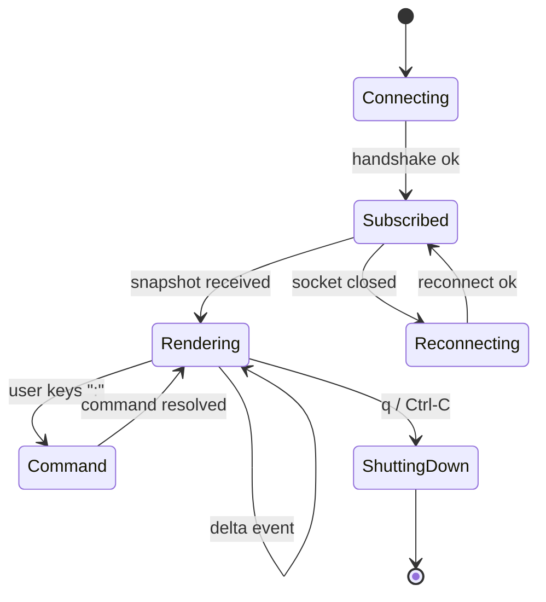

## Progress

- [x] **Phase 1 — Package scaffolding & shared protocol**
  - [x] 1.1 Create `packages/cli/` workspace with `package.json`, `tsconfig.json`, `src/`
  - [x] 1.2 Wire `dct` bin in `package.json` and add to root workspace
  - [x] 1.3 Define IPC protocol types (`src/protocol/messages.ts`)
  - [x] 1.4 Implement save-path resolver (`src/paths.ts`) using XDG / `%APPDATA%`
- [x] **Phase 2 — Daemon (game server) core**
  - [x] 2.1 Implement `GameRuntime` wrapping `GameState` + `reduce` + tick loop
  - [x] 2.2 Implement debounced autosave to JSON via `serialize()`
  - [x] 2.3 Implement Unix-domain-socket JSON-RPC transport (`src/daemon/transport.ts`)
  - [x] 2.4 Implement RPC handlers for all `Action`s + `query`/`subscribe`
  - [x] 2.5 Implement daemon lifecycle: PID/lock file, graceful shutdown, idle exit
  - [x] 2.6 Unit tests for runtime, transport, and savefile round-trip
- [x] **Phase 3 — Client SDK**
  - [x] 3.1 Implement `DctClient` connecting over the socket
  - [x] 3.2 Auto-spawn daemon on first connect (detached child)
  - [x] 3.3 Reconnect / handshake / version negotiation
  - [x] 3.4 Snapshot + delta subscription helpers
- [ ] **Phase 4 — One-shot CLI subcommands**
  - [x] 4.1 Argument parser scaffolding (no heavy deps; small custom parser)
  - [x] 4.2 `dct status` — prints summary (cash, tick, dcs, contracts)
  - [x] 4.3 `dct new`, `dct load`, `dct save`, `dct quit`
  - [x] 4.4 `dct ls dc|racks|contracts|market` listing commands
  - [x] 4.5 `dct build-dc`, `dct add-rack`, `dct remove-rack`
  - [x] 4.6 `dct accept-contract`, `dct cancel-contract`
  - [x] 4.7 `dct tick [n]`, `dct pause`, `dct resume`, `dct speed <ticks/sec>`
  - [x] 4.8 `--json` global flag for machine-readable output
- [ ] **Phase 5 — Interactive TUI**
  - [x] 5.1 Pick & vendor a tiny ANSI/TUI helper (or `ink`); document choice
  - [x] 5.2 Main layout: header (cash/tick/speed) + tab bar + body + status line
  - [x] 5.3 Dashboard tab (KPIs, ledger tail, alerts)
  - [ ] 5.4 Datacenters tab (list → detail → rack grid)
  - [ ] 5.5 Contracts tab (market + active, accept/cancel)
  - [ ] 5.6 Catalog tab (DC specs, rack specs)
  - [ ] 5.7 Command palette (`:` to run any one-shot subcommand)
  - [ ] 5.8 Keybindings cheatsheet (`?`)
  - [ ] 5.9 Live updates via subscription stream
- [ ] **Phase 6 — Polish & docs**
  - [ ] 6.1 Write `packages/cli/README.md` and `packages/cli/AGENTS.md`
  - [ ] 6.2 Add `npm run dev:cli` script and update root `AGENTS.md`
  - [ ] 6.3 Integration test: spawn daemon, run subcommands, assert save shape
  - [ ] 6.4 Release notes / CHANGELOG entry

## Overview

We want a first-class command-line experience for Datacenter Tycoon, parallel to the
web client, that:

1. Lets a player **play the whole game** in an interactive terminal UI.
2. **Persists game state continuously** to a JSON savefile so killing the TUI never loses progress.
3. **Doubles as a scripting surface**: `dct status`, `dct add-rack <dc> <pos> <type>`, `dct accept-contract <id>`, etc., for automation, tests, and demos.

To support both modes cleanly we split the CLI into two roles:

- A **daemon** (`dct daemon`) that owns the `GameState`, runs the simulation tick, and persists to JSON.
- A **client** (`dct …`) that talks to the daemon over a local Unix-domain socket using a small JSON-RPC protocol. The interactive TUI is just a long-lived client that subscribes to state.

The client auto-spawns a daemon if none is running, so to the end-user it feels like a single program — but internally it's a clean server/client split that mirrors the web architecture (`game-logic` core + thin UI shell).

## Architecture

### High-level component diagram

```mermaid
flowchart LR
    subgraph user[User]
      Term["Terminal"]
    end

    subgraph cli[@datacenter-tycoon/cli]
      Bin["dct (bin)"]
      Parser["arg parser / dispatcher"]
      OneShot["one-shot commands"]
      TUI["interactive TUI"]
      Client["DctClient (RPC)"]
      Daemon["GameDaemon"]
      Runtime["GameRuntime"]
      Persist["Autosave (JSON)"]
      Sock[("Unix socket\n~/.local/state/dct/dct.sock")]
      Save[("Savefile\n~/.local/share/dct/save.json")]
    end

    GL["@datacenter-tycoon/game-logic"]

    Term --> Bin --> Parser
    Parser --> OneShot --> Client
    Parser --> TUI --> Client
    Client <--> Sock
    Sock <--> Daemon
    Daemon --> Runtime --> GL
    Runtime --> Persist --> Save
```

### Process model

```mermaid
sequenceDiagram
    autonumber
    participant U as user shell
    participant C as dct (client)
    participant D as dct daemon
    participant FS as savefile

    U->>C: `dct status`
    C->>C: probe socket
    alt no daemon
      C->>D: spawn detached `dct daemon --save <path>`
      D->>FS: read savefile (or newGame)
      D-->>C: ready (handshake)
    end
    C->>D: rpc { method: "query", params: { kind: "status" } }
    D-->>C: { cash, tick, dcs, … }
    C-->>U: print
    Note over D,FS: tick loop runs in daemon; debounced autosave on every state change
```

### Interactive TUI lifecycle



### Why a daemon (instead of in-process)?

| Concern | In-process only | Daemon + client |
|---|---|---|
| One-shot subcommands cheap | ❌ each invocation re-loads JSON, runs no ticks | ✅ daemon already warm |
| Time advances even when no UI | ❌ pauses when CLI exits | ✅ ticks continue (configurable) |
| Multiple concurrent clients | ❌ | ✅ TUI + scripts simultaneously |
| Implementation complexity | low | moderate (one extra file: transport) |

We pick the daemon model. Idle daemons exit after `--idle-timeout` (default: 10 min with no clients **and** game paused) so we don't leak background processes.

### Savefile & paths

| Purpose | Path (Linux) | Path (macOS) | Path (Windows) |
|---|---|---|---|
| Savefile | `$XDG_DATA_HOME/dct/save.json` | `~/Library/Application Support/dct/save.json` | `%APPDATA%/dct/save.json` |
| Socket | `$XDG_RUNTIME_DIR/dct/dct.sock` | `$TMPDIR/dct/dct.sock` | named pipe `\\.\pipe\dct` |
| PID/lock | next to socket: `dct.pid` | same | same |
| Logs | `$XDG_STATE_HOME/dct/daemon.log` | `~/Library/Logs/dct/daemon.log` | `%LOCALAPPDATA%/dct/Logs/daemon.log` |

Override with `--save <path>` and `--socket <path>`.

### IPC protocol (JSON-RPC 2.0 subset over newline-delimited JSON)

```ts
// Request
interface RpcRequest<P = unknown> {
  jsonrpc: "2.0";
  id: number;          // omitted for notifications
  method: string;      // "dispatch" | "query" | "subscribe" | "unsubscribe" | "control"
  params?: P;
}

// Response
interface RpcResponse<R = unknown> {
  jsonrpc: "2.0";
  id: number;
  result?: R;
  error?: { code: number; message: string; data?: unknown };
}

// Server-pushed event (subscription)
interface RpcEvent<E = unknown> {
  jsonrpc: "2.0";
  method: "event";
  params: { subId: number; event: E };
}
```

Methods:

| Method | Params | Returns | Notes |
|---|---|---|---|
| `hello` | `{ clientVersion }` | `{ daemonVersion, saveVersion, tick }` | handshake; first call required |
| `dispatch` | `Action` (from game-logic) | `{ tick }` | mutating; runs `reduce` |
| `query` | `{ kind: "snapshot" \| "status" \| "list", … }` | varies | read-only, returns derived view |
| `subscribe` | `{ events: ("state" \| "ledger" \| "tick")[] }` | `{ subId }` | server pushes `RpcEvent`s |
| `unsubscribe` | `{ subId }` | `{}` | |
| `control` | `{ op: "pause" \| "resume" \| "set-speed" \| "save-now" \| "shutdown", … }` | `{}` | runtime control |

The `Action` type is reused **directly** from `@datacenter-tycoon/game-logic` so the daemon is a thin wrapper. This honors the AGENTS rule: *"`web`/`desktop`/`server` → `game-logic`. Frontends never reimplement game rules."*

### Tick scheduling

The daemon owns wall-clock → tick mapping:

```ts
class GameRuntime {
  private state: GameState;
  private speedTps = 1;            // ticks per second
  private paused = false;
  private timer?: NodeJS.Timeout;
  private dirty = false;

  start() {
    this.timer = setInterval(() => {
      if (this.paused) return;
      this.dispatch({ type: "Tick" });
    }, 1000 / this.speedTps);
  }

  dispatch(action: Action): GameState {
    this.state = reduce(this.state, action);
    this.dirty = true;
    this.scheduleAutosave();    // debounced 500ms
    this.emit("state", { tick: this.state.tick });
    return this.state;
  }
}
```

Speeds: `0` (paused), `1`, `2`, `4`, `8`, `16` tps. Configurable via `dct speed N` or `:speed N` in TUI.

### Autosave

- Debounced 500 ms after last `dispatch`.
- Atomic write: serialize → write to `save.json.tmp` → `fs.rename` → done.
- On daemon SIGINT/SIGTERM: flush synchronously before exit.
- Save format reuses `serialize()` / `deserialize()` from `game-logic/save`. No new schema.

### Auto-spawn

```ts
// pseudocode in DctClient.connect()
try {
  await net.createConnection(socketPath);
} catch (err) {
  if (err.code === "ENOENT" || err.code === "ECONNREFUSED") {
    spawn(process.execPath, [thisBin, "daemon", "--save", savePath, "--socket", socketPath], {
      detached: true,
      stdio: "ignore",
    }).unref();
    await waitForSocket(socketPath, { timeoutMs: 3000 });
    return net.createConnection(socketPath);
  }
  throw err;
}
```

A `flock`-style PID file at `dct.pid` prevents two daemons binding the same socket.

### CLI surface (one-shots)

```
dct                                  # interactive TUI (default)
dct status                           # short status line
dct status --json                    # JSON dump for scripts
dct ls dc                            # list datacenters
dct ls racks <dcId>
dct ls market | active               # contract listings
dct new [--seed N]                   # discard current save & start over (confirm)
dct load <path>                      # load savefile from path (copy into state dir)
dct save [<path>]                    # force-save (and optionally export copy)
dct build-dc <specId> [--id <dcId>]
dct add-rack <dcId> <row> <position> <rackSpecId>
dct remove-rack <dcId> <placementId>
dct accept-contract <contractId> <dcId>
dct cancel-contract <contractId>
dct tick [n]                         # advance n ticks (default 1) regardless of pause
dct pause | resume | speed <tps>
dct daemon [--save <p>] [--socket <p>] [--idle-timeout <ms>]
dct quit                             # tell daemon to flush & shutdown
dct --help, dct <cmd> --help
```

Global flags: `--json`, `--socket <path>`, `--save <path>`, `--no-daemon` (fail if not running), `--quiet`.

### TUI layout (illustrative)

```
┌ Datacenter Tycoon ──────────────────── tick 1284  cash $42,310  speed 4× ▶ ┐
│ [1]Dashboard  [2]DCs  [3]Contracts  [4]Catalog  [5]Ledger        ?:help    │
├──────────────────────────────────────────────────────────────────────────────┤
│  Datacenters (2)                                                             │
│  ▸ dc-001 Edge POP      8/40 racks   power 12/30kW   ████░░░░░░             │
│    dc-002 Hyperscale 1  0/240 racks  power  0/2MW    ░░░░░░░░░░             │
│                                                                              │
│  Use ↑↓ to select, Enter to open, n=new dc, : for commands                  │
├──────────────────────────────────────────────────────────────────────────────┤
│ : add-rack dc-001 0 5 compute-1u                                             │
└──────────────────────────────────────────────────────────────────────────────┘
```

The TUI calls the **same** RPC methods the one-shot commands use. The command-palette (`:`) literally accepts the one-shot subcommand syntax — keeping one canonical surface.

### Package layout

```
packages/cli/
├── package.json
├── tsconfig.json
├── README.md
├── AGENTS.md
├── bin/
│   └── dct.js                  # shebang shim → dist/cli.js
└── src/
    ├── cli.ts                  # entry, argv dispatch
    ├── paths.ts                # XDG/macOS/Windows path resolver
    ├── protocol/
    │   ├── messages.ts         # RPC types
    │   └── codec.ts            # ndjson encode/decode
    ├── daemon/
    │   ├── runtime.ts          # GameRuntime
    │   ├── transport.ts        # net server, framing
    │   ├── server.ts           # method handlers, sub registry
    │   ├── persist.ts          # debounced atomic autosave
    │   └── lifecycle.ts        # pid/lock, idle timer, signals
    ├── client/
    │   ├── client.ts           # DctClient
    │   └── spawn.ts            # auto-spawn daemon
    ├── commands/
    │   ├── status.ts
    │   ├── ls.ts
    │   ├── build-dc.ts
    │   ├── add-rack.ts
    │   ├── remove-rack.ts
    │   ├── accept-contract.ts
    │   ├── cancel-contract.ts
    │   ├── tick.ts
    │   ├── control.ts          # pause/resume/speed/save/quit
    │   └── new-load.ts
    ├── tui/
    │   ├── app.tsx | app.ts    # main loop
    │   ├── layout.ts
    │   ├── tabs/
    │   │   ├── dashboard.ts
    │   │   ├── datacenters.ts
    │   │   ├── contracts.ts
    │   │   └── catalog.ts
    │   ├── palette.ts          # ":" command bar
    │   └── render.ts           # ANSI helpers
    └── index.test.ts
```

### Dependencies

Keep it thin:
- Hard deps: `@datacenter-tycoon/game-logic` only.
- TUI: prefer **`ink`** (`react`-flavored TUI, well-maintained) **or** a tiny custom ANSI renderer. Decide in step 5.1 with a brief ADR comment in `packages/cli/AGENTS.md`. If `ink` is chosen, also add `react`. Avoid `commander`/`yargs` — write a 100-line argv parser to keep the dep surface tiny.
- Dev: `tsx`, `typescript`, `@types/node`.

---

## Phase 1 — Package scaffolding & shared protocol

**Goal**: empty package builds and exposes a `dct` bin and shared protocol types.

### Step 1.1 — Create `packages/cli/`

- Files: `packages/cli/package.json`, `packages/cli/tsconfig.json`, `packages/cli/src/cli.ts` (stub `console.log("dct")`), `packages/cli/bin/dct.js` (shebang → `dist/cli.js`).
- `package.json` has `"name": "@datacenter-tycoon/cli"`, `"type": "module"`, `"bin": { "dct": "bin/dct.js" }`, `"dependencies": { "@datacenter-tycoon/game-logic": "*" }`.
- Acceptance: `npm install` from root succeeds; `npx dct` prints `dct`.

### Step 1.2 — Workspace wiring

- Files: root `package.json`.
- Add `"packages/cli"` to `workspaces`. Add `"build:cli"`, `"dev:cli"`, `"test:cli"`, `"typecheck"` already covers it via `--workspaces --if-present`.
- Acceptance: `npm run build` includes cli; `npm run typecheck` passes.

### Step 1.3 — Protocol types

- File: `packages/cli/src/protocol/messages.ts`.
- Define `RpcRequest`, `RpcResponse`, `RpcEvent`, `Method`, `QueryKind`, `ControlOp`, error codes.
- Re-export `Action` from game-logic for convenience.
- Acceptance: typecheck passes; types are exhaustive (no `any`).

### Step 1.4 — Path resolver

- File: `packages/cli/src/paths.ts`.
- Implement `resolvePaths({ saveOverride?, socketOverride? }): { savePath, socketPath, pidPath, logPath }` honoring XDG / macOS / Windows.
- Acceptance: unit test for each platform branch using mocked `process.platform` and env vars.

---

## Phase 2 — Daemon (game server) core

**Goal**: a runnable `dct daemon` that owns state, ticks, autosaves, and serves RPCs.

### Step 2.1 — `GameRuntime`

- File: `packages/cli/src/daemon/runtime.ts`.
- Wrap `GameState`, expose `dispatch(action)`, `query(kind, params)`, `setSpeed`, `pause`, `resume`, `tickNow`, `getSnapshot`.
- Use a tiny event emitter (Node `EventEmitter`) to push `state` / `ledger` / `tick` events.
- Acceptance: unit test: dispatching `{type:"Tick"}` advances `tick`; speed change reschedules timer.

### Step 2.2 — Persistence

- File: `packages/cli/src/daemon/persist.ts`.
- `loadOrInit(savePath, seed)` — if file exists, `deserialize()` (with `migrate()`); else `newGame(seed)`.
- `scheduleAutosave(state)` — debounce 500 ms, atomic write via tmp+rename.
- `flushSync()` for shutdown path.
- Acceptance: round-trip test (save → kill → reload → identical state).

### Step 2.3 — Transport

- File: `packages/cli/src/daemon/transport.ts`.
- `net.createServer` (Unix socket / Windows named pipe).
- Newline-delimited JSON framing; per-connection buffer; backpressure handled by Node streams.
- Emit `(connection, request)` events.
- Acceptance: integration test: connect with raw `net.createConnection`, send hello, receive response.

### Step 2.4 — RPC handlers

- File: `packages/cli/src/daemon/server.ts`.
- Map methods → handler functions:
  - `hello` → version handshake.
  - `dispatch` → `runtime.dispatch(action)`.
  - `query` → switch on `kind` → derived view (snapshot/status/list/catalog).
  - `subscribe`/`unsubscribe` → registry of `(connection, subId, events[])`; runtime events fan out.
  - `control` → pause/resume/speed/save-now/shutdown.
- Translate thrown errors (`reduce` invariants) to `{ code, message }`.
- Acceptance: tests for happy paths and one error path per method.

### Step 2.5 — Lifecycle

- File: `packages/cli/src/daemon/lifecycle.ts`.
- On start: try to acquire PID lock, bind socket, register `SIGINT`/`SIGTERM` → flush + close.
- Idle timer: when 0 clients **and** runtime paused, exit after `--idle-timeout` (default 10 min). Reset on any connect or speed > 0.
- Acceptance: spawn daemon, `dct quit`, daemon process exits with code 0 within 1 s.

### Step 2.6 — Tests

- File: `packages/cli/src/daemon/*.test.ts`.
- Cover runtime, persist, transport, end-to-end "dispatch + autosave on disk".
- Acceptance: `npm run test -w @datacenter-tycoon/cli` passes.

---

## Phase 3 — Client SDK

**Goal**: a typed `DctClient` usable by both the one-shot commands and the TUI.

### Step 3.1 — `DctClient`

- File: `packages/cli/src/client/client.ts`.
- API: `connect()`, `hello()`, `dispatch(action)`, `query(kind, params)`, `subscribe(events, onEvent)`, `control(op, params)`, `close()`.
- Internally tracks pending requests by `id`; rejects on socket close.
- Acceptance: unit test using an in-process mock server.

### Step 3.2 — Auto-spawn

- File: `packages/cli/src/client/spawn.ts`.
- If connect fails with `ENOENT`/`ECONNREFUSED`, spawn `dct daemon` detached, poll for socket up to 3 s.
- Respect `--no-daemon` (fail fast).
- Acceptance: with no daemon running, `client.connect()` succeeds and a daemon process exists.

### Step 3.3 — Handshake & version negotiation

- Refuse to operate if `daemonVersion` major differs from `clientVersion`. Print actionable error.
- Acceptance: unit test with mock server returning a bad version.

### Step 3.4 — Snapshot + delta helpers

- `client.subscribeState(onSnapshot, onDelta)` — first snapshot, then `tick`/`state` events.
- Acceptance: TUI smoke test (Phase 5) consumes this without polling.

---

## Phase 4 — One-shot CLI subcommands

**Goal**: every game action and query is scriptable via `dct …`.

### Step 4.1 — Argv parser

- File: `packages/cli/src/cli.ts` + `src/argv.ts`.
- Tiny parser supporting `cmd subcmd pos1 pos2 --flag=val --bool -h`.
- Dispatch table maps subcommand → handler module.
- Global flags: `--json`, `--socket`, `--save`, `--no-daemon`, `--quiet`, `-h/--help`.
- Acceptance: `dct --help` lists all commands; unknown command exits non-zero with a hint.

### Step 4.2 — `dct status`

- File: `packages/cli/src/commands/status.ts`.
- Default output: `tick=1284 cash=$42,310 dcs=2 racks=8 active=3 market=4 paused=false speed=4`.
- `--json`: structured.
- Acceptance: golden-file test for both modes.

### Step 4.3 — Save management

- File: `packages/cli/src/commands/new-load.ts` + `commands/control.ts`.
- `dct new` confirms (`--yes` to skip), deletes savefile, restarts daemon clean.
- `dct load <path>` validates via `deserialize`, copies into state dir, restarts daemon.
- `dct save [<path>]` triggers `control { op:"save-now" }` and optionally copies file to `<path>`.
- `dct quit` triggers `shutdown`.
- Acceptance: scripted end-to-end test.

### Step 4.4 — Listings

- File: `packages/cli/src/commands/ls.ts`.
- `dct ls dc`, `dct ls racks <dcId>`, `dct ls market`, `dct ls active`, `dct ls catalog dc|rack`.
- Table renderer with `--json` toggle.
- Acceptance: tests with seeded daemon.

### Step 4.5 — Build / place / remove

- Files: `commands/build-dc.ts`, `add-rack.ts`, `remove-rack.ts`.
- Each maps args → an `Action`, calls `client.dispatch`, prints the new id.
- Generate ids client-side (`dc-<short-uuid>`, `rp-<short-uuid>`) unless `--id` given.
- Acceptance: build a DC then add a rack, both visible in `ls`.

### Step 4.6 — Contracts

- Files: `commands/accept-contract.ts`, `cancel-contract.ts`.
- Acceptance: accept then cancel; verify status transitions.

### Step 4.7 — Time control

- File: `commands/tick.ts` and `control.ts`.
- `dct tick [n]`: dispatch `Tick` n times even if paused.
- `dct pause`, `dct resume`, `dct speed <tps>`.
- Acceptance: status reflects new tick / paused / speed.

### Step 4.8 — `--json` everywhere

- Every printer respects `--json`. Standardize: `{ ok: true, data: … }` or `{ ok:false, error: { code, message } }` and exit code 0 / 1.
- Acceptance: piping through `jq` works; documented in README.

---

## Phase 5 — Interactive TUI

**Goal**: `dct` (no args) opens a playable TUI subscribing to live state.

### Step 5.1 — Choose TUI lib

See the **TUI Framework Research** section below for the full landscape comparison. The plan's recommendation is **`ink` + `react`**.

- Doc choice in `packages/cli/AGENTS.md` ADR section, citing the comparison table.
- Lazy-load the TUI module from `cli.ts` so one-shot commands don't pay React/Yoga startup cost (`await import("./tui/app.js")` only on the no-args path).
- Acceptance: `dct` boots a blank "hello" frame and exits cleanly on `q`; `dct status` startup time stays under ~150 ms (no `ink`/`react` imported).

### Step 5.2 — Layout shell

- File: `tui/layout.ts`, `tui/app.tsx`.
- Header (cash/tick/speed/paused), tab bar, body slot, status line.
- Resize-aware.
- Acceptance: snapshot test of rendered frame.

### Step 5.3 — Dashboard tab

- KPIs: cash, monthly opex/revenue trend (last 30 ticks), active contracts, alerts (overdrawn power, breached contracts).
- Last 10 ledger entries.
- Acceptance: visual approval + snapshot test.

### Step 5.4 — Datacenters tab

- List → detail view with rack grid (rows × positions). Indicate kind by color/icon.
- Hotkeys: `n` build dc, `r` add rack at cursor, `x` remove rack, arrow keys navigate.
- Acceptance: e2e: build dc, add rack, remove rack — all reflected without restart.

### Step 5.5 — Contracts tab

- Two columns: Market | Active. `a` accept, `c` cancel.
- Show payout, tier, urgency, deadline, current fulfillment %.
- Acceptance: accept moves contract from market → active.

### Step 5.6 — Catalog tab

- Static read-only view of `DATACENTER_CATALOG` and `RACK_CATALOG` with prices and capacities.
- Acceptance: rendered.

### Step 5.7 — Command palette

- `:` opens prompt → parse with the same argv parser → call client.
- History (`↑/↓`), tab-complete subcommand names.
- Acceptance: `:add-rack dc-001 0 5 compute-1u` works from inside TUI.

### Step 5.8 — Help overlay

- `?` toggles modal listing keybindings + global commands.
- Acceptance: rendered.

### Step 5.9 — Live updates

- Subscribe on mount; re-render on `state`/`tick`/`ledger` events; debounce render to ≤ 30 fps.
- On socket loss: show "reconnecting…" banner; retry every 1 s.
- Acceptance: kill daemon while TUI runs; banner appears; restart daemon; banner clears and state resumes.

---

## Phase 6 — Polish & docs

### Step 6.1 — Package docs

- Files: `packages/cli/README.md`, `packages/cli/AGENTS.md`.
- Cover: install, daemon model, savefile path, all subcommands, TUI keymap, troubleshooting (`rm ~/.local/state/dct/dct.sock`).
- Acceptance: review.

### Step 6.2 — Root wiring

- Update root `AGENTS.md` repo layout to mention `packages/cli`.
- Add `npm run dev:cli` (`tsx watch src/cli.ts`).
- Acceptance: `npm run dev:cli -- status` works end-to-end.

### Step 6.3 — Integration test

- File: `packages/cli/src/index.test.ts` (or `e2e.test.ts`).
- Spawn `dct daemon` via `child_process`, run sequence: `new` → `build-dc` → `add-rack` → `tick 10` → `status --json` → assert shape; verify savefile exists and round-trips.
- Acceptance: green in CI.

### Step 6.4 — Release notes

- Update `CHANGELOG` (or create) with cli debut.
- Acceptance: merged.

---

## TUI Framework Research

Researched 2026-05-02 via web search (perplexity + parallel-search). Candidates considered:

| Framework | Stars / weekly DL | Paradigm | Runtime | Notes |
|---|---|---|---|---|
| **[ink](https://github.com/vadimdemedes/ink)** | ~28k ⭐ / ~1.3M wk | React renderer (JSX, hooks, Flexbox via Yoga) | Node ≥18 | De-facto standard. Used by Gatsby, Prisma, Terraform CDK, Shopify CLI, **Claude Code**, GitHub Copilot CLI. Ink 7 (2025) adds `useInput`, `useWindowSize`, alternate-screen mode, better key handling. Mature, huge ecosystem of `ink-*` components (`ink-text-input`, `ink-select-input`, `ink-table`, `ink-spinner`, `ink-gradient`, `ink-big-text`, …). |
| **[OpenTUI](https://opentui.com)** | new (2025) | React/Solid bindings on a native Zig core (C ABI) | Bun-first, Node works | Promising performance story, GPU-ish rendering for animations, mouse + true-color. Young; small community; Bun-centric docs. Worth revisiting in 6–12 months. |
| **[Silvery](https://silvery.dev)** | new (2025) | React-like, layout-first pipeline | Node | Built explicitly to fix Ink's "render-then-layout" limitation; passes 98.9 % of Ink's test suite. Smaller community, smaller component ecosystem. |
| **[blessed](https://github.com/chjj/blessed)** | ~11k ⭐ | Imperative, ncurses-like widget tree | Node | Powerful (windows, tables, forms, mouse) but unmaintained since ~2016. JS-only types; awkward in modern TS. |
| **[neo-blessed](https://github.com/embarklabs/neo-blessed)** | fork of blessed | same | Node | Light maintenance fork; same imperative model. |
| **[blessed-contrib](https://github.com/yaronn/blessed-contrib)** | ~6k ⭐ | charts/dashboards on top of blessed | Node | Great for dashboards, inherits blessed's age. |
| **[terminal-kit](https://github.com/cronvel/terminal-kit)** | ~2.6k ⭐ | Imperative low-level toolkit | Node | Solid primitives (input, menus, progress bars), no component model. |
| **[tuir](https://github.com/Brookke/tuir)** | small | React renderer (Ink fork by some accounts) | Node | Niche, small footprint; not enough adoption to bet on. |
| **[terminosaurus](https://github.com/arcanis/terminosaurus)** (Yarn team) | small | React renderer, browser-DOM-like APIs | Node | Interesting but niche. |
| Hand-rolled ANSI | n/a | imperative writes to `process.stdout` | Node | Zero deps, max effort. Reasonable only for tiny screens. |

### Decision: **Ink**

Why:
1. **Maturity & ecosystem** — battle-tested in tools we admire (Claude Code, Prisma, Shopify CLI). Tons of off-the-shelf widgets (`ink-text-input`, `ink-select-input`, `ink-table`, `ink-spinner`) we can compose for the dashboard, contracts table, command palette.
2. **Familiar mental model** — same React paradigm as the `web` package, so a contributor moving between `web/` and `cli/` keeps muscle memory. State subscription via the `DctClient` slots into a `useEffect` cleanly.
3. **Layout via Yoga** — Flexbox is enough for our header/tab/body/status-line layout and rack grids; we don't need a layout-first pipeline.
4. **Modern TS support** — first-class types, hooks, and Node ≥20 (matches our `engines`).

Known limits we accept:
- Ink renders, then Yoga measures — components can't react to measured size *during* a single render. We'll use `useWindowSize` (Ink 7) and `measureElement` for cases like the rack grid.
- React + Yoga add ~30–60 ms cold-start. Mitigated by **lazy-importing** the TUI only when no subcommand is given.

Fallback plan: if Ink ever blocks us (perf or layout), the `DctClient` is UI-agnostic, so swapping to **OpenTUI** or **Silvery** is a contained refactor inside `src/tui/`.

Additional packages to add when we reach Phase 5:
- `ink` (peer: `react`)
- `react`
- `ink-text-input` — for the `:` command palette
- `ink-select-input` — for menus / spec pickers
- `ink-table` — for `ls` views inside the TUI
- `ink-spinner` — "reconnecting…" banner
- `@types/react` (dev)

## Open questions / deferred

- **Multi-save profiles**: deferred. `--save <path>` is enough for now; later `dct profile use <name>`.
- **Remote daemons**: deferred; protocol is transport-agnostic so a TCP+token mode can be bolted on later.
- **Replays / time-travel**: not in scope; the deterministic `seed`+action log story is owned by the existing server package.
- **Color/no-color**: respect `NO_COLOR` env from day one in the renderer.

## References

- [AGENTS.md](../../AGENTS.md) — package boundary rules; `game-logic` is source of truth.
- `packages/game-logic/src/state/reduce.ts` — `Action` union we reuse verbatim.
- `packages/game-logic/src/save/serialize.ts` — savefile format & migration.
- `packages/web/src/store/gameStore.ts` — analogous in-process store the TUI mirrors over RPC.
- Plan `007-electron-desktop-wrapper.md` — prior art for shipping a non-web client.
- XDG Base Directory Specification.

## Changelog

- 2026-05-02 — created.
