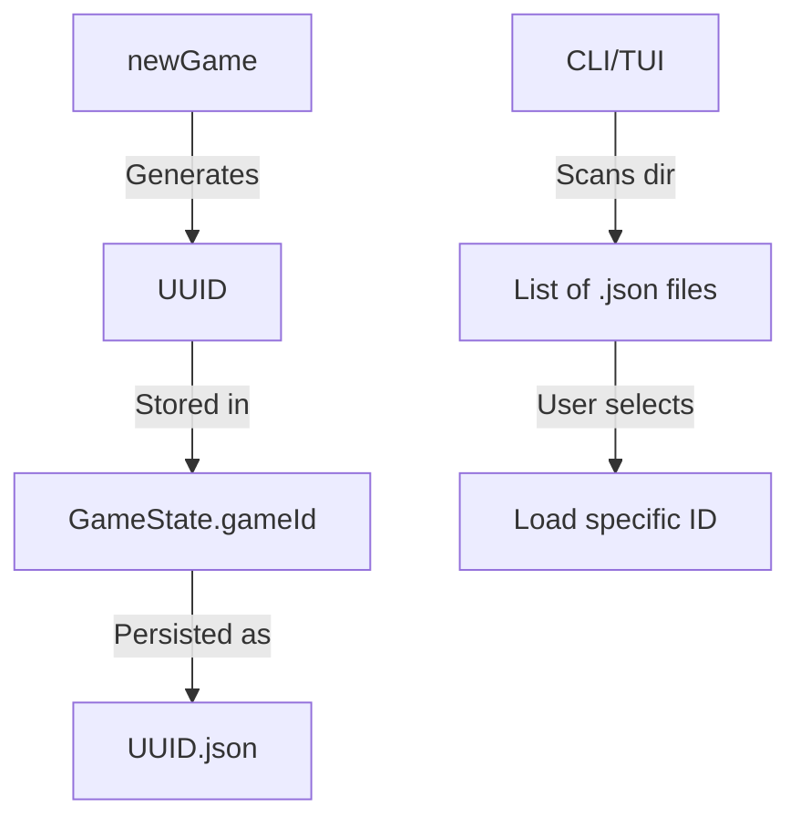

## Progress

- [x] **Phase 1 — Core Game ID**
  - [x] 1.1 Add `gameId` to `GameState` and `GameId` branded type
  - [x] 1.2 Update `newGame` to generate a UUID
  - [x] 1.3 Update `migrate` to assign a UUID to existing version 0/1 saves
- [x] **Phase 2 — CLI Multi-Save Support**
  - [x] 2.1 Update CLI path resolution to handle `<id>.json`
  - [x] 2.2 Add `dct list-saves` command
  - [x] 2.3 Implement save selector when starting `dct` (TUI) if no active session
- [x] **Phase 3 — Web Support**
  - [x] 3.1 Update web persistence to use `gameId` as part of the localStorage key
  - [x] 3.2 Implement simple save selector/manager in the web UI

## Overview

Currently, the game (especially in CLI mode) defaults to a single `save.json`. This makes it difficult to maintain multiple concurrent "runs". By adding a unique `gameId` (UUID) to the `GameState` and using it to name save files (e.g., `550e8400-e29b-41d4-a716-446655440000.json`), we enable multiple save slots. The CLI will gain a selector to pick which game to resume.

## Architecture

Key decisions:
- `gameId` is part of `GameState` so it travels with the data (copy/paste saves work).
- We use `crypto.randomUUID()` which is available in Node 18+ and modern browsers.
- For existing saves without an ID, the migration logic will generate one to ensure consistency.

## Phase 1 — Core Game ID

**Goal**: Every `GameState` object has a unique identifier.

### Step 1.1 — Add `gameId` to `GameState`

- File: `packages/game-logic/src/types.ts`
- Add `export type GameId = Brand<string, "GameId">;`
- Add `gameId: GameId;` to the `GameState` interface.
- Acceptance: `npm run typecheck` passes (with some errors in `newGame` to be fixed in 1.2).

### Step 1.2 — Update `newGame`

- File: `packages/game-logic/src/state/newGame.ts`
- Generate a new UUID using `crypto.randomUUID()` (import from `node:crypto` for Node, or use global in browser-compatible way).
- Acceptance: `newGame()` returns a state with a unique `gameId`.

### Step 1.3 — Update Migration

- File: `packages/game-logic/src/save/serialize.ts`
- In `migrate()`, if the state is missing `gameId`, generate one.
- Acceptance: Loading an old `save.json` automatically assigns it a stable ID.

## Phase 2 — CLI Multi-Save Support

**Goal**: CLI can manage multiple files in the data directory.

### Step 2.1 — Update path resolution

- File: `packages/cli/src/paths.ts`
- Modify `resolvePaths` to support a "current session" pointer or a specific ID.
- Acceptance: `dct --id <uuid>` loads `<uuid>.json`.

### Step 2.2 — Add `list-saves`

- File: `packages/cli/src/commands/ls.ts`
- Add `dct ls saves` to list all `.json` files in the data directory with their metadata (cash, tick, etc.).
- Acceptance: `dct ls saves` shows available games.

## Phase 3 — Web Support

**Goal**: Web frontend supports multiple local saves.

### Step 3.1 — Multi-save persistence

- File: `packages/web/src/store/persist.ts`
- Update `SAVE_KEY` logic to use the `gameId`.
- Maintain an index of available `gameIds` in localStorage.
- Acceptance: Starting a new game doesn't overwrite the old one in localStorage.

## References

- [AGENTS.md](../../AGENTS.md)
- [009-cli-client.md](009-cli-client.md)

## Changelog

- 2026-05-02 — created.
