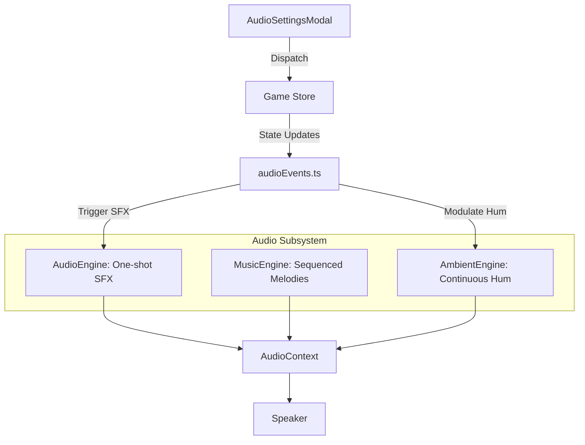

## Progress

- [x] **Phase 1 — Generative Music & Ambience**
  - [x] 1.1 Implement `MusicEngine` for retro-style MIDI melodies
  - [x] 1.2 Implement `AmbientEngine` for server usage "hum"
  - [x] 1.3 Add "Music" and "Ambient" start/stop controls to `AudioEngine`
- [ ] **Phase 2 — Money & Logic SFX**
  - [ ] 2.1 Add "Revenue" (chime) and "Opex" (thud) sound profiles
  - [ ] 2.2 Wire money events into `audioEvents.ts` listener
  - [ ] 2.3 Add "Usage-based" pitch/volume modulation for ambient hum
- [ ] **Phase 3 — Granular Audio Settings**
  - [ ] 3.1 Update `GameState` and `AudioSettings` types
  - [ ] 3.2 Implement `AudioSettingsModal` UI
  - [ ] 3.3 Wire modal into `TopBar` and replace simple mute toggle

## Overview

We want to move beyond simple event-based blips to a more immersive "living" datacenter environment. This plan introduces generative background music that feels like a 90s tycoon game, ambient audio that responds to the actual load of your servers, and specific sounds for the flow of money. We will also give players granular control over these different audio channels through a new settings modal.

## Architecture

We will extend the audio subsystem with specialized engines for continuous audio (Music and Ambience).



### Key Decisions:
- **Music Sequence**: We'll use a simple `setInterval`-based sequencer that plays notes from a scale (e.g., C-major or Pentatonic) to ensure it's always harmonious.
- **Ambient Hum**: A low-frequency sawtooth or triangle wave with a low-pass filter. The filter's cutoff frequency will increase with server load.
- **Granular Settings**: Instead of a single `audioEnabled` boolean, we will have:
  ```ts
  interface AudioSettings {
    master: boolean;
    music: boolean;
    sfx: boolean;     // Datacenter events
    money: boolean;   // Revenue/Opex
    ambient: boolean; // Server hum
  }
  ```

## Phase 1 — Generative Music & Ambience

**Goal**: Create the underlying engines for continuous audio playback.

### Step 1.1 — Implement `MusicEngine`
- File: `packages/web/src/audio/MusicEngine.ts`
- Create a sequencer that plays a basic retro melody using square/pulse waves.
- Support `startMusic()` and `stopMusic()` with volume ramping to avoid clicks.
- Acceptance: Calling `startMusic()` in the console plays a repeating melody.

### Step 1.2 — Implement `AmbientEngine`
- File: `packages/web/src/audio/AmbientEngine.ts`
- Create a continuous low-frequency hum.
- Support `setUsage(load: number)` where `load` is 0 to 1, affecting the volume and filter cutoff.
- Acceptance: Calling `startAmbient()` plays a hum; `setUsage(1)` makes it louder/brighter.

### Step 1.3 — Integrate with `AudioEngine`
- File: `packages/web/src/audio/AudioEngine.ts`
- Export `music` and `ambient` controllers from the main audio subsystem.
- Acceptance: `AudioEngine` becomes the single entry point for all audio control.

## Phase 2 — Money & Logic SFX

**Goal**: Connect game logic events to audio feedback.

### Step 2.1 — Add Money Sound Profiles
- File: `packages/web/src/audio/AudioEngine.ts`
- Add `revenue` (high-pitched "coin" sound) and `opex` (low-pitched "spending" sound).
- Acceptance: `playSound('revenue')` and `playSound('opex')` work.

### Step 2.2 — Wire Money Events
- File: `packages/web/src/store/audioEvents.ts`
- Listen for changes in the ledger or cash delta to trigger money sounds.
- To avoid spam, only play once per tick even if multiple ledger entries exist.
- Acceptance: Revenue triggers a chime; Opex triggers a thud.

### Step 2.3 — Modulate Ambience
- File: `packages/web/src/store/audioEvents.ts`
- Use `selectResourceUsage` to calculate total server load.
- Call `ambient.setUsage(load)` on every tick or significant state change.
- Acceptance: The background hum changes based on how many racks are used/power consumed.

## Phase 3 — Granular Audio Settings

**Goal**: Provide UI for controlling the new audio features.

### Step 3.1 — Update Game State
- Files: `packages/game-logic/src/types.ts`, `packages/game-logic/src/state/reduce.ts`, `packages/game-logic/src/state/newGame.ts`
- Add `audioSettings: AudioSettings` to the state.
- Add `UpdateAudioSettings` action.
- Acceptance: Redux state includes the new settings structure.

### Step 3.2 — Build `AudioSettingsModal`
- File: `packages/web/src/ui/settings/AudioSettingsModal.tsx`
- Create a modal with toggles for Music, SFX, Money, and Ambient audio.
- Match the neon/dark theme of existing modals.
- Acceptance: Modal renders and toggles update the game state.

### Step 3.3 — Wire into TopBar
- File: `packages/web/src/ui/topbar/TopBar.tsx`
- Replace the simple mute button with a "Volume/Settings" icon that opens the modal.
- Ensure all engines respect their individual settings in `audioEvents.ts`.
- Acceptance: Clicking the audio icon opens settings; toggling music stops/starts the background track immediately.

## References

- [006-generative-audio-effects.md](006-generative-audio-effects.md)
- [Web Audio API - OscillatorNode](https://developer.mozilla.org/en-US/docs/Web/API/OscillatorNode)

## Changelog

- 2026-05-02 — created.
