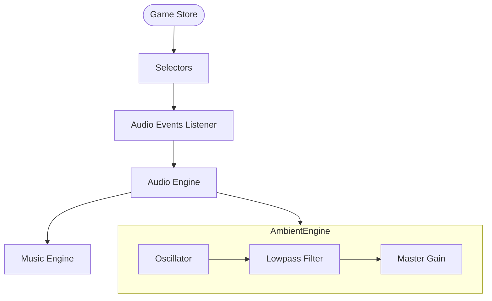

## Progress

- [x] **Phase 1 — Ambient Engine Enhancements**
  - [x] 1.1 Update `AmbientEngine.ts` to support frequency modulation and pausing.
  - [x] 1.2 Update `attachAudioEvents.ts` to pass game speed and pause state.
- [x] **Phase 2 — Dynamic Infrastructure Hum**
  - [x] 2.1 Identify/Implement "active infrastructure" metric in selectors.
  - [x] 2.2 Update `attachAudioEvents.ts` to use infrastructure scale for ambient modulation.
- [x] **Phase 3 — Contract Acceptance SFX**
  - [x] 3.1 Implement "kaching" (register ring) generative sound in `AudioEngine.ts`.
  - [x] 3.2 Trigger "kaching" sound on contract acceptance in `attachAudioEvents.ts`.

## Overview

This plan expands the audio experience by making the background ambience more responsive to game state and adding tactile audio feedback for key player actions.
1. The server hum will reflect the actual scale of the datacenter (number of servers/racks).
2. The hum will change pitch/speed based on game speed and pause when the game is paused.
3. A "kaching" sound will provide satisfying feedback when accepting contracts.

## Architecture

### Game Speed & Pause
The `AmbientEngine` will expose `setSpeed(speed: number)` and `setPaused(paused: boolean)`.
- `speed`: Multiplier for base oscillator frequency (e.g., 55Hz * speed_factor).
- `paused`: If true, ramp volume to 0 or stop oscillator.

### Infrastructure Scale
Instead of just "usage/load", the base volume and filter cutoff will be modulated by the total number of active racks/servers.
- `volume = base_volume + (num_servers * volume_per_server)`
- `cutoff = base_cutoff + (num_servers * cutoff_per_server)`

### Generative "Kaching"
A register-like "ding-cling" can be synthesized using:
1. A high-frequency sine wave (e.g., 2000Hz) with a very fast attack and medium decay.
2. A second harmonically related frequency (e.g., 2500Hz) to add metallic "ting".
3. A short burst of white noise or high-pass filtered sawtooth for the "mechanical" part of the ring.

## Phase 1 — Ambient Engine Enhancements

**Goal**: Make the background hum react to time-scale changes.

### Step 1.1 — Update `AmbientEngine.ts`

- File: `packages/web/src/audio/AmbientEngine.ts`
- Add `setSpeed(factor: number)` to adjust oscillator frequency.
- Add `setPaused(paused: boolean)` to handle pausing (ramp volume to 0).
- Acceptance: Hum pitch changes when `setSpeed` is called.

### Step 1.2 — Update `attachAudioEvents.ts`

- File: `packages/web/src/store/audioEvents.ts`
- Track `state.game.speed` and `state.game.paused`.
- Call `ambient.setSpeed` and `ambient.setPaused` accordingly.
- Acceptance: Ambient hum pauses when game is paused.

## Phase 2 — Dynamic Infrastructure Hum

**Goal**: Make the hum grow in intensity as the datacenter expands.

### Step 2.1 — Infrastructure Metric

- File: `packages/web/src/store/selectors.ts`
- Ensure we have a selector for "total number of racks" or "total number of servers".
- Acceptance: Selector returns a count of active hardware.

### Step 2.2 — Modulate Hum by Scale

- File: `packages/web/src/store/audioEvents.ts`
- Use the infrastructure count to adjust the `ambient.setUsage` or a new `ambient.setScale` method.
- Acceptance: More racks result in a deeper, more intense hum.

## Phase 3 — Contract Acceptance SFX

**Goal**: Add satisfying feedback for revenue-generating actions.

### Step 3.1 — Implement "kaching" sound

- File: `packages/web/src/audio/AudioEngine.ts`
- Add `contract_accepted` to `SoundType`.
- Implement generative synthesis for a "register ring" sound.
- Acceptance: Calling `playSound('contract_accepted')` produces a metallic "ding".

### Step 3.2 — Trigger on Acceptance

- File: `packages/web/src/store/audioEvents.ts`
- Detect when a contract ID moves from a "available" to "active" state.
- Trigger `playSound('contract_accepted')`.
- Acceptance: Accepting a contract plays the sound.

## References

- [006-generative-audio-effects.md](./006-generative-audio-effects.md)
- [012-generative-music-and-expanded-audio.md](./012-generative-music-and-expanded-audio.md)

## Changelog

- 2026-05-02 — Created plan.
