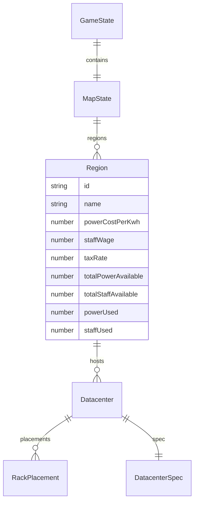
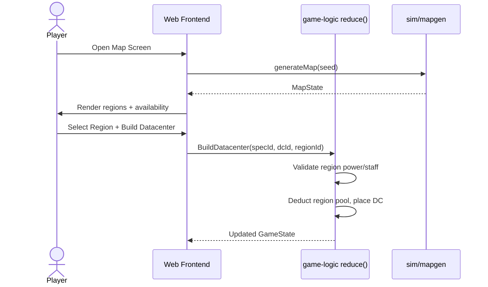

## Progress

- [x] **Phase 1 — Game-Logic Type Abstractions**
  - [x] 1.1 Add `RegionId`, `StateId` branded IDs and `Region` interface to `types.ts`
  - [x] 1.2 Add `MapState` interface and embed into `GameState`
  - [x] 1.3 Abstract `DatacenterSpec` staff from flat cost to `staffCount` headcount
  - [x] 1.4 Add `regionId` to `Datacenter` and update `BuildDatacenter` action
  - [x] 1.5 Export new types from `src/index.ts`
- [x] **Phase 2 — Regional Catalog & Map Generation**
  - [x] 2.1 Create `catalog/regions.ts` with state definitions (power cost, wage, tax rate, total power, total staff)
  - [x] 2.2 Implement deterministic `generateMap(seed)` in `sim/mapgen.ts`
  - [x] 2.3 Add region resource-pool tracking helpers (`regionPowerUsed`, `regionStaffUsed`, `canBuildInRegion`)
  - [x] 2.4 Unit tests for map generation determinism and region invariants
- [x] **Phase 3 — Economy Refactoring**
  - [x] 3.1 Replace global `ELECTRICITY_USD_PER_KWH` with per-region lookup in `tickOpex`
  - [x] 3.2 Refactor staff opex from `datacenter.spec.monthlyStaffCost` to `staffCount * region.staffWage`
  - [x] 3.3 Add monthly tax calculation per datacenter (tax rate × datacenter profit)
  - [x] 3.4 Update `OpexBreakdown` to include `tax` line item
  - [x] 3.5 Update economy tests and constants
- [ ] **Phase 4 — State, Reducer & Save Integration**
  - [ ] 4.1 Update `newGame()` to generate and attach a `MapState`
  - [ ] 4.2 Update `reduce.ts` `BuildDatacenter` to validate region power/staff availability
  - [ ] 4.3 Update `reduce.ts` to track `region.powerUsed` and `region.staffUsed` on build
  - [ ] 4.4 Update `serialize.ts` save version and add migration stub for old saves
  - [ ] 4.5 Update integration and reducer tests
- [ ] **Phase 5 — Frontend Map Screen**
  - [ ] 5.1 Add `map` route to hash router and shell navigation
  - [ ] 5.2 Create `MapView` component with procedural SVG/Canvas region visualization
  - [ ] 5.3 Create `RegionPanel` showing dynamics (power cost, wage, tax, availability)
  - [ ] 5.4 Wire `NewDatacenterModal` to require a selected region from the map
  - [ ] 5.5 Update `DatacenterList` and `DatacenterView` to show region name
- [ ] **Phase 6 — Testing & Polish**
  - [ ] 6.1 End-to-end test: build DC on map → verify regional opex/tax in ledger
  - [ ] 6.2 Verify old save migration path (no regions → default region fallback)
  - [ ] 6.3 Update `game-logic/README.md` with new public APIs
  - [ ] 6.4 Update root `AGENTS.md` domain vocabulary if needed

## Overview

Currently, datacenters are abstract facilities with no geographic context. Power and staffing costs are global constants or flat spec values. This plan introduces a **procedurally-generated world map** divided into regions (states). Each region has its own economy: power rates, labor wages, and corporate tax rates. Regions also have finite pools of grid power and skilled labor, creating scarcity and strategic location choice. Players will pick a region on the map before building a datacenter, and ongoing opex will dynamically reflect that region's economics.

This touches both `game-logic` (new data model, map generation, economy refactoring) and `web` (new map screen, updated build flow).

## Architecture

### Data Model

### Build Flow

### Key Decisions

- **Region is a plain object**, not a class, to keep state JSON-serializable.
- **Map generation is deterministic** given the game seed, using the existing PRNG (`sim/rng.ts`).
- **Power cost moves from global constant to per-region**: `region.powerCostPerKwh` replaces `ELECTRICITY_USD_PER_KWH` in opex calculations.
- **Staff becomes headcount × wage**: `DatacenterSpec.monthlyStaffCost` is replaced by `staffCount` (number of employees the facility needs). The monthly cost becomes `staffCount * region.staffWage`.
- **Tax is calculated per-datacenter, per-tick**: `tax = region.taxRate * max(0, datacenterRevenue - datacenterOpex)`. This is a new `OpexBreakdown` line item.
- **Finite regional pools**: `region.totalPowerAvailable` and `region.totalStaffAvailable` cap how many datacenters (and racks) can exist in a region. `powerUsed` and `staffUsed` are derived from the datacenters in that region, not stored redundantly, but for performance we may cache them in state.
- **Backward compatibility**: Old saves without regions get a migration that assigns all existing datacenters to a single "Global" default region with legacy constants.

## Phase 1 — Game-Logic Type Abstractions

**Goal**: Introduce the new data model without changing any runtime behavior yet.

### Step 1.1 — Add `RegionId` and `Region` interface

- File: `packages/game-logic/src/types.ts`
- Add `RegionId = Brand<string, "RegionId">`.
- Add `Region` interface with all fields listed in Architecture.
- Add `MapState` interface: `{ regions: Region[]; seed: number }` (seed for map gen determinism).
- Acceptance: `npm run typecheck -w @datacenter-tycoon/game-logic` passes.

### Step 1.2 — Embed `MapState` into `GameState`

- File: `packages/game-logic/src/types.ts`
- Add `map: MapState` to `GameState`.
- Acceptance: Typecheck passes; no runtime code references `state.map` yet.

### Step 1.3 — Abstract staff in `DatacenterSpec`

- File: `packages/game-logic/src/types.ts`, `src/catalog/datacenters.ts`
- Rename `monthlyStaffCost: Money` → `staffCount: number` on `DatacenterSpec`.
- Update catalog values: garage = 2, warehouse = 8, hyperscale = 45 (roughly equivalent to old costs at a baseline wage of ~$6K–$8K).
- Acceptance: Typecheck passes; old `monthlyStaffCost` no longer exists on the spec type.

### Step 1.4 — Add `regionId` to `Datacenter` and update `BuildDatacenter` action

- File: `packages/game-logic/src/types.ts`, `src/state/reduce.ts`
- Add `regionId: RegionId` to `Datacenter` interface.
- Update `BuildDatacenter` action payload to require `regionId: RegionId`.
- Acceptance: Typecheck passes; reducer may still ignore `regionId` for now.

### Step 1.5 — Export new types

- File: `packages/game-logic/src/index.ts`
- Re-export `Region`, `RegionId`, `MapState` if not already covered by `types.ts` barrel.
- Acceptance: `npm run typecheck` passes across workspaces.

## Phase 2 — Regional Catalog & Map Generation

**Goal**: Create the region catalog and deterministic generator.

### Step 2.1 — Create `catalog/regions.ts`

- File: `packages/game-logic/src/catalog/regions.ts`
- Define a static catalog of ~8–12 regions with varied dynamics:
  - e.g. "Silicon Valley" (high wage, high tax, expensive power, abundant staff)
  - "Iowa" (cheap power, cheap staff, low tax, limited power)
  - "Iceland" (very cheap renewable power, moderate wage, limited staff)
- Export `REGION_CATALOG: Record<RegionId, Region>`.
- Acceptance: Typecheck passes; catalog values are positive and sensible.

### Step 2.2 — Implement `generateMap(seed)`

- File: `packages/game-logic/src/sim/mapgen.ts`
- Create `generateMap(seed: number): MapState`.
- Use the existing PRNG (`sim/rng.ts`) to shuffle / subset regions if desired, or simply return all catalog regions with randomized minor variations (±10% on power cost, ±5% on wage) to make each game world feel different.
- Ensure deterministic output for the same seed.
- Acceptance: Unit test in `sim/mapgen.test.ts` asserts determinism and valid ranges.

### Step 2.3 — Add region pool helpers

- File: `packages/game-logic/src/entities/region.ts` (new)
- Implement:
  - `regionPowerUsed(regionId, datacenters): number`
  - `regionStaffUsed(regionId, datacenters): number`
  - `canBuildInRegion(region, spec, datacenters): boolean` (checks power + staff headroom)
- Acceptance: Unit tests cover over-commitment scenarios.

### Step 2.4 — Unit tests for map generation

- File: `packages/game-logic/src/sim/mapgen.test.ts`
- Assert same seed → same map, different seeds → different maps (with high probability).
- Assert all generated regions have valid numeric ranges.
- Acceptance: `npm run test -w @datacenter-tycoon/game-logic` passes.

## Phase 3 — Economy Refactoring

**Goal**: Make opex region-aware and add taxes.

### Step 3.1 — Per-region power cost in `tickOpex`

- File: `packages/game-logic/src/economy/opex.ts`
- Change `tickOpex(datacenter: Datacenter)` signature to `tickOpex(datacenter: Datacenter, region: Region)`.
- Replace `ELECTRICITY_USD_PER_KWH` constant with `region.powerCostPerKwh`.
- Update all call sites (`sim/tick.ts`, tests).
- Acceptance: Economy tests updated and passing.

### Step 3.2 — Headcount-based staff cost

- File: `packages/game-logic/src/economy/opex.ts`
- Replace `datacenter.spec.monthlyStaffCost` with `datacenter.spec.staffCount * region.staffWage`.
- Update `OpexBreakdown` interface: rename `staff` to `staff` (keep name, change calc).
- Acceptance: Tests reflect new math; garage staff cost is roughly in line with old balance.

### Step 3.3 — Add tax calculation

- File: `packages/game-logic/src/economy/opex.ts`
- Add `tax: Money` to `OpexBreakdown`.
- Compute datacenter profit = `datacenterRevenue - datacenterOpexExcludingTax`.
- Tax = `max(0, profit) * region.taxRate`.
- Note: This requires passing per-datacenter revenue into `tickOpex` or computing tax in `tick.ts` after revenue is known. Prefer computing tax in `tick.ts` to avoid circular dependency.
- Acceptance: Tax is zero when unprofitable, positive when profitable.

### Step 3.4 — Update economy tests and constants

- File: `packages/game-logic/src/economy/economy.test.ts`, `src/economy/constants.ts`
- Remove or deprecate `ELECTRICITY_USD_PER_KWH` global constant (keep as fallback/default only).
- Update test fixtures to include a `Region`.
- Acceptance: All economy tests pass.

## Phase 4 — State, Reducer & Save Integration

**Goal**: Wire the map into the game loop, reducer, and persistence.

### Step 4.1 — Update `newGame()` to generate a map

- File: `packages/game-logic/src/state/newGame.ts`
- Call `generateMap(seed)` and attach to `GameState.map`.
- Acceptance: `newGame.test.ts` passes; `state.map.regions` is non-empty.

### Step 4.2 — Validate region availability on `BuildDatacenter`

- File: `packages/game-logic/src/state/reduce.ts`
- In `BuildDatacenter` handler, look up the region from `state.map.regions`.
- Call `canBuildInRegion(region, spec, state.datacenters)`.
- If insufficient power or staff, return unchanged state (or add an error mechanism — for now, silent no-op is acceptable to match existing patterns).
- Acceptance: Reducer test shows building in an overcommitted region is blocked.

### Step 4.3 — Track regional pool usage

- File: `packages/game-logic/src/state/reduce.ts`
- On successful `BuildDatacenter`, increment `region.powerUsed` and `region.staffUsed` by the datacenter spec's `powerCapacityKw` and `staffCount`.
- Add a new action `DecommissionDatacenter` (optional but recommended) to free pools. If skipping, note as future work.
- Acceptance: Reducer tests verify pool increments.

### Step 4.4 — Save version bump and migration

- File: `packages/game-logic/src/save/serialize.ts`
- Bump `SAVE_VERSION`.
- In `migrate()`, if loading an old save without `map`, create a default `MapState` with one "Global" region using legacy constants, and assign all datacenters to it.
- Acceptance: `serialize.test.ts` round-trip passes; manual test of old save loads without crash.

### Step 4.5 — Update integration and reducer tests

- File: `packages/game-logic/src/integration.test.ts`, `src/state/reduce.test.ts`
- Update test actions to include `regionId`.
- Acceptance: Full test suite passes.

## Phase 5 — Frontend Map Screen

**Goal**: Let players see the world map, browse regions, and pick a location to build.

### Step 5.1 — Add `map` route

- File: `packages/web/src/router/hashRouter.ts`
- Add `map` to `Route` union.
- Add `navigateToMap()` helper.
- Update `Shell.tsx` to include a "MAP" nav button.
- Acceptance: Navigating to `/#/map` renders a placeholder.

### Step 5.2 — Create `MapView` component

- File: `packages/web/src/ui/map/MapView.tsx`, `MapView.module.css`
- Render a stylized abstract map (SVG or Canvas) showing regions as polygons / nodes.
- Use `state.map.regions` as data source.
- Color-code regions by power cost or tax rate.
- Show datacenter count per region.
- Acceptance: Component renders without errors; visually distinct regions.

### Step 5.3 — Create `RegionPanel` component

- File: `packages/web/src/ui/map/RegionPanel.tsx`
- On region click/hover, show a panel with:
  - Name, power cost ($/kWh), staff wage ($/mo), tax rate (%)
  - Power availability bar (`powerUsed / totalPowerAvailable`)
  - Staff availability bar (`staffUsed / totalStaffAvailable`)
  - "Build Here" button that opens `NewDatacenterModal` pre-scoped to this region
- Acceptance: Panel updates when different regions are selected.

### Step 5.4 — Wire `NewDatacenterModal` to map

- File: `packages/web/src/ui/onboarding/NewDatacenterModal.tsx`
- Accept an optional `regionId` prop.
- If provided, filter/validate specs against regional power/staff availability.
- On "BUILD", dispatch `BuildDatacenter` with the selected `regionId`.
- Update `DatacenterList` "NEW DATACENTER" button to navigate to map first (or open modal with map picker embedded).
- Acceptance: Can build a datacenter in a specific region; build is blocked if region is full.

### Step 5.5 — Show region name in DC views

- File: `packages/web/src/ui/left-rail/DatacenterList.tsx`, `src/ui/dc-view/DatacenterView.tsx`
- Look up region name from `state.map.regions` by `datacenter.regionId`.
- Display next to datacenter name.
- Acceptance: Region names visible in list and detail view.

## Phase 6 — Testing & Polish

**Goal**: Ensure correctness, backward compatibility, and documentation.

### Step 6.1 — End-to-end integration test

- File: `packages/game-logic/src/integration.test.ts`
- Add a test: start game → build DC in region X → run ticks → assert ledger contains region-specific power cost, staff cost, and tax entries.
- Acceptance: Test passes.

### Step 6.2 — Save migration verification

- File: `packages/game-logic/src/save/serialize.test.ts`
- Construct a v0 save object without `map`, run through `deserialize`, assert it gains a default region and all datacenters point to it.
- Acceptance: Test passes.

### Step 6.3 — Update `game-logic/README.md`

- File: `packages/game-logic/README.md`
- Document new public APIs: `generateMap`, `Region`, `MapState`, updated `BuildDatacenter` action.
- Acceptance: README is accurate.

### Step 6.4 — Update root `AGENTS.md` vocabulary

- File: `AGENTS.md` (repo root)
- Add "Region" and "Map" to domain vocabulary if not already present.
- Acceptance: File updated.

## References

- [AGENTS.md](../AGENTS.md)
- [packages/game-logic/AGENTS.md](../packages/game-logic/AGENTS.md)
- [packages/web/AGENTS.md](../packages/web/AGENTS.md)
- Related plans: none directly; this is a major new subsystem.

## Changelog

- 2026-05-03 — Created.
