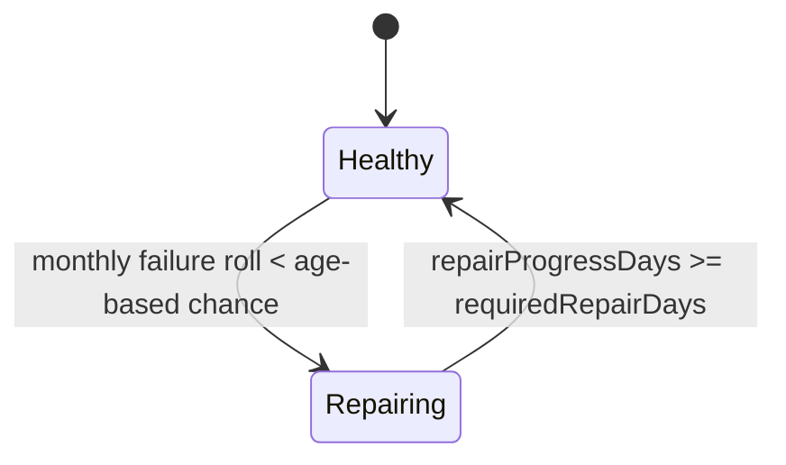

## Progress

- [x] **Phase 1 — Data model & balance scaffolding**
  - [x] 1.1 Extend rack and datacenter types for health, repair progress, and maintenance staffing
  - [x] 1.2 Add tunable wear/repair balance constants and document the month↔day conversion
  - [x] 1.3 Export new types/helpers from the public surface where needed
- [x] **Phase 2 — Rack health domain helpers**
  - [x] 2.1 Implement pure helpers for rack age, failure chance, and repair throughput
  - [x] 2.2 Make usable capacity health-aware while keeping installed-resource accounting stable
  - [x] 2.3 Add unit tests for age curve, caps, and repair-speed scaling
- [x] **Phase 3 — Deterministic simulation integration**
  - [x] 3.1 Integrate monthly failure rolls into `sim/tick.ts` using seeded RNG
  - [x] 3.2 Advance repairs each tick and restore racks when repair progress completes
  - [x] 3.3 Ensure contract evaluation sees rack downtime in the same tick
- [ ] **Phase 4 — Staffing lever, reducer & economy wiring**
  - [x] 4.1 Add `SetMaintenanceStaff` action and reducer validation against regional staff limits
  - [x] 4.2 Charge staffing opex and regional staff usage from baseline staff + maintenance staff
  - [ ] 4.3 Seed default maintenance staffing on build and expose selectors for UI summaries
- [ ] **Phase 5 — Save, UI & verification**
  - [ ] 5.1 Bump save version and invalidate legacy saves instead of migrating them
  - [ ] 5.2 Show rack age, health, and repair progress in the web datacenter/floor views
  - [ ] 5.3 Add a maintenance staffing control to the web UI with repair-speed feedback
  - [ ] 5.4 Add reducer/tick/integration tests and update package docs

## Overview

This plan introduces **rack wear and tear** as a new operational risk in the simulation. Racks will age in months, accumulate a higher chance of failure as they get older, and automatically enter a repair workflow when they break. Repairs will take a configurable number of in-game days and complete faster when the player allocates more maintenance staff to a datacenter.

The design deliberately preserves the current **deterministic monthly tick** model in `game-logic`: rack age remains month-based because one tick equals one month, while repair work is expressed in days and accumulated as progress within each monthly tick. The feature also adds a player-facing maintenance staffing lever, so breakdown recovery becomes a strategic tradeoff between resilience, staffing cost, and regional labor scarcity.

## Architecture

### Rack lifecycle



### Simulation flow

```mermaid
flowchart LR
    Tick[Monthly tick] --> Age[rackAgeMonths(currentTick - installedAtTick)]
    Age --> FailChance[failureChance(ageMonths)]
    FailChance --> Roll[seeded RNG roll]
    Roll -->|fail| Repairing[mark rack repairing]
    Repairing --> RepairProgress[advance repairProgressDays]
    RepairProgress --> Capacity[usable datacenter capacity]
    Capacity --> Contracts[contract fulfillment / breach]
    Staff[maintenanceStaff] --> RepairProgress
    Staff --> Opex[staff opex + regional staff usage]
```

### Key decisions

- **Age is derived, not duplicated**: rack age in months comes from `currentTick - installedAtTick`, which matches the package rule that one tick equals one in-game month.
- **Repairs are stored in days without changing tick granularity**: each rack stores repair progress in days (or remaining repair days), and each monthly tick contributes `DAYS_PER_TICK * repairSpeed` progress. This keeps the simulation deterministic and avoids a repo-wide shift from monthly to daily ticks.
- **Failure chance ramps linearly to a hard cap of 50% at 36 months** unless later balance tuning revises the curve. That directly matches the requested “up to 50% after 3 years” behavior.
- **Maintenance staffing is an adjustable datacenter property**: use `maintenanceStaff` as extra headcount on top of the datacenter spec’s baseline operational staff. More maintenance staff speeds repairs; less staff slows them down. This also raises wage opex and consumes more of the region’s finite labor pool.
- **Failed/repairing racks still occupy installed footprint**: they continue to occupy slots and count toward installed hardware, but they stop contributing **usable capacity** for contracts while under repair. Placement/resource budgeting remains tied to installed hardware so players cannot exploit failures to overbuild.
- **All randomness must consume the seeded PRNG** already used by contracts/market generation. Rack failure order must be stable (e.g. datacenters sorted by array order, then placements sorted by row/position/id) so replays remain deterministic.

### Illustrative types

```ts
export type RackHealthStatus = "healthy" | "repairing";

export interface Rack {
  id: RackPlacementId;
  specId: RackSpecId;
  kind: RackKind;
  installedAtTick: Tick;
  health: RackHealthStatus;
  repairProgressDays?: number;
  lastFailureAtTick?: Tick;
}

export interface Datacenter {
  id: DatacenterId;
  name: string;
  spec: DatacenterSpec;
  placements: RackPlacement[];
  builtAtTick: Tick;
  regionId: RegionId;
  maintenanceStaff: number;
}
```

The exact field names can change during implementation, but the persisted state should retain the same semantics: age derived from install tick, health persisted per rack, and maintenance staffing persisted per datacenter.

## Phase 1 — Data model & balance scaffolding

**Goal**: represent rack health, repair progress, and adjustable maintenance staffing without yet changing monthly outcomes.

### Step 1.1 — Extend rack and datacenter types

- File: `packages/game-logic/src/types.ts`
- Add a rack-health concept to `Rack` / `RackPlacement` (e.g. `health`, repair progress metadata, last failure tick).
- Add `maintenanceStaff: number` to `Datacenter` as the player-controlled staffing lever.
- Keep all new fields JSON-serializable and omit optional properties when unset.
- Acceptance: `npm run typecheck -w @datacenter-tycoon/game-logic` passes and old fields remain intact.

### Step 1.2 — Add wear/repair tuning constants

- File: `packages/game-logic/src/balance/maintenance.ts` (new), `packages/game-logic/src/economy/constants.ts` or `src/index.ts` if a barrel update is needed.
- Centralize all numeric knobs:
  - `RACK_FAILURE_MAX_CHANCE = 0.5`
  - `RACK_FAILURE_MAX_AGE_MONTHS = 36`
  - `BASE_REPAIR_DAYS`
  - `DAYS_PER_TICK = 30`
  - `DEFAULT_MAINTENANCE_STAFF`
  - any repair-speed multiplier clamps
- Add comments explaining why repair durations are stored in days even though simulation advances monthly.
- Acceptance: constants live in one obvious place; no magic numbers are planned for `sim/tick.ts`.

### Step 1.3 — Export new public types/helpers where appropriate

- File: `packages/game-logic/src/index.ts`, `packages/game-logic/README.md`
- Re-export new public types/helper functions if consumers need them (`RackHealthStatus`, age helper, maintenance selectors, etc.).
- Document the new persisted fields and maintenance model in the package README if they become part of the public API.
- Acceptance: package public surface stays explicit and `npm run typecheck` passes across workspaces.

## Phase 2 — Rack health domain helpers

**Goal**: isolate wear/repair math into pure, testable helpers before wiring it into the game loop.

### Step 2.1 — Implement age, failure, and repair helpers

- File: `packages/game-logic/src/sim/maintenance.ts` (new) or `packages/game-logic/src/entities/maintenance.ts` (new)
- Implement pure helpers such as:
  - `rackAgeMonths(currentTick, rack)`
  - `rackFailureChance(ageMonths)`
  - `repairProgressPerTick(maintenanceStaff)`
  - `advanceRackRepair(rack, maintenanceStaff)`
- Keep the failure curve linear from 0 → 50% over 36 months unless a better curve is explicitly chosen and documented.
- Design helpers so staffing changes can affect in-progress repairs immediately rather than only at failure start.
- Acceptance: helpers are deterministic, side-effect free, and require no `GameState` mutation to test.

### Step 2.2 — Make usable capacity health-aware

- File: `packages/game-logic/src/entities/datacenter.ts`, optionally `packages/game-logic/src/entities/index.ts`
- Update usable-capacity logic so repairing racks contribute zero customer-serving capacity.
- Keep placement/resource-budget logic tied to installed racks so failures do not free rack slots or datacenter provisioned limits.
- Add any small summary helper needed by the UI (e.g. failed rack count, average rack age, repairing rack count).
- Acceptance: a datacenter with one repairing rack shows reduced capacity but unchanged slot occupancy.

### Step 2.3 — Add unit tests for the aging curve and repair throughput

- File: `packages/game-logic/src/sim/maintenance.test.ts` (new), `packages/game-logic/src/entities/capacity.test.ts`
- Verify representative points on the curve:
  - 0 months → near-zero/zero failure chance
  - 18 months → halfway-to-cap chance
  - 36 months → 50% chance
  - >36 months → still capped at 50%
- Verify higher `maintenanceStaff` produces faster repair progress.
- Acceptance: `npm run test -w @datacenter-tycoon/game-logic` passes with focused unit coverage.

## Phase 3 — Deterministic simulation integration

**Goal**: apply failures and repairs during the monthly tick while preserving seeded determinism.

### Step 3.1 — Integrate failure rolls into `tick()`

- File: `packages/game-logic/src/sim/tick.ts`
- Create a seeded RNG from `state.rngState` and evaluate healthy racks in a stable order every tick.
- For each healthy rack, compute age-derived failure chance and compare against the RNG roll.
- Transition failed racks into the repairing state and persist the updated RNG state before the rest of the tick finishes.
- Acceptance: running the same starting state twice yields identical rack failure timelines.

### Step 3.2 — Advance repairs and restore healthy racks

- File: `packages/game-logic/src/sim/tick.ts`
- During each tick, advance `repairProgressDays` for repairing racks using current maintenance staffing.
- When repair progress reaches the configured threshold, restore the rack to healthy and clear transient repair fields.
- Keep the logic pure by producing updated datacenter / placement arrays rather than mutating in place.
- Acceptance: identical aged racks recover in fewer ticks when maintenance staffing is higher.

### Step 3.3 — Evaluate contracts after maintenance state changes

- File: `packages/game-logic/src/sim/tick.ts`, `packages/game-logic/src/economy/opex.ts` if call ordering changes require it
- Reorder or refactor the tick flow so rack failures/repairs happen before revenue and contract fulfillment are evaluated.
- Confirm that a rack failing this tick can immediately reduce fulfilled capacity and breach an overcommitted contract.
- Confirm that a repaired rack can restore capacity for the same tick’s fulfillment check.
- Acceptance: tick tests clearly show downtime affecting revenue/penalties in the expected month.

## Phase 4 — Staffing lever, reducer & economy wiring

**Goal**: make maintenance staffing player-adjustable and ensure it carries real cost/scarcity consequences.

### Step 4.1 — Add `SetMaintenanceStaff` action and reducer support

- File: `packages/game-logic/src/state/reduce.ts`, `packages/game-logic/src/types.ts`
- Add a new action such as `{ type: "SetMaintenanceStaff"; dcId: DatacenterId; maintenanceStaff: number }`.
- Clamp or validate the requested staff level against a documented min/max range.
- Reject changes that would exceed the region’s available staff pool, and update `region.staffUsed` when staffing changes succeed.
- Acceptance: reducer tests cover increase, decrease, clamp, and insufficient-region-staff cases.

### Step 4.2 — Make staffing opex and regional labor usage dynamic

- File: `packages/game-logic/src/economy/opex.ts`, `packages/game-logic/src/entities/region.ts` and/or `packages/game-logic/src/state/reduce.ts`
- Change staff cost math from fixed baseline staff to `(datacenter.spec.staffCount + datacenter.maintenanceStaff) * region.staffWage`.
- Ensure any region labor accounting reflects current maintenance staffing instead of only the baseline datacenter spec.
- Keep the result deterministic and compatible with the region-scarcity model added in plan 014.
- Acceptance: economy tests show that raising maintenance staff increases monthly opex and consumes additional regional staff capacity.

### Step 4.3 — Seed build defaults and expose selectors for UI

- File: `packages/game-logic/src/state/reduce.ts`, `packages/web/src/store/selectors.ts`
- When a new datacenter is built, initialize `maintenanceStaff` to a sensible default from the balance constants.
- Add selectors that surface per-datacenter maintenance staffing, repairing rack count, failed/repairing status summaries, and average rack age.
- Keep selectors thin: they should compose `game-logic` helpers rather than reimplement rules in the web package.
- Acceptance: UI can render maintenance state without duplicating simulation logic.

## Phase 5 — Save, UI & verification

**Goal**: make the feature visible, adjustable, and consistent with destructive save recreation on upgrade.

### Step 5.1 — Bump save version and invalidate legacy saves

- File: `packages/game-logic/src/save/serialize.ts`
- Increase `SAVE_VERSION`.
- Reject or reset pre-feature saves instead of migrating them forward.
- Document that upgrades recreate saves destructively, so no compatibility shim is required for missing rack-health or maintenance-staff fields.
- Acceptance: current-version save round-trip tests pass and outdated saves fail in a clear, expected way.

### Step 5.2 — Show rack age, health, and repair progress in the web UI

- File: `packages/web/src/ui/dc-view/DatacenterView.tsx`, `packages/web/src/ui/floor/RackTile.tsx`, related CSS modules
- Show each rack’s age in months and whether it is healthy or repairing.
- For repairing racks, render repair progress / ETA text using the selector data rather than bespoke UI-side calculations.
- Add visual distinction (badge, tint, icon) so downtime is obvious on the floor/grid view.
- Acceptance: component tests assert age/status rendering for healthy and repairing racks.

### Step 5.3 — Add the maintenance staffing control

- File: `packages/web/src/ui/dc-view/DatacenterView.tsx`, optionally `packages/web/src/ui/stats/OpexCard.tsx` and `packages/web/src/store/gameStore.ts` tests
- Add a player-facing control (stepper, slider, or +/- buttons) that dispatches `SetMaintenanceStaff`.
- Show the immediate side effects of the lever: current maintenance staff, monthly wage impact, and an approximate repair-speed indicator.
- Keep validation server/game-logic-side; the UI should only reflect disabled states/help text, not own the rule set.
- Acceptance: UI test covers increasing/decreasing staffing and disabled behavior when limits are reached.

### Step 5.4 — Add integration coverage and docs

- File: `packages/game-logic/src/sim/tick.test.ts`, `packages/game-logic/src/state/reduce.test.ts`, `packages/game-logic/src/integration.test.ts`, `packages/game-logic/README.md`
- Add end-to-end coverage for:
  - an aged rack failing
  - the same rack repairing over time
  - low vs high maintenance staffing changing recovery time
- Update README examples and any relevant design docs to describe rack aging, failure cap, repair timing, and the maintenance staffing lever.
- Acceptance: `npm run test`, `npm run typecheck`, and relevant web tests all pass.

## References

- [Root AGENTS.md](../../AGENTS.md)
- [game-logic AGENTS.md](../../packages/game-logic/AGENTS.md)
- [014-regional-map-and-location-economy.md](./014-regional-map-and-location-economy.md) — regional labor scarcity and staff-cost rules this plan builds on
- [planning skill](../skills/planning/SKILL.md)

## Changelog

- 2026-05-04 — created.
- 2026-05-04 — completed step 1.1 by extending rack health fields and datacenter maintenance staffing scaffolding.
- 2026-05-04 — removed legacy-save migration work; upgrades will recreate saves destructively instead.
- 2026-05-04 — completed step 1.2 by centralizing rack-failure and repair timing constants in a maintenance balance module.
- 2026-05-04 — completed step 1.3 by exporting maintenance balance constants from the package entrypoint and documenting the new persisted rack/datacenter fields.
- 2026-05-04 — completed step 2.1 by adding pure rack-aging, failure-chance, repair-speed, and repair-advancement helpers under `sim/maintenance.ts`.
- 2026-05-04 — completed step 2.2 by making `datacenterCapacity()` health-aware, preserving installed capacity explicitly, and adding maintenance summary helpers for downstream UI use.
- 2026-05-04 — completed step 2.3 by adding dedicated maintenance-helper tests and increasing base repair duration so staffing changes can produce distinct recovery times.
- 2026-05-04 — completed step 3.1 by integrating deterministic rack-failure rolls into `tick()` and updating the smoke test to cover a stable early-game scenario instead of a no-failure long run.
- 2026-05-04 — completed step 3.2 by advancing rack repairs during `tick()` and proving that higher maintenance staffing restores identical failures in fewer months.
- 2026-05-04 — completed step 3.3 by reordering `tick()` so failures and repairs affect same-month contract fulfillment, with coverage for both same-tick breaches and same-tick recoveries.
- 2026-05-04 — completed step 4.1 by adding a `SetMaintenanceStaff` reducer action with integer validation, clamp behavior, regional labor-cap checks, and reducer coverage for increase/decrease/clamp/rejection paths.
- 2026-05-04 — completed step 4.2 by charging maintenance staffing in monthly staff opex and adding economy coverage for the extra wage load.
