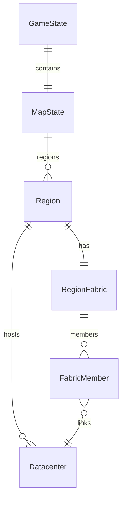

## Progress

- [x] **Phase 1 - Game-logic model, persistence, and exports**
  - [x] 1.1 Add serializable region-fabric state to the core types and initialize it in `newGame()`
  - [x] 1.2 Bump save version and migrate legacy saves to empty regional fabrics
  - [x] 1.3 Re-export any new public symbols from the `game-logic` barrels
- [x] **Phase 2 - Fabric investment and reducer flow**
  - [x] 2.1 Add a fabric-link action with region-local validation and capex debit
  - [x] 2.2 Persist fabric membership changes and ledger the investment consistently
  - [x] 2.3 Add explicit errors for invalid joins, duplicate joins, and cross-region joins
- [x] **Phase 3 - Pooled capacity and contract evaluation**
  - [x] 3.1 Add pure helpers for fabric membership and pooled capacity lookup
  - [x] 3.2 Route contract acceptance and fulfilment through pooled fabric capacity
  - [x] 3.3 Update selectors and tick summaries to expose fabric-aware totals
- [x] **Phase 4 - Web UI and feedback**
  - [x] 4.1 Surface fabric status and join cost in map, region, and datacenter views
  - [x] 4.2 Update capacity displays to show pooled block capacity for fabric-connected sites
  - [x] 4.3 Add a UI affordance for connecting datacenters into the regional fabric
- [ ] **Phase 5 - Tests and regression coverage**
  - [x] 5.1 Add game-logic tests for first link, later links, and invalid joins
  - [x] 5.2 Add contract tests for pooled fulfilment across multiple datacenters
  - [ ] 5.3 Add UI selector/component tests for pooled capacity and fabric badges

## Overview

This plan extends the regional economy work with a new investment layer: a region-local fabric that connects datacenters and turns them into one pooled capacity block for contract fulfilment. The goal is to let players pay a connection cost to join datacenters into the fabric, starting with the first pair in a region and then reusing the same cost for every additional datacenter. Once connected, those datacenters should behave like one homogeneous capacity pool for contract checks, while still remaining serializable and deterministic in game-logic.

This plan now explicitly depends on the datacenter-upgrade work in [036-datacenter-upgrade-framework.md](./036-datacenter-upgrade-framework.md): only datacenters whose effective network type is `fiber` may participate in the regional fabric. Fabric creation and later joins must therefore validate fiber readiness through authoritative `game-logic` upgrade/infrastructure queries instead of inferring it from raw bandwidth numbers in UI or reducer code.

This is a follow-on to the regional map and location-economy work, so the implementation should build on the existing region and datacenter model instead of introducing a parallel system.

## Architecture

```mermaid
flowchart LR
    Player --> UI[Map / Datacenter UI]
    UI --> Reducer[game-logic reduce()]
    Reducer --> Fabric[Region fabric state]
    Fabric --> Capacity[Fabric-aware capacity helper]
    Capacity --> Contracts[Contract fulfilment]
    Capacity --> UI
```



Key decisions:
- Fabric state stays region-local and JSON-serializable.
- Capacity is derived from membership, not duplicated into each datacenter.
- Contract fulfilment uses the pooled fabric block when a datacenter is fabric-connected.
- The initial fabric connection and later joins use the same capex cost.
- Fabric membership is gated by effective datacenter `networkType === "fiber"`; non-fiber datacenters cannot create or join a fabric.
- Fabric eligibility must be resolved through the upgrade/infrastructure query surface from plan 036, not re-derived from raw bandwidth thresholds.

## Phase 1 - Game-logic model, persistence, and exports

**Goal**: introduce fabric state without changing gameplay rules yet.

### Step 1.1 - Add region fabric state

- File: `packages/game-logic/src/types.ts`, `packages/game-logic/src/state/newGame.ts`
- Add a serializable fabric structure for each region that can record connected datacenters in the region.
- Keep the shape plain-object only so save/load stays deterministic and JSON-safe.
- Initialize the fabric state in new games and keep it empty until the player invests.
- Acceptance: `npm run typecheck -w @datacenter-tycoon/game-logic` passes.

### Step 1.2 - Update save version and migration

- File: `packages/game-logic/src/save/serialize.ts`
- Bump the save version for the new fabric state.
- Migrate older saves by attaching empty fabric state to regions that do not have it yet.
- Preserve existing datacenters and region data without changing their economics.
- Acceptance: save round-trip and migration tests pass for old and new payloads.

### Step 1.3 - Update public exports

- File: `packages/game-logic/src/index.ts`, `packages/game-logic/src/entities/index.ts` if needed
- Re-export any new fabric-related types or helpers from the public surface.
- Keep the exported API coherent so web code can consume the new helpers without deep imports.
- Acceptance: workspace typecheck passes with imports coming from package barrels only.

## Phase 2 - Fabric investment and reducer flow

**Goal**: let the player pay to join datacenters into the regional fabric.

### Step 2.1 - Add a fabric-link action

- File: `packages/game-logic/src/state/reduce.ts`
- Introduce a reducer action for linking datacenters into the regional fabric.
- Validate region locality, existing membership, the first-link case where the fabric is created by connecting the first pair, and the new prerequisite that every participating datacenter has effective `networkType === "fiber"`.
- Resolve fiber readiness through the authoritative infrastructure/upgrade helpers from plan 036 rather than by comparing raw `bandwidthGbps` values inline.
- Debit the same investment cost for the first link and every later join.
- Acceptance: reducer tests cover valid first join, valid follow-up join, rejected non-fiber joins, and rejected attempts to bootstrap a fabric from non-fiber datacenters.

### Step 2.2 - Persist investment results

- File: `packages/game-logic/src/state/reduce.ts`, `packages/game-logic/src/economy/capex.ts` if needed
- Store fabric membership changes in game state after a successful join.
- Record the investment in the ledger using the existing capex pattern so the cost is visible to the player.
- Keep the action deterministic and side-effect free outside the reducer.
- Acceptance: the ledger and game state update consistently after a fabric-link action.

### Step 2.3 - Define validation errors

- File: `packages/game-logic/src/state/reduce.ts`, related test files
- Reject cross-region links, duplicate joins, joins against unknown datacenters, and joins involving non-fiber datacenters with explicit errors.
- Keep the failure reasons stable enough for UI feedback and tests.
- Acceptance: negative-path tests assert the exact rejected cases, including the fiber prerequisite.

## Phase 3 - Pooled capacity and contract evaluation

**Goal**: make fabric-connected datacenters behave like one homogeneous capacity block.

### Step 3.1 - Add fabric-aware capacity helpers

- File: `packages/game-logic/src/entities/region.ts` or a new `packages/game-logic/src/entities/fabric.ts`
- Implement pure helpers to resolve fabric membership and sum capacity across connected datacenters in the same region.
- Return local capacity for datacenters that are not fabric-connected.
- Acceptance: unit tests prove pooled totals are correct and isolated datacenters stay independent.

### Step 3.2 - Route contracts through pooled capacity

- File: `packages/game-logic/src/contracts/lifecycle.ts`, `packages/game-logic/src/contracts/market.ts`
- Update contract fulfilment and acceptance logic to use fabric-aware capacity when the assigned datacenter is on a fabric.
- Ensure contracts can be satisfied even when the required capacity is split across multiple connected datacenters in the same region.
- Preserve the existing contract flow for non-fabric datacenters.
- Acceptance: a contract requiring split capacity can complete when the region fabric has enough pooled resources.

### Step 3.3 - Update selectors and tick summaries

- File: `packages/web/src/store/selectors.ts`, `packages/game-logic/src/sim/tick.ts` if summaries need adjustment
- Expose fabric-aware totals so the UI can render a single block view when a region fabric is active.
- Keep raw datacenter totals available where the UI still needs per-site breakdowns.
- Also expose fabric eligibility / ineligibility reasons per datacenter so consumers can explain why a site cannot yet join (for now, the key reason is non-fiber `networkType`).
- Acceptance: selectors expose both pooled and per-datacenter views without breaking existing screens and can explain fiber-gated ineligible sites.

## Phase 4 - Web UI and feedback

**Goal**: make fabric state visible and actionable in the frontend.

### Step 4.1 - Surface fabric status

- File: `packages/web/src/ui/map/MapView.tsx`, `packages/web/src/ui/map/RegionPanel.tsx`, `packages/web/src/ui/dc-view/DatacenterView.tsx`
- Show whether a region has an active fabric, which datacenters are joined, what the join cost is, and which datacenters are still blocked because they are not yet on fiber network type.
- Make the connected-state obvious from both the region view and the datacenter view.
- Acceptance: the user can identify fabric-connected datacenters, region fabric state, and fiber-gated ineligible datacenters at a glance.

### Step 4.2 - Update capacity displays

- File: `packages/web/src/ui/stats/CapacityTiles.tsx`, `packages/web/src/ui/left-rail/DatacenterList.tsx`
- Render pooled capacity for fabric-connected sites as a single homogeneous block.
- Keep a local/per-site fallback view for datacenters that are not connected.
- Acceptance: the capacity UI matches the new pooled contract model.

### Step 4.3 - Add join affordance

- File: `packages/web/src/ui/onboarding/NewDatacenterModal.tsx` or a region/datacenter action component
- Add the control used to pay for and create fabric links.
- Wire the control to the new reducer action and reuse existing store patterns.
- Disable or block the control with clear feedback when any target datacenter is not yet on fiber network type.
- Acceptance: the player can connect a datacenter to the regional fabric from the UI only when all participating datacenters meet the fiber prerequisite.

## Phase 5 - Tests and regression coverage

**Goal**: lock in the new fabric behavior across game-logic and web.

### Step 5.1 - Add game-logic tests

- File: `packages/game-logic/src/**/*.test.ts`
- Cover first-link creation, follow-up joins, invalid joins, save/load round-trips, and the new fiber prerequisite.
- Add coverage for fabric-aware capacity helpers and state migration.
- Acceptance: `npm run test -w @datacenter-tycoon/game-logic` passes.

### Step 5.2 - Add contract tests

- File: `packages/game-logic/src/contracts/*.test.ts`
- Cover pooled fulfilment across multiple fabric-connected datacenters and failure when the same capacity is not connected.
- Acceptance: contract lifecycle tests prove the pooled block semantics.

### Step 5.3 - Add web tests

- File: `packages/web/src/ui/**/*.test.tsx`, `packages/web/src/store/selectors.test.ts`
- Verify the new fabric indicators, pooled-capacity rendering paths, and fiber-gated disabled/error states for non-eligible datacenters.
- Acceptance: web tests pass and the new selectors/components stay stable.

## References

- [Regional Map & Location-Aware Economy](./014-regional-map-and-location-economy.md)
- [AGENTS.md](../AGENTS.md)
- [game-logic AGENTS.md](../../packages/game-logic/AGENTS.md)
- [web AGENTS.md](../../packages/web/AGENTS.md)
- [Datacenter Upgrade Framework](./036-datacenter-upgrade-framework.md)

## Changelog

- 2026-05-04 - created.
- 2026-05-11 - added dependency on plan 036 so regional fabric requires all participating datacenters to have effective fiber network type.
