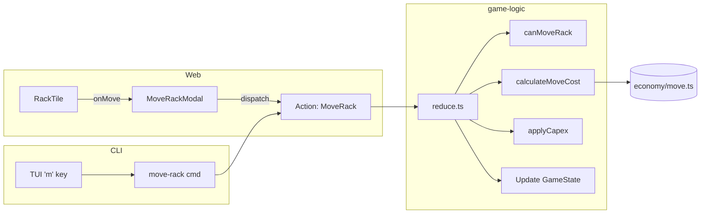

## Progress

- [x] **Phase 1 — Game Logic Core**
  - [x] 1.1 Add move-cost constants and `calculateMoveCost` pure function
  - [x] 1.2 Add `MoveRack` action to `Action` union and reducer switch
  - [x] 1.3 Implement `moveRack` reducer with validation and ledger entry
  - [x] 1.4 Add `canMoveRack` helper in `entities/datacenter.ts`
  - [x] 1.5 Export new helpers from `game-logic/src/index.ts`
  - [x] 1.6 Unit tests for `moveRack` reducer and `calculateMoveCost`
- [x] **Phase 2 — Web UI**
  - [x] 2.1 Add move button to `RackTile` (beside decommission ×)
  - [x] 2.2 Create `MoveRackModal` component with DC selector + cost display
  - [x] 2.3 Wire modal into `FloorView` → `Grid` → `Slot` → `RackTile`
  - [x] 2.4 Add CSS modules for move button and modal
  - [x] 2.5 Unit tests for `MoveRackModal`
- [x] **Phase 3 — CLI**
  - [x] 3.1 Add `move-rack` one-shot command in `cli/src/commands/build-dc.ts`
  - [x] 3.2 Register command in `cli/src/cli.ts`
  - [x] 3.3 Add TUI `m` keybinding in `cli/src/tui/app.ts`
  - [x] 3.4 Unit tests for `move-rack` command
- [ ] **Phase 4 — Integration & Polish**
  - [ ] 4.1 Run full test suite (`npm run test`)
  - [ ] 4.2 Run typecheck (`npm run typecheck`)
  - [ ] 4.3 Update `packages/game-logic/AGENTS.md` if API surface changed
  - [ ] 4.4 Update `packages/cli/AGENTS.md` if new commands added

## Overview

Players currently lose the full capital investment when they decommission a rack. This feature lets them **relocate an existing rack** to another datacenter, paying a moving fee instead of re-purchasing hardware. Moving within the same region is cheaper than cross-region moves, creating an interesting logistics decision.

The feature touches all three consumer packages:
- **`game-logic`** — new `MoveRack` action, cost formula, placement validation.
- **`web`** — move button on each rack card, modal to pick target DC and slot.
- **`cli`** — `move-rack` command and TUI keybinding.

## Architecture



Key decisions:
- **Cost is derived from rack capex** — same-region = 10 %, cross-region = 25 % (tunable constants).
- **Rack identity is preserved** — `id`, `installedAtTick`, `health`, `repairProgressDays` all travel with the rack.
- **Target validation reuses `canPlaceRack`** — power, cooling, bandwidth, bounds, and cooling-type checks apply exactly as for a new placement.
- **Ledger entry type is `"capex"`** — moving is a one-time capital-like outlay; the reason string clarifies it is a move.
- **No new regional resource consumption** — the rack already exists; only the destination DC's internal capacity matters.

### Core types (illustrative)

```ts
// packages/game-logic/src/economy/move.ts
export const SAME_REGION_MOVE_COST_PERCENT = 0.10;
export const CROSS_REGION_MOVE_COST_PERCENT = 0.25;

export function calculateMoveCost(
  rackSpec: RackSpec,
  sourceRegionId: RegionId,
  targetRegionId: RegionId,
): Money;
```

```ts
// packages/game-logic/src/state/reduce.ts
export type Action =
  | ...existing actions...
  | {
      type: "MoveRack";
      dcId: DatacenterId;          // source DC
      placementId: RackPlacementId;
      targetDcId: DatacenterId;
      row: number;
      position: number;
    };
```

## Phase 1 — Game Logic Core

**Goal**: introduce the `MoveRack` action, cost model, and validation so that all frontends can dispatch it safely.

### Step 1.1 — Add move-cost constants and `calculateMoveCost`

- **File**: `packages/game-logic/src/economy/move.ts` (new)
- Add `SAME_REGION_MOVE_COST_PERCENT = 0.10` and `CROSS_REGION_MOVE_COST_PERCENT = 0.25`.
- Implement `calculateMoveCost(rackSpec, sourceRegionId, targetRegionId)`:
  - Returns `Math.round(rackSpec.capexCost * percent)`.
  - Same region when `sourceRegionId === targetRegionId`.
- **Acceptance**: `npm run typecheck` passes; function has a unit test verifying same-region < cross-region for the same spec.

### Step 1.2 — Add `MoveRack` action type

- **File**: `packages/game-logic/src/state/reduce.ts`
- Append `MoveRack` to the `Action` discriminated union.
- **Acceptance**: `npm run typecheck` passes; no runtime changes yet.

### Step 1.3 — Implement `moveRack` reducer

- **File**: `packages/game-logic/src/state/reduce.ts`
- Add `moveRack(state, action)` helper:
  1. Locate source DC and placement; throw if missing.
  2. Locate target DC; throw if missing or same as source.
  3. Get rack spec from `RACK_CATALOG`.
  4. Call `canPlaceRack(targetDc, spec, { row, position })`; throw on failure.
  5. Compute cost via `calculateMoveCost(spec, sourceDc.regionId, targetDc.regionId)`.
  6. Call `applyCapex(state, cost, "Move rack: <spec.name> to <targetDc.name>")`.
  7. Remove placement from source DC, add to target DC with new `row`/`position`.
  8. Return updated state.
- Wire into `reduce()` switch statement.
- **Acceptance**: `reduce.test.ts` covers:
  - Successful move (same region and cross region).
  - Insufficient funds.
  - Invalid target slot (`canPlaceRack` failure).
  - Missing source/target DC.
  - Missing placement.

### Step 1.4 — Add `canMoveRack` helper

- **File**: `packages/game-logic/src/entities/datacenter.ts`
- Add `canMoveRack(sourceDc, targetDc, placement, targetPosition)`:
  - Returns `{ ok: true } | { ok: false; reason: string }`.
  - Reuses `canPlaceRack` for target validation.
  - Additional checks: source DC contains the placement; target DC is different.
- **Acceptance**: Exported from `entities/index.ts`; has unit tests.

### Step 1.5 — Export new helpers

- **File**: `packages/game-logic/src/economy/index.ts`
- Re-export `* from "./move.js"`.
- **File**: `packages/game-logic/src/index.ts`
- Ensure `calculateMoveCost` and `canMoveRack` are reachable via `@datacenter-tycoon/game-logic`.
- **Acceptance**: `npm run typecheck` passes.

### Step 1.6 — Unit tests

- **File**: `packages/game-logic/src/economy/move.test.ts` (new)
- **File**: `packages/game-logic/src/state/reduce.test.ts` (append)
- **File**: `packages/game-logic/src/entities/datacenter.test.ts` (append, or create if missing)
- Cover cost calculation, reducer integration, and entity helper.
- **Acceptance**: `npm run test -w @datacenter-tycoon/game-logic` passes.

## Phase 2 — Web UI

**Goal**: let players initiate a move from the datacenter floor view.

### Step 2.1 — Add move button to `RackTile`

- **File**: `packages/web/src/ui/floor/RackTile.tsx`
- Add `onMove: (placementId: RackPlacementId) => void` prop.
- Render a small move icon button (e.g. `⇄` or `↗`) in the top-right bezel, immediately left of the existing decommission `×` button.
- Clicking it calls `onMove(placement.id)`.
- Update `aria-label` and `title` attributes.
- **Acceptance**: `RackTile.test.tsx` renders the button and fires `onMove`.

### Step 2.2 — Create `MoveRackModal`

- **File**: `packages/web/src/ui/floor/MoveRackModal.tsx` (new)
- **File**: `packages/web/src/ui/floor/MoveRackModal.module.css` (new)
- Props:
  ```ts
  interface MoveRackModalProps {
    sourceDcId: DatacenterId;
    placement: RackPlacement;
    spec: RackSpec;
    onClose: () => void;
  }
  ```
- Behaviour:
  1. Read all datacenters via `useSelector(selectAllDatacenters)`.
  2. Filter out the source DC.
  3. For each candidate target DC, compute `canPlaceRack` for the first available slot (or show a mini slot grid). **Simplification for MVP**: auto-pick the first empty slot; display row/position text.
  4. Show target DC cards with region name, available slots count, and move cost.
  5. Highlight same-region vs cross-region cost difference.
  6. Confirm button dispatches `MoveRack` action and closes modal.
  7. Disable confirm if player cash < cost or no valid slot exists.
- Use existing modal patterns (backdrop click to close, Escape key, `role="dialog"`).
- **Acceptance**: Modal renders without errors; `npm run typecheck` passes.

### Step 2.3 — Wire modal into floor view

- **File**: `packages/web/src/ui/floor/FloorView.tsx`
- Add `moveModalPlacement` state (similar to `pickerSlot`).
- Pass `onMove` down through `Grid` → `Slot` → `RackTile`.
- When `moveModalPlacement` is set, render `<MoveRackModal ... />`.
- **File**: `packages/web/src/ui/floor/Grid.tsx`
- Add `onMove` prop and forward to `Slot`.
- **File**: `packages/web/src/ui/floor/Slot.tsx`
- Add `onMove` prop and forward to `RackTile`.
- **Acceptance**: Clicking the move button on a rack opens the modal; selecting a target DC and confirming dispatches the action.

### Step 2.4 — Add CSS modules

- **File**: `packages/web/src/ui/floor/RackTile.module.css`
- Style the move button (small, subtle, positioned left of `×`).
- **File**: `packages/web/src/ui/floor/MoveRackModal.module.css`
- Backdrop, panel, DC card grid, cost highlight colours, confirm/cancel buttons.
- Follow existing colour tokens and spacing from `NewDatacenterModal.module.css`.
- **Acceptance**: Visual inspection in dev mode; no layout regressions.

### Step 2.5 — Unit tests

- **File**: `packages/web/src/ui/floor/MoveRackModal.test.tsx` (new)
- Test rendering, target DC selection, cost display, confirm dispatch, and close behaviour.
- **File**: `packages/web/src/ui/floor/RackTile.test.tsx` (update)
- Assert move button presence and click handler.
- **Acceptance**: `npm run test -w @datacenter-tycoon/web` passes.

## Phase 3 — CLI

**Goal**: expose rack moves via one-shot command and TUI shortcut.

### Step 3.1 — Add `move-rack` one-shot command

- **File**: `packages/cli/src/commands/build-dc.ts` (or new `packages/cli/src/commands/move-rack.ts`)
- Implement `runMoveRackCommand(parsed)`:
  - Positional args: `<dcId> <placementId> <targetDcId> <row> <position>`.
  - Validates integers for `row` and `position`.
  - Dispatches `MoveRack` action via `client.dispatch()`.
  - Prints result with JSON support (`--json`).
- **Acceptance**: `npm run typecheck` passes.

### Step 3.2 — Register command in CLI router

- **File**: `packages/cli/src/cli.ts`
- Add `{ name: "move-rack", summary: "Move a rack to another datacenter", run: ... }` to `COMMANDS` array.
- **Acceptance**: `dct --help` lists `move-rack`; `dct move-rack --help` shows usage.

### Step 3.3 — Add TUI keybinding

- **File**: `packages/cli/src/tui/app.ts`
- In the `onKeypress` handler, when `activeTab === "datacenters"` and `key.name === "m"`:
  - Open palette with `paletteInput = "move-rack <selectedDc> "`.
- **File**: `packages/cli/src/tui/tabs/datacenters.ts`
- Append a hint line to the rendered output: `"m move rack · n new DC · r add rack · x remove rack"`.
- **Acceptance**: Pressing `m` in the datacenters tab opens the command palette pre-filled.

### Step 3.4 — Unit tests

- **File**: `packages/cli/src/commands/build-dc.test.ts` (append) or new `move-rack.test.ts`
- Test successful dispatch, missing args, and invalid coordinates.
- **Acceptance**: `npm run test -w @datacenter-tycoon/cli` passes.

## Phase 4 — Integration & Polish

**Goal**: verify everything works end-to-end and documentation is consistent.

### Step 4.1 — Full test suite

- Run `npm run test` at repo root.
- Fix any cross-package regressions.
- **Acceptance**: All tests green.

### Step 4.2 — Typecheck

- Run `npm run typecheck`.
- **Acceptance**: Zero type errors.

### Step 4.3 — Update package AGENTS.md files

- **File**: `packages/game-logic/AGENTS.md`
- Document the new `MoveRack` action and `calculateMoveCost` / `canMoveRack` helpers.
- **File**: `packages/cli/AGENTS.md`
- Document the `move-rack` command syntax.
- **Acceptance**: Docs accurately describe the new APIs.

### Step 4.4 — Final review

- Play-test in web dev mode: place a rack, move it same-region, move it cross-region, verify costs and ledger.
- Play-test in CLI TUI: use `m` keybinding to move a rack.
- **Acceptance**: Feature feels smooth; no console errors.

## References

- [AGENTS.md](../../AGENTS.md) — repo-wide architecture rules
- [packages/game-logic/AGENTS.md](../../packages/game-logic/AGENTS.md) — game-logic purity constraints
- [packages/web/AGENTS.md](../../packages/web/AGENTS.md) — web frontend guidelines
- [packages/cli/AGENTS.md](../../packages/cli/AGENTS.md) — CLI command patterns
- Related plans:
  - [001-initial-game-logic.md](001-initial-game-logic.md) — original reducer design
  - [014-regional-map-and-location-economy.md](014-regional-map-and-location-economy.md) — regional cost model
  - [015-rack-aging-failures-and-maintenance.md](015-rack-aging-failures-and-maintenance.md) — rack health state

## Changelog

- 2026-05-05 — Created plan.
