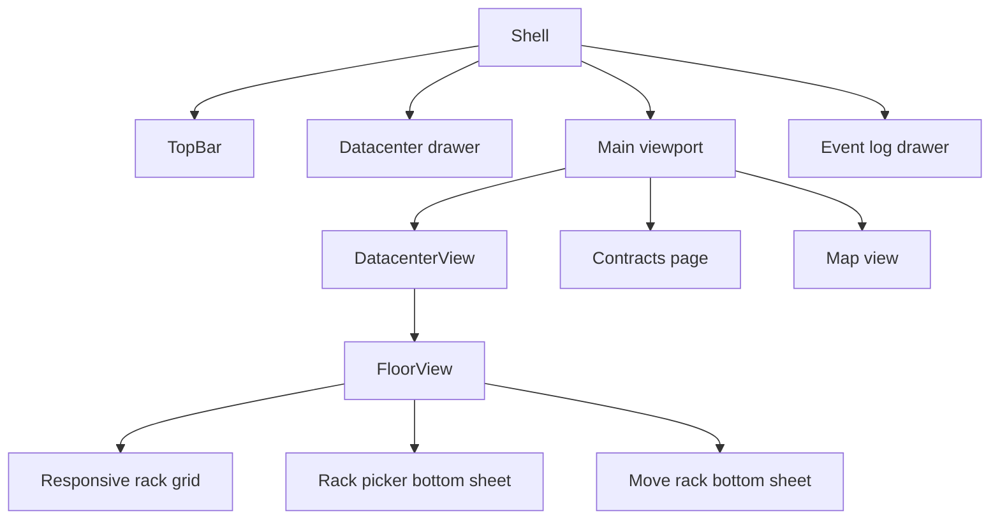

## Progress

- [x] **Phase 1 — Mobile baseline and shared responsive rules**
  - [x] 1.1 Define mobile breakpoints, touch-target rules, and viewport constraints
  - [x] 1.2 Audit current shell, floor, modal, and card layouts against those rules
  - [x] 1.3 Add regression coverage for phone-sized rendering assumptions
- [x] **Phase 2 — Collapsible shell rails and mobile navigation**
  - [x] 2.1 Introduce mobile drawer state in `Shell`
  - [x] 2.2 Convert the datacenter rail into a pull-out drawer on phones
  - [x] 2.3 Convert the event log rail into a pull-out drawer on phones
  - [x] 2.4 Add persistent mobile drawer triggers without crowding the viewport
- [ ] **Phase 3 — Portrait-first datacenter and rack floor**
  - [x] 3.1 Compress datacenter header content for narrow screens
  - [x] 3.2 Make datacenter tabs touch-friendly and horizontally scrollable
  - [x] 3.3 Add a portrait rack layout mode for the floor grid
  - [ ] 3.4 Keep rack actions discoverable without hover on touch devices
- [ ] **Phase 4 — Modal and drawer ergonomics**
  - [ ] 4.1 Standardize modal height, inner scrolling, and safe-area padding
  - [ ] 4.2 Adapt rack picker to a phone bottom-sheet layout
  - [ ] 4.3 Adapt move rack, new datacenter, reset, audio, and tutorial modals
  - [ ] 4.4 Preserve focus, escape, backdrop, and accessible close behavior
- [ ] **Phase 5 — Cards, buttons, and dense content polish**
  - [ ] 5.1 Enlarge card corner buttons and compact controls for touch
  - [ ] 5.2 Improve contract and map card stacking on phones
  - [ ] 5.3 Reduce horizontal overflow and favor vertical real estate
  - [ ] 5.4 Add visible affordances for hidden panels and scrollable regions
- [ ] **Phase 6 — Validation and release readiness**
  - [ ] 6.1 Run web lint, typecheck, and test commands
  - [ ] 6.2 Add manual QA checklist for common phone viewport sizes
  - [ ] 6.3 Verify desktop layout remains unchanged
  - [ ] 6.4 Update documentation if new responsive conventions emerge

## Overview

The current web UI uses a desktop control-room layout with a fixed left datacenter rail, central viewport, and fixed right event log. On phone-sized screens those side rails, hover-revealed rack buttons, dense headers, and wide modal panels consume too much horizontal space and make core actions difficult to reach. This plan keeps the existing React + CSS Modules architecture while introducing mobile-first shell behavior: collapsible drawers, portrait-friendly floor layout, scroll-safe modals, and larger touch targets.

The intended outcome is that a player can build, inspect, move, decommission, and manage racks comfortably on a phone without losing access to datacenter navigation, contracts, logs, help, reset, audio, or tutorial flows.

## Architecture

Key decisions:

- **Responsive behavior belongs in `packages/web` only**. No game rules or data-model changes are required.
- **Desktop remains the default**. Existing rail widths, grid proportions, and modal widths should remain unchanged above the tablet breakpoint unless a bug is found.
- **Phone view uses overlays instead of permanent side rails**. Datacenter navigation and event log become drawers controlled by obvious buttons so the central game surface can use the full screen width.
- **Touch devices cannot rely on hover**. Rack move/decommission controls and other small action buttons must be visible or available through a clear tap affordance.
- **Vertical space is preferred over horizontal space**. Dense grids and cards should stack, scroll internally, or use bottom sheets on phones.
- **Modal bodies own their scrolling**. Headers and footers stay reachable while content scrolls inside the panel when viewport height is limited.
- **Safe-area insets matter**. Bottom sheets and floating controls should account for notches, browser bars, and home indicators.

## Phase 1 — Mobile baseline and shared responsive rules

**Goal**: define the responsive targets and inventory the UI surfaces before changing behavior.

### Step 1.1 — Define mobile breakpoints, touch-target rules, and viewport constraints

- **Files**:
  - `packages/web/src/theme/tokens.css`
  - `packages/web/src/theme/global.css`
  - Relevant component CSS modules as needed
- Add or document shared responsive thresholds for phone and tablet layouts.
- Establish a minimum practical touch target for action buttons, icon buttons, tabs, drawer handles, and close buttons.
- Ensure the app shell continues to use dynamic viewport height so mobile browser chrome does not trap content.
- Include safe-area padding guidance for fixed, sticky, bottom-sheet, and drawer controls.
- **Acceptance**: responsive rules are referenced consistently in later phases; desktop token usage remains compatible.

### Step 1.2 — Audit current shell, floor, modal, and card layouts against those rules

- **Files**:
  - `packages/web/src/ui/shell/Shell.module.css`
  - `packages/web/src/ui/topbar/TopBar.module.css`
  - `packages/web/src/ui/dc-view/DatacenterView.module.css`
  - `packages/web/src/ui/floor/Grid.module.css`
  - `packages/web/src/ui/floor/RackTile.module.css`
  - `packages/web/src/ui/floor/RackPicker.module.css`
  - `packages/web/src/ui/floor/MoveRackModal.module.css`
  - Other modal and card CSS modules found during implementation
- Check every fixed width, multi-column grid, hover-only control, and full-height modal for phone behavior.
- Record which areas must become drawers, bottom sheets, stacked cards, or inner-scroll regions.
- Prioritize the user-reported issues: collapsible side panels, portrait rack layout, drawer access, modal scrolling, and larger corner buttons.
- **Acceptance**: implementation tasks are confirmed against actual files; no unrelated game-logic areas are included.

### Step 1.3 — Add regression coverage for phone-sized rendering assumptions

- **Files**:
  - Existing tests near affected components, such as `packages/web/src/ui/shell/Shell.test.tsx` if created
  - `packages/web/src/ui/floor/*.test.tsx`
  - `packages/web/src/ui/topbar/TopBar.test.tsx`
- Add focused component tests for mobile-only controls that affect state or accessibility, such as drawer open/close buttons and always-available rack actions.
- Prefer behavior assertions over brittle CSS assertions.
- Use existing Vitest and Testing Library setup; do not add a new test framework.
- **Acceptance**: `npm run test -w @datacenter-tycoon/web` passes and covers new interactive mobile affordances.

## Phase 2 — Collapsible shell rails and mobile navigation

**Goal**: make the left datacenter panel and right event log easy to open while preserving maximum main viewport width on phones.

### Step 2.1 — Introduce mobile drawer state in `Shell`

- **Files**:
  - `packages/web/src/ui/shell/Shell.tsx`
  - `packages/web/src/ui/shell/Shell.module.css`
- Add frontend-only UI state for the active mobile drawer: none, datacenters, or log.
- Keep existing desktop markup structure where practical to avoid duplicating content.
- Close drawers when the route changes, when the backdrop is tapped, and when Escape is pressed.
- Add accessible labels, `aria-expanded`, and `aria-controls` for drawer triggers.
- **Acceptance**: on desktop, rails render as today; on phones, no side rail permanently consumes width.

### Step 2.2 — Convert the datacenter rail into a pull-out drawer on phones

- **Files**:
  - `packages/web/src/ui/shell/Shell.tsx`
  - `packages/web/src/ui/shell/Shell.module.css`
  - `packages/web/src/ui/left-rail/DatacenterList.module.css`
- On phone breakpoints, position the datacenter rail as an off-canvas drawer.
- Use most of the screen width but leave enough backdrop visible to communicate dismiss behavior.
- Preserve existing datacenter cards, contracts shortcut, and new datacenter CTA.
- Ensure the list itself scrolls internally when there are many datacenters.
- **Acceptance**: phone users can open, scroll, select a datacenter, create a datacenter, or open contracts without horizontal page overflow.

### Step 2.3 — Convert the event log rail into a pull-out drawer on phones

- **Files**:
  - `packages/web/src/ui/shell/Shell.tsx`
  - `packages/web/src/ui/shell/Shell.module.css`
  - `packages/web/src/ui/log/LogFeed.module.css`
- On phone breakpoints, position the event log as an off-canvas drawer opposite the datacenter drawer.
- Keep log entries in an inner scroll region with the header visible.
- Use the current log component without duplicating ledger selection logic.
- **Acceptance**: phone users can open and dismiss the event log quickly, and long logs scroll inside the drawer.

### Step 2.4 — Add persistent mobile drawer triggers without crowding the viewport

- **Files**:
  - `packages/web/src/ui/shell/Shell.tsx`
  - `packages/web/src/ui/shell/Shell.module.css`
  - `packages/web/src/ui/topbar/TopBar.tsx`
  - `packages/web/src/ui/topbar/TopBar.module.css`
- Decide whether drawer triggers live in `Shell` as floating edge tabs or in `TopBar` as compact icon buttons.
- Keep triggers large enough to tap and available across datacenter, contracts, map, log, and home routes.
- Avoid covering rack corner actions or modal footers.
- Show meaningful labels or icons for datacenters and log, with screen-reader names.
- **Acceptance**: every hidden panel has a discoverable trigger in phone view, and the triggers do not reduce desktop usability.

## Phase 3 — Portrait-first datacenter and rack floor

**Goal**: make the datacenter detail screen and rack layout use vertical space effectively on narrow portrait screens.

### Step 3.1 — Compress datacenter header content for narrow screens

- **Files**:
  - `packages/web/src/ui/dc-view/DatacenterView.tsx`
  - `packages/web/src/ui/dc-view/DatacenterView.module.css`
  - `packages/web/src/ui/stats/ResourceBars.module.css`
- Stack or wrap the datacenter name, spec, region, resource strip, maintenance status, and maintenance controls.
- Reduce decorative spacing while keeping text legible.
- Keep maintenance staff stepper controls at touch-friendly size.
- Consider hiding low-priority metadata behind a compact disclosure only if the header still crowds the floor.
- **Acceptance**: the floor tab remains visible without excessive initial scrolling on common phone viewport heights.

### Step 3.2 — Make datacenter tabs touch-friendly and horizontally scrollable

- **Files**:
  - `packages/web/src/ui/dc-view/DatacenterView.module.css`
- Increase tab hit area for phone screens.
- Allow the tab bar to scroll horizontally if labels or future tabs do not fit.
- Preserve `role="tablist"` and `aria-selected` semantics.
- Keep active-tab styling visually obvious in the neon theme.
- **Acceptance**: FLOOR, POWER, and CONTRACTS tabs are easy to tap and do not overflow the viewport.

### Step 3.3 — Add a portrait rack layout mode for the floor grid

- **Files**:
  - `packages/web/src/ui/floor/Grid.tsx`
  - `packages/web/src/ui/floor/Grid.module.css`
  - `packages/web/src/ui/floor/Slot.module.css`
  - `packages/web/src/ui/floor/RackTile.module.css`
- Evaluate two phone layouts during implementation:
  - Preserve rows but make the grid horizontally scrollable with sticky row and column labels.
  - Reflow into a portrait list grouped by row, using full-width rack slots stacked vertically.
- Prefer the option that minimizes horizontal panning and makes individual rack actions easiest to tap.
- Keep row and slot identity visible so players understand where a rack is installed.
- Maintain placement callbacks with the same row and position values.
- **Acceptance**: phone portrait users can inspect and tap every slot without needing precision zoom; desktop rack layout remains unchanged.

### Step 3.4 — Keep rack actions discoverable without hover on touch devices

- **Files**:
  - `packages/web/src/ui/floor/RackTile.tsx`
  - `packages/web/src/ui/floor/RackTile.module.css`
- Replace hover-only visibility for move and decommission controls at phone or coarse-pointer breakpoints.
- Increase move, decommission, confirmation, and cancel controls to touch-friendly dimensions on phones.
- Prevent action buttons from overlapping critical rack status text.
- Keep destructive decommission confirmation clear and hard to tap accidentally.
- **Acceptance**: move and decommission can be discovered and used on a touchscreen without relying on hover.

## Phase 4 — Modal and drawer ergonomics

**Goal**: ensure every modal and drawer works within limited phone height, with important controls always reachable.

### Step 4.1 — Standardize modal height, inner scrolling, and safe-area padding

- **Files**:
  - `packages/web/src/ui/floor/RackPicker.module.css`
  - `packages/web/src/ui/floor/MoveRackModal.module.css`
  - `packages/web/src/ui/onboarding/NewDatacenterModal.module.css`
  - `packages/web/src/ui/topbar/ResetGameModal.module.css`
  - `packages/web/src/ui/settings/AudioSettingsModal.module.css`
  - `packages/web/src/ui/help/TutorialModal.module.css`
- For each modal, keep the header and primary action footer visible where possible.
- Put overflowing content in a body region with `overflow-y: auto`.
- Add phone-specific max-height, bottom safe-area padding, and reduced outer padding.
- Avoid nested scroll traps unless a component already requires its own list scrolling.
- **Acceptance**: no modal content or primary action is unreachable at common phone viewport heights.

### Step 4.2 — Adapt rack picker to a phone bottom-sheet layout

- **Files**:
  - `packages/web/src/ui/floor/RackPicker.tsx`
  - `packages/web/src/ui/floor/RackPicker.module.css`
- On phones, align the rack picker panel to the bottom and let it use most of the viewport height.
- Keep filter chips near the top and cards in the scrollable body.
- Stack footer actions if needed so install and cancel remain large and visible.
- Keep insufficient funds messaging visible near the install action.
- **Acceptance**: players can filter, compare, select, and install racks on a phone without losing the selected action footer.

### Step 4.3 — Adapt move rack, new datacenter, reset, audio, and tutorial modals

- **Files**:
  - `packages/web/src/ui/floor/MoveRackModal.tsx`
  - `packages/web/src/ui/floor/MoveRackModal.module.css`
  - `packages/web/src/ui/onboarding/NewDatacenterModal.tsx`
  - `packages/web/src/ui/onboarding/NewDatacenterModal.module.css`
  - `packages/web/src/ui/topbar/ResetGameModal.tsx`
  - `packages/web/src/ui/topbar/ResetGameModal.module.css`
  - `packages/web/src/ui/settings/AudioSettingsModal.tsx`
  - `packages/web/src/ui/settings/AudioSettingsModal.module.css`
  - `packages/web/src/ui/help/TutorialModal.tsx`
  - `packages/web/src/ui/help/TutorialModal.module.css`
- Convert multi-column modal content to one-column stacking at phone widths.
- Ensure close buttons are large enough and do not move offscreen.
- Keep tutorial navigation readable with inner scrolling for long steps.
- Keep reset and destructive actions visually separated from cancel buttons.
- **Acceptance**: every modal can be opened, read, scrolled, acted on, and dismissed on a phone viewport.

### Step 4.4 — Preserve focus, escape, backdrop, and accessible close behavior

- **Files**:
  - Modal components listed in Phase 4
  - `packages/web/src/ui/shell/Shell.tsx`
- Preserve existing Escape-to-close behavior where it exists.
- Add Escape-to-close and backdrop dismiss for new drawers.
- Ensure dialogs and drawers have meaningful accessible names.
- Return focus to the trigger where practical after closing a drawer or modal.
- Avoid focusable controls hidden behind inactive mobile drawers.
- **Acceptance**: keyboard and screen-reader users can identify, open, close, and navigate mobile panels.

## Phase 5 — Cards, buttons, and dense content polish

**Goal**: make smaller controls and dense pages feel intentional on phone screens.

### Step 5.1 — Enlarge card corner buttons and compact controls for touch

- **Files**:
  - `packages/web/src/ui/floor/RackTile.module.css`
  - `packages/web/src/ui/topbar/TopBar.module.css`
  - `packages/web/src/ui/dc-view/DatacenterView.module.css`
  - `packages/web/src/ui/contracts/*.module.css`
  - `packages/web/src/ui/map/*.module.css`
- Increase icon-only buttons, close buttons, speed buttons, stepper buttons, and card action buttons at phone or coarse-pointer breakpoints.
- Keep visual density by reducing surrounding gaps instead of shrinking hit areas.
- Ensure disabled controls still communicate state clearly.
- **Acceptance**: all primary phone controls meet the project touch-target rule from Phase 1.

### Step 5.2 — Improve contract and map card stacking on phones

- **Files**:
  - `packages/web/src/ui/contracts/ContractsPage.module.css`
  - `packages/web/src/ui/contracts/MarketList.module.css`
  - `packages/web/src/ui/contracts/ActiveList.module.css`
  - `packages/web/src/ui/map/MapView.module.css`
  - `packages/web/src/ui/map/RegionPanel.module.css`
- Stack contract columns and region panels vertically on phones.
- Keep accept, inspect, and navigation actions near the content they affect.
- Avoid requiring horizontal scrolling for contract stats, capacity requirements, or region metadata.
- **Acceptance**: contracts and map views remain usable with one-thumb vertical scrolling.

### Step 5.3 — Reduce horizontal overflow and favor vertical real estate

- **Files**:
  - All CSS modules changed in earlier phases
  - `packages/web/src/theme/global.css`
- Check long labels, fixed widths, grid minimums, and `white-space: nowrap` usage.
- Use wrapping, truncation, or stacked metadata where needed.
- Avoid viewport-wide elements exceeding `100vw`, especially inside fixed drawers and modals.
- **Acceptance**: no route creates body-level horizontal scrolling at phone widths.

### Step 5.4 — Add visible affordances for hidden panels and scrollable regions

- **Files**:
  - `packages/web/src/ui/shell/Shell.module.css`
  - Modal and drawer CSS modules touched in Phase 4
- Add clear drawer handles, labels, shadows, or edge tabs so hidden panels feel pull-out capable.
- Add subtle visual boundaries for scrollable modal bodies and drawer lists.
- Avoid purely decorative affordances that reduce accessibility or increase tap ambiguity.
- **Acceptance**: phone users can tell when content is scrollable and where hidden panels can be opened.

## Phase 6 — Validation and release readiness

**Goal**: prove the responsive changes work without regressing desktop behavior.

### Step 6.1 — Run web lint, typecheck, and test commands

- **Files**: none unless validation reveals failures caused by this work.
- Run:
  - `npm run lint -w @datacenter-tycoon/web`
  - `npm run typecheck -w @datacenter-tycoon/web`
  - `npm run test -w @datacenter-tycoon/web`
- If shell or modal changes affect app-level build behavior, also run `npm run build -w @datacenter-tycoon/web`.
- **Acceptance**: relevant commands pass, or any unrelated existing failures are documented with evidence.

### Step 6.2 — Add manual QA checklist for common phone viewport sizes

- **Files**:
  - PR description
  - Optional package documentation only if the team wants a durable checklist
- Check at least:
  - 320 × 568 phone portrait
  - 360 × 740 phone portrait
  - 390 × 844 phone portrait
  - 430 × 932 phone portrait
  - A phone landscape size
  - A desktop size matching current layout expectations
- Verify navigation drawers, floor grid, rack picker, move modal, contracts, map, event log, top bar, speed controls, and tutorial.
- **Acceptance**: manual QA results are summarized for reviewers.

### Step 6.3 — Verify desktop layout remains unchanged

- **Files**:
  - CSS modules changed in earlier phases
- Compare the shell, datacenter floor, contracts, map, and modals at desktop widths.
- Confirm side rails remain permanent on desktop.
- Confirm hover affordances may still work on desktop while touch alternatives exist on phone.
- **Acceptance**: desktop behavior is unchanged except for intentional accessibility improvements such as larger focus states.

### Step 6.4 — Update documentation if new responsive conventions emerge

- **Files**:
  - `packages/web/AGENTS.md`
  - `packages/web/src/theme/*`
  - `.agents/plans/018-mobile-responsive-ux.md`
- Document any durable conventions such as breakpoint names, touch-target minimums, bottom-sheet structure, or drawer semantics.
- Keep documentation concise and specific to future web UI work.
- Mark this plan as completed only after all phases and validation are done.
- **Acceptance**: future contributors can follow the same responsive patterns without re-auditing this work.

## References

- [`AGENTS.md`](../../AGENTS.md) — repository architecture and planning guidance.
- [`packages/web/AGENTS.md`](../../packages/web/AGENTS.md) — React, Vite, TypeScript, CSS Modules, and frontend-only state guidance.
- [`packages/web/src/ui/shell/Shell.tsx`](../../packages/web/src/ui/shell/Shell.tsx) — current desktop shell with fixed left and right rails.
- [`packages/web/src/ui/floor/Grid.tsx`](../../packages/web/src/ui/floor/Grid.tsx) — rack floor layout entry point.
- [`packages/web/src/ui/floor/RackTile.tsx`](../../packages/web/src/ui/floor/RackTile.tsx) — rack card actions that currently rely on hover.
- [`packages/web/src/ui/floor/RackPicker.tsx`](../../packages/web/src/ui/floor/RackPicker.tsx) — rack install modal.
- [`packages/web/src/ui/floor/MoveRackModal.tsx`](../../packages/web/src/ui/floor/MoveRackModal.tsx) — rack move modal.

## Changelog

- 2026-05-05 — created.
- 2026-05-05 — step 1.1 completed by adding shared responsive constants, viewport-height tokens, touch-target guidance, and safe-area tokens for later drawer and sheet work.
- 2026-05-05 — step 1.2 audit findings:
  - `Shell.module.css` still uses fixed 200px/240px rails, so phone view needs overlay drawers instead of a three-column grid.
  - `TopBar.module.css`, `DatacenterView.module.css`, `RackTile.module.css`, and `RegionPanel.module.css` still rely on 28px–32px icon buttons and dense nowrap text that need touch-target and wrap treatment.
  - `Grid.module.css`, `Slot.module.css`, and `RackTile.module.css` assume desktop row/column density and hover-revealed rack actions, so portrait touch interaction needs a dedicated floor mode.
  - `RackPicker.module.css`, `MoveRackModal.module.css`, `NewDatacenterModal.module.css`, `ResetGameModal.module.css`, `AudioSettingsModal.module.css`, and `TutorialModal.module.css` all use centered desktop modal panels with limited height handling, so Phase 4 should standardize inner scrolling and bottom-sheet behavior.
  - `ContractsPage.module.css`, `MarketList.module.css`, `ActiveList.module.css`, `MapView.module.css`, and `RegionPanel.module.css` still contain fixed-width cards, multi-column grids, and nowrap metadata that need phone stacking and overflow cleanup in Phase 5.
- 2026-05-05 — step 1.3 completed by adding viewport breakpoint tests so later drawer and floor behavior can depend on shared phone/tablet mode assumptions without brittle CSS assertions.
- 2026-05-05 — step 2.1 completed by introducing shared phone drawer state in `Shell`, closing mobile drawers on route changes and Escape, and moving phone rails into overlay positioning so they no longer reserve layout width.
- 2026-05-05 — step 2.2 completed by giving the datacenter rail dedicated left-drawer animation, safe-area padding, and internal scrolling so it can behave as a pull-out phone navigation panel.
- 2026-05-05 — step 2.3 completed by giving the event log its own right-drawer animation and safe-area-aware scrolling so long ledger history stays inside the overlay panel.
- 2026-05-05 — step 2.4 completed by adding persistent phone edge-tab triggers with drawer ARIA wiring and focused interaction tests for opening and dismissing both hidden rails.
- 2026-05-05 — step 3.1 completed by compressing the datacenter header and compact resource strip so title, region, maintenance, and staffing controls wrap cleanly on narrow portrait screens.
- 2026-05-05 — step 3.2 completed by making the datacenter tab bar horizontally scrollable and enlarging tab hit areas for phone-sized touch navigation.
- 2026-05-05 — step 3.3 completed by adding a portrait row-grouped floor layout that stacks full-width slot cards on phones while preserving the existing desktop grid.
