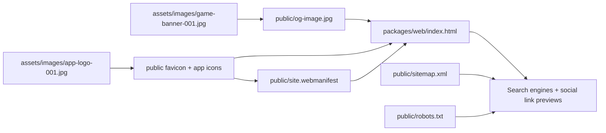

## Progress

- [x] **Phase 1 — SEO scope and asset mapping**
  - [x] 1.1 Confirm the homepage URL, description, and social preview requirements
  - [x] 1.2 Map source brand art from `assets/images/` to web-public SEO assets
- [x] **Phase 2 — Generate public brand assets**
  - [x] 2.1 Create Open Graph banner output from the game banner image
  - [x] 2.2 Create favicon and app icon outputs from the game logo image
  - [x] 2.3 Add a web app manifest that references the generated logo assets
- [x] **Phase 3 — Wire homepage metadata**
  - [x] 3.1 Add homepage title, description, canonical URL, and robots directives
  - [x] 3.2 Add Open Graph and Twitter metadata for the hosted domain
  - [x] 3.3 Add structured data and crawler discovery files for the root URL
- [x] **Phase 4 — Validate and finalize**
  - [x] 4.1 Build the web package successfully after the SEO changes
  - [x] 4.2 Mark the plan complete and document the delivered files

## Overview

This plan improves the discoverability and shareability of the Datacenter Tycoon website without changing game logic or routing. The homepage should expose a better browser title and description, include canonical and crawler metadata for `https://dctycoon.arnav.tech`, and use the existing banner and logo artwork for social previews and installed-site branding.

The work stays entirely inside the web package by generating static assets under `packages/web/public/` and wiring them into the Vite HTML shell. That keeps deployment simple while giving link unfurlers, search engines, and device launchers consistent branding.

## Architecture

Key decisions:

- Use the existing banner artwork as the primary social sharing image.
- Use the existing square logo artwork for favicon, Apple touch icon, and manifest icons.
- Keep metadata static in `packages/web/index.html` because the site is a Vite SPA with a single homepage entry point.
- Add `robots.txt` and `sitemap.xml` for lightweight crawler discovery at the production domain.

## Phase 1 — SEO scope and asset mapping

**Goal**: define the production URL, homepage messaging, and the source assets used for branding.

### Step 1.1 — Confirm the homepage URL, description, and social preview requirements

- **Files**:
  - `packages/web/index.html`
  - `.agents/plans/019-web-seo-brand-assets.md`
- Use `https://dctycoon.arnav.tech/` as the canonical homepage URL.
- Define homepage title and meta description copy for Datacenter Tycoon.
- Confirm that the banner image is the primary `og:image` and the logo is used for browser/install branding.
- **Acceptance**: metadata copy and URL choices are ready to wire into the HTML shell.

### Step 1.2 — Map source brand art from `assets/images/` to web-public SEO assets

- **Files**:
  - `assets/images/game-banner-001.jpg`
  - `assets/images/app-logo-001.jpg`
  - `packages/web/public/*`
- Use the banner source to produce a public Open Graph image.
- Use the square logo source to produce favicon and manifest icon sizes.
- Keep generated files in `packages/web/public/` so Vite serves them from the site root.
- **Acceptance**: every metadata reference points at a concrete public asset path.

## Phase 2 — Generate public brand assets

**Goal**: create the static image files and manifest used by browsers, crawlers, and social previews.

### Step 2.1 — Create Open Graph banner output from the game banner image

- **Files**:
  - `assets/images/game-banner-001.jpg`
  - `packages/web/public/og-image.jpg`
- Generate a shareable `og-image.jpg` from the provided game banner artwork.
- Size it for social sharing while preserving the original art as closely as practical.
- **Acceptance**: `packages/web/public/og-image.jpg` exists and is suitable for social sharing tags.

### Step 2.2 — Create favicon and app icon outputs from the game logo image

- **Files**:
  - `assets/images/app-logo-001.jpg`
  - `packages/web/public/favicon.ico`
  - `packages/web/public/favicon-16x16.png`
  - `packages/web/public/favicon-32x32.png`
  - `packages/web/public/apple-touch-icon.png`
  - `packages/web/public/android-chrome-192x192.png`
  - `packages/web/public/android-chrome-512x512.png`
- Use ImageMagick to generate the favicon and installable icon sizes from the logo artwork.
- Provide an `.ico` file plus PNG variants for common browser and device uses.
- **Acceptance**: all icon assets exist under `packages/web/public/` and are ready to reference from HTML and the manifest.

### Step 2.3 — Add a web app manifest that references the generated logo assets

- **Files**:
  - `packages/web/public/site.webmanifest`
- Add a minimal manifest with the Datacenter Tycoon name, colors, start URL, and icon entries.
- Reuse the generated PNG icon assets rather than duplicating files.
- **Acceptance**: `site.webmanifest` exists and references valid icon files.

## Phase 3 — Wire homepage metadata

**Goal**: expose discoverable metadata and crawler hints from the homepage HTML shell.

### Step 3.1 — Add homepage title, description, canonical URL, and robots directives

- **Files**:
  - `packages/web/index.html`
- Set a descriptive `<title>` for the homepage.
- Add a homepage meta description, canonical URL, robots meta tag, and theme/app-name metadata.
- **Acceptance**: the document head contains the core SEO metadata for the root URL.

### Step 3.2 — Add Open Graph and Twitter metadata for the hosted domain

- **Files**:
  - `packages/web/index.html`
- Point Open Graph and Twitter preview tags at the production URL and `og-image.jpg`.
- Include alt text and site naming metadata for the Datacenter Tycoon brand.
- **Acceptance**: the homepage emits consistent rich-preview metadata for link unfurlers.

### Step 3.3 — Add structured data and crawler discovery files for the root URL

- **Files**:
  - `packages/web/index.html`
  - `packages/web/public/robots.txt`
  - `packages/web/public/sitemap.xml`
- Add JSON-LD describing the game/site and its public URL.
- Add `robots.txt` and a one-page sitemap for the deployed domain.
- **Acceptance**: crawlers can discover the site root and its metadata from standard files.

## Phase 4 — Validate and finalize

**Goal**: verify the web package still builds and leave the plan in a resumable completed state.

### Step 4.1 — Build the web package successfully after the SEO changes

- **Files**:
  - `packages/web/package.json`
- Run the web build to catch TypeScript or Vite regressions.
- **Acceptance**: `npm run build -w @datacenter-tycoon/web` succeeds.

### Step 4.2 — Mark the plan complete and document the delivered files

- **Files**:
  - `.agents/plans/019-web-seo-brand-assets.md`
- Update the progress checklist, timestamps, and final status after implementation finishes.
- Note the generated public assets and metadata entry points in the completed plan.
- **Acceptance**: the plan is fully checked off with `status: completed` when all work is done.

## Delivery Notes

- Homepage metadata now lives in `packages/web/index.html`.
- Generated public SEO/brand assets live in `packages/web/public/`:
  - `og-image.jpg`
  - `favicon.ico`
  - `favicon-16x16.png`
  - `favicon-32x32.png`
  - `apple-touch-icon.png`
  - `android-chrome-192x192.png`
  - `android-chrome-512x512.png`
  - `site.webmanifest`
  - `robots.txt`
  - `sitemap.xml`
- Validation command completed: `npm run build -w @datacenter-tycoon/web`

## References

- `AGENTS.md`
- `packages/web/AGENTS.md`
- `packages/web/index.html`
- `assets/images/game-banner-001.jpg`
- `assets/images/app-logo-001.jpg`
