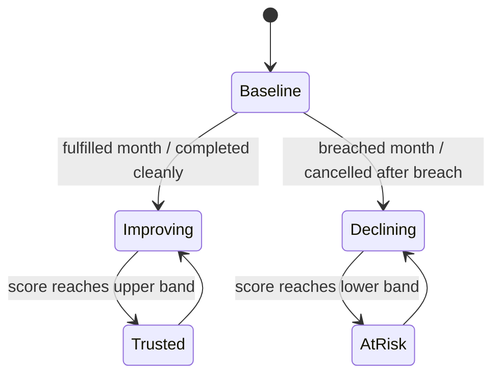

## Progress

- [ ] **Phase 1 — Reliability domain model and persistence**
  - [x] 1.1 Add serializable player reliability state and SLA outcome vocabulary to core types
  - [ ] 1.2 Centralize reliability balance constants and recovery/decay rules
  - [ ] 1.3 Update save/versioned public surfaces for the new reliability data
- [ ] **Phase 2 — SLA evaluation and reliability scoring**
  - [ ] 2.1 Add pure helpers that classify monthly contract outcomes and compute reliability deltas
  - [ ] 2.2 Wire reliability updates into the monthly tick without breaking deterministic contract flow
  - [ ] 2.3 Add tests for streaks, baseline clamps, and fulfilled vs breached score changes
- [ ] **Phase 3 — Reliability-aware contract market shaping**
  - [ ] 3.1 Make offer refresh volume depend on reliability bands
  - [ ] 3.2 Bias generated contract terms toward longer or shorter durations from reliability
  - [ ] 3.3 Keep market difficulty and seeded RNG behavior deterministic under the new policy
- [ ] **Phase 4 — Player-facing UI and feedback**
  - [ ] 4.1 Expose reliability summaries and recent SLA outcomes through selectors
  - [ ] 4.2 Surface reliability score, trend, and contract-market effects in the web UI
  - [ ] 4.3 Highlight SLA consequences on active/breached contracts and offer cards
- [ ] **Phase 5 — Regression coverage and docs**
  - [ ] 5.1 Add reducer/tick/contract tests for reliability-driven market behavior
  - [ ] 5.2 Update package and plan documentation for the new system

## Overview

This plan adds a persistent **player reliability score** that represents how dependable the operator is at honoring contract SLAs over time. The score starts from a documented baseline, rises when contracts are fulfilled, and drops when they are breached or cancelled after breach.

Reliability then feeds back into the contract market: dependable players should see more offers and a higher share of long-duration work, while unreliable players should see fewer offers and mostly shorter contracts. The design keeps the simulation deterministic and serializable by making reliability a plain data field on game state and driving all market effects through seeded helpers in `game-logic`.

## Architecture

```mermaid
flowchart LR
    Tick[Monthly tick] --> SLA[Evaluate contract SLA outcome]
    SLA --> Reliability[Update player reliability score]
    Reliability --> MarketPolicy[Derive offer-count and term bias]
    MarketPolicy --> Market[refreshContractMarket()]
    Reliability --> UI[Selectors / HUD / contract views]
```



Key decisions:

- **Reliability belongs to the player, not individual datacenters** because the request describes a global operator reputation that influences market supply.
- **SLA outcomes are derived from existing contract status transitions** instead of storing duplicate fulfillment flags per month.
- **Market shaping should happen through pure policy helpers** that translate reliability into offer-count and term-length biases while leaving seeded random generation intact.
- **Reliability must be clamped to a finite range** so streaks remain meaningful but never explode unbounded.
- **Longer contracts should become more likely, not guaranteed** at high reliability, preserving variety in the market.

```ts
export interface PlayerReliability {
  score: number;
  band: "at-risk" | "baseline" | "trusted";
  lastDelta?: number;
}

export interface ReliabilityMarketPolicy {
  offerCount: number;
  longTermBias: number;
  shortTermBias: number;
}
```

## Phase 1 — Reliability domain model and persistence

**Goal**: introduce a durable reliability concept without changing monthly outcomes yet.

### Step 1.1 — Add reliability state and SLA terminology

- File: `packages/game-logic/src/types.ts`
- Add a serializable reliability shape to `Player` or a nearby player-owned sub-object.
- Define any explicit SLA/reliability vocabulary needed by helpers (for example, monthly contract outcome kinds or reliability bands).
- Keep the shape plain-object only and avoid writing optional `undefined` fields into saves.
- Acceptance: `npm run typecheck -w @datacenter-tycoon/game-logic` passes and new games can carry baseline reliability state.

### Step 1.2 — Add reliability balance constants

- File: `packages/game-logic/src/balance/reliability.ts` (new), `packages/game-logic/src/balance/index.ts`, optionally `packages/game-logic/src/economy/constants.ts`
- Centralize all numeric knobs, including baseline score, min/max clamp, fulfilled delta, breached delta, and reliability bands used by market shaping.
- Define contract-frequency and contract-term bias constants in the same balance module so there are no hidden magic numbers in market code.
- Acceptance: reliability scoring and market effects can be adjusted from one obvious module.

### Step 1.3 — Update save/versioned public surfaces

- File: `packages/game-logic/src/save/serialize.ts`, `packages/game-logic/src/index.ts`, `packages/game-logic/README.md`
- Version the new save shape and choose either migration or the repo’s destructive-save replacement policy, then document that choice.
- Re-export any public reliability types/helpers from the package barrel if web consumers need them.
- Acceptance: save tests and public API docs cover the new reliability state.

## Phase 2 — SLA evaluation and reliability scoring

**Goal**: translate contract performance into deterministic reliability movement.

### Step 2.1 — Add pure SLA and scoring helpers

- File: `packages/game-logic/src/contracts/lifecycle.ts`, `packages/game-logic/src/contracts/reliability.ts` (new)
- Add pure helpers that classify whether a contract-month counted as fulfilled, breached, or escalated to cancellation.
- Add a helper that converts those outcomes into a net reliability delta for the tick, with clear clamp behavior.
- Keep the helpers independent of UI and side effects so they can be unit-tested in isolation.
- Acceptance: deterministic helper tests cover fulfilled, repeated breach, completion, and cancellation paths.

### Step 2.2 — Integrate reliability updates into `tick()`

- File: `packages/game-logic/src/sim/tick.ts`, possibly `packages/game-logic/src/economy/opex.ts`
- Update the monthly tick so reliability changes after SLA evaluation and before the next market refresh uses the new score.
- Ensure a contract that breaches this month affects reliability for the same refresh cycle, while fulfilled months improve the score predictably.
- Keep ledger behavior stable unless reliability itself becomes a user-visible log entry.
- Acceptance: running the same starting state twice yields the same contract statuses, reliability score, and market offers.

### Step 2.3 — Add scoring tests

- File: `packages/game-logic/src/contracts/contracts.test.ts`, `packages/game-logic/src/sim/tick.test.ts`, optionally `packages/game-logic/src/integration.test.ts`
- Cover baseline initialization, positive movement from fulfilled work, negative movement from breach/cancellation, and clamp edges.
- Include streak scenarios so consecutive good or bad months produce the intended market-band transitions.
- Acceptance: game-logic tests prove reliability changes only when SLA outcomes change.

## Phase 3 — Reliability-aware contract market shaping

**Goal**: convert reliability into contract availability and term mix without rewriting the market system.

### Step 3.1 — Make offer count reliability-aware

- File: `packages/game-logic/src/contracts/market.ts`
- Replace the fixed refresh-size assumption with a policy-driven offer target derived from reliability score or band.
- Preserve expiry/retention behavior for existing offers while changing how many new offers are backfilled for the player.
- Acceptance: high reliability creates more concurrent offers than low reliability in deterministic market tests.

### Step 3.2 — Bias contract terms from reliability

- File: `packages/game-logic/src/contracts/generator.ts`, `packages/game-logic/src/contracts/market.ts`
- Thread a reliability-derived policy into contract generation so higher reliability shifts probability toward longer `termMonths` and lower reliability shifts toward shorter terms.
- Keep payment/penalty relationships coherent with the resulting term mix and urgency categories.
- Acceptance: seeded generator tests show the same RNG stream produces longer average terms for trusted players than at-risk players.

### Step 3.3 — Preserve determinism and difficulty semantics

- File: `packages/game-logic/src/contracts/market.ts`, `packages/game-logic/src/contracts/generator.ts`
- Document how reliability interacts with `marketDifficulty()` so score-based term/frequency changes do not accidentally replace the current tick-based difficulty curve.
- Ensure all added randomness still flows through the existing seeded RNG in stable order.
- Acceptance: identical seed + action history + reliability state yields identical market refresh output.

## Phase 4 — Player-facing UI and feedback

**Goal**: make reliability visible and explain how it affects contract opportunities.

### Step 4.1 — Expose selector-backed reliability summaries

- File: `packages/web/src/store/selectors.ts`, `packages/web/src/store/selectors.test.ts`
- Add selectors for current reliability score, band, most recent delta, and any market-effect summary used by the UI.
- Keep selectors thin and sourced from `@datacenter-tycoon/game-logic` exports rather than UI-local rule copies.
- Acceptance: selector tests cover baseline, improved, and at-risk states.

### Step 4.2 — Surface reliability in persistent UI

- File: `packages/web/src/ui/topbar/TopBar.tsx`, `packages/web/src/ui/contracts/ContractsPage.tsx`, related CSS modules
- Display the player’s reliability score/band in a persistent HUD area and explain its effect on contract supply and duration.
- Add concise copy so players understand that fulfilled work improves future opportunities and breaches reduce them.
- Acceptance: component tests confirm reliability text appears and updates with store state.

### Step 4.3 — Show SLA consequences on contract screens

- File: `packages/web/src/ui/contracts/ActiveList.tsx`, `packages/web/src/ui/contracts/MarketList.tsx`
- Annotate active/breached contracts with SLA impact messaging and show offer-card hints when reliability is limiting longer-term work.
- Avoid adding new gameplay rules in the web package; consume selector data only.
- Acceptance: contract UI tests cover positive and negative reliability messaging states.

## Phase 5 — Regression coverage and docs

**Goal**: lock in the reliability loop across simulation, save/load, and UI.

### Step 5.1 — Add end-to-end reliability coverage

- File: `packages/game-logic/src/integration.test.ts`, `packages/game-logic/src/save/serialize.test.ts`, `packages/web/src/store/gameStore.test.ts`
- Add flows for a cleanly fulfilled contract improving reliability and a breached contract reducing reliability and shrinking later market opportunities.
- Confirm save/load round-trips preserve the score and that the store surfaces the same behavior after hydration.
- Acceptance: tests prove reliability affects future offers, not just instantaneous UI state.

### Step 5.2 — Update docs and related plans

- File: `packages/game-logic/README.md`, `.agents/plans/README.md`
- Document the reliability baseline, score movement model, and how it changes contract availability and term mix.
- Link this plan from any future SLA- or contract-market-related work so the reputation system remains discoverable.
- Acceptance: docs explain the feature without requiring code spelunking.

## References

- [Root AGENTS.md](../../AGENTS.md)
- [game-logic AGENTS.md](../../packages/game-logic/AGENTS.md)
- [web AGENTS.md](../../packages/web/AGENTS.md)
- [015-rack-aging-failures-and-maintenance.md](./015-rack-aging-failures-and-maintenance.md) — existing breach pressure from rack downtime that should feed reliability
- [planning skill](../skills/planning/SKILL.md)

## Changelog

- 2026-05-06 — created.
