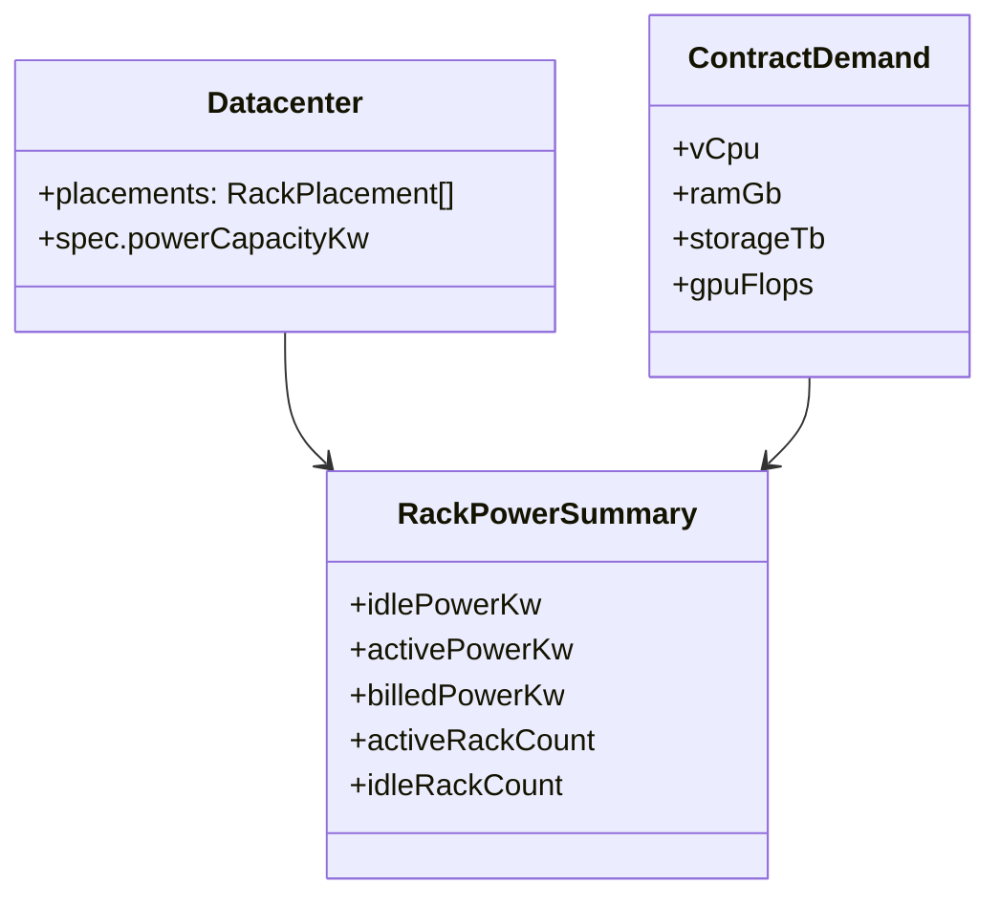

## Progress

- [x] **Phase 1 — Power-state model and balance scaffolding**
  - [x] 1.1 Add explicit active-vs-idle power usage vocabulary and summaries
  - [x] 1.2 Centralize idle baseline and active-power billing constants
  - [x] 1.3 Expose public helpers and document the budgeting-vs-billing split
- [x] **Phase 2 — Deterministic rack activity allocation**
  - [x] 2.1 Add pure helpers that map contract demand onto healthy racks in stable order
  - [x] 2.2 Derive per-rack activity, idle counts, and billed power without persisting transient state
  - [x] 2.3 Add tests for mixed idle/active fleets and rack-health interactions
- [ ] **Phase 3 — Opex and placement integration**
  - [x] 3.1 Preserve placement-time power-cap checks against installed maximum draw
  - [ ] 3.2 Switch monthly power billing to activity-aware power usage
  - [ ] 3.3 Keep cooling/bandwidth/resource summaries coherent with the new power model
- [ ] **Phase 4 — Web visibility and player feedback**
  - [ ] 4.1 Expose active/idle rack power summaries through selectors
  - [ ] 4.2 Update rack and datacenter views to show activity state and billed power
  - [ ] 4.3 Clarify the new billing model in power/opex UI
- [ ] **Phase 5 — Regression coverage and docs**
  - [ ] 5.1 Add integration tests for power bills changing as contracts start and end
  - [ ] 5.2 Update docs for rack idle baseline behavior and power budgeting rules

## Overview

This plan separates **power reservation** from **power billing**. Datacenter placement rules should still prevent the player from installing more racks than the datacenter’s power budget can support at full draw, but monthly electricity bills should no longer assume every installed rack is working at peak load all the time.

Instead, every installed rack pays only a shared baseline “stay on” idle power cost unless it is actively serving contract capacity during the month. When contracts are running, only the racks allocated to that demand should consume full electrical power for billing. The implementation should remain deterministic, derived from existing contract assignments and rack catalogs rather than relying on mutable runtime-only rack state.

## Architecture

```mermaid
flowchart LR
    ActiveContracts[Active contracts per datacenter] --> Allocator[Deterministic rack activity allocator]
    Datacenter[Installed healthy racks] --> Allocator
    Allocator --> RackState[Idle vs active rack summaries]
    RackState --> Billing[tickOpex() power cost]
    RackState --> UI[PowerView / RackTile / selectors]
    Datacenter --> Placement[canPlaceRack full-draw budget check]
```



Key decisions:

- **Installed power budget and billed power are different views** of the same fleet: placement still uses full `powerDrawKw`, while opex uses idle-plus-active allocation.
- **Rack activity is derived each tick**, not persisted on the rack, so saves remain simple and replay-safe.
- **Idle baseline should be a single constant across rack types** to match the request, even though full active draw continues to come from each rack spec.
- **Allocator order must be stable and deterministic** so identical state always produces identical active-rack sets and bills.
- **Repairing racks stay unavailable for both capacity and active billing**, but they may still consume idle baseline unless product design later says failed racks power off entirely.

```ts
export interface RackActivityView {
  placementId: RackPlacementId;
  status: "idle" | "active" | "repairing";
  billedPowerKw: number;
}

export interface RackPowerSummary {
  reservedPowerKw: number;
  idleBaselinePowerKw: number;
  activePowerKw: number;
  billedPowerKw: number;
  activeRackCount: number;
  idleRackCount: number;
}
```

## Phase 1 — Power-state model and balance scaffolding

**Goal**: define the concepts needed for usage-based billing before changing calculations.

### Step 1.1 — Add power-state vocabulary and summary types

- File: `packages/game-logic/src/types.ts`
- Add any public summary/result types needed for rack activity and billed power breakdowns.
- Keep rack activity itself derived rather than persisted on `RackPlacement`.
- Acceptance: public types clearly distinguish reserved capacity from billed usage.

### Step 1.2 — Add baseline and billing constants

- File: `packages/game-logic/src/balance/power.ts` (new), `packages/game-logic/src/balance/index.ts`
- Centralize the global idle baseline kilowatt draw and any helper constants needed to convert rack activity into billed monthly power.
- Document why idle baseline is flat across rack types while active draw still comes from rack specs.
- Acceptance: there is one authoritative place to tune the idle baseline.

### Step 1.3 — Update exports and docs

- File: `packages/game-logic/src/index.ts`, `packages/game-logic/README.md`
- Re-export new rack-power helpers/summaries that the web package will consume.
- Document the difference between installation-time power reservation and monthly billed power.
- Acceptance: consumers can import rack-power helpers from the public package surface only.

## Phase 2 — Deterministic rack activity allocation

**Goal**: decide which racks are considered active for billing in a pure, replay-safe way.

### Step 2.1 — Add a rack activity allocator

- File: `packages/game-logic/src/entities/datacenter.ts` or `packages/game-logic/src/economy/power.ts` (new)
- Build a pure helper that takes a datacenter plus its assigned active-contract demand and allocates that demand across healthy racks in stable order.
- Prefer filling healthy racks deterministically (for example by placement order) and stop once aggregate demand is covered.
- Acceptance: the same datacenter, contracts, and tick always yield the same active-rack set.

### Step 2.2 — Derive billed power and activity summaries

- File: `packages/game-logic/src/entities/datacenter.ts`, `packages/game-logic/src/economy/opex.ts`
- Add helpers that return active rack count, idle rack count, reserved power, idle baseline power, and final billed power for a datacenter.
- Ensure healthy idle racks bill the baseline constant, active racks bill their rack-spec draw, and repairing racks follow the documented policy.
- Acceptance: helper tests cover no contracts, partial fleet utilization, and full-fleet utilization.

### Step 2.3 — Add health-aware allocation tests

- File: `packages/game-logic/src/entities/capacity.test.ts`, `packages/game-logic/src/economy/economy.test.ts`, optionally `packages/game-logic/src/sim/maintenance.test.ts`
- Verify repairing racks are excluded from serving demand and do not accidentally absorb active workload.
- Verify mixed compute/storage/gpu fleets only mark the minimum necessary healthy racks active for the assigned contracts.
- Acceptance: tests prove allocation is deterministic and consistent with health-aware capacity rules.

## Phase 3 — Opex and placement integration

**Goal**: charge power bills from real usage while keeping datacenter build limits unchanged.

### Step 3.1 — Preserve placement-time power ceilings

- File: `packages/game-logic/src/entities/datacenter.ts`, `packages/game-logic/src/state/reduce.ts`
- Keep `canPlaceRack()` and related placement validation tied to installed full-draw `powerDrawKw` so players still cannot overbuild the datacenter.
- Add or update tests proving idle billing does not let extra racks bypass the power-cap placement limit.
- Acceptance: placement rejects an over-budget rack even if current contracts would leave it idle.

### Step 3.2 — Make opex power billing activity-aware

- File: `packages/game-logic/src/economy/opex.ts`, `packages/game-logic/src/sim/tick.ts`
- Replace the current “sum every rack’s full draw” billing path with the new activity summary helper.
- Keep cooling cost logic aligned with the chosen billing model, whether it follows billed active power directly or uses a documented blended-load formula.
- Acceptance: monthly power cost rises and falls as contracts are accepted, breached, completed, or cancelled.

### Step 3.3 — Update aggregate resource summaries

- File: `packages/game-logic/src/entities/datacenter.ts`, `packages/web/src/store/selectors.ts`
- Expose both reserved power and billed power so UI and any future gameplay systems can distinguish infrastructure headroom from current usage.
- Keep bandwidth and slot usage semantics unchanged unless explicitly required.
- Acceptance: selectors can render reserved-vs-billed power without reimplementing economy logic in the web package.

## Phase 4 — Web visibility and player feedback

**Goal**: make the new billing behavior understandable to players.

### Step 4.1 — Add selector-backed activity summaries

- File: `packages/web/src/store/selectors.ts`, `packages/web/src/store/selectors.test.ts`
- Add selectors for per-datacenter active rack count, idle rack count, billed power, and reserved power.
- Keep all calculations sourced from `@datacenter-tycoon/game-logic` helpers.
- Acceptance: selector tests cover empty, idle-only, and active-serving datacenters.

### Step 4.2 — Show rack activity in floor and datacenter views

- File: `packages/web/src/ui/floor/RackTile.tsx`, `packages/web/src/ui/dc-view/DatacenterView.tsx`, related CSS modules
- Surface whether a rack is actively serving load, idle, or repairing.
- Add concise datacenter summaries showing how many racks are currently active and how much billed power they are consuming.
- Acceptance: component tests render distinct states for active, idle, and repairing racks.

### Step 4.3 — Clarify power and opex UI

- File: `packages/web/src/ui/stats/PowerView.tsx`, `packages/web/src/ui/stats/OpexCard.tsx`
- Split displayed power into reserved budget vs billed usage so players can see why installation limits still apply.
- Explain the idle-baseline rule in the power or opex panel copy.
- Acceptance: UI tests confirm both power numbers are present and correctly labeled.

## Phase 5 — Regression coverage and docs

**Goal**: lock in the new economics across contracts, maintenance, and UI.

### Step 5.1 — Add end-to-end billing coverage

- File: `packages/game-logic/src/integration.test.ts`, `packages/game-logic/src/contracts/contracts.test.ts`, `packages/web/src/store/gameStore.test.ts`
- Cover a scenario where idle racks keep only baseline power, then active contracts raise billed power, and contract end drops bills again.
- Include a case where a repairing rack changes which remaining racks become active for billing.
- Acceptance: tests prove the billed-power curve follows active workload rather than installed fleet size alone.

### Step 5.2 — Update documentation

- File: `packages/game-logic/README.md`, `.agents/plans/README.md`
- Document the idle baseline rule, full-draw placement guardrail, and the resulting player-facing strategy tradeoff.
- Link to related maintenance/power plans so later work builds on the same vocabulary.
- Acceptance: docs make the new model understandable without reading implementation code.

## References

- [Root AGENTS.md](../../AGENTS.md)
- [game-logic AGENTS.md](../../packages/game-logic/AGENTS.md)
- [web AGENTS.md](../../packages/web/AGENTS.md)
- [015-rack-aging-failures-and-maintenance.md](./015-rack-aging-failures-and-maintenance.md) — rack health already affects usable capacity and should stay consistent with active-power billing
- [planning skill](../skills/planning/SKILL.md)

## Changelog

- 2026-05-06 — created.
- 2026-05-08 — completed Step 1.1 by adding rack activity and rack power summary public types.
- 2026-05-08 — completed Step 1.2 by adding centralized idle-baseline and monthly power-billing constants in `balance/power.ts`.
- 2026-05-08 — completed Step 1.3 by documenting reserved-vs-billed power and confirming helper exports from the package surface.
- 2026-05-08 — completed Step 2.1 by adding deterministic demand-to-rack allocation helpers and a datacenter wrapper for activity allocation.
- 2026-05-08 — completed Step 2.2 by deriving rack activity snapshots and billed-vs-reserved power summaries from transient allocation output.
- 2026-05-08 — completed Step 2.3 by adding deterministic mixed-fleet and repairing-rack allocation tests in `economy/rack-activity.test.ts`.
- 2026-05-08 — completed Step 3.1 by adding explicit placement power-cap regression tests in `entities/capacity.test.ts` and `state/reduce.test.ts`.
