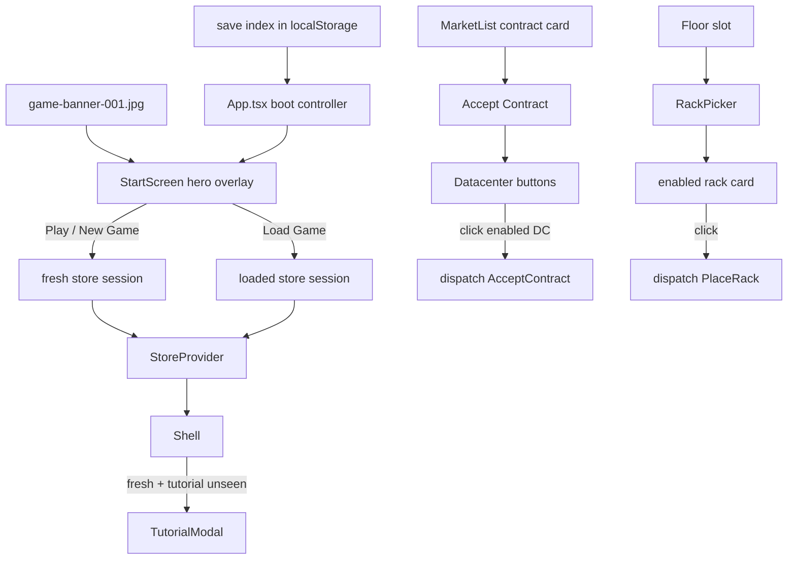

## Progress

- [ ] **Phase 1 — Start gate and session bootstrap**
  - [x] 1.1 Add a save-aware app boot/session model
  - [x] 1.2 Build the banner-based start screen with Play / Load Game / New Game actions
  - [ ] 1.3 Delay first-time tutorial opening until the player starts a session
  - [ ] 1.4 Add start-flow tests for fresh and saved sessions
- [ ] **Phase 2 — Contract assignment click-to-confirm**
  - [ ] 2.1 Remove the extra post-datacenter confirm state from `MarketList`
  - [ ] 2.2 Update contract assignment copy, styling, and tests for two-click acceptance
- [ ] **Phase 3 — Rack picker click-to-place**
  - [ ] 3.1 Remove selected-rack/install-button state and place directly from rack cards
  - [ ] 3.2 Preserve affordability and failure feedback without a second confirm step
  - [ ] 3.3 Update rack picker tests for direct placement
- [ ] **Phase 4 — Integration polish and regression QA**
  - [ ] 4.1 Verify responsive UX and manual end-to-end flows
  - [ ] 4.2 Run web package typecheck, tests, and build

## Overview

The web app should feel like a game, not like a developer dashboard that starts immediately in mid-session. This plan adds a banner-led start gate that uses `assets/images/game-banner-001.jpg` as the first thing players see, with save-aware calls to action: **Play** for first-time users, or **Load Game** / **New Game** when a save already exists.

It also removes two pieces of interaction friction in the core loop. Accepting a contract should no longer require a final confirm button after choosing a datacenter, and adding a rack should no longer require selecting a rack card and then clicking a separate install button.

This work stays entirely in `packages/web` and does not change any game rules in `@datacenter-tycoon/game-logic`. It intentionally supersedes the still-unimplemented confirm-step idea in plan `005-contracts-ux-overhaul.md`: in the desired UX, the datacenter click itself is the confirmation.

## Architecture



Key decisions:

- **Start-gate state lives above `StoreProvider`.** The app needs to decide whether the player wants to load an existing save or begin a fresh session before it commits to a long-lived store instance.
- **The tutorial remains UI-local.** We keep using `hasSeenTutorial()` / `markTutorialSeen()`; the only change is *when* the tutorial can auto-open.
- **The contract accept flow ends on datacenter click.** The intermediate “Confirm Accept” screen is removed entirely.
- **The rack install flow ends on rack-card click.** Rack cards remain buttons, so keyboard activation still works and accessibility does not regress.
- **Use the existing repo banner art as the start screen hero.** Implementation should import `assets/images/game-banner-001.jpg` directly into the web app (adding an `@assets` alias in Vite/TypeScript if needed) rather than creating unrelated duplicate art.

```ts
interface AppSession {
  store: GameStore;
  isFreshStart: boolean;
}

type StartChoice = "load" | "new";
```

```ts
// Desired contract flow
clickAccept(contractId);
clickDatacenter(dcId); // dispatches AcceptContract immediately

// Desired rack flow
openRackPicker(row, position);
clickRackCard(specId); // dispatches PlaceRack immediately
```

## Phase 1 — Start gate and session bootstrap

**Goal**: make the website open on a branded start screen and only enter the game after the player explicitly chooses how to begin.

### Step 1.1 — Add a save-aware app boot/session model

- Files:
  - `packages/web/src/App.tsx`
  - `packages/web/src/store/persist.ts`
- Add a small app-level session controller so `App` can determine whether saves exist before mounting the game shell.
- Expose whatever minimal helper is needed from persistence (for example `hasAnySaves()` and/or latest-save metadata) so the UI can choose between fresh and resumable entry states without booting blindly into the latest save.
- Ensure `App` can create a fresh session and a loaded session without forcing a full page reload.
- Acceptance: both “load latest save” and “start fresh game” paths can produce a valid `StoreProvider` session; `npm run typecheck -w @datacenter-tycoon/web` passes.

### Step 1.2 — Build the banner-based start screen with Play / Load Game / New Game actions

- Files:
  - `packages/web/src/ui/start/StartScreen.tsx` (new)
  - `packages/web/src/ui/start/StartScreen.module.css` (new)
  - `packages/web/vite.config.ts`
  - `packages/web/tsconfig.json`
- Create a dedicated start-screen component that uses `assets/images/game-banner-001.jpg` as the hero artwork.
- If no save exists, render a single prominent **Play** button with a green treatment.
- If a save exists, render **Load Game** and **New Game** buttons instead, optionally with a small summary of the latest save (`playerName`, date, or cash/tick) pulled from `SaveInfo`.
- Add or extend bundler/path configuration so the component can import the banner source cleanly via an alias such as `@assets/images/game-banner-001.jpg`.
- Acceptance: the start screen renders the correct button set for both save states and remains legible at phone and desktop widths.

### Step 1.3 — Delay first-time tutorial opening until the player starts a session

- Files:
  - `packages/web/src/App.tsx`
  - `packages/web/src/ui/shell/Shell.tsx`
  - `packages/web/src/store/tutorialPersist.ts` (read existing helpers; no behavioral change unless needed)
- Prevent the tutorial from auto-opening behind the new start screen.
- Fresh sessions should follow this sequence: **Start screen → Play/New Game → Shell → Tutorial (if unseen)**.
- Loading an existing save should *not* auto-open the tutorial solely because the app mounted.
- Keep the existing manual Help / How to Play reopen behavior intact after the session starts.
- Acceptance: fresh first-time play opens the tutorial only after the user presses Play/New Game; loading a save goes straight into the game shell.

### Step 1.4 — Add start-flow tests for fresh and saved sessions

- Files:
  - `packages/web/src/App.test.tsx` (new)
  - `packages/web/src/ui/shell/Shell.test.tsx`
  - `packages/web/src/store/persist.test.ts`
- Add tests that cover:
  - no-save state shows **Play**
  - saved-game state shows **Load Game** and **New Game**
  - choosing **Load Game** enters the existing save
  - choosing **New Game** creates a fresh session
  - tutorial auto-open waits until after the session-start button is clicked
- Acceptance: `npm run test -w @datacenter-tycoon/web` passes with deterministic start-flow coverage.

## Phase 2 — Contract assignment click-to-confirm

**Goal**: reduce contract acceptance from three clicks to two by making datacenter selection the final confirmation step.

### Step 2.1 — Remove the extra post-datacenter confirm state from `MarketList`

- Files:
  - `packages/web/src/ui/contracts/MarketList.tsx`
- Remove the separate `pendingAssignment` / `ConfirmAssignment` state and component.
- Keep the first click on **Accept Contract** to expand datacenter choices.
- Make clicking an enabled datacenter button dispatch `AcceptContract` immediately and then close the inline assignment UI.
- Preserve the ability to cancel out of the assignment state without accepting.
- Acceptance: the market flow becomes `Accept Contract → chosen datacenter`, and accepted contracts still backfill the market correctly.

### Step 2.2 — Update contract assignment copy, styling, and tests for two-click acceptance

- Files:
  - `packages/web/src/ui/contracts/MarketList.tsx`
  - `packages/web/src/ui/contracts/MarketList.module.css`
  - `packages/web/src/ui/contracts/MarketList.test.tsx`
- Update labels/copy so the inline chooser clearly communicates that clicking a datacenter *will accept the contract*.
- Remove assertions and styles related to `CONFIRM ACCEPT`.
- Add/update tests so a datacenter click directly activates the contract and no final confirm button appears.
- Acceptance: tests verify the simplified flow and visual copy matches the new interaction.

## Phase 3 — Rack picker click-to-place

**Goal**: reduce rack placement from two clicks to one inside the picker by making the rack-card click itself perform the placement.

### Step 3.1 — Remove selected-rack/install-button state and place directly from rack cards

- Files:
  - `packages/web/src/ui/floor/RackPicker.tsx`
- Remove `selectedId`, `selectedSpec`, and the footer install action as the primary placement path.
- Make an enabled rack card dispatch `PlaceRack` immediately, play the existing click sound, and close the picker.
- Keep cards as semantic buttons so Enter/Space on a focused enabled card also places the rack.
- Acceptance: clicking an enabled rack card adds the rack to the chosen slot and closes the modal immediately.

### Step 3.2 — Preserve affordability and failure feedback without a second confirm step

- Files:
  - `packages/web/src/ui/floor/RackPicker.tsx`
  - `packages/web/src/ui/floor/RackPicker.module.css`
- Keep disabled cards, price display, insufficient-funds messaging, and placement-failure reasons visible before the click.
- Simplify the footer so it only provides non-destructive controls such as **Cancel** plus any necessary explanatory copy.
- Ensure invalid choices remain obviously non-interactive and do not close the picker.
- Acceptance: users can still understand why a rack cannot be placed even though there is no separate install button.

### Step 3.3 — Update rack picker tests for direct placement

- Files:
  - `packages/web/src/ui/floor/RackPicker.test.tsx`
- Replace install-button-based tests with rack-card-click tests.
- Add assertions that enabled card clicks dispatch placement and close the modal, while disabled cards do not.
- Keep cancel/close tests intact.
- Acceptance: `npm run test -w @datacenter-tycoon/web` passes and covers the new one-click behavior.

## Phase 4 — Integration polish and regression QA

**Goal**: ship the new entry flow and simplified actions without breaking responsiveness or existing save behavior.

### Step 4.1 — Verify responsive UX and manual end-to-end flows

- Files:
  - `packages/web/src/ui/start/StartScreen.module.css`
  - `packages/web/src/ui/contracts/MarketList.module.css`
  - `packages/web/src/ui/floor/RackPicker.module.css`
- Manual QA checklist:
  1. Clear saves and tutorial flag, refresh, and verify the banner start screen shows **Play**.
  2. Click **Play** and verify the tutorial opens for a first-time session.
  3. Reload with a save present and verify the start screen shows **Load Game** and **New Game**.
  4. Click **Load Game** and verify the latest save resumes without data loss.
  5. Click **New Game** and verify a fresh session starts; tutorial only auto-opens if it is still unseen.
  6. Open Contracts and verify accepting a contract is only two clicks.
  7. Open an empty rack slot and verify placing a valid rack is one click inside the picker.
  8. Repeat checks 1, 3, 6, and 7 at phone width.
- Acceptance: all eight checks pass.

### Step 4.2 — Run web package typecheck, tests, and build

- Commands:
  ```bash
  npm run typecheck -w @datacenter-tycoon/web
  npm run test -w @datacenter-tycoon/web
  npm run build -w @datacenter-tycoon/web
  ```
- Acceptance: all three commands exit 0 after the feature work lands.

## References

- `AGENTS.md`
- `packages/web/AGENTS.md`
- `assets/images/game-banner-001.jpg`
- `packages/web/src/App.tsx`
- `packages/web/src/store/persist.ts`
- `packages/web/src/store/tutorialPersist.ts`
- `packages/web/src/ui/shell/Shell.tsx`
- `packages/web/src/ui/contracts/MarketList.tsx`
- `packages/web/src/ui/floor/RackPicker.tsx`
- Plan `004-first-time-help-screen.md` — tutorial timing must still feel correct after the new start gate.
- Plan `005-contracts-ux-overhaul.md` — this plan supersedes the remaining separate-confirm-button concept for contract acceptance.
- Plan `019-web-seo-brand-assets.md` — reuses the same banner art source already established for web branding.

## Changelog

- 2026-05-09 — created.
