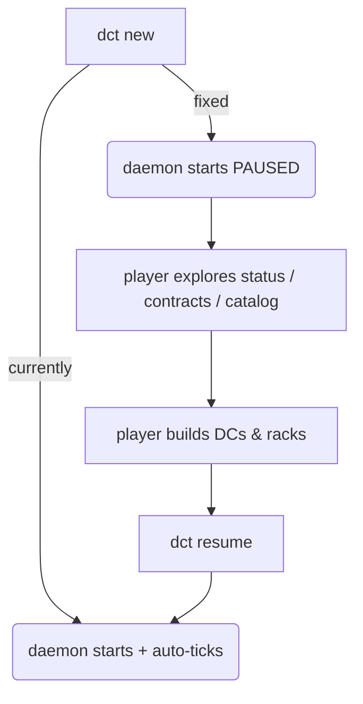

## Progress

- [x] **Phase 1 — Stop the clock on new game**
  - [x] 1.1 Pause daemon immediately after `dct new`
- [x] **Phase 2 — Fix `dct ls` sub-commands**
  - [x] 2.1 Implement `dct ls contracts` (market + active)
  - [x] 2.2 Implement `dct ls datacenters`
  - [x] 2.3 Implement `dct ls racks <dcId>`
  - [x] 2.4 Implement `dct ls catalog`
  - [x] 2.5 Fix help text to match what actually works
- [x] **Phase 3 — Add `dct contracts` command**
  - [x] 3.1 Add top-level `dct contracts` command (alias for `dct ls contracts`)
- [x] **Phase 4 — Fix `dct status` / save-file tick mismatch**
  - [x] 4.1 Ensure `dct ls saves` reads the same tick value as `dct status --json`
- [x] **Phase 5 — Make daemon auto-start visible**
  - [x] 5.1 Print a one-line notice when the daemon is spawned automatically

## Overview

During hands-on play-testing via the CLI (starting a fresh game with `dct new`), five categories of UX problems were found that collectively make the game nearly unplayable from the command line without reading source code or save files:

1. A fresh game immediately starts auto-ticking at 1 TPS — by the time a new player reads `dct status` output and plans their first moves (~60–90 s), the game has silently advanced 60–90 ticks, landing them in late-game contract territory with only starting capital.
2. `dct ls` claims to support datacenters / racks / contracts / catalog but all sub-commands except `saves` return an error.
3. There is no CLI way to list contracts with their requirements, payments, and expiry — the single most important piece of information needed before building anything.
4. `dct status --json` shows only counts; `dct ls saves` and the raw save file sometimes show different tick values, making debugging confusing.
5. The daemon spawns silently — no indication that the game clock has started running.

## Architecture



The `dct ls` command router already exists; it just needs additional sub-command handlers that call the same daemon query endpoints the TUI uses.

## Phase 1 — Stop the clock on new game

**Goal**: Make `dct new` safe to call without immediately burning game time. Players should have unlimited time to read output and plan before the first tick fires.

### Step 1.1 — Pause daemon immediately after `dct new`

**Problem**: `dct new` creates a save, spawns the daemon (or resets its state), and the daemon immediately begins auto-ticking at 1 TPS. A player who spends 60 seconds reading CLI help has already lost 60 ticks of early-game time — skipping straight to tier-3 contract difficulty with starting capital.

**Observed behaviour**: Started new game at tick 1, spent ~90 s exploring CLI commands → daemon auto-advanced to tick 92. All 6 market contracts were tier-3 (requiring GPU racks costing $4–10 M) with only $2.5 M starting cash — effectively unplayable without reading source code.

**Fix**:
- File: `packages/cli/src/commands/new.ts` (or wherever the `new` command is handled)
- After creating/resetting game state, set `game.paused = true` before the daemon begins its tick loop.
- Print to stdout: `"New game created and paused at tick 1. Run 'dct resume' when ready to start."`
- Acceptance: `dct new --yes && dct status --json` shows `"paused": true` and `"tick": 1` regardless of how long the operator waits before running the next command.

## Phase 2 — Fix `dct ls` sub-commands

**Goal**: Make every sub-command listed in the help text actually work, so `dct ls` is a useful discovery and inspection tool.

**Observed behaviour**: `dct --help` says `ls` can "List datacenters, racks, contracts, or catalog data". Every call except `dct ls saves` returns:
```
{ "ok": false, "error": { "code": 1, "message": "Usage: dct ls saves" } }
```

### Step 2.1 — Implement `dct ls contracts`

- File: `packages/cli/src/commands/ls.ts`
- Query the daemon for both `contractMarket` and `activeContracts` from game state.
- For each contract, print: `ID | Name | Status | $payment/mo | termMonths mo | urgency | Tier N | Expires tick N`
- On a second line (indented): `Reqs: vCPU=X, RAM=Xgb, Storage=XTB, GPU=X`
- With `--json`, emit a JSON array of the full contract objects.
- Acceptance: `dct ls contracts` prints all market + active contracts with requirements visible; `dct ls contracts --json` is valid JSON.

### Step 2.2 — Implement `dct ls datacenters`

- File: `packages/cli/src/commands/ls.ts`
- Query game state for `datacenters` list.
- Print: `ID | specId | regionId | racks N/maxSlots | power Xkw/Ykw | cash drain $Z/mo`
- Acceptance: `dct ls datacenters` prints all built DCs.

### Step 2.3 — Implement `dct ls racks <dcId>`

- File: `packages/cli/src/commands/ls.ts`
- Takes a required `<dcId>` positional argument.
- Prints each rack placement: `placementId | specId | row,pos | status (healthy/repairing) | age N months`
- Acceptance: `dct ls racks dc-1` prints all racks in that datacenter.

### Step 2.4 — Implement `dct ls catalog`

- File: `packages/cli/src/commands/ls.ts`
- Reuse the existing `dct query '{"kind":"catalog"}'` data.
- Print rack specs in a readable table: `ID | Kind | Tier | vCPU | RAM | Storage | GPU | Power | Capex | Maint/mo`
- Also print datacenter specs in a second table: `ID | Slots | Power | Cooling | BW | Capex | CoolingType`
- Acceptance: `dct ls catalog` prints both tables; no need to know the raw query protocol.

### Step 2.5 — Fix help text

- File: `packages/cli/src/commands/ls.ts` (help string)
- Update the help/usage string to accurately describe the implemented sub-commands with examples.
- Acceptance: `dct ls --help` shows all working sub-commands with one-line descriptions.

## Phase 3 — Add `dct contracts` top-level command

**Goal**: Make contract visibility a first-class, discoverable CLI command — the single most important piece of information for planning builds.

**Problem**: The only CLI way to see contract details (requirements, payment, expiry tick) is `dct query '{"kind":"catalog"}'` which returns rack specs, not contracts. Seeing contracts requires either the TUI or reading the raw JSON save file. This is the #1 obstacle to CLI play.

### Step 3.1 — Add top-level `dct contracts` command

- File: `packages/cli/src/commands/contracts.ts` (new file)
- Register as a top-level command alongside `build-dc`, `accept-contract`, etc.
- Behaviour: identical to `dct ls contracts` (Phase 2.1), implemented as a thin wrapper or alias.
- Add to `dct --help` command list.
- Acceptance: `dct contracts` and `dct contracts --json` work; the command appears in `dct --help`.

## Phase 4 — Fix tick mismatch between `dct status` and `dct ls saves`

**Goal**: All CLI entry-points that report the current tick must agree.

**Observed behaviour**:
- `dct status --json` → `"tick": 1`
- `dct ls saves` → `Tick: 22`
- `cat save.json | jq .state.tick` → `32`

All three were observed within the same 2-minute window after `dct new`. They should be identical (or at most 1 tick apart due to in-flight write timing).

### Step 4.1 — Align tick reporting across status, ls saves, and save file

- File: `packages/cli/src/commands/status.ts`, `packages/cli/src/commands/ls.ts`, daemon save logic
- Investigate why the in-memory daemon tick, the `ls saves` read path, and the on-disk save file diverge.
- Likely cause: `dct new` resets in-memory state to tick 1 but does not immediately flush to disk; the save on disk is from a previous game; `ls saves` reads disk; `status` reads in-memory.
- Fix: `dct new` should flush the new game state to disk before printing success and before the daemon starts ticking.
- Acceptance: Immediately after `dct new`, all three sources (`dct status --json`, `dct ls saves`, raw save file) report the same tick value.

## Phase 5 — Make daemon auto-start visible

**Goal**: Players should never be surprised that the game clock started running.

**Observed behaviour**: Running any `dct` command (e.g. `dct status`) silently spawns the daemon in the background with no output. The game clock starts ticking at 1 TPS immediately. There is no indication of this in the terminal.

### Step 5.1 — Print a notice when the daemon is auto-spawned

- File: `packages/cli/src/client/` (wherever auto-spawn logic lives)
- When the CLI detects no daemon is running and spawns one, print to stderr (so it doesn't pollute `--json` output):
  ```
  ⚡ Daemon not running — starting it now. Game clock is now ticking.
     Run 'dct pause' to stop the clock.
  ```
- If the game is also paused (e.g. after `dct new` fix above), adjust message to reflect that.
- Acceptance: First `dct` command after a daemon shutdown prints the notice; `--json` output is unaffected (notice goes to stderr).

## References

- [packages/cli/AGENTS.md](../../packages/cli/AGENTS.md) — CLI package guidance
- [play-cli-game skill](../skills/play-cli-game/SKILL.md) — full command reference
- [009-cli-client.md](009-cli-client.md) — original CLI implementation plan
- [005-contracts-ux-overhaul.md](005-contracts-ux-overhaul.md) — contract UX thinking (web, but relevant)

## Changelog

- 2026-05-09 — Created from CLI play-test session. All 5 bug categories observed firsthand by an AI agent playing the game from tick 1 to tick 92 (due to bug #1).
