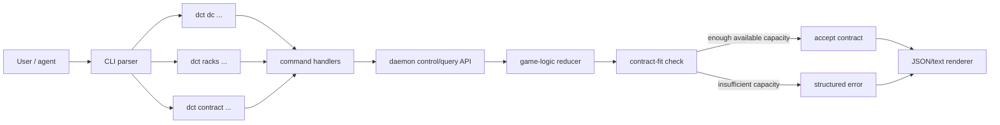

## Progress

- [x] **Phase 1 — Enforce contract-fit guardrails in game logic**
  - [x] 1.1 Add a derived per-datacenter committed/available-capacity helper
  - [x] 1.2 Reject contract acceptance when the target DC cannot satisfy the contract right now
  - [x] 1.3 Surface the rejection as a real CLI/daemon error
- [x] **Phase 2 — Normalize contract/payment naming**
  - [x] 2.1 Choose canonical contract DTO field names and shared presenters
  - [x] 2.2 Make list/detail JSON output use the same payment field name everywhere
- [x] **Phase 3 — Make `--json` universally available for one-shot commands**
  - [x] 3.1 Audit every command handler for structured JSON success/error output
  - [x] 3.2 Centralize JSON/text envelope helpers so command outputs stop drifting
  - [x] 3.3 Add regression tests for representative read/write commands in `--json` mode
- [x] **Phase 4 — Group CLI commands by resource noun**
  - [x] 4.1 Introduce `dct dc ...` routing with `dc build` as the datacenter command surface
  - [x] 4.2 Introduce `dct racks add|decom|move` as the rack command surface
  - [x] 4.3 Introduce `dct contract accept|cancel|details` as the contract command surface
  - [x] 4.4 Remove legacy flat commands and old pluralized routing from help, parser, and tests
- [ ] **Phase 5 — Update tests, docs, and agent guidance**
  - [x] 5.1 Update CLI tests and help text to reflect the new command taxonomy
  - [x] 5.2 Update `packages/cli/README.md` and `packages/cli/AGENTS.md`
  - [ ] 5.3 Update `.agents/skills/play-cli-game/SKILL.md`

## Overview

The first CLI playtest surfaced three related product gaps: the game lets a player accept a contract onto a datacenter that may not actually have enough free capacity, machine-readable contract outputs drift between names like `paymentPerMonth` and `monthlyPayment`, and the command surface has grown as a flat list of verbs (`build-dc`, `add-rack`, `accept-contract`) instead of a grouped noun-first CLI. This plan fixes those issues together because they all touch the contract acceptance path, command routing, JSON output, and operator documentation.

The implementation should keep `@datacenter-tycoon/game-logic` deterministic and serializable by deriving fit checks from existing state rather than persisting new counters. On the CLI side, the end result should be a more scriptable and discoverable surface: consistent `--json` support, canonical grouped commands, and an explicit error when a contract does not fit on the requested datacenter.

## Architecture



Key decisions:

- **Contract acceptance must validate available, not just installed, capacity.** The check should be based on the target datacenter's derived installed capacity minus the requirements already committed by active contracts assigned to that datacenter.
- **No new persisted capacity fields.** Capacity and committed usage stay derived so save/load format remains stable and deterministic.
- **`monthlyPayment` becomes the canonical programmatic field name.** Human-readable table headings can still say `Payment/mo`, but JSON output and TypeScript DTOs should use one stable property name.
- **Grouped noun-first commands replace the old flat verbs.** `dc`, `racks`, and `contract` become the only supported command families for these operations.
- **Breaking changes are acceptable for this refactor.** Do not spend implementation effort on compatibility aliases, deprecation shims, or dual command surfaces.
- **All one-shot commands must honor `--json`.** Structured success and failure output should come from shared helpers, not hand-rolled per command.

Illustrative contract-fit result shape:

```ts
interface ContractFitFailure {
  ok: false;
  code: 'insufficient_capacity';
  dcId: string;
  required: ResourceBundle;
  available: ResourceBundle;
}
```

## Phase 1 — Enforce contract-fit guardrails in game logic

**Goal**: accepting a contract should fail deterministically when the requested datacenter does not currently have enough free capacity to cover the contract on top of already-assigned active work.

### Step 1.1 — Add a derived per-datacenter committed/available-capacity helper

- Files: `packages/game-logic/src/entities/datacenter.ts`, `packages/game-logic/src/entities/capacity.test.ts` (or nearest capacity-focused test file), and any barrel exports needed in `packages/game-logic/src/entities/index.ts`
- Add a pure helper that returns at least `installed`, `committed`, and `available` capacity for a datacenter by combining rack-derived capacity with the requirements of active contracts already assigned to that datacenter.
- Reuse existing capacity/resource bundle types where possible; do not introduce duplicate ad hoc shapes in CLI code.
- Keep the helper internal to game-logic and derived from state only; do not store cached values on `GameState`.
- Acceptance: deterministic tests cover an empty DC, a partially committed DC, and a fully exhausted DC.

### Step 1.2 — Reject contract acceptance when the target DC cannot satisfy the contract right now

- Files: `packages/game-logic/src/contracts/market.ts`, `packages/game-logic/src/state/reduce.ts`, `packages/game-logic/src/contracts/contracts.test.ts`, `packages/game-logic/src/state/reduce.test.ts`
- Thread the new availability helper into the contract acceptance path before a contract moves from market to active.
- If any required dimension exceeds available capacity, leave state unchanged: the contract stays in the market, active contracts stay untouched, and no acceptance-side effects are recorded.
- Pick one canonical failure shape/error code that the CLI can surface without string-matching opaque messages.
- Acceptance: reducer/contract tests prove that over-capacity acceptance is rejected and exact-fit acceptance still succeeds.

### Step 1.3 — Surface the rejection as a real CLI/daemon error

- Files: `packages/cli/src/commands/contracts.ts`, `packages/cli/src/protocol/messages.ts`, `packages/cli/src/commands/contracts.test.ts`, plus any daemon request/response plumbing used for action failures
- Ensure a rejected accept request comes back as a non-success command result instead of silently returning unchanged state.
- For text mode, print a concise error that names the DC and capacity shortfall.
- For `--json`, return a stable machine-readable error envelope containing the failure code plus `required` and `available` bundles.
- Acceptance: `dct contract accept <contractId> <dcId>` exits with an error when the DC is already full, and `dct contract accept ... --json` contains `code: "insufficient_capacity"`.

## Phase 2 — Normalize contract/payment naming

**Goal**: remove output-shape drift so every contract-oriented JSON surface uses the same field names and agents do not need special-case adapters.

### Step 2.1 — Choose canonical contract DTO field names and shared presenters

- Files: `packages/cli/src/commands/contracts.ts`, `packages/cli/src/commands/ls.ts`, `packages/cli/src/protocol/messages.ts`, and any shared presenter/helper file created under `packages/cli/src/commands/`
- Audit current contract list/detail renderers for fields that differ only by naming (`paymentPerMonth` vs `monthlyPayment`, assignment labels, status labels, etc.).
- Define a single CLI-facing contract DTO/presenter shape that both list and details paths reuse.
- Prefer `monthlyPayment` as the canonical machine-readable property, since it already matches the underlying game-state vocabulary.
- Acceptance: there is one shared contract presenter path instead of duplicated field assembly in multiple command handlers.

### Step 2.2 — Make list/detail JSON output use the same payment field name everywhere

- Files: `packages/cli/src/commands/contracts.ts`, `packages/cli/src/commands/ls.ts`, related tests under `packages/cli/src/commands/*.test.ts`
- Update `dct ls contracts --json`, `dct contract details --json`, and any other contract-oriented JSON output to emit the canonical field names.
- Do not keep a backwards-compat alias for the old payment field name; update callers, tests, and docs to the canonical schema in one pass.
- Verify text-mode output still reads cleanly even if the programmatic property name changes.
- Acceptance: snapshot/unit tests assert the same contract JSON schema across list and detail commands.

## Phase 3 — Make `--json` universally available for one-shot commands

**Goal**: every one-shot CLI command should be script-friendly, not just a subset of read-only commands.

### Step 3.1 — Audit every command handler for structured JSON success/error output

- Files: `packages/cli/src/cli.ts`, `packages/cli/src/argv.ts`, `packages/cli/src/commands/*.ts`
- Enumerate the current top-level and nested commands and mark which ones already honor `--json` versus which ones still print plain text only.
- Update mutating commands such as datacenter build, rack add/remove/move, contract accept/cancel, save/load, and control commands to return structured JSON success payloads.
- Confirm failures also respect `--json` rather than mixing plain text and JSON in the same execution path.
- Acceptance: the canonical grouped commands in Phase 4 and the existing one-shot lifecycle commands all support `--json`.

### Step 3.2 — Centralize JSON/text envelope helpers so command outputs stop drifting

- Files: `packages/cli/src/commands/common.ts` and any command files that currently handcraft success/error envelopes
- Introduce or extend shared render helpers for success payloads, error payloads, exit codes, and optional quiet mode handling.
- Remove duplicated per-command JSON formatting logic where practical.
- Ensure stderr notices (for example daemon auto-start) stay off stdout so JSON remains parseable.
- Acceptance: at least the core mutation commands use shared helpers, and representative tests confirm clean stdout JSON.

### Step 3.3 — Add regression tests for representative read/write commands in `--json` mode

- Files: `packages/cli/src/commands/build-dc.test.ts`, `packages/cli/src/commands/contracts.test.ts`, `packages/cli/src/commands/control.test.ts`, `packages/cli/src/commands/new-load.test.ts`, `packages/cli/src/commands/status.test.ts`, or equivalent
- Add coverage for both success and failure paths in JSON mode, not just happy-path text output.
- Include at least one nested grouped command per noun router from Phase 4.
- Acceptance: `npm run test -w @datacenter-tycoon/cli` passes with new JSON-focused assertions.

## Phase 4 — Group CLI commands by resource noun

**Goal**: make the CLI more discoverable by grouping commands as `dct <noun> <verb>` instead of proliferating flat `verb-noun` commands.

### Step 4.1 — Introduce `dct dc ...` routing with `dc build` as the canonical datacenter creation command

- Files: `packages/cli/src/cli.ts`, `packages/cli/src/commands/build-dc.ts` or a new `packages/cli/src/commands/dc.ts`, and matching tests
- Add a `dc` router whose primary live subcommand is `build`.
- Decide whether `dc decom` should be a reserved stub (`not implemented yet`) or omitted from help until the gameplay mechanic exists; document that choice explicitly.
- Remove `build-dc` from the supported command surface instead of keeping it as an alias.
- Acceptance: `dct dc build garage --region us_west` works, is shown in help, and `build-dc` is no longer documented or accepted.

### Step 4.2 — Introduce `dct racks add|decom|move` as canonical rack operations

- Files: `packages/cli/src/cli.ts`, `packages/cli/src/commands/build-dc.ts` or a new `packages/cli/src/commands/racks.ts`, and matching tests
- Group existing rack operations under a `racks` namespace with verbs `add`, `decom`, and `move`.
- Reuse the current remove-rack implementation for `decom`; avoid changing game behavior while only changing command taxonomy.
- Remove `add-rack`, `remove-rack`, and `move-rack` from the supported command surface.
- Acceptance: `dct racks add ...`, `dct racks decom ...`, and `dct racks move ...` all work in text and JSON modes, and the old flat rack commands are rejected.

### Step 4.3 — Introduce `dct contract accept|cancel|details` as canonical contract operations

- Files: `packages/cli/src/cli.ts`, `packages/cli/src/commands/contracts.ts`, and matching tests
- Make grouped contract verbs under `dct contract ...` the only supported write/inspect surface.
- Remove the old `contracts` router from normal command parsing/help so contract operations live under one singular noun.
- Ensure the accept path uses the Phase 1 rejection plumbing and the Phase 2 canonical DTO names.
- Acceptance: `dct contract accept|cancel|details` is documented and tested, and old flat aliases like `accept-contract` are removed.

### Step 4.4 — Remove legacy flat commands and old pluralized routing

- Files: `packages/cli/src/cli.ts`, command help text, `packages/cli/README.md`, matching parser/routing tests
- Delete the old flat command entry points being replaced (`build-dc`, `add-rack`, `remove-rack`, `move-rack`, `accept-contract`, `cancel-contract`) from the supported parser/help surface.
- Remove the old `contracts` router so the command taxonomy is singular and unambiguous under `dct contract ...`.
- Update parser errors/help text so unsupported old commands fail fast instead of silently aliasing.
- Acceptance: help/docs/tests show only the new grouped commands, and invoking the removed commands yields an error.

## Phase 5 — Update tests, docs, and agent guidance

**Goal**: the documented CLI surface, contributor guidance, and agent playbook should all match the post-refactor behavior.

### Step 5.1 — Update CLI tests and help text to reflect the new command taxonomy

- Files: `packages/cli/src/cli.ts`, existing `packages/cli/src/commands/*.test.ts`
- Refresh root help output and any subcommand help strings to show grouped commands and JSON availability only.
- Extend command tests so help text and routing changes are covered alongside behavior changes.
- Acceptance: help output matches the intended command surface and test expectations are updated accordingly.

### Step 5.2 — Update `packages/cli/README.md` and `packages/cli/AGENTS.md`

- Files: `packages/cli/README.md`, `packages/cli/AGENTS.md`
- Update command examples from flat verbs to grouped nouns.
- Document that `--json` is expected to work across one-shot commands, especially for automation.
- Update contributor guidance so future CLI changes extend grouped routers instead of reintroducing new flat verbs.
- Acceptance: README examples and CLI package guidance no longer reference removed flat commands.

### Step 5.3 — Update `.agents/skills/play-cli-game/SKILL.md`

- File: `.agents/skills/play-cli-game/SKILL.md`
- Refresh the skill's exact command inventory, examples, and automation guidance to use only the grouped command names and the universal `--json` expectation.
- Call out the new contract-fit rejection behavior so agents stop assuming every accept attempt is valid.
- Acceptance: the skill can be used by a fresh agent to play the CLI without relying on removed command names or inconsistent JSON field names.

## References

- `.agents/research/playtest-results-01.md` — playtest findings that motivated the contract-fit and CLI ergonomics fixes
- `.agents/plans/025-cli-ux-bug-fixes.md` — preceding CLI playtest response plan
- `packages/cli/AGENTS.md` — CLI package rules, especially machine-readable output expectations
- `packages/game-logic/AGENTS.md` — deterministic/pure-state rules for contract validation
- `.agents/skills/play-cli-game/SKILL.md` — current CLI command inventory that must be updated alongside implementation
