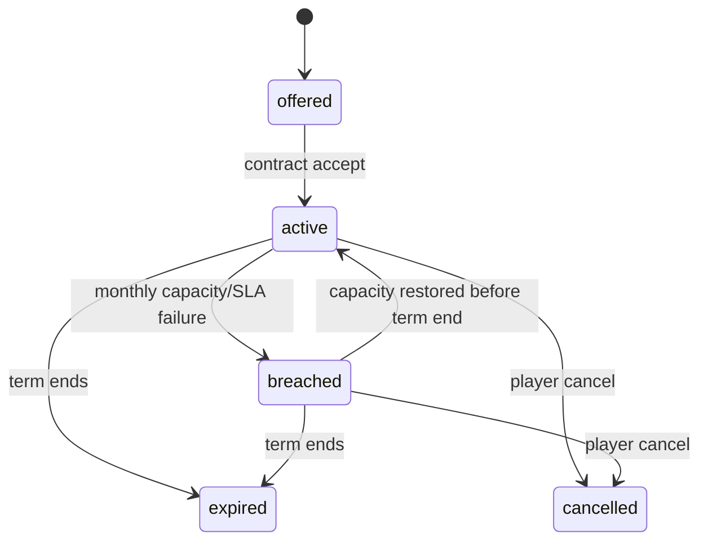
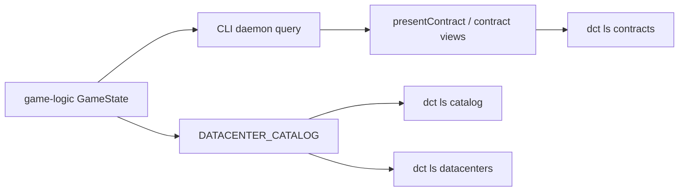

## Progress

- [x] **Phase 1 — Fix contract assignment visibility in CLI listings**
  - [x] 1.1 Add a regression that reproduces assigned contracts rendering as unassigned
  - [x] 1.2 Fix the shared contract presentation path so assigned DC IDs survive list/detail rendering
- [ ] **Phase 2 — Make datacenter row/column layout discoverable**
  - [x] 2.1 Surface row/column geometry in `dct ls catalog`
  - [ ] 2.2 Thread layout bounds into player-facing datacenter/rack output
- [ ] **Phase 3 — Simplify contract end states to `breached`, `cancelled`, and `expired`**
  - [ ] 3.1 Replace `completed` with `expired` in game-logic contract lifecycle
  - [ ] 3.2 Reserve `cancelled` for explicit player cancellation and stop auto-relabeling breach failures as cancelled
  - [ ] 3.3 Update save migration, CLI presenters, and tests for the new status vocabulary
- [ ] **Phase 4 — Regression coverage and docs**
  - [ ] 4.1 Add end-to-end tests covering assigned, breached, cancelled, and expired contracts
  - [ ] 4.2 Update README / agent guidance for the new CLI contract and catalog output

## Overview

The first CLI playtest surfaced three follow-up issues that still make contract management harder than it should be: assigned contracts can appear as `DC: unassigned`, datacenter slot geometry is not visible enough to explain rack placement bounds, and contract end-state labels blur together operational failure and deliberate player cancellation. This plan fixes those issues together because they all affect the same player loop: inspect contracts, inspect datacenter capacity/layout, accept work onto a specific DC, and understand what happened after time advances.

The work spans both `@datacenter-tycoon/cli` and `@datacenter-tycoon/game-logic`. The CLI should remain a thin presenter over daemon/game state, while the contract lifecycle semantics remain deterministic and serializable in game-logic.

## Architecture





Key decisions:
- `assignedDcId` should come from the canonical active-contract state and flow through one shared CLI presenter path for both list and details views.
- Datacenter geometry should be presented from the catalog's existing `rows` and `positionsPerRow` data rather than duplicated in CLI-only metadata.
- `completed` should be replaced with `expired` for "term ended normally"; `cancelled` should mean player-initiated cancellation only.
- A contract may remain `breached` while it is live and failing, but once its term ends it should become `expired` rather than being silently remapped to `cancelled`.
- Because contract status is persisted, save migration/versioning must be handled explicitly.

Illustrative status shape after the cleanup:

```ts
export type ContractStatus =
  | "offered"
  | "active"
  | "breached"
  | "expired"
  | "cancelled";
```

## Phase 1 — Fix contract assignment visibility in CLI listings

**Goal**: when a contract is accepted onto a datacenter, every CLI contract surface should show the same assigned DC identifier instead of misleading `unassigned` text.

### Step 1.1 — Add a regression that reproduces assigned contracts rendering as unassigned

- Files: `packages/cli/src/commands/contracts.test.ts`, `packages/cli/src/commands/contracts-view.test.ts`
- Add a focused regression using an active contract with a real `assignedDcId` and verify both text and `--json` list output preserve it.
- Cover both `dct ls contracts` and `dct contract details` so the shared presenter contract stays aligned.
- Acceptance: the new regression fails before the rendering fix and passes after it; `assignedDcId` is asserted in both list and detail payloads.

### Step 1.2 — Fix the shared contract presentation path so assigned DC IDs survive list/detail rendering

- Files: `packages/cli/src/commands/contracts-view.ts`, `packages/cli/src/commands/ls.ts`, `packages/cli/src/commands/contracts.ts`, `packages/cli/src/daemon/runtime.ts` (only if the bug is in query shaping rather than presentation)
- Trace the active-contract data from daemon query to presenter to final CLI text rendering, and fix the first place where `assignedDcId` is being dropped, normalized incorrectly, or bypassed.
- Keep one canonical presenter path for contract rows so list/detail output cannot drift again.
- Acceptance: `dct ls contracts` text output shows `DC: <dc-id>` for assigned contracts, and `dct ls contracts --json` returns non-null `assignedDcId` values for active contracts.

## Phase 2 — Make datacenter row/column layout discoverable

**Goal**: a player should be able to see a datacenter's slot grid before trying rack placements, instead of learning it by hitting `out_of_bounds` errors.

### Step 2.1 — Surface row/column geometry in `dct ls catalog`

- Files: `packages/cli/src/commands/ls.ts`, `packages/cli/src/commands/contracts-view.test.ts` (if shared helpers move), `packages/cli/src/commands/build-dc.test.ts` or `packages/cli/src/commands/contracts.test.ts` if snapshot-style CLI assertions already live there
- Update the datacenter catalog table to show both total slots and explicit geometry, e.g. `Layout: 2 rows × 4 cols (8 slots)`.
- Preserve the existing `--json` payload shape, which already includes `rows` and `positionsPerRow`; only the text output needs discoverability work unless tests show a naming cleanup is worthwhile.
- Acceptance: `dct ls catalog` makes the garage layout visibly read as `2 × 4`; automated CLI output coverage locks that in.

### Step 2.2 — Thread layout bounds into player-facing datacenter/rack output

- Files: `packages/cli/src/commands/ls.ts`, `packages/cli/src/commands/racks.ts`, `packages/cli/src/commands/build-dc.ts` (or the command file that formats rack placement errors), relevant tests under `packages/cli/src/commands/*.test.ts`
- Add the same geometry to at least one "what can I do next?" surface besides catalog — preferably `dct ls datacenters`, and if practical the rack-placement `out_of_bounds` error path should mention the valid row/column range.
- Keep the CLI script-friendly: text output may be richer, but `--json` remains structured.
- Acceptance: after building a garage, at least one discovery path besides the catalog tells the player it is `rows=2`, `cols=4`; invalid placement errors no longer feel context-free.

## Phase 3 — Simplify contract end states to `breached`, `cancelled`, and `expired`

**Goal**: contract status labels should answer three distinct player questions cleanly — is the contract currently failing (`breached`), did I cancel it (`cancelled`), or did it finish its term (`expired`)?

### Step 3.1 — Replace `completed` with `expired` in game-logic contract lifecycle

- Files: `packages/game-logic/src/types.ts`, `packages/game-logic/src/contracts/lifecycle.ts`, `packages/game-logic/src/sim/tick.ts`, `packages/game-logic/src/contracts/contracts.test.ts`, `packages/game-logic/src/sim/tick.test.ts`, `packages/game-logic/src/integration.test.ts`
- Rename the healthy end-of-term status from `completed` to `expired` in the contract type union and all deterministic lifecycle helpers.
- Update tick finalization so a live contract becomes `expired` once `termMonths` elapse.
- Acceptance: contract lifecycle and integration tests assert `expired` instead of `completed`, and game-logic tests pass.

### Step 3.2 — Reserve `cancelled` for explicit player cancellation and stop auto-relabeling breach failures as cancelled

- Files: `packages/game-logic/src/sim/tick.ts`, `packages/game-logic/src/state/reduce.ts`, `packages/game-logic/src/contracts/lifecycle.ts`, `packages/game-logic/src/contracts/reliability.ts`, related tests under `packages/game-logic/src/contracts/*.test.ts`, `packages/game-logic/src/state/reduce.test.ts`, `packages/game-logic/src/sim/tick.test.ts`
- Remove the auto-cancel/escalation path that turns repeated breach months into `cancelled`.
- Keep `CancelContract` as the only path that writes `status: "cancelled"`.
- Ensure breached contracts still count as committed demand while live, can recover to `active` if capacity returns, and ultimately end as `expired` when the term runs out.
- Revisit reliability outcome classification so breach months and explicit cancellations are still scored deterministically without relying on the old `completed`/auto-cancel semantics.
- Acceptance: a repeated SLA failure remains `breached`, a user-issued cancel becomes `cancelled`, and end-of-term healthy contracts become `expired`.

### Step 3.3 — Update save migration, CLI presenters, and tests for the new status vocabulary

- Files: `packages/game-logic/src/save/serialize.ts`, `packages/game-logic/src/save/serialize.test.ts`, `packages/cli/src/commands/contracts-view.ts`, `packages/cli/src/commands/ls.ts`, `packages/cli/src/commands/contracts.ts`, related CLI tests
- Bump or explicitly handle save-version migration so legacy saves containing `completed` deserialize into `expired`.
- Update any CLI presenters, help text, and JSON/text assertions that still mention `completed` or interpret `cancelled` as a breach-driven outcome.
- Acceptance: old save fixtures migrate cleanly, no public CLI output mentions `completed`, and both CLI + game-logic test suites pass.

## Phase 4 — Regression coverage and docs

**Goal**: lock the fixes in with durable tests and ensure user/operator guidance matches the new behavior.

### Step 4.1 — Add end-to-end tests covering assigned, breached, cancelled, and expired contracts

- Files: `packages/game-logic/src/integration.test.ts`, `packages/cli/src/commands/contracts.test.ts`, and any focused fixtures/helpers they need
- Add an end-to-end scenario that accepts a contract onto a known DC, verifies the assignment is rendered, then exercises one explicit cancellation path and one natural expiry path.
- Add at least one breach scenario proving the contract shows as `breached` rather than being silently converted to `cancelled`.
- Acceptance: the new tests fail if assignment text regresses or if contract states collapse back into ambiguous labels.

### Step 4.2 — Update README / agent guidance for the new CLI contract and catalog output

- Files: `packages/game-logic/README.md`, `packages/cli/README.md`, `.agents/skills/play-cli-game/SKILL.md`
- Update examples and prose so they refer to `expired` instead of `completed`, explain that `cancelled` is player-driven, and point out where row/column layout is shown in the CLI.
- Keep agent guidance aligned with the exact command output expected after Phases 1–3.
- Acceptance: docs and skill guidance match the implemented output/state names and no longer describe the old ambiguous contract labels.

## References

- `.agents/research/playtest-results-01.md` — source playtest report for issues 3.1, 3.4, and 3.5
- `.agents/plans/025-cli-ux-bug-fixes.md` — earlier CLI playtest-response plan
- `.agents/plans/026-cli-command-grouping-and-contract-guardrails.md` — recent contract/CLI refactor work
- `packages/cli/AGENTS.md` — CLI package guidance
- `packages/game-logic/AGENTS.md` — deterministic core rules and save-format guidance

## Changelog

- 2026-05-09 — Created from playtest follow-up items 3.1, 3.4, and 3.5.
