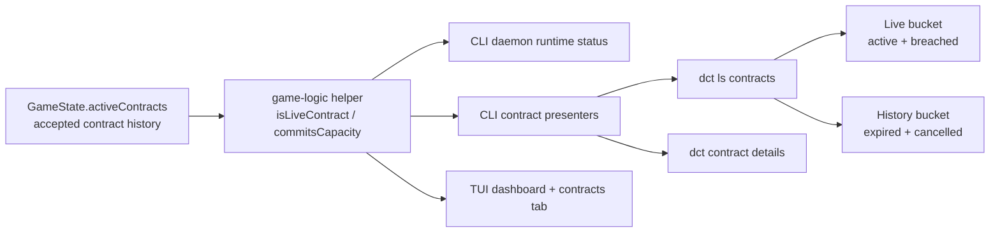

## Progress

- [x] **Phase 1 — Canonicalize contract liveness semantics**
  - [x] 1.1 Add a shared game-logic helper for "live / capacity-committing" contract status
  - [x] 1.2 Add focused game-logic regression coverage proving expired contracts no longer commit capacity
- [x] **Phase 2 — Fix CLI daemon status and one-shot contract views**
  - [x] 2.1 Make daemon/runtime status counts use only live contracts
  - [x] 2.2 Split CLI contract presentation into live vs history buckets
  - [x] 2.3 Keep contract details available for historical contracts without labeling them active
- [ ] **Phase 3 — Fix TUI surfaces and lock in regressions**
  - [x] 3.1 Update dashboard and contracts tab to distinguish live vs historical accepted contracts
  - [x] 3.2 Add CLI/TUI regression tests for the expired-contract repro
  - [ ] 3.3 Update README / agent guidance to document the live-vs-history distinction

## Overview

Investigation shows this bug is primarily in the **CLI layer**, not in the core simulation. In `@datacenter-tycoon/game-logic`, expired and cancelled contracts are already excluded from committed-capacity calculations: `acceptContract()` checks `datacenterContractCapacitySummary()`, and that summary only counts contracts whose status is `active` or `breached`. A direct repro confirmed that after a one-month contract expires, the datacenter reports `committed: 0` and full `available` capacity, while the CLI runtime still reports `activeContractCount: 1` and CLI/TUI surfaces continue to show the expired contract in "active" buckets.

The root issue is that the CLI currently treats `GameState.activeContracts` as "currently live contracts", when in practice it is acting as a **history of accepted contracts with mixed statuses**. The fix should preserve history visibility, but stop labeling expired/cancelled contracts as live or capacity-holding.

## Architecture



Key decisions:
- **Treat contract liveness as a shared rule, not ad hoc CLI filtering.** The rule "only `active` and `breached` contracts still commit capacity" should live in `game-logic` and be reused by CLI/daemon code.
- **Do not change save shape.** `GameState.activeContracts` can remain the persisted list of accepted contracts; the bug is in how the CLI interprets that list.
- **Preserve contract history visibility.** Expired and cancelled contracts should not disappear entirely; they should move into a clearly labeled history bucket instead of remaining in active/live views.
- **Status counts must reflect live work only.** `activeContractCount` in daemon/CLI status should mean contracts that are still consuming capacity or can currently breach (`active` + `breached`).
- **Avoid frontend rule drift.** The CLI should import one canonical helper rather than repeating `status === "active" || status === "breached"` in multiple files.

Illustrative helper shape:

```ts
export function isLiveContractStatus(status: ContractStatus): boolean {
  return status === "active" || status === "breached";
}
```

Illustrative presenter result after the fix:

```ts
interface ContractBuckets {
  market: CliContractView[];
  active: CliContractView[];   // live contracts only
  history: CliContractView[];  // expired + cancelled
}
```

## Phase 1 — Canonicalize contract liveness semantics

**Goal**: establish one shared source of truth for whether a contract is still live / capacity-committing, and prove in tests that expired contracts do not reserve capacity in game-logic.

### Step 1.1 — Add a shared game-logic helper for "live / capacity-committing" contract status

- Files: `packages/game-logic/src/contracts/` (new helper or existing lifecycle module), `packages/game-logic/src/contracts/index.ts`, `packages/game-logic/src/index.ts`
- Move or extract the currently duplicated status rule into a small reusable helper such as `isLiveContractStatus()` or `contractCommitsCapacity()`.
- Reuse that helper anywhere status semantics are currently open-coded or hidden as private internals.
- Keep the helper pure and serialization-neutral.
- Acceptance: the helper is exported from the public game-logic surface and can be imported by `@datacenter-tycoon/cli` without reimplementing status checks.

### Step 1.2 — Add focused game-logic regression coverage proving expired contracts no longer commit capacity

- Files: `packages/game-logic/src/entities/capacity.test.ts`, optionally `packages/game-logic/src/contracts/contracts.test.ts` or `packages/game-logic/src/integration.test.ts`
- Add an explicit regression for the reported case: accept a contract, advance until it expires, then verify committed demand is zero and available capacity returns to full.
- If helpful, also assert that a new exact-fit contract can be accepted immediately after expiry.
- Acceptance: the regression fails if expired contracts ever re-enter committed-capacity calculations, and `npm run test -w @datacenter-tycoon/game-logic` passes.

## Phase 2 — Fix CLI daemon status and one-shot contract views

**Goal**: make every CLI one-shot surface report live contracts accurately while still exposing historical accepted contracts for inspection.

### Step 2.1 — Make daemon/runtime status counts use only live contracts

- Files: `packages/cli/src/daemon/runtime.ts`, `packages/cli/src/protocol/messages.ts`, `packages/cli/src/commands/status.test.ts`, `packages/cli/src/daemon/runtime.test.ts`
- Update `createStatusView()` so `activeContractCount` counts only live contracts using the shared game-logic helper.
- Audit any other runtime-derived summary fields that currently assume `state.activeContracts.length` means "live".
- Keep the existing field name unless a stronger compatibility/documentation reason emerges during implementation.
- Acceptance: a snapshot containing only expired/cancelled accepted contracts reports `activeContractCount: 0`.

### Step 2.2 — Split CLI contract presentation into live vs history buckets

- Files: `packages/cli/src/commands/contracts-view.ts`, `packages/cli/src/commands/ls.ts`, `packages/cli/src/commands/contracts.test.ts`, `packages/cli/src/commands/ls.test.ts`
- Change the shared presenter so accepted contracts are bucketed into at least:
  - `active` (live: `active` + `breached`)
  - `history` (`expired` + `cancelled`)
- Update text output for `dct ls contracts` to render these sections clearly.
- Update JSON output so machine-readable consumers can distinguish live vs historical contracts without inferring it from status strings alone.
- Acceptance: expired contracts no longer appear under the "Active Contracts" section in text output, and the JSON payload exposes a dedicated history bucket.

### Step 2.3 — Keep contract details available for historical contracts without labeling them active

- Files: `packages/cli/src/commands/contracts-view.ts`, `packages/cli/src/commands/contracts.ts`, relevant tests under `packages/cli/src/commands/contracts*.test.ts`
- Ensure `dct contract details <id>` still resolves accepted historical contracts by ID.
- Update any `bucket` or section labels so expired/cancelled contracts are described as historical rather than active.
- Preserve `assignedDcId` in details output for post-mortem debugging, but do not imply that assignment still consumes capacity.
- Acceptance: `dct contract details` works for an expired contract and labels it as historical (or equivalent wording), not active.

## Phase 3 — Fix TUI surfaces and lock in regressions

**Goal**: make the interactive terminal UI and automated test suite reflect the same live-vs-history semantics as one-shot CLI commands.

### Step 3.1 — Update dashboard and contracts tab to distinguish live vs historical accepted contracts

- Files: `packages/cli/src/tui/tabs/dashboard.ts`, `packages/cli/src/tui/tabs/contracts.ts`, `packages/cli/src/tui/tabs/dashboard.test.ts`, `packages/cli/src/tui/tabs/contracts.test.ts`
- Change the dashboard KPI so "Active contracts" reflects only live contracts.
- Update the contracts tab so expired/cancelled accepted contracts appear in a separate history section, or are otherwise clearly not grouped under "Active".
- Keep the TUI derived from snapshots; do not duplicate simulation rules there.
- Acceptance: a snapshot with one expired accepted contract renders zero active/live contracts and still shows the expired contract under history.

### Step 3.2 — Add CLI/TUI regression tests for the expired-contract repro

- Files: `packages/cli/src/commands/status.test.ts`, `packages/cli/src/commands/contracts.test.ts`, `packages/cli/src/tui/tabs/contracts.test.ts`, `packages/cli/src/tui/tabs/dashboard.test.ts`, optionally `packages/cli/src/daemon/runtime.test.ts`
- Encode the exact failure mode observed during investigation:
  - expired contract still present in `state.activeContracts`
  - CLI status must report zero live contracts
  - CLI/TUI active sections must exclude the expired contract
- Prefer one shared fixture/snapshot shape so the same repro is asserted across status, list, and TUI views.
- Acceptance: tests fail against the current buggy behavior and pass after the fix; `npm run test -w @datacenter-tycoon/cli` passes.

### Step 3.3 — Update README / agent guidance to document the live-vs-history distinction

- Files: `packages/cli/README.md`, `packages/game-logic/README.md`, `.agents/skills/play-cli-game/SKILL.md`
- Document that accepted-contract history is retained, but only `active`/`breached` contracts are live and capacity-committing.
- Update any screenshots/examples/help text that currently imply every entry in `activeContracts` or every accepted contract is still live.
- Acceptance: docs consistently explain the distinction and no longer describe expired/cancelled contracts as active capacity consumers.

## References

- `packages/game-logic/src/entities/datacenter.ts` — committed-capacity logic already excludes expired/cancelled contracts
- `packages/game-logic/src/contracts/market.ts` — acceptance path uses derived available capacity from game-logic
- `packages/game-logic/src/economy/opex.ts` — billing/revenue logic also ignores expired/cancelled contracts for assigned demand
- `packages/cli/src/daemon/runtime.ts` — currently counts `state.activeContracts.length` directly in status output
- `packages/cli/src/commands/contracts-view.ts` — currently buckets every accepted contract as `active`
- `packages/cli/src/tui/tabs/dashboard.ts` and `packages/cli/src/tui/tabs/contracts.ts` — currently present all accepted contracts as active/live
- `.agents/plans/026-cli-command-grouping-and-contract-guardrails.md`
- `.agents/plans/027-cli-playtest-contract-layout-and-status-fixes.md`

## Changelog

- 2026-05-10 — Created after investigation showed capacity release is correct in game-logic, while CLI status/list/TUI layers still misreport expired contracts as active.
