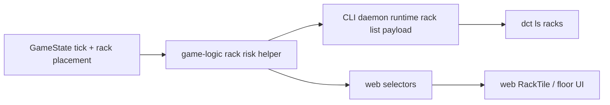

## Progress

- [x] **Phase 1 — Canonicalize rack failure-risk data in game-logic**
  - [x] 1.1 Add a public game-logic helper/view that derives rack age and current failure probability
  - [x] 1.2 Add regression tests and README docs for the new rack-risk helper
- [x] **Phase 2 — Surface failure probability in CLI rack listings**
  - [x] 2.1 Extend CLI rack list protocol/runtime payloads with rack health and failure probability fields
  - [x] 2.2 Update `dct ls racks` text and JSON output to show current health and monthly failure probability
  - [x] 2.3 Add CLI regression coverage for rack-risk listing output
- [x] **Phase 3 — Surface failure probability in the web rack UI**
  - [x] 3.1 Extend web rack maintenance selectors with failure probability data from game-logic
  - [x] 3.2 Render visible risk information in rack tiles/tooltips for desktop and phone layouts
  - [x] 3.3 Add web selector/component tests and styling updates for the new rack-risk display

## Overview

Rack failure probability already exists in the simulation, but it is effectively hidden from players. `@datacenter-tycoon/game-logic` computes rack age and failure chance during tick maintenance, yet the CLI rack list only shows placement/spec/install tick, and the web floor UI only shows age, health state, and repair progress. This plan exposes the derived risk data through a canonical game-logic helper and then threads that data into the CLI and web presentation layers so players can make replacement and staffing decisions before failures happen.

The goal is to surface **current rack failure probability**, not to change the simulation or save format. The failure-risk value should remain derived from existing state (`tick`, `installedAtTick`, rack health) so all clients stay deterministic and consistent.

## Architecture



Key decisions:
- **Keep failure probability derived, not persisted.** The source inputs already exist in save data, so no save migration should be needed.
- **One canonical game-logic helper should own the calculation.** Even though `rackAgeMonths()` and `rackFailureChance()` already exist, consumers currently have to compose them ad hoc. A small public helper/view keeps CLI and web semantics aligned.
- **Expose raw numbers for machines, format strings in UI layers.** Game-logic/daemon payloads should carry numeric probability values (e.g. `0.0235`), while CLI/web format them as percentages for people.
- **Show risk visibly in web UI, not only in hover text.** The web package must support phone layouts, so failure probability cannot live only in a tooltip.
- **Preserve current health semantics.** Repairing racks should still show as `repairing`; the new risk field clarifies the chance for currently healthy racks and can degrade to a distinct "under repair" display when the rack is already unavailable.

Illustrative helper shape:

```ts
export interface RackFailureRiskView {
  placementId: RackPlacementId;
  ageMonths: number;
  health: RackHealthStatus;
  failureProbability: number; // 0..1 monthly chance from current age curve
}

export function rackFailureRiskView(
  currentTick: Tick,
  rack: Pick<Rack, "id" | "installedAtTick" | "health">
): RackFailureRiskView {
  const ageMonths = rackAgeMonths(currentTick, rack);
  return {
    placementId: rack.id,
    ageMonths,
    health: rack.health,
    failureProbability: rack.health === "repairing" ? 0 : rackFailureChance(ageMonths),
  };
}
```

Illustrative CLI JSON shape after the change:

```ts
interface RackListItem {
  dcId: string;
  placementId: string;
  row: number;
  position: number;
  installedAtTick: number;
  health: "healthy" | "repairing";
  ageMonths: number;
  failureProbability: number;
  spec: RackSpec;
}
```

## Phase 1 — Canonicalize rack failure-risk data in game-logic

**Goal**: provide one public, documented, tested way for clients to ask “how risky is this rack right now?” without duplicating failure-curve composition.

### Step 1.1 — Add a public game-logic helper/view that derives rack age and current failure probability

- Files: `packages/game-logic/src/sim/maintenance.ts`, `packages/game-logic/src/types.ts` (if a shared exported view type is warranted), `packages/game-logic/src/sim/index.ts`, `packages/game-logic/src/index.ts`
- Add a public helper/view that combines `rackAgeMonths()` + `rackFailureChance()` for a concrete rack/placement at a given tick.
- Decide and document how `repairing` racks should present risk:
  - either keep returning the curve-derived probability for informational age-only risk, or
  - return `0` / omit probability because they are already failed and cannot newly fail while repairing.
- Keep the helper pure and framework-agnostic.
- Re-export it from the public package surface so both CLI and web can consume the exact same rule.
- Acceptance: consumers can import one symbol from `@datacenter-tycoon/game-logic` to derive a rack’s current failure probability without manually composing maintenance helpers.

### Step 1.2 — Add regression tests and README docs for the new rack-risk helper

- Files: `packages/game-logic/src/sim/maintenance.test.ts`, optionally `packages/game-logic/src/integration.test.ts`, `packages/game-logic/README.md`
- Add focused tests covering:
  - young/old healthy racks exposing expected failure probabilities
  - whatever policy is chosen for repairing racks
  - determinism / clamping behavior at the age cap
- Update the README’s rack aging/failures section to explicitly document that clients can read the live monthly failure probability from the new helper.
- Acceptance: `npm run test -w @datacenter-tycoon/game-logic` passes, and the README explains how failure risk is exposed to consumers.

## Phase 2 — Surface failure probability in CLI rack listings

**Goal**: make `dct ls racks` reveal current rack health/risk in both text and JSON output without teaching the command layer to recompute simulation rules.

### Step 2.1 — Extend CLI rack list protocol/runtime payloads with rack health and failure probability fields

- Files: `packages/cli/src/protocol/messages.ts`, `packages/cli/src/daemon/runtime.ts`, `packages/cli/src/daemon/runtime.test.ts`
- Extend `RackListItem` to include at least:
  - `health`
  - `ageMonths`
  - `failureProbability`
- Compute those fields in the daemon runtime using the shared game-logic helper and current snapshot tick.
- Keep `installedAtTick` for backwards compatibility/context unless implementation shows it is redundant.
- Acceptance: `query({ kind: "list", target: "racks", dcId })` returns risk metadata for each rack and runtime tests lock the payload shape.

### Step 2.2 — Update `dct ls racks` text and JSON output to show current health and monthly failure probability

- Files: `packages/cli/src/commands/ls.ts`
- Update the human-readable rack listing to include health/risk information, e.g. `Health: healthy | Fail risk: 2.0%/mo | Age: 12 mo`.
- Keep JSON output machine-readable with raw numeric probability values and health status fields.
- Consider whether the text output should show `repairing` racks as `under repair` instead of a percentage if that reads better for players.
- Acceptance: `dct ls racks <dcId>` clearly surfaces current rack failure probability in text mode, and `--json` returns the underlying numeric field.

### Step 2.3 — Add CLI regression coverage for rack-risk listing output

- Files: `packages/cli/src/commands/ls.test.ts`, optionally `packages/cli/src/daemon/server.test.ts`
- Add text-mode assertions that `ls racks` includes health + risk labels.
- Add JSON-mode assertions that the response includes the new fields with expected values.
- Prefer a deterministic fixture (e.g. a rack installed 12 ticks ago) so the expected percentage is stable.
- Acceptance: `npm run test -w @datacenter-tycoon/cli` passes with explicit regression coverage for rack-risk surfacing.

## Phase 3 — Surface failure probability in the web rack UI

**Goal**: show rack risk in the web floor experience in a way that works on desktop and phone, while continuing to derive all logic from game-logic.

### Step 3.1 — Extend web rack maintenance selectors with failure probability data from game-logic

- Files: `packages/web/src/store/selectors.ts`, `packages/web/src/store/selectors.test.ts`
- Extend `RackMaintenanceView` (or introduce a sibling view model) with the new failure-risk data returned from game-logic.
- Reuse the shared helper from `@datacenter-tycoon/game-logic` instead of recomputing age/chance separately in the web package.
- Preserve existing repair-progress fields so current maintenance UI continues to work.
- Acceptance: web selectors produce age, health, repair info, and current failure probability in one stable rack-maintenance view.

### Step 3.2 — Render visible risk information in rack tiles/tooltips for desktop and phone layouts

- Files: `packages/web/src/ui/floor/RackTile.tsx`, `packages/web/src/ui/floor/RackTile.module.css`, optionally `packages/web/src/ui/floor/Grid.tsx` if layout plumbing changes are needed
- Add a visible failure-risk label to the rack tile UI, not just the `title` tooltip.
- Update tooltip/title content to include the same value for desktop hover affordance.
- Choose copy that distinguishes states clearly, for example:
  - healthy rack: `FAIL RISK 2.0%/MO`
  - repairing rack: `UNDER REPAIR` / `FAIL RISK PAUSED`
- Ensure the added label remains legible in both desktop tiles and phone cards without breaking the current rack-grid density.
- Acceptance: players can see current rack failure probability directly on the floor UI even on touch devices.

### Step 3.3 — Add web selector/component tests and styling updates for the new rack-risk display

- Files: `packages/web/src/ui/floor/RackTile.test.tsx`, `packages/web/src/ui/floor/Grid.test.tsx` if needed, `packages/web/src/store/selectors.test.ts`
- Add selector tests that assert failure probability is threaded into `RackMaintenanceView`.
- Add component tests for healthy and repairing racks covering the new visible risk label / tooltip copy.
- Update CSS module tests/snapshots only as needed to keep layout intentional.
- Acceptance: `npm run test -w @datacenter-tycoon/web` passes and the new rack-risk display is covered by targeted tests.

## References

- `packages/game-logic/src/sim/maintenance.ts` — current age/failure curve helpers already exist here
- `packages/game-logic/src/sim/tick.ts` — maintenance tick currently consumes `rackAgeMonths()` + `rackFailureChance()` internally
- `packages/game-logic/README.md` — documents the current aging/failure curve but not a client-facing rack-risk view
- `packages/cli/src/protocol/messages.ts` — current `RackListItem` omits health/risk fields
- `packages/cli/src/daemon/runtime.ts` — current rack listing query only includes placement/spec/install metadata
- `packages/cli/src/commands/ls.ts` — `dct ls racks` currently prints install tick/spec/power only
- `packages/web/src/store/selectors.ts` — current `RackMaintenanceView` exposes age/repair state but not failure probability
- `packages/web/src/ui/floor/RackTile.tsx` — current tile shows age and repair status but not rack risk
- `packages/web/src/ui/floor/RackTile.test.tsx` — existing rack maintenance display tests to extend

## Changelog

- 2026-05-10 — Created to expose rack failure probability from game-logic and surface it consistently in CLI rack listings and the web floor UI.
