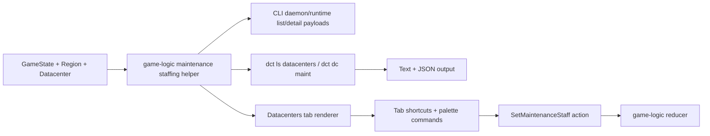

## Progress

- [ ] **Phase 1 — Canonicalize maintenance staffing data in game-logic**
  - [ ] 1.1 Add a shared game-logic helper/view for datacenter maintenance staffing state and effects
  - [ ] 1.2 Add regression tests and README docs for maintenance staffing surfacing
- [ ] **Phase 2 — Add one-shot CLI visibility and control commands**
  - [ ] 2.1 Extend CLI datacenter list/detail payloads with maintenance staffing metadata
  - [ ] 2.2 Show maintenance staffing summary in `dct ls datacenters`
  - [ ] 2.3 Add `dct dc maint` commands to inspect, increase, decrease, and set maintenance staff
  - [ ] 2.4 Add CLI regression coverage for text and `--json` maintenance flows
- [ ] **Phase 3 — Add TUI maintenance staffing visibility and controls**
  - [ ] 3.1 Surface maintenance staffing, wage cost, repair speed, and regional spare staff in the Datacenters tab
  - [ ] 3.2 Add TUI controls and palette affordances for increasing/decreasing selected datacenter maintenance staff
  - [ ] 3.3 Add TUI regression tests and update CLI docs/help text

## Overview

Investigation shows this is a **CLI feature gap**, not a missing simulation mechanic. `@datacenter-tycoon/game-logic` already supports `SetMaintenanceStaff`, clamps it against `MAX_MAINTENANCE_STAFF`, charges extra wage opex via region `staffWage`, and uses the current staffing level to accelerate repairs. The **web UI already exposes this lever** in `DatacenterView.tsx`, including current staff count, wage impact, repair speed, and disabled behavior when regional labor is exhausted.

By contrast, the CLI currently does not provide a first-class way to use or even understand this system. There is no `dc` subcommand that dispatches `SetMaintenanceStaff`, the TUI Datacenters tab does not show maintenance staffing or offer controls, and the one-shot command surfaces do not explain the hiring cost, repair-speed effect, or spare regional staff. `ls datacenters --json` incidentally includes the raw nested `datacenter.maintenanceStaff` field, but that is not discoverable enough for actual play and does not surface the mechanic’s consequences.

This plan adds a canonical maintenance-staffing view in game-logic, then uses it to expose clear one-shot commands and TUI controls so CLI players can inspect and adjust maintenance staffing with the same clarity that already exists in the web UI.

## Architecture



Key decisions:
- **Treat maintenance staffing as a datacenter concern.** The CLI command surface should live under `dct dc ...`, not under `racks`, because the action mutates `datacenter.maintenanceStaff` and consumes regional labor.
- **Do not duplicate wage / limit / repair-speed rules in CLI code.** The CLI should use a shared game-logic helper to derive current staff, spare regional labor, repair speed, and wage cost rather than recomputing those ad hoc in multiple renderers.
- **Expose both current state and next-action context.** Players need to know not just the current `maintenanceStaff`, but also what one more hire costs, whether more hires are allowed, and how staffing affects repair speed.
- **Keep one-shot and TUI surfaces consistent.** `dct ls datacenters`, `dct dc maint ...`, and the Datacenters tab should all speak the same vocabulary and numbers.
- **Respect existing CLI conventions.** New commands must support `--json`, maintain noun-first routing, and keep handlers thin by pushing the ruleful parts into game-logic helpers and small presenter utilities.

Illustrative shared view shape:

```ts
export interface DatacenterMaintenanceStaffingView {
  dcId: DatacenterId;
  currentStaff: number;
  maxStaff: number;
  canIncrease: boolean;
  canDecrease: boolean;
  availableRegionalStaff: number;
  staffWagePerHead: Money;
  extraWagesMonthly: Money;
  repairSpeedDaysPerTick: number;
  repairingRackCount: number;
  totalRackCount: number;
  averageRackAgeMonths: number;
}
```

Illustrative one-shot CLI usage after the change:

```bash
dct ls datacenters
dct dc maint dc-1
dct dc maint inc dc-1
dct dc maint dec dc-1
dct dc maint set dc-1 3
```

## Phase 1 — Canonicalize maintenance staffing data in game-logic

**Goal**: expose one shared, public description of maintenance staffing state/effects so CLI surfaces do not need to reassemble repair-speed, wage, and regional-labor rules themselves.

### Step 1.1 — Add a shared game-logic helper/view for datacenter maintenance staffing state and effects

- Files: `packages/game-logic/src/entities/datacenter.ts`, `packages/game-logic/src/entities/index.ts`, `packages/game-logic/src/index.ts`, optionally `packages/game-logic/src/types.ts` if the view type should live there
- Add a helper/view that combines existing maintenance summary data with staffing-specific economics and control affordances.
- The helper should derive at least:
  - current maintenance staff
  - max allowed maintenance staff
  - whether increase/decrease is currently allowed
  - spare regional staff available for another hire
  - wage cost per extra maintenance head and current monthly extra wages
  - current repair speed in days per tick
  - current repairing rack count / total rack count / average rack age
- Reuse existing game-logic helpers where possible (`datacenterMaintenanceSummary`, `repairProgressPerTick`, region staffing math) instead of rewriting formulas.
- Keep it pure and serializable-neutral; this is a derived view, not persisted state.
- Acceptance: CLI code can import one public helper from `@datacenter-tycoon/game-logic` to describe maintenance staffing without reimplementing the underlying rules.

### Step 1.2 — Add regression tests and README docs for maintenance staffing surfacing

- Files: `packages/game-logic/src/entities/capacity.test.ts` or `packages/game-logic/src/entities/datacenter.test.ts`, `packages/game-logic/README.md`
- Add focused tests covering:
  - current maintenance staff and repair speed at multiple staffing levels
  - spare regional staff and `canIncrease` behavior near the regional labor cap
  - wage cost derivation from `region.staffWage`
  - max-staff clamping semantics as exposed to consumers
- Update the README to document the new public helper and explain that maintenance staffing affects both repair speed and wage opex.
- Acceptance: `npm run test -w @datacenter-tycoon/game-logic` passes and the public README explains how clients can inspect maintenance staffing state.

## Phase 2 — Add one-shot CLI visibility and control commands

**Goal**: make maintenance staffing discoverable and operable from normal CLI commands, both for human players and JSON consumers.

### Step 2.1 — Extend CLI datacenter list/detail payloads with maintenance staffing metadata

- Files: `packages/cli/src/protocol/messages.ts`, `packages/cli/src/daemon/runtime.ts`, `packages/cli/src/daemon/runtime.test.ts`
- Extend `DatacenterListItem` (or add a sibling detail payload used by the new command) with a maintenance-staffing sub-view produced from the shared game-logic helper.
- Include enough fields for both text and JSON consumers to show:
  - current maintenance staff
  - spare regional staff
  - wage cost per head / total extra wages
  - repair speed
  - repairing rack count summary
- Keep raw numeric values in the protocol; format them in command renderers.
- Acceptance: CLI runtime queries expose explicit maintenance staffing metadata rather than relying on callers to inspect nested raw datacenter state.

### Step 2.2 — Show maintenance staffing summary in `dct ls datacenters`

- Files: `packages/cli/src/commands/ls.ts`, `packages/cli/src/commands/ls.test.ts`
- Update the human-readable datacenter list to include a short maintenance line per datacenter, for example:
  - `Maintenance: 2 staff | +$13,000/mo | Repair speed 45 days/tick | Spare regional staff 6`
- Ensure `--json` includes the structured maintenance view in a stable field rather than only exposing `datacenter.maintenanceStaff` deep inside the nested object.
- Keep output compact enough for multi-datacenter listing while still surfacing the mechanic clearly.
- Acceptance: a paused player can run `dct ls datacenters` and immediately see current maintenance staffing and its cost/effect for each datacenter.

### Step 2.3 — Add `dct dc maint` commands to inspect, increase, decrease, and set maintenance staff

- Files: `packages/cli/src/commands/dc.ts`, new helper module under `packages/cli/src/commands/` if needed, `packages/cli/src/cli.ts`, related tests
- Add a noun-first datacenter maintenance command surface such as:
  - `dct dc maint <dcId>` — show detailed staffing state/effects
  - `dct dc maint inc <dcId> [--by <n>]` — increase staffing
  - `dct dc maint dec <dcId> [--by <n>]` — decrease staffing
  - `dct dc maint set <dcId> <count>` — set an absolute staffing level
- Reuse the existing `SetMaintenanceStaff` game-logic action; CLI validation should stay minimal and defer rule enforcement to game-logic.
- After a successful mutation, print the updated maintenance staffing view instead of only a terse success string.
- Ensure `--json` returns machine-readable before/after or final-state data for automation.
- Acceptance: CLI players can inspect and adjust maintenance staffing without leaving the terminal or resorting to raw daemon internals.

### Step 2.4 — Add CLI regression coverage for text and `--json` maintenance flows

- Files: `packages/cli/src/commands/ls.test.ts`, new/updated tests under `packages/cli/src/commands/dc*.test.ts`, `packages/cli/src/daemon/runtime.test.ts`
- Add coverage for:
  - `ls datacenters` text output including maintenance summary
  - `ls datacenters --json` exposing the structured maintenance fields
  - `dc maint <dcId>` detail rendering
  - `dc maint inc/dec/set` dispatching the right actions and reflecting updated counts
  - regional-labor exhaustion or clamp behavior surfacing cleanly in CLI output
- Acceptance: `npm run test -w @datacenter-tycoon/cli` passes with dedicated maintenance staffing coverage.

## Phase 3 — Add TUI maintenance staffing visibility and controls

**Goal**: make the interactive terminal UI expose maintenance staffing as a first-class datacenter operation during play, not just in one-shot commands.

### Step 3.1 — Surface maintenance staffing, wage cost, repair speed, and regional spare staff in the Datacenters tab

- Files: `packages/cli/src/tui/tabs/datacenters.ts`, `packages/cli/src/tui/tabs/datacenters.test.ts`
- Expand the selected datacenter summary to include maintenance staffing information similar to the web header strip, including:
  - current maintenance staff
  - repairing rack count / total racks
  - repair speed in days per tick
  - extra wage cost
  - spare regional staff / inability to hire more
- Use the shared game-logic helper against the current snapshot instead of duplicating the formulas in the TUI.
- Acceptance: the selected datacenter view clearly communicates maintenance staffing and its impact without leaving the TUI.

### Step 3.2 — Add TUI controls and palette affordances for increasing/decreasing selected datacenter maintenance staff

- Files: `packages/cli/src/tui/app.ts`, `packages/cli/src/tui/palette.ts`, `packages/cli/src/tui/layout.ts` or tab help text if needed
- Add direct keybinds on the Datacenters tab for adjusting maintenance staffing on the selected datacenter (choose non-conflicting keys during implementation and document them).
- Add palette affordances so users can quickly autocomplete the new `dc maint ...` commands.
- Update on-screen help/status hints so maintenance controls are discoverable in the same place that rack move/add/remove shortcuts are shown.
- Acceptance: TUI users can change maintenance staffing from the Datacenters tab with keyboard controls and via the command palette.

### Step 3.3 — Add TUI regression tests and update CLI docs/help text

- Files: `packages/cli/src/tui/app.test.ts`, `packages/cli/src/tui/tabs/datacenters.test.ts`, `packages/cli/README.md`, `.agents/skills/play-cli-game/SKILL.md`
- Add TUI tests covering maintenance summary rendering and the new adjustment shortcuts.
- Update CLI README command examples, TUI keymap/help text, and the CLI-play skill documentation so maintenance staffing is discoverable to both humans and agents.
- Make sure docs explain:
  - where to inspect current maintenance staff
  - how extra maintenance staff affects repair speed and monthly cost
  - how to increase/decrease staffing in one-shot commands and in the TUI
- Acceptance: docs and tests consistently describe the new CLI maintenance staffing workflow.

## References

- `.agents/plans/015-rack-aging-failures-and-maintenance.md` — original maintenance staffing plan implemented reducer/economy/web UI but never added CLI parity
- `packages/game-logic/src/state/reduce.ts` — `SetMaintenanceStaff` already exists and is validated here
- `packages/game-logic/src/economy/opex.ts` — maintenance staffing already increases wage opex
- `packages/game-logic/src/sim/maintenance.ts` — repair speed already scales with maintenance staffing
- `packages/web/src/ui/dc-view/DatacenterView.tsx` — existing web implementation already shows the desired player-facing information and controls
- `packages/cli/src/commands/dc.ts` — current datacenter command router has no maintenance subcommands
- `packages/cli/src/tui/tabs/datacenters.ts` — current TUI datacenter view omits maintenance staffing entirely
- `packages/cli/README.md` — current CLI docs do not mention maintenance staffing commands or controls

## Changelog

- 2026-05-10 — Created after investigation showed the maintenance staffing mechanic is implemented in game-logic and surfaced in the web UI, but is effectively absent from CLI command and TUI play.
