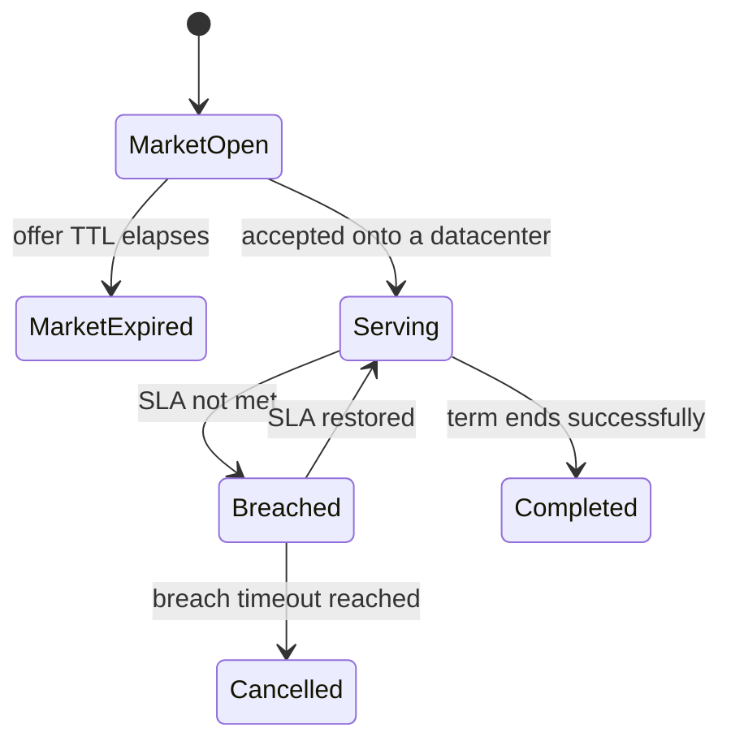

## Progress

- [x] **Phase 1 — Simplify the contract model in game-logic**
  - [x] 1.1 Introduce `ContractLifecycleState` and supporting metadata
  - [x] 1.2 Replace `contractMarket` + `activeContracts` with one canonical `contracts` collection
  - [x] 1.3 Bump save version, reject incompatible old saves, and update reusable fixtures
- [x] **Phase 2 — Rebuild contract transitions and simulation rules**
  - [x] 2.1 Preserve market-expired offers and refactor accept/serve/breach/complete transitions
  - [x] 2.2 Add breach streak tracking and auto-cancel after prolonged SLA failure
  - [x] 2.3 Rebuild capacity, revenue, and reliability logic on lifecycle selectors
- [x] **Phase 3 — Update CLI to use the new lifecycle model**
  - [x] 3.1 Expose lifecycle-aware contract buckets from daemon/protocol code
  - [x] 3.2 Update one-shot CLI commands and JSON output for all six states
  - [x] 3.3 Update TUI contracts/dashboard surfaces and CLI regression tests
- [x] **Phase 4 — Update web UI, docs, and cross-package regression coverage**
  - [x] 4.1 Replace web ad hoc filters with lifecycle-aware selectors
  - [x] 4.2 Update web contract pages and auxiliary UI for all six states
  - [x] 4.3 Add cross-workspace regression tests and update docs / older plans

## Overview

The current contract model is harder than it needs to be. One overloaded `status` field is trying to represent market state, live SLA state, and terminal outcome, while the actual data is also split across `contractMarket` and `activeContracts`. That is the root cause behind repeated confusion such as accepted history appearing “active”, successful completions being labeled `expired`, and market-expired offers disappearing entirely.

This plan simplifies the model around one idea: a contract should have **one authoritative lifecycle state** chosen from the six mutually exclusive player-facing states:
1. open on market,
2. expired from market without acceptance,
3. accepted and being served,
4. accepted and currently breached,
5. cancelled,
6. completed successfully.

The refactor starts in `@datacenter-tycoon/game-logic`, then updates CLI and web to consume shared lifecycle selectors instead of guessing meaning from legacy arrays or status strings.

## Architecture



Key decisions:
- **Use one lifecycle enum, not multiple coordinated state variables.** The six requested states are mutually exclusive, so a single enum is the clearest model.
- **Use one canonical `contracts` collection.** Market, live, and history buckets should be derived from one source of truth.
- **Keep extra facts as metadata, not extra state enums.** Things like `assignedDcId`, `acceptedAtTick`, `closedAtTick`, and `breachStreakMonths` are supporting fields.
- **Rename successful term-end to `completed`.** `expired` should no longer mean “finished successfully”.
- **Retain market-expired offers in history.** They should stop affecting gameplay, but they should not disappear from state.

Illustrative shape:

```ts
export type ContractLifecycleState =
  | "market_open"
  | "market_expired"
  | "serving"
  | "breached"
  | "cancelled"
  | "completed";

export interface Contract {
  id: ContractId;
  name: string;
  requirements: Capacity;
  monthlyPayment: Money;
  penaltyPerMonth: Money;
  termMonths: number;
  lifecycleState: ContractLifecycleState;
  assignedDcId?: DatacenterId;
  acceptedAtTick?: Tick;
  closedAtTick?: Tick;
  breachStreakMonths?: number;
}
```

Shared helpers should derive buckets and live semantics:

```ts
export function isLiveContract(contract: Contract): boolean {
  return (
    contract.lifecycleState === "serving" ||
    contract.lifecycleState === "breached"
  );
}

export function isHistoricalContract(contract: Contract): boolean {
  return (
    contract.lifecycleState === "market_expired" ||
    contract.lifecycleState === "cancelled" ||
    contract.lifecycleState === "completed"
  );
}
```

## Phase 1 — Simplify the contract model in game-logic

**Goal**: replace the current ambiguous contract state model with one clear enum and one canonical storage shape.

### Step 1.1 — Introduce `ContractLifecycleState` and supporting metadata

- Files: `packages/game-logic/src/types.ts`, `packages/game-logic/src/contracts/index.ts`, `packages/game-logic/src/index.ts`, `packages/game-logic/README.md`
- Replace the current overloaded `Contract.status` union with a single `ContractLifecycleState` union / enum:
  - `market_open`
  - `market_expired`
  - `serving`
  - `breached`
  - `cancelled`
  - `completed`
- Add only the metadata needed to explain and drive transitions:
  - `assignedDcId`
  - `acceptedAtTick`
  - `closedAtTick`
  - `breachStreakMonths`
- Document basic invariants, for example:
  - only `market_open` contracts can be accepted
  - only `serving` and `breached` contracts are live
  - only terminal contracts have `closedAtTick`
- Acceptance: `Contract` can represent the six requested states with one authoritative enum, and public docs/types no longer describe the old overloaded status model as the future direction.

### Step 1.2 — Replace `contractMarket` + `activeContracts` with one canonical `contracts` collection

- Files: `packages/game-logic/src/types.ts`, `packages/game-logic/src/state/newGame.ts`, `packages/game-logic/src/state/reduce.ts`, `packages/game-logic/src/contracts/market.ts`, `packages/game-logic/src/contracts/index.ts`
- Replace the split authoritative storage model with one canonical `contracts` collection on `GameState`.
- Treat all buckets as derived selectors over that collection, for example:
  - `selectOpenMarketContracts()`
  - `selectLiveContracts()`
  - `selectHistoricalContracts()`
  - `selectCompletedContracts()`
  - `selectCancelledContracts()`
  - `selectMarketExpiredContracts()`
- Remove assumptions that `activeContracts` means either “live” or “accepted history”.
- Acceptance: every contract lives in exactly one canonical collection, and market/live/history groupings are derived from selectors rather than storage shape.

### Step 1.3 — Bump save version, reject incompatible old saves, and update reusable fixtures

- Files: `packages/game-logic/src/save/serialize.ts`, `packages/game-logic/src/save/serialize.test.ts`, contract fixture helpers under `packages/game-logic/src/contracts/`
- Bump the save version and reject older saves instead of migrating them.
- Document that incompatible saves must be recreated.
- Add reusable fixtures/builders for all six states.
- Acceptance: current saves load into the new model, old saves fail clearly, and later tests can build each lifecycle state from shared fixtures.

## Phase 2 — Rebuild contract transitions and simulation rules

**Goal**: make all game-logic transitions read naturally in terms of the new enum and ensure simulation rules only act on the right states.

### Step 2.1 — Preserve market-expired offers and refactor accept/serve/breach/complete transitions

- Files: `packages/game-logic/src/contracts/market.ts`, `packages/game-logic/src/contracts/lifecycle.ts`, `packages/game-logic/src/sim/tick.ts`, `packages/game-logic/src/contracts/contracts.test.ts`, `packages/game-logic/src/sim/tick.test.ts`
- Change market refresh so old offers move from `market_open` to `market_expired` instead of being deleted.
- Refactor acceptance so a contract moves from `market_open` to `serving` within the same canonical collection.
- Refactor tick/lifecycle logic so live contracts move between:
  - `serving`
  - `breached`
  - `completed`
- Preserve `assignedDcId` and timing metadata through completion.
- Acceptance: all core transitions are expressed in terms of the new enum, and market-expired offers remain in history instead of vanishing.

### Step 2.2 — Add breach streak tracking and auto-cancel after prolonged SLA failure

- Files: `packages/game-logic/src/contracts/lifecycle.ts`, `packages/game-logic/src/sim/tick.ts`, `packages/game-logic/src/economy/opex.ts`, `packages/game-logic/src/contracts/reliability.ts`, related tests
- Add `breachStreakMonths` tracking for live accepted contracts.
- Define one deterministic cancellation rule for prolonged breach:
  - where the threshold constant lives
  - when the check runs during the monthly tick
  - what cash/reliability consequences apply in the cancellation month
- Reset the breach streak when service recovers.
- Decide whether any player-issued cancellation still exists; if so, it should still end in `cancelled` and use metadata only if the distinction matters.
- Acceptance: a contract that stays breached too long automatically transitions to `cancelled`, and tests lock the threshold and side effects.

### Step 2.3 — Rebuild capacity, revenue, and reliability logic on lifecycle selectors

- Files: `packages/game-logic/src/entities/datacenter.ts`, `packages/game-logic/src/economy/opex.ts`, `packages/game-logic/src/contracts/reliability.ts`, related tests
- Replace open-coded checks like `status === "active" || status === "breached"` with lifecycle selectors/helpers.
- Ensure only `serving` and `breached` contracts:
  - commit capacity
  - affect assigned demand / power billing
  - receive monthly revenue or penalties
- Ensure `market_expired`, `cancelled`, and `completed` contracts remain visible in history but do not affect current simulation.
- Acceptance: there is one canonical definition of “live contract” across capacity, economy, and reliability code.

## Phase 3 — Update CLI to use the new lifecycle model

**Goal**: make the CLI present the six states directly instead of inferring them from legacy arrays or overloaded status names.

### Step 3.1 — Expose lifecycle-aware contract buckets from daemon/protocol code

- Files: `packages/cli/src/protocol/messages.ts`, `packages/cli/src/daemon/runtime.ts`, `packages/cli/src/daemon/runtime.test.ts`
- Replace protocol/runtime assumptions built around `contractMarket` and `activeContracts`.
- Return explicit lifecycle-aware buckets and/or counts for:
  - market open
  - live serving
  - live breached
  - completed
  - cancelled
  - market expired
- Keep contract details queryable by ID across every lifecycle state.
- Acceptance: daemon/runtime responses expose explicit buckets from the unified game-logic model.

### Step 3.2 — Update one-shot CLI commands and JSON output for all six states

- Files: `packages/cli/src/commands/contracts-view.ts`, `packages/cli/src/commands/contracts.ts`, `packages/cli/src/commands/ls.ts`, `packages/cli/src/commands/status.ts`, related tests
- Redesign `dct ls contracts`, `dct contract details`, and any contract counts around the six lifecycle states.
- Ensure text and `--json` clearly distinguish:
  - market-open offers
  - market-expired offers
  - serving contracts
  - breached contracts
  - cancelled contracts
  - completed contracts
- Remove the old ambiguous use of `expired` for successful accepted contracts.
- Acceptance: CLI output shows all six states clearly and uses lifecycle-aware counts everywhere.

### Step 3.3 — Update TUI contracts/dashboard surfaces and CLI regression tests

- Files: `packages/cli/src/tui/tabs/contracts.ts`, `packages/cli/src/tui/tabs/dashboard.ts`, `packages/cli/src/tui/tabs/contracts.test.ts`, `packages/cli/src/tui/tabs/dashboard.test.ts`, related command tests
- Update the TUI contracts tab to split Market / Live / History using lifecycle selectors.
- Show `breached` contracts separately from healthy `serving` contracts in live views.
- Update dashboard KPIs / alerts so only live contracts count as active.
- Add CLI regression coverage for the six states and the key lifecycle transitions visible in CLI output.
- Acceptance: TUI and one-shot CLI agree on lifecycle semantics and no longer mix live and historical contracts.

## Phase 4 — Update web UI, docs, and cross-package regression coverage

**Goal**: finish the refactor by moving the web UI onto the same lifecycle model and locking the behavior down with tests and docs.

### Step 4.1 — Replace web ad hoc filters with lifecycle-aware selectors

- Files: `packages/web/src/store/selectors.ts`, `packages/web/src/store/selectors.test.ts`
- Replace filters that currently inspect legacy `status` values or `activeContracts` arrays directly.
- Add selectors for:
  - market-open offers
  - live serving contracts
  - live breached contracts
  - completed contracts
  - cancelled contracts
  - market-expired contracts
- Reuse game-logic lifecycle helpers where practical so the web layer stays thin.
- Acceptance: web selectors expose clean lifecycle-aware buckets and hide the storage details from components.

### Step 4.2 — Update web contract pages and auxiliary UI for all six states

- Files: `packages/web/src/ui/contracts/ContractsPage.tsx`, `packages/web/src/ui/contracts/MarketList.tsx`, `packages/web/src/ui/contracts/ActiveList.tsx`, `packages/web/src/ui/contracts/CompletedList.tsx`, `packages/web/src/store/audioEvents.ts`, related tests
- Update the contracts page to render the six states clearly, likely grouped as:
  - Market
  - Live (Serving / Breached)
  - History (Completed / Cancelled / Market Expired)
- Replace remaining uses of accepted `expired` with `completed`.
- Update audio/event classification and any top-level counts or warnings so they depend only on the new lifecycle selectors.
- Acceptance: the web app presents the same lifecycle vocabulary and buckets as game-logic and CLI.

### Step 4.3 — Add cross-workspace regression tests and update docs / older plans

- Files: `packages/game-logic/src/contracts/*.test.ts`, `packages/game-logic/src/integration.test.ts`, `packages/cli/src/**/*.test.ts`, `packages/web/src/**/*.test.ts`, `packages/game-logic/README.md`, `packages/cli/README.md`, `.agents/skills/play-cli-game/SKILL.md`, relevant older plans under `.agents/plans/`
- Add explicit regression coverage for all six states and these edges:
  - `market_open` → `market_expired`
  - `market_open` → `serving`
  - `serving` ↔ `breached`
  - `breached` → `cancelled`
  - `serving` → `completed`
- Update docs/help text to explain the new lifecycle vocabulary.
- Add a note to older contract-related plans that this refactor supersedes earlier assumptions around `activeContracts` and accepted `expired`.
- Acceptance: tests, docs, and plan history all align with the simplified single-enum lifecycle model.

## References

- `packages/game-logic/src/types.ts` — current `ContractStatus` and `GameState` split
- `packages/game-logic/src/contracts/market.ts` — current market retention and acceptance logic
- `packages/game-logic/src/contracts/lifecycle.ts` — current live contract transition logic
- `packages/game-logic/src/sim/tick.ts` — current monthly orchestration and term finalization
- `packages/game-logic/src/economy/opex.ts` — current revenue / penalty handling
- `packages/game-logic/src/contracts/reliability.ts` — current reliability outcome handling
- `packages/game-logic/src/save/serialize.ts` — save versioning and migration
- `packages/cli/src/commands/contracts-view.ts` — current CLI bucket/presenter logic
- `packages/web/src/store/selectors.ts` — current web contract filtering logic
- `packages/web/src/ui/contracts/ContractsPage.tsx` — current web Market / Active / History structure
- `.agents/plans/027-cli-playtest-contract-layout-and-status-fixes.md`
- `.agents/plans/028-cli-live-vs-historical-contract-reporting.md`

## Changelog

- 2026-05-10 — Created to redesign contract lifecycle state around six explicit user-facing states and thread the new model through game-logic, CLI, save migration, and web UI.
- 2026-05-10 — Simplified the plan to use one authoritative `ContractLifecycleState` enum, one canonical `contracts` collection, and a smaller set of clearer phases/steps.
- 2026-05-10 — Implemented the lifecycle refactor, canonical `contracts` storage, lifecycle selectors, market-expired retention, breach streak cancellation, and cross-workspace fixture updates. Per user direction, old save migration was dropped; incompatible saves are rejected and can be recreated.
