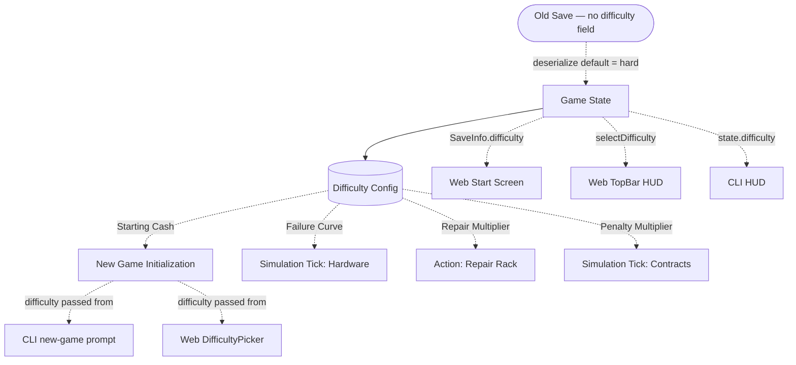

## Progress

- [ ] **Phase 1 — Types & Configuration**
  - [ ] 1.1 Add `Difficulty` type to root game state
  - [ ] 1.2 Create difficulty configuration constants and modifier curves
- [ ] **Phase 2 — Game Logic Implementation**
  - [ ] 2.1 Update new game initialization to use difficulty-based starting cash
  - [ ] 2.2 Update rack failure logic to use the new age-based frequency curves
  - [ ] 2.3 Apply difficulty multipliers to rack repair times
  - [ ] 2.4 Apply difficulty multipliers to contract breach penalties
  - [ ] 2.5 Update tests to cover both difficulty modes
- [ ] **Phase 3 — CLI Interface Updates**
  - [ ] 3.1 Update CLI `new-game` command to prompt for difficulty
  - [ ] 3.2 Display current difficulty in CLI HUD/status
- [ ] **Phase 4 — Web Interface Updates**
  - [ ] 4.1 Add a `DifficultyPicker` component for selecting difficulty during new game
  - [ ] 4.2 Wire difficulty selection into `App.tsx` new-game flow and `createFreshSession`
  - [ ] 4.3 Add difficulty to `SaveInfo` index and update `updateSaveIndex` in `persist.ts`
  - [ ] 4.4 Display difficulty badge in the saved-game summary on `StartScreen`
  - [ ] 4.5 Display current difficulty badge in the `TopBar` HUD
  - [ ] 4.6 Treat legacy saves (missing `difficulty` field) as `"hard"` in migration

## Overview

We are introducing 'easy' and 'hard' difficulty modes to Datacenter Tycoon to provide players with a more forgiving entry point. 'Hard' mode represents the current game configurations. 'Easy' mode offers a larger starting budget ($5M vs $2.5M), faster rack repairs, smaller contract breach penalties, and a halved hardware failure rate curve across rack lifespans.

Old save files that do not contain a `difficulty` field are silently migrated to `"hard"` on load — no user prompt or explicit migration step is required.

## Architecture



Key decisions:
- Store a `"difficulty": "easy" | "hard"` flag in the top-level serialized state.
- Create a constant configuration map that exports the exact numerical multipliers and curves for each difficulty setting, keeping the simulation code clean and avoiding inline ternary branches wherever possible.
- The failure rate curves will map age-in-years to failure probability percentages. Easy: `[0, 1, 2, 4, 8, 16]`. Hard: `[0, 2, 4, 8, 16, 32]`.

```ts
// Illustrative code for configuration
export const DIFFICULTY_CONFIG = {
  easy: {
    startingCash: 5_000_000,
    repairTimeMultiplier: 0.5,
    breachPenaltyMultiplier: 0.5,
    failureCurvePct: [0, 1, 2, 4, 8, 16] // indexed by year
  },
  hard: {
    startingCash: 2_500_000,
    repairTimeMultiplier: 1.0,
    breachPenaltyMultiplier: 1.0,
    failureCurvePct: [0, 2, 4, 8, 16, 32]
  }
};
```

## Phase 1 — Types & Configuration

**Goal**: Define the basic types and extract the hardcoded values into a centralized difficulty configuration.

### Step 1.1 — Add `Difficulty` type to root game state

- File: `packages/game-logic/src/types.ts` (or equivalent core state type file)
- Add `export type Difficulty = 'easy' | 'hard';`.
- Add `difficulty` property to the root `GameState` interface.
- Acceptance: `npm run typecheck` passes.

### Step 1.2 — Create difficulty configuration constants and modifier curves

- File: `packages/game-logic/src/constants/difficulty.ts` (or equivalent config file)
- Implement and export the `DIFFICULTY_CONFIG` object mapping `easy` and `hard` to their respective starting cash, repair time multiplier, breach penalty multiplier, and failure curves.
- Acceptance: Constants are available for import.

## Phase 2 — Game Logic Implementation

**Goal**: Plumb the new settings into the core simulation rules.

### Step 2.1 — Update new game initialization to use difficulty-based starting cash

- File: `packages/game-logic/src/game.ts` (or where initial state is built)
- Update game creation functions to accept an optional `difficulty` argument (defaulting to 'hard' for backward compatibility or prompting appropriately).
- Set starting cash by reading `DIFFICULTY_CONFIG[difficulty].startingCash`.
- Acceptance: A new "easy" game starts with 5M; "hard" starts with 2.5M.

### Step 2.2 — Update rack failure logic to use the new age-based frequency curves

- File: `packages/game-logic/src/simulation/hardware.ts` (or relevant tick handler)
- Replace any existing static hardware failure chance with a lookup: determine the rack's age in years, and fetch the corresponding percentage from `DIFFICULTY_CONFIG[state.difficulty].failureCurvePct`.
- If a rack is older than the max index (6+ years), cap it at the highest configured array value.
- Acceptance: Racks fail at a visibly lower rate on easy mode.

### Step 2.3 — Apply difficulty multipliers to rack repair times

- File: `packages/game-logic/src/actions/rack.ts` (or equivalent repair handler)
- When calculating the duration/ticks required for a rack repair, multiply the base repair time by `DIFFICULTY_CONFIG[state.difficulty].repairTimeMultiplier`.
- Acceptance: Repair times calculate correctly based on difficulty.

### Step 2.4 — Apply difficulty multipliers to contract breach penalties

- File: `packages/game-logic/src/simulation/contracts.ts`
- Multiply the base breach penalty by `DIFFICULTY_CONFIG[state.difficulty].breachPenaltyMultiplier`.
- Acceptance: Breach penalties are smaller in easy mode.

### Step 2.5 — Update tests to cover both difficulty modes

- File: `packages/game-logic/src/**/*.test.ts`
- Add unit tests validating that game creation handles both difficulty settings and sets initial cash correctly.
- Add tests to ensure failure percentages lookup and contract penalties scale correctly according to the chosen difficulty.
- Acceptance: `npm run test` passes locally for `game-logic`.

## Phase 3 — CLI Interface Updates

**Goal**: Expose difficulty selection and display it to the player in the CLI.

### Step 3.1 — Update CLI `new-game` command to prompt for difficulty

- File: `packages/cli/src/commands/new-game.ts` (or equivalent)
- Prompt the user to select "Easy" or "Hard" mode when initiating a new game interactively, or accept a `--difficulty` flag.
- Pass the selected difficulty to the game creation logic.
- Acceptance: Player can successfully choose easy or hard during CLI game creation.

### Step 3.2 — Display current difficulty in CLI HUD/status

- File: `packages/cli/src/ui/hud.ts` (or equivalent)
- Add the current game difficulty (e.g., "[Mode: Easy]") to the persistent UI header or status command.
- Acceptance: Difficulty is visible while playing the CLI version.

## Phase 4 — Web Interface Updates

**Goal**: Expose difficulty selection in the web frontend new-game flow, display difficulty on saved-game cards, and show it in the in-game HUD.

### Step 4.1 — Add a `DifficultyPicker` component

- File: `packages/web/src/ui/start/DifficultyPicker.tsx` (new file)
- Render two selectable cards — "Easy" and "Hard" — each showing the key differences for that mode (starting cash, repair speed, penalty size, failure rate).
- Expose a `value: Difficulty` prop and an `onChange` callback.
- Acceptance: Component renders and allows toggling between the two modes.

### Step 4.2 — Wire difficulty selection into App.tsx new-game flow

- Files: `packages/web/src/ui/start/StartScreen.tsx`, `packages/web/src/App.tsx`, `packages/web/src/store/persist.ts`
- On the `StartScreen`, when the user clicks **New Game** (or **Play** for first-timers), show the `DifficultyPicker` before starting the session (either as an inline step or a modal).
- Pass the chosen `Difficulty` to `createFreshSession` (update its signature to accept an optional `difficulty` argument) and forward it to `newGame(seed, difficulty)`.
- Acceptance: Selecting easy or hard and confirming creates a game with the correct difficulty in state.

### Step 4.3 — Add difficulty to `SaveInfo` and `updateSaveIndex`

- File: `packages/web/src/store/persist.ts`
- Add an optional `difficulty?: Difficulty` field to the `SaveInfo` interface.
- In `updateSaveIndex`, copy `state.difficulty` into the `SaveInfo` entry so the start screen can read it without deserialising the full save.
- Acceptance: After an autosave the difficulty field is present in the index entry.

### Step 4.4 — Display difficulty badge in the saved-game summary on StartScreen

- File: `packages/web/src/ui/start/StartScreen.tsx`
- In the `saveSummary` meta-grid, add a "Difficulty" item reading from `latestSave.difficulty` (defaulting to `"hard"` when absent, for backward-compat with legacy saves).
- Style the badge distinctly per mode (e.g. amber for hard, green for easy).
- Acceptance: Loading the start screen shows the correct difficulty for the latest save.

### Step 4.5 — Display current difficulty badge in the TopBar HUD

- File: `packages/web/src/ui/topbar/TopBar.tsx`
- Add a `selectDifficulty` selector in `packages/web/src/store/selectors.ts` that reads `state.difficulty`.
- Render a compact HUD block labelled `MODE` with values `EASY` / `HARD` in the appropriate colour, placed alongside the existing financial blocks.
- Acceptance: Difficulty is visible in the top bar while playing.

### Step 4.6 — Legacy save migration: default missing difficulty to "hard"

- File: `packages/game-logic/src/serialization.ts` (or wherever `deserialize` lives)
- After deserialising the JSON, if `difficulty` is missing or undefined, set it to `"hard"` before returning the state.
- No migration prompt is needed; old saves are silently upgraded to hard difficulty.
- Acceptance: Loading an old save does not throw; the game runs with `state.difficulty === "hard"`.

## References

- [AGENTS.md](../AGENTS.md)

## Changelog

- 2026-05-10 — created.
- 2026-05-10 — added Phase 4 (web UI steps: DifficultyPicker, SaveInfo difficulty badge, TopBar HUD badge, legacy save migration to hard).
