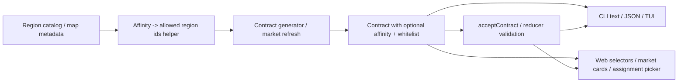
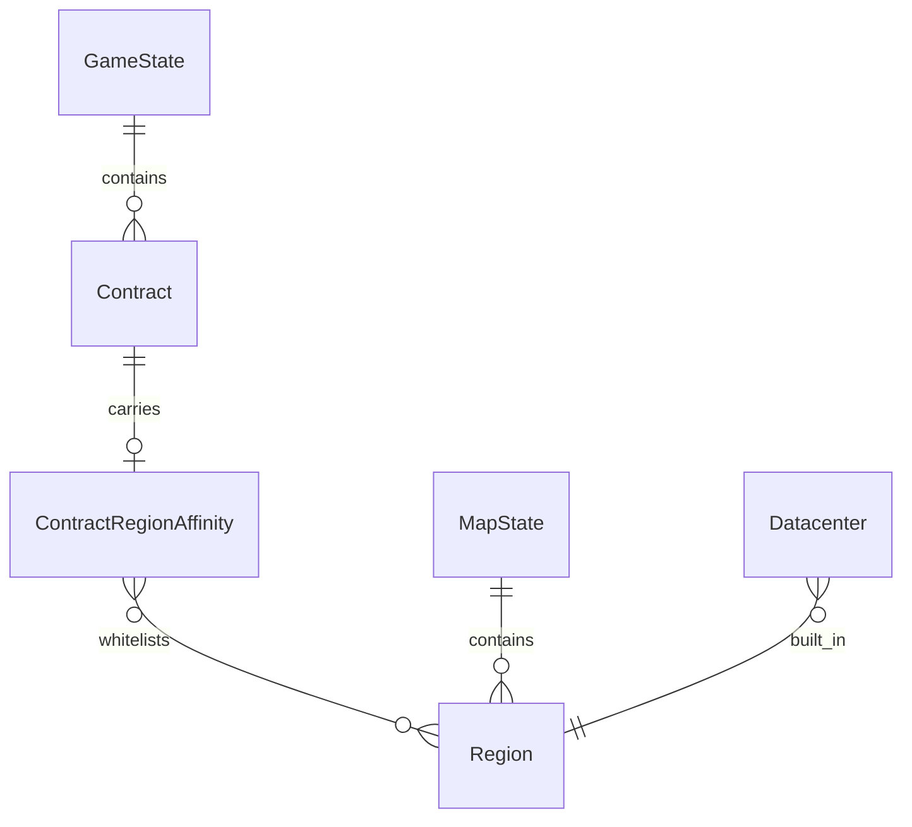

## Progress

- [x] **Phase 1 — Region-affinity domain model and persistence**
  - [x] 1.1 Add contract region-affinity vocabulary and persisted whitelist fields to game-logic types
  - [x] 1.2 Add region grouping helpers so EU, Asia, and USA affinity sets resolve from the map/catalog
  - [x] 1.3 Update save/versioned public surfaces and package docs for the new contract shape
- [x] **Phase 2 — Affinity-aware contract generation and acceptance**
  - [x] 2.1 Add deterministic generation rules so some offers are EU-, Asia-, or USA-affine while others remain unrestricted
  - [x] 2.2 Persist and expose the allowed-region whitelist on generated contracts
  - [x] 2.3 Reject contract acceptance onto datacenters outside the contract’s allowed regions with a stable error shape
- [x] **Phase 3 — CLI contract reporting and guardrails**
  - [x] 3.1 Extend CLI/protocol contract views and JSON output with affinity labels and allowed regions
  - [x] 3.2 Update one-shot contract list/details/accept flows to explain region affinity and region-mismatch failures
  - [x] 3.3 Update TUI contract surfaces and CLI regression tests for affinity-aware presentation
- [x] **Phase 4 — Web contract UX and assignment flow**
  - [x] 4.1 Add selectors that summarize contract affinity and eligible datacenters from game-logic state
  - [x] 4.2 Surface affinity badges and region-whitelist copy in market, active, and historical contract views
  - [x] 4.3 Update accept/assignment UI so only region-eligible datacenters are presented as valid targets
- [ ] **Phase 5 — Regression coverage and follow-on docs**
  - [x] 5.1 Add game-logic tests for unrestricted vs affine generation, save round-trips, and invalid-region acceptance
  - [ ] 5.2 Add CLI and web tests for affinity rendering, JSON payloads, and region-mismatch messaging
  - [ ] 5.3 Update plan/docs indexes and contributor guidance for future contract-market work

## Overview

Contracts currently care about capacity, urgency, and term mix, but not geography. This plan adds an optional region-affinity layer so some offers can only run in approved regions, while other offers remain globally deployable.

The motivating cases are region-constrained workloads like GDPR-sensitive EU work, Asia-specific demand, and USA-only AI training jobs. The implementation should keep game-logic deterministic and serializable by storing explicit allowed-region whitelists on contracts, then make those constraints visible and enforceable in both the CLI and web frontends.

## Architecture





Key decisions:
- **Store both a human-meaningful affinity key and an explicit whitelist on the contract.** A key like `eu`, `asia`, or `usa` makes UI copy easy, while persisted `allowedRegionIds` keeps historical offers deterministic even if catalog metadata changes later.
- **Unrestricted contracts should omit affinity data instead of writing empty placeholders.** That preserves the current “deploy anywhere” behavior without adding noisy optional fields to saves.
- **Region grouping should be centralized near the region catalog/map layer.** Contract generation and UI code should ask for the resolved allowed-region set instead of duplicating hard-coded lists of EU, Asia, or USA regions.
- **Acceptance must validate region eligibility in game-logic, not only in UI.** CLI, web, and future clients all need the same authoritative guardrail when a datacenter is in the wrong region.

Illustrative shape:

```ts
export type ContractRegionAffinityKey = "eu" | "asia" | "usa";

export interface ContractRegionAffinity {
  key: ContractRegionAffinityKey;
  allowedRegionIds: RegionId[];
}

export interface Contract {
  // existing fields...
  regionAffinity?: ContractRegionAffinity;
}
```

## Phase 1 — Region-affinity domain model and persistence

**Goal**: introduce a durable representation for contract region constraints without changing offer behavior yet.

### Step 1.1 — Add contract region-affinity types

- Files: `packages/game-logic/src/types.ts`, `packages/game-logic/src/contracts/index.ts`, `packages/game-logic/src/index.ts`
- Add the affinity vocabulary and optional contract field used to describe region-restricted offers.
- Keep the persisted shape plain-object only and avoid writing explicit `undefined` or empty whitelist fields for unrestricted contracts.
- Acceptance: `npm run typecheck -w @datacenter-tycoon/game-logic` passes and the public package surface exposes the new contract-affinity types.

### Step 1.2 — Add region grouping helpers

- Files: `packages/game-logic/src/catalog/regions.ts`, `packages/game-logic/src/entities/region.ts`, related tests
- Define how regions are classified for contract-affinity purposes so EU, Asia, and USA groupings come from one canonical place.
- Add pure helpers that resolve the allowed-region whitelist for each affinity key from the current map/catalog.
- Acceptance: unit tests prove EU-only, Asia-only, USA-only, and unrestricted cases resolve the expected region ids.

### Step 1.3 — Update save/versioned public surfaces

- Files: `packages/game-logic/src/save/serialize.ts`, `packages/game-logic/README.md`
- Version the contract-shape change and document how old saves are handled.
- Ensure saved contracts round-trip with and without affinity data.
- Acceptance: save tests and README/public API docs cover the new optional contract field.

## Phase 2 — Affinity-aware contract generation and acceptance

**Goal**: make contract geography part of the market and enforce it during assignment.

### Step 2.1 — Add deterministic affinity generation policy

- Files: `packages/game-logic/src/contracts/generator.ts`, `packages/game-logic/src/contracts/market.ts`, balance/constants files if needed
- Decide what share of generated contracts remain unrestricted versus receiving EU, Asia, or USA affinity.
- Bias the affinity choice toward fitting workload themes where it makes sense, such as EU compliance work, Asia demand bursts, and USA AI training jobs.
- Keep all randomness on the seeded RNG path so the same seed/action history still yields the same market.
- Acceptance: seeded generator tests show a stable mix of unrestricted and affine contracts.

### Step 2.2 — Persist and expose region whitelists on offers

- Files: `packages/game-logic/src/contracts/generator.ts`, `packages/game-logic/src/contracts/lifecycle.ts`, selector/helper tests
- Attach the resolved whitelist and affinity label when contracts are created/refreshed, while leaving unrestricted contracts unchanged.
- Preserve the whitelist through acceptance, live service, and historical states so reporting stays consistent.
- Acceptance: market refresh and lifecycle tests prove affinity metadata survives every contract transition.

### Step 2.3 — Enforce affinity in acceptance flow

- Files: `packages/game-logic/src/contracts/market.ts`, `packages/game-logic/src/state/reduce.ts`, related tests
- Reject acceptance when the chosen datacenter’s `regionId` is not in the contract whitelist.
- Return a stable failure shape/code that includes at least the datacenter region, affinity key, and allowed regions so CLI/web can render a useful message.
- Preserve existing unrestricted-contract behavior and existing capacity checks for contracts that are region-eligible.
- Acceptance: reducer/market tests cover unrestricted success, valid affine acceptance, and wrong-region rejection.

## Phase 3 — CLI contract reporting and guardrails

**Goal**: make region affinity visible and scriptable in every CLI contract surface.

### Step 3.1 — Extend CLI/presenter/protocol shapes

- Files: `packages/cli/src/protocol/messages.ts`, `packages/cli/src/commands/contracts-view.ts`, `packages/cli/src/commands/common.ts` if needed
- Add affinity label and allowed-region fields to the shared CLI-facing contract views and machine-readable envelopes.
- Keep JSON output stable and explicit so automation can tell unrestricted contracts from region-restricted ones.
- Acceptance: `dct ls contracts --json` and `dct contract details --json` include affinity information when present and omit it cleanly otherwise.

### Step 3.2 — Update one-shot command messaging and errors

- Files: `packages/cli/src/commands/contracts.ts`, `packages/cli/src/commands/ls.ts`, command tests
- Show affinity summaries in list/details text output, including the whitelist of allowed regions or a clear “any region” label.
- Surface wrong-region acceptance failures as concise text errors and structured JSON errors without relying on string parsing.
- Acceptance: CLI tests prove region-mismatch failures are actionable in both text and `--json` mode.

### Step 3.3 — Update TUI contract surfaces

- Files: `packages/cli/src/tui/tabs/contracts.ts`, related TUI tests
- Add affinity indicators to the contracts tab so region-limited offers are recognizable at a glance.
- Update any TUI help/action copy that currently implies every market contract can be assigned to any datacenter.
- Acceptance: TUI renderer tests cover unrestricted and affine market entries.

## Phase 4 — Web contract UX and assignment flow

**Goal**: show contract geography clearly in the browser and prevent invalid assignment choices.

### Step 4.1 — Add affinity-aware selectors

- Files: `packages/web/src/store/selectors.ts`, `packages/web/src/store/selectors.test.ts`
- Create selectors/helpers that summarize each contract’s affinity label, whitelist, and eligible datacenters.
- Keep all rule decisions sourced from `@datacenter-tycoon/game-logic` data instead of re-deriving affinity groups in the web package.
- Acceptance: selector tests cover unrestricted contracts, region-limited contracts, and mixed datacenter fleets.

### Step 4.2 — Surface affinity in contract UI

- Files: `packages/web/src/ui/contracts/MarketList.tsx`, `packages/web/src/ui/contracts/ActiveList.tsx`, `packages/web/src/ui/contracts/CompletedList.tsx`, related styles/tests
- Add affinity badges/copy to market and historical cards so players can tell whether work is EU-only, Asia-only, USA-only, or unrestricted.
- Display the allowed region list in a readable way without overwhelming the card layout.
- Acceptance: component tests verify the new affinity labels appear and remain responsive on smaller layouts.

### Step 4.3 — Restrict assignment UI to eligible datacenters

- Files: `packages/web/src/ui/contracts/MarketList.tsx`, related helpers/tests
- Update the accept flow so only datacenters in allowed regions are enabled for selection, with clear messaging for region mismatches.
- Ensure unrestricted contracts still show all datacenters and preserve the current click-to-accept interaction pattern.
- Acceptance: web interaction tests prove wrong-region datacenters are blocked and valid datacenters remain selectable.

## Phase 5 — Regression coverage and follow-on docs

**Goal**: lock in the new contract geography model across persistence, clients, and contributor guidance.

### Step 5.1 — Add game-logic regression coverage

- Files: `packages/game-logic/src/contracts/*.test.ts`, `packages/game-logic/src/state/reduce.test.ts`, `packages/game-logic/src/save/serialize.test.ts`
- Cover unrestricted contracts, each supported affinity family, deterministic whitelist resolution, and acceptance rejection for non-whitelisted regions.
- Acceptance: `npm run test -w @datacenter-tycoon/game-logic` passes.

### Step 5.2 — Add CLI and web regression coverage

- Files: `packages/cli/src/commands/*.test.ts`, `packages/cli/src/tui/tabs/*.test.ts`, `packages/web/src/ui/contracts/*.test.tsx`
- Verify affinity labels, allowed-region lists, and wrong-region error/reporting paths in both clients.
- Acceptance: `npm run test -w @datacenter-tycoon/cli` and `npm run test -w @datacenter-tycoon/web` pass with affinity-specific assertions.

### Step 5.3 — Update docs and plan references

- Files: `.agents/plans/README.md`, `packages/cli/AGENTS.md` and/or `packages/web/AGENTS.md` if guidance needs a note, related plan references
- Add this plan to the plan index and document that future contract-market work should account for region affinity when changing acceptance or presentation flows.
- Acceptance: the new plan is indexed and future contributors can find the affinity constraints quickly.

## References

- [Root AGENTS.md](../../AGENTS.md)
- [game-logic AGENTS.md](../../packages/game-logic/AGENTS.md)
- [cli AGENTS.md](../../packages/cli/AGENTS.md)
- [web AGENTS.md](../../packages/web/AGENTS.md)
- [014-regional-map-and-location-economy.md](./014-regional-map-and-location-economy.md)
- [026-cli-command-grouping-and-contract-guardrails.md](./026-cli-command-grouping-and-contract-guardrails.md)
- [031-contract-lifecycle-state-model-refactor.md](./031-contract-lifecycle-state-model-refactor.md)
- [032-contract-generation-variety-and-realism.md](./032-contract-generation-variety-and-realism.md)

## Changelog

- 2026-05-17 — completed step 5.1 by adding game-logic regressions for canonical affinity whitelists, reduced-map fallback behavior, and round-tripping every supported affinity family.
- 2026-05-17 — completed phase 4 by adding affinity-aware selectors, web card rendering, and assignment UI that only offers valid regional datacenters while explaining blocked regions.
- 2026-05-17 — completed step 4.2 by surfacing region-affinity badges and allowed-region copy across market, active, and history cards in the web UI with component regression coverage.
- 2026-05-17 — completed step 4.1 by adding web selectors that summarize affinity badges, allowed regions, and eligible datacenter assignment options from canonical game-logic fit data.
- 2026-05-17 — completed phase 3 by propagating contract affinity through CLI JSON/text/TUI surfaces and adding regression coverage for wrong-region errors and affinity rendering.
- 2026-05-17 — completed step 3.2 by surfacing region affinity in CLI list/detail text output and formatting wrong-region accept failures for both humans and JSON callers.
- 2026-05-17 — completed step 3.1 by extending CLI contract presenters/protocol types so JSON views expose affinity labels and allowed regions for restricted contracts.
- 2026-05-17 — completed phase 2 by generating deterministic region-affine offers, carrying explicit whitelists through lifecycle/query views, and rejecting wrong-region contract acceptance with a structured error.
- 2026-05-17 — completed phase 1 / step 1.3 by versioning save migration, adding round-trip coverage, and documenting contract region affinity in the game-logic README.
- 2026-05-17 — completed step 1.2 by adding canonical contract-affinity region grouping helpers and tests.
- 2026-05-17 — completed step 1.1 by adding contract region-affinity types and public exports.
- 2026-05-11 — created.
