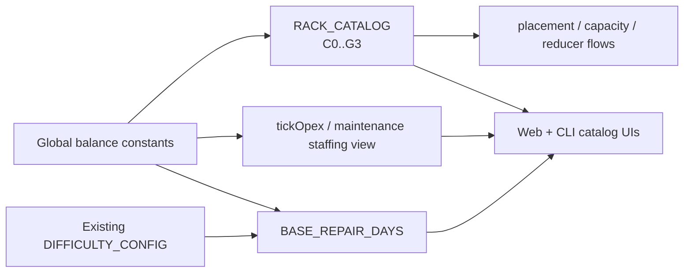

## Progress

- [x] **Phase 1 — Balance mapping & scaffolding**
  - [x] 1.1 Codify the target balance levers and centralize new easier-pass constants
  - [x] 1.2 Extend rack tier typing and catalog invariants to support tier 0 hardware
- [ ] **Phase 2 — Recurring cost and repair-time rebalance**
  - [x] 2.1 Apply the 20% recurring-cost reductions to rack opex and extra maintenance staffing
  - [ ] 2.2 Halve base repair duration while preserving easy vs hard relative modifiers
- [ ] **Phase 3 — Tier-0 hardware rollout**
  - [ ] 3.1 Add `C0`, `M0`, `S0`, and `G0` rack specs with proportionally smaller outputs and opex
  - [ ] 3.2 Add simulation and economy coverage proving tier-0 racks are cheaper, weaker, and fully usable
- [ ] **Phase 4 — Consumer surfaces, versioning & docs**
  - [ ] 4.1 Update web/CLI catalog surfaces and copy for the expanded tier range
  - [ ] 4.2 Bump balance version, update changelog/docs, and run cross-package verification

## Overview

This plan makes the game broadly more forgiving without introducing a brand-new ruleset or replacing the existing easy/hard difficulty modes. The intended outcome is lower monthly pressure from rack upkeep and maintenance staffing, a new entry-level `0` tier for each rack family, and materially shorter repair windows so failures are less punishing.

The changes are deliberately **global balance changes**: they should benefit both easy and hard games, with existing difficulty modifiers continuing to layer on top where they already exist. Because the work touches shared catalogs, economy math, repair timing, UI catalog surfaces, docs, and replay-sensitive balance constants, it should be executed as a tracked multi-phase plan.

## Architecture



Key decisions:

- **Treat this as a base-balance pass, not a new difficulty mode.** Easy and hard should keep their existing role, but both should inherit the lower recurring costs, new tier-0 options, and shorter repairs.
- **Keep numeric knobs centralized.** New discount multipliers and any tier-0 derivation helpers should live in `packages/game-logic/src/balance/` or other canonical balance modules, not as ad-hoc literals spread through UI or simulation code.
- **Interpret “staffing cost of all racks” through the current model before editing numbers.** Today, racks have `monthlyMaintenance`, while wages live on datacenter staffing (`staffCount`) and extra maintenance staffing. Step 1.1 explicitly locks down which current opex bucket maps to the requested 20% rack-side reduction before implementation proceeds.
- **Discount extra maintenance staff separately from baseline regional wages.** The request specifically calls out “adding maintenance staff”, so the preferred implementation is a dedicated multiplier for `maintenanceStaff` wage cost rather than lowering `region.staffWage` for every staffing consumer in the game.
- **Tier 0 is a real catalog expansion.** We should widen `RackTier` to `0 | 1 | 2 | 3`, add actual `C0/M0/S0/G0` specs, and update every consumer that assumes the rack catalog starts at tier 1 or contains exactly 12 SKUs.
- **Do not add contract tier 0 in this pass.** The easier experience should come from cheaper supply and faster recovery, not from introducing a second contract-tier taxonomy.

Illustrative target shapes:

```ts
export type RackTier = 0 | 1 | 2 | 3;

export const RACK_RECURRING_OPEX_MULTIPLIER = 0.8;
export const EXTRA_MAINTENANCE_STAFF_WAGE_MULTIPLIER = 0.8;
export const BASE_REPAIR_DAYS = 45; // half of the current 90-day baseline

export function repairDurationDays(difficulty: Difficulty = DEFAULT_DIFFICULTY): number {
  return BASE_REPAIR_DAYS * DIFFICULTY_CONFIG[difficulty].repairTimeMultiplier;
}
```

Tier-0 rack values should be derived from tier-1 families using a documented, consistent ratio (for example, ~50% of primary output/cost/opex before clean-number rounding) so progression remains monotonic and predictable.

## Phase 1 — Balance mapping & scaffolding

**Goal**: pin down the exact meaning of the requested reductions in the current model and prepare the type/balance scaffolding needed for a clean implementation.

### Step 1.1 — Codify the target balance levers and centralize new easier-pass constants

- Files: `packages/game-logic/src/balance/`, `packages/game-logic/src/economy/opex.ts`, optionally `packages/game-logic/src/catalog/racks.ts`, `packages/game-logic/src/entities/datacenter.ts`
- Audit the current recurring-cost buckets and explicitly map the user’s requested changes onto them:
  - rack-side recurring opex reduction (`20%`)
  - extra maintenance-staff wage reduction (`20%`)
  - repair-duration reduction (`50%`)
- Add named constants/helpers for the new multipliers instead of baking `0.8` or `0.5` directly into runtime logic.
- Document in code comments whether the rack-side reduction is implemented as a direct `RackSpec.monthlyMaintenance` rebalance or a new derived multiplier, and why that matches the user’s wording.
- Acceptance: there is one obvious source of truth for the easier-pass numbers, and the implementation path for each requested change is clear before catalog values start moving.

### Step 1.2 — Extend rack tier typing and catalog invariants to support tier 0 hardware

- Files: `packages/game-logic/src/types.ts`, `packages/game-logic/src/catalog/catalog.test.ts`, any leaf tests/helpers that assume tiers are only `1 | 2 | 3`
- Change `RackTier` to include `0`.
- Update catalog invariants to stop assuming exactly 12 rack SKUs or `/^[CGMS][123]$/` IDs.
- Audit direct tier assumptions in tests and helper code (sorting, copy, regexes, and any “tier 1 is minimum” logic) so later tier-0 catalog changes land cleanly.
- Acceptance: typecheck/test scaffolding is ready for `C0/M0/S0/G0` without first breaking on hard-coded 1–3 assumptions.

## Phase 2 — Recurring cost and repair-time rebalance

**Goal**: lower the monthly penalty of owning hardware and recovering from failures while keeping the difficulty system coherent.

### Step 2.1 — Apply the 20% recurring-cost reductions to rack opex and extra maintenance staffing

- Files: `packages/game-logic/src/catalog/racks.ts`, `packages/game-logic/src/economy/opex.ts`, `packages/game-logic/src/entities/datacenter.ts`, `packages/game-logic/src/economy/economy.test.ts`, `packages/game-logic/src/entities/*.test.ts`
- Reduce the chosen rack-side recurring opex lever by `20%` across all rack families and tiers.
- Reduce the monthly wage cost of **extra** maintenance staffing by `20%`, while keeping baseline datacenter staffing behavior unchanged unless Phase 1 explicitly broadens the scope.
- Update `datacenterMaintenanceStaffingView()` and any other shared derived views so UI/CLI surfaces show the discounted per-head maintenance hire cost rather than stale `region.staffWage` math.
- Add regression tests for representative datacenters proving both discounts are reflected in opex breakdowns and staffing summaries.
- Acceptance: monthly opex is measurably lower in the targeted buckets, and all shared player-facing maintenance staffing views remain accurate.

### Step 2.2 — Halve base repair duration while preserving easy vs hard relative modifiers

- Files: `packages/game-logic/src/balance/maintenance.ts`, `packages/game-logic/src/sim/maintenance.ts`, `packages/game-logic/src/sim/maintenance.test.ts`, `packages/game-logic/src/sim/tick.test.ts`
- Reduce the global base repair duration from its current value to half that amount.
- Keep `DIFFICULTY_CONFIG` as the relative modifier layer so easy remains faster than hard, but both difficulties become half as slow as they are today.
- Update helper-level and tick-level tests to assert the new duration behavior for both `easy` and `hard` states.
- Acceptance: repair timing is globally shorter, deterministic behavior is preserved, and both difficulties validate as exactly half of their prior repair durations.

## Phase 3 — Tier-0 hardware rollout

**Goal**: add a true starter SKU for each rack family so players can scale more gradually and cheaply.

### Step 3.1 — Add `C0`, `M0`, `S0`, and `G0` rack specs with proportionally smaller outputs and opex

- Files: `packages/game-logic/src/catalog/racks.ts`, optionally a new helper module under `packages/game-logic/src/balance/`, `packages/game-logic/src/catalog/catalog.test.ts`
- Add one new rack spec per family: `C0`, `M0`, `S0`, and `G0`.
- Base each on its family’s tier-1 rack using a documented proportion that lowers:
  - primary capacity
  - secondary resources (power, heat, bandwidth)
  - capex
  - recurring rack opex
- Round to clean, human-readable catalog numbers while preserving monotonic family progression (`tier 0 < tier 1 < tier 2 < tier 3`).
- Keep existing placement semantics intact: the special cooling-type restriction should remain a tier-3 concern, not accidentally expand to lower tiers.
- Acceptance: the catalog contains 16 rack SKUs, tier progression remains strictly increasing within each family, and tier-0 racks are visibly cheaper/weaker than tier 1.

### Step 3.2 — Add simulation and economy coverage proving tier-0 racks are cheaper, weaker, and fully usable

- Files: `packages/game-logic/src/entities/capacity.test.ts`, `packages/game-logic/src/economy/economy.test.ts`, `packages/game-logic/src/state/reduce.test.ts`, `packages/game-logic/src/integration.test.ts` if needed
- Add tests proving tier-0 racks:
  - can be placed and contribute valid capacity
  - have lower capex and recurring opex than their tier-1 counterparts
  - obey the same deterministic reducer/tick flow as existing racks
- Add at least one integration-style sanity check showing that a small early-game build with tier-0 hardware produces sensible economics and does not require contract-system changes to remain playable.
- Acceptance: `game-logic` coverage demonstrates that tier-0 hardware is a first-class part of the simulation, not just a catalog entry.

## Phase 4 — Consumer surfaces, versioning & docs

**Goal**: make the expanded catalog and easier balance rules visible everywhere players encounter them, and record the replay-affecting rebalance properly.

### Step 4.1 — Update web/CLI catalog surfaces and copy for the expanded tier range

- Files: `packages/web/src/ui/floor/RackPicker.tsx`, `packages/web/src/ui/floor/RackPicker.test.tsx`, `packages/web/src/ui/help/tutorialContent.ts`, `packages/cli/src/commands/ls.ts`, `packages/cli/src/tui/tabs/catalog.ts`, `packages/cli/README.md`, related tests
- Update catalog renderers and sorters so tier 0 appears naturally before tier 1 in each family.
- Fix copy that currently says racks only come in tiers `1–3`; update it to reflect the new `0–3` range while preserving the message that tier 3 requires liquid cooling.
- Update tests and snapshots that currently expect 12 rack cards/SKUs or hard-code tier-1-only examples.
- Acceptance: players can discover and inspect the new tier-0 racks consistently in both web and CLI surfaces, and no maintained UI copy contradicts the live catalog.

### Step 4.2 — Bump balance version, update changelog/docs, and run cross-package verification

- Files: `packages/game-logic/src/economy/constants.ts`, `packages/game-logic/src/catalog/catalog.test.ts`, `packages/game-logic/README.md`, `CHANGELOG.md`
- Increment `BALANCE_VERSION` because this pass changes replay/save-sensitive balance across catalogs, opex, and repair timing.
- Update README/changelog notes to describe:
  - the new tier-0 rack family
  - the 20% recurring-cost reductions
  - the shorter repair baseline
  - the fact that these are **global** balance changes layered under existing difficulty modes
- Run and record the expected verification commands:
  - `npm run test -w @datacenter-tycoon/game-logic`
  - `npm run typecheck -w @datacenter-tycoon/game-logic`
  - `npm run test -w @datacenter-tycoon/web` if web catalog/help surfaces changed
  - `npm run test -w @datacenter-tycoon/cli` if CLI catalog/help surfaces changed
- Acceptance: versioning/docs reflect the rebalance and the touched workspaces pass their relevant test/typecheck commands.

## References

- [Root AGENTS.md](../../AGENTS.md)
- [game-logic AGENTS.md](../../packages/game-logic/AGENTS.md)
- [web AGENTS.md](../../packages/web/AGENTS.md)
- [cli AGENTS.md](../../packages/cli/AGENTS.md)
- [015-rack-aging-failures-and-maintenance.md](./015-rack-aging-failures-and-maintenance.md)
- [023-cooling-and-rack-failure-curve-rebalance.md](./023-cooling-and-rack-failure-curve-rebalance.md)
- [030-cli-maintenance-staffing-surfacing-and-controls.md](./030-cli-maintenance-staffing-surfacing-and-controls.md)
- [033-game-difficulty-modes.md](./033-game-difficulty-modes.md)
- [game-balance-tuning skill](../skills/game-balance-tuning/SKILL.md)
- [planning skill](../skills/planning/SKILL.md)

## Changelog

- 2026-05-11 — created to scope a global easier-balance pass covering lower recurring costs, new tier-0 racks, and faster repairs.