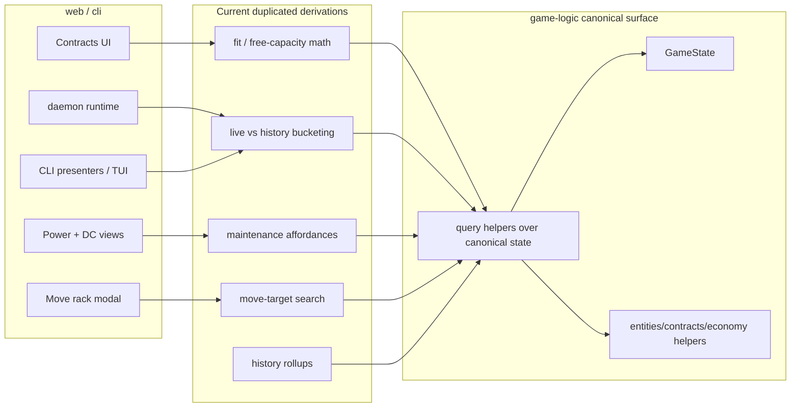

## Progress

- [x] **Phase 1 — Add canonical read-only gameplay queries to `game-logic`**
  - [x] 1.1 Add canonical contract bucket and datacenter-assignment query helpers over `GameState.contracts`
  - [x] 1.2 Add state-level datacenter capacity / maintenance query helpers so UIs stop recomputing them from raw fields
  - [x] 1.3 Add rack-move candidate helpers for first-fit slot search and move-target summaries
  - [x] 1.4 Export the new query surface and add focused game-logic regression tests
- [x] **Phase 2 — Refactor web to consume only canonical gameplay queries**
  - [x] 2.1 Replace web contract fit / free-capacity / bucket logic with game-logic queries
  - [x] 2.2 Fix datacenter power, maintenance, and move-modal views to consume game-logic summaries instead of local rule copies
  - [x] 2.3 Remove remaining web reads of deprecated compatibility views where a canonical query exists
- [x] **Phase 3 — Refactor CLI and daemon to consume only canonical gameplay queries**
  - [x] 3.1 Update daemon/runtime status and list endpoints to derive buckets and counts from canonical game-logic queries
  - [x] 3.2 Replace CLI contract presenters and TUI tabs that still classify contracts locally
  - [x] 3.3 Keep command-level UX validation thin and delete leftover gameplay interpretation from CLI code
- [ ] **Phase 4 — Verification, docs, and guardrails**
  - [ ] 4.1 Add cross-workspace regression tests proving web/cli outputs match game-logic query results
  - [ ] 4.2 Update AGENTS/docs and add a grep-based audit for gameplay logic leaking back into consumers

## Overview

The repo rule is clear: `@datacenter-tycoon/game-logic` is the source of truth for gameplay rules and shared derived behavior, while `web` and `cli` should only render and dispatch actions. A research pass across `packages/web` and `packages/cli` found that a meaningful amount of **cross-interface gameplay interpretation still lives outside `game-logic`**, especially around contract bucketing, contract fit checks, per-datacenter free capacity, maintenance staffing affordances, move-target discovery, and historical contract summaries.

Concrete examples include `packages/web/src/ui/contracts/contractUtils.ts` recomputing contract fit and free capacity, `packages/web/src/ui/stats/PowerView.tsx` inventing a per-datacenter free-capacity formula from global totals, `packages/web/src/ui/floor/MoveRackModal.tsx` scanning for valid move targets locally, `packages/web/src/ui/dc-view/DatacenterView.tsx` recomputing maintenance staffing affordances from raw region fields, `packages/web/src/store/selectors.ts` and several CLI files still treating deprecated `activeContracts` / `contractMarket` compatibility views as authoritative, and CLI presenters/TUI tabs locally classifying “live vs history” contract buckets.

This plan creates a **shared read-only gameplay query surface inside `game-logic`** for exactly these cross-package questions, then migrates web and CLI to consume it. The goal is not to move every UI formatting choice into `game-logic`; it is to move any domain answer that should be identical across interfaces — for example: “which open contracts fit which datacenters right now?”, “what is a datacenter’s committed vs available capacity?”, “what are the valid move targets for this rack?”, and “which contracts are live vs historical?”

## Architecture



Key decisions:

- **Introduce a first-class read-only query layer in `game-logic`.** These helpers answer domain questions from `GameState` without mutating state and without depending on React, Node, or CLI transport concerns.
- **Treat `GameState.contracts` as authoritative.** Web and CLI should stop interpreting deprecated `contractMarket` / `activeContracts` compatibility views as if they were the real model.
- **Keep UI heuristics in UI, move domain answers into `game-logic`.** Sorting, phrasing, colors, and thresholds like “warn when within 7 days” can stay in the frontend; contract fit, liveness, capacity, staffing affordances, and valid move targets should not.
- **Prefer reusable state-level helpers over ad hoc per-component formulas.** If multiple consumers need the same answer, add a named helper in `game-logic` instead of open-coding another reducer/filter chain in web or CLI.

Illustrative target API:

```ts
export interface ContractAssignmentFitSummary {
  contractId: ContractId;
  fitStatus: "fits" | "partial" | "none";
  networkAvailable: Capacity;
  candidates: Array<{
    dcId: DatacenterId;
    available: Capacity;
    fits: boolean;
  }>;
}

export function summarizeContractAssignmentFit(
  state: Pick<GameState, "contracts" | "contractMarket" | "activeContracts" | "datacenters">,
  contractId: ContractId,
): ContractAssignmentFitSummary;

export function selectLiveContractsForDatacenter(
  state: Pick<GameState, "contracts" | "contractMarket" | "activeContracts">,
  dcId: DatacenterId,
): Contract[];

export function summarizeDatacenterCapacityFromState(
  state: Pick<GameState, "datacenters" | "contracts" | "contractMarket" | "activeContracts">,
  dcId: DatacenterId,
): DatacenterContractCapacitySummary;

export function listRackMoveTargets(
  state: Pick<GameState, "datacenters" | "map">,
  sourceDcId: DatacenterId,
  placementId: RackPlacementId,
): MoveRackTarget[];
```

## Phase 1 — Add canonical read-only gameplay queries to `game-logic`

**Goal**: `game-logic` exposes one authoritative place for cross-interface gameplay questions so consumers stop re-deriving rules from raw state.

### Step 1.1 — Add canonical contract bucket and datacenter-assignment query helpers over `GameState.contracts`

- Files: `packages/game-logic/src/contracts/lifecycle.ts`, a new query module such as `packages/game-logic/src/query/contracts.ts`, related barrel exports in `packages/game-logic/src/contracts/index.ts` and/or `packages/game-logic/src/index.ts`
- Add state-level helpers that work from canonical contract data instead of forcing consumers to inspect deprecated compatibility views:
  - bucket open / live / historical contracts from `contractsFromState(state)`
  - select live contracts for one datacenter
  - summarize whether a market contract fits any datacenter, which datacenters fit it, and whether fit is `fits | partial | none`
- Reuse existing lifecycle selectors and `datacenterContractCapacitySummary()` rather than duplicating liveness or capacity math again.
- Acceptance: a consumer can answer “which open contracts fit which datacenters right now?” without any web/cli-local capacity math or `status === ...` checks.

### Step 1.2 — Add state-level datacenter capacity / maintenance query helpers so UIs stop recomputing them from raw fields

- Files: `packages/game-logic/src/entities/datacenter.ts`, `packages/game-logic/src/entities/region.ts`, a new query module such as `packages/game-logic/src/query/datacenters.ts`, plus exports in `packages/game-logic/src/entities/index.ts` / `src/index.ts`
- Add state-level helpers for:
  - per-datacenter `installed / usable / committed / available` capacity from full game state
  - whole-network capacity summaries if needed by web/cli dashboards
  - maintenance staffing views that resolve region + datacenter + regional labor availability directly from `GameState`
- Make these helpers the canonical way to answer questions currently reimplemented in `packages/web/src/store/selectors.ts`, `packages/web/src/ui/contracts/contractUtils.ts`, `packages/web/src/ui/stats/PowerView.tsx`, and `packages/web/src/ui/dc-view/DatacenterView.tsx`.
- Acceptance: web/cli no longer need to recompute assigned demand, free capacity, or regional maintenance affordances from raw arrays and raw region counters.

### Step 1.3 — Add rack-move candidate helpers for first-fit slot search and move-target summaries

- Files: `packages/game-logic/src/entities/datacenter.ts` or a new `packages/game-logic/src/query/move.ts`, `packages/game-logic/src/economy/move.ts`, related exports in `packages/game-logic/src/index.ts`
- Add reusable helpers that, given a source DC and placement, can:
  - enumerate target datacenters
  - count valid target slots per datacenter
  - optionally return the first valid target slot
  - include move cost and same-region/cross-region metadata
- Reuse `canPlaceRack()` and `calculateMoveCost()` so the rules stay authoritative and deterministic.
- Acceptance: `packages/web/src/ui/floor/MoveRackModal.tsx` no longer needs to loop the grid itself to discover move candidates.

### Step 1.4 — Export the new query surface and add focused game-logic regression tests

- Files: `packages/game-logic/src/index.ts`, new `*.test.ts` files near the new query modules, and `packages/game-logic/README.md`
- Add focused tests covering at least:
  - contract bucket derivation from canonical `contracts`
  - exact-fit / partial-fit / no-fit contract assignment summaries
  - per-datacenter available capacity under multiple live contracts
  - maintenance staffing affordances near regional labor exhaustion
  - move target discovery across same-region and cross-region datacenters
- Document the new query helpers as the intended consumer-facing read-only surface.
- Acceptance: `npm run test -w @datacenter-tycoon/game-logic` and `npm run typecheck -w @datacenter-tycoon/game-logic` pass with the new helpers publicly exported.

## Phase 2 — Refactor web to consume only canonical gameplay queries

**Goal**: remove gameplay interpretation from the web package so components only format already-derived answers.

### Step 2.1 — Replace web contract fit / free-capacity / bucket logic with game-logic queries

- Files: `packages/web/src/store/selectors.ts`, `packages/web/src/ui/contracts/contractUtils.ts`, `packages/web/src/ui/contracts/MarketList.tsx`, `packages/web/src/ui/contracts/ContractsPage.tsx`, `packages/web/src/ui/contracts/ActiveList.tsx`, `packages/web/src/ui/contracts/CompletedList.tsx`, related tests
- Remove or greatly shrink `contractUtils.ts`; it currently duplicates free-capacity checks, fit checks, and contract deal scoring context.
- Replace direct reads of `state.activeContracts`, `state.contractMarket`, and ad hoc `status === ...` filters with canonical game-logic query helpers.
- Fix `CompletedList` so it stops inventing historical financial totals from `monthlyPayment * termMonths` and single-penalty assumptions unless a game-logic helper explicitly defines that summary.
- Acceptance: the contracts page can render market/live/history and “fits now” affordances without any UI-local capacity or liveness rules.

### Step 2.2 — Fix datacenter power, maintenance, and move-modal views to consume game-logic summaries instead of local rule copies

- Files: `packages/web/src/ui/stats/PowerView.tsx`, `packages/web/src/ui/dc-view/DatacenterView.tsx`, `packages/web/src/ui/floor/MoveRackModal.tsx`, `packages/web/src/store/selectors.ts`, related tests
- Replace the current `PowerView` per-DC free-capacity approximation with canonical per-datacenter available-capacity data from `game-logic`.
- Replace `DatacenterView`’s local `availableRegionalStaff`, `canIncreaseMaintenance`, and maintenance wage derivation with a game-logic-maintained staffing view resolved from whole state.
- Replace `MoveRackModal`’s local slot scan / first-fit logic with `game-logic` move-target helpers.
- Acceptance: no datacenter-management component derives capacity, staffing affordances, or move candidates from raw arrays when a canonical helper exists.

### Step 2.3 — Remove remaining web reads of deprecated compatibility views where a canonical query exists

- Files: `packages/web/src/store/audioEvents.ts`, `packages/web/src/ui/floor/FloorView.tsx`, `packages/web/src/ui/topbar/TopBar.tsx`, `packages/web/src/store/selectors.ts`, `packages/web/AGENTS.md`
- Audit all remaining direct reads of `state.activeContracts`, `state.contractMarket`, and old `status === ...` liveness checks.
- Keep purely presentational logic in web, but move any remaining domain bucketing/selection to `game-logic` helpers.
- Add a rule to `packages/web/AGENTS.md` that gameplay queries should come from `@datacenter-tycoon/game-logic`, not from UI-local helper files.
- Acceptance: the remaining web usage of deprecated compatibility fields is limited to transitional shims or pure presentation wiring, not gameplay interpretation.

## Phase 3 — Refactor CLI and daemon to consume only canonical gameplay queries

**Goal**: make the daemon and CLI thin translators over canonical `game-logic` queries instead of a second place where contract semantics are reconstructed.

### Step 3.1 — Update daemon/runtime status and list endpoints to derive buckets and counts from canonical game-logic queries

- Files: `packages/cli/src/daemon/runtime.ts`, `packages/cli/src/protocol/messages.ts`, related runtime tests
- Stop treating `state.contractMarket` and `state.activeContracts` as authoritative storage.
- Use canonical query helpers to produce:
  - live contract counts
  - market/live/history list buckets
  - any per-datacenter capacity summaries exposed by the daemon
- Keep runtime status/list responses stable where possible, but derive them from `game-logic` rather than CLI-local filtering.
- Acceptance: daemon status and list endpoints can survive eventual removal of compatibility views because they no longer depend on them semantically.

### Step 3.2 — Replace CLI contract presenters and TUI tabs that still classify contracts locally

- Files: `packages/cli/src/commands/contracts-view.ts`, `packages/cli/src/commands/contracts.ts`, `packages/cli/src/commands/ls.ts`, `packages/cli/src/tui/tabs/contracts.ts`, `packages/cli/src/tui/tabs/dashboard.ts`, related tests
- Remove presenter logic that locally decides `market` vs `active` vs `history` from raw `status` checks and compatibility arrays.
- Consume runtime/query results that are already bucketed canonically.
- Ensure CLI details output uses canonical lifecycle-aware language and does not imply that accepted history is still live capacity.
- Acceptance: no CLI renderer or presenter needs to know how to reconstruct contract liveness from legacy state layout.

### Step 3.3 — Keep command-level UX validation thin and delete leftover gameplay interpretation from CLI code

- Files: `packages/cli/src/commands/dc-maint.ts`, `packages/cli/src/commands/common.ts`, `packages/cli/AGENTS.md`, any command handlers touched during migration
- Audit remaining command-side “helpful” calculations and keep only transport/UX concerns there.
- Where a command needs a domain answer (for example staffing affordances or contract buckets), fetch the canonical view instead of recomputing it.
- Update `packages/cli/AGENTS.md` to state explicitly that daemon/command code must use exported `game-logic` queries for gameplay interpretation.
- Acceptance: command handlers remain thin adapters around query + action flow, not alternative gameplay rule engines.

## Phase 4 — Verification, docs, and guardrails

**Goal**: lock the architectural boundary down so future work does not drift back into UI-local rule copies.

### Step 4.1 — Add cross-workspace regression tests proving web/cli outputs match game-logic query results

- Files: targeted tests under `packages/game-logic/src/**/*.test.ts`, `packages/web/src/**/*.test.tsx`, and `packages/cli/src/**/*.test.ts`
- Add regression coverage for at least these cases:
  - an open contract that fits exactly one datacenter
  - an open contract where total network free capacity exists but no single datacenter fits (`partial`)
  - a breached/live/history contract mix after lifecycle transitions
  - a datacenter near regional staffing exhaustion
  - a rack move candidate set with one legal and one illegal destination
- Acceptance: the same scenario produces the same derived answers in game-logic tests and in consumer-facing web/cli tests.

### Step 4.2 — Update AGENTS/docs and add a grep-based audit for gameplay logic leaking back into consumers

- Files: `AGENTS.md`, `packages/web/AGENTS.md`, `packages/cli/AGENTS.md`, `.agents/plans/README.md`, optionally `packages/game-logic/README.md`
- Add a short “query boundary” rule: consumers may compose UI state and formatting, but shared gameplay queries belong in `game-logic`.
- Add or document repeatable audit commands such as:
  - `rg -n "state\.activeContracts|state\.contractMarket|status === \"active\"|status === \"breached\"" packages/web/src packages/cli/src`
  - `rg -n "canFulfill|dcFreeCapacity|fitStatus|countAvailableSlots|findFirstAvailableSlot" packages/web/src packages/cli/src`
- Acceptance: future contributors have an explicit checklist for spotting gameplay drift outside `game-logic`.

## References

- [AGENTS.md](../../AGENTS.md)
- [packages/game-logic/AGENTS.md](../../packages/game-logic/AGENTS.md)
- [packages/web/AGENTS.md](../../packages/web/AGENTS.md)
- [packages/cli/AGENTS.md](../../packages/cli/AGENTS.md)
- [028-cli-live-vs-historical-contract-reporting.md](./028-cli-live-vs-historical-contract-reporting.md)
- [031-contract-lifecycle-state-model-refactor.md](./031-contract-lifecycle-state-model-refactor.md)
- [022-rack-usage-based-billing.md](./022-rack-usage-based-billing.md)
- Research evidence:
  - `packages/web/src/store/selectors.ts`
  - `packages/web/src/ui/contracts/contractUtils.ts`
  - `packages/web/src/ui/contracts/MarketList.tsx`
  - `packages/web/src/ui/contracts/ActiveList.tsx`
  - `packages/web/src/ui/contracts/CompletedList.tsx`
  - `packages/web/src/ui/stats/PowerView.tsx`
  - `packages/web/src/ui/dc-view/DatacenterView.tsx`
  - `packages/web/src/ui/floor/MoveRackModal.tsx`
  - `packages/cli/src/daemon/runtime.ts`
  - `packages/cli/src/commands/contracts-view.ts`
  - `packages/cli/src/commands/ls.ts`
  - `packages/cli/src/tui/tabs/contracts.ts`
  - `packages/cli/src/tui/tabs/dashboard.ts`

## Changelog

- 2026-05-11 — created after an architecture audit found cross-interface gameplay queries and contract/capacity interpretation still duplicated in `web` and `cli` instead of living authoritatively in `game-logic`.
