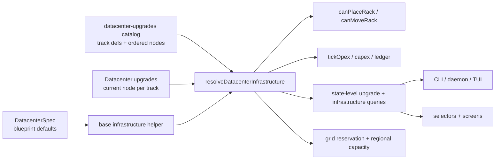
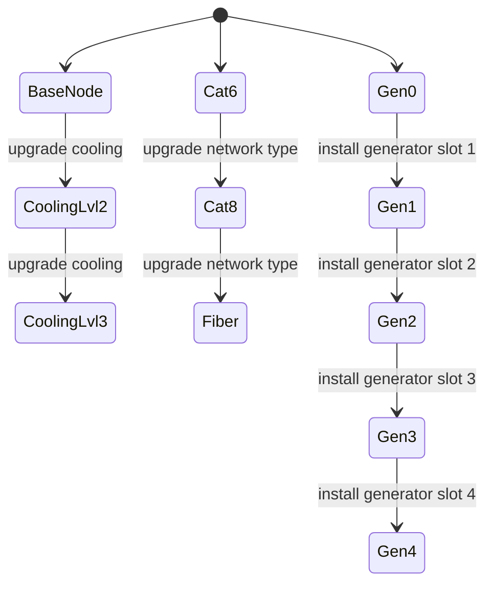

## Progress

- [x] **Phase 1 — Model upgrades as first-class datacenter infrastructure**
  - [x] 1.1 Introduce canonical base-vs-effective infrastructure helpers without mutating spec semantics
  - [x] 1.2 Add a catalog-driven monotonic track model for cooling, network type, and gas generators
  - [x] 1.3 Persist generic per-track progress on each datacenter and derive canonical resolvers
  - [x] 1.4 Bump save/version boundaries and add regression fixtures for default upgrade state
- [x] **Phase 2 — Integrate upgrades into reducer, placement rules, and economy**
  - [x] 2.1 Add authoritative datacenter-upgrade actions and validation helpers
  - [x] 2.2 Route rack placement, move validation, and capacity checks through effective infrastructure
  - [x] 2.3 Add upgrade-aware opex and split grid-vs-onsite power semantics for generators
  - [x] 2.4 Add focused game-logic tests for upgrade progression, tier unlocks, and power/economy envelopes
- [x] **Phase 3 — Expose an authoritative upgrade query surface and cross-package transport**
  - [x] 3.1 Add read-only game-logic queries for current upgrade status, effective infrastructure, and next-node affordances
  - [x] 3.2 Extend CLI daemon/protocol/list views and add `dct dc upgrade` commands using canonical queries
  - [x] 3.3 Update web selectors and datacenter screens to inspect/apply upgrades without UI-local rule copies
- [ ] **Phase 4 — Balance scaffolding, UX polish, and guardrails**
  - [ ] 4.1 Centralize upgrade balance constants and per-blueprint limits in tunable catalog data
  - [ ] 4.2 Update docs, AGENTS guidance, and plan index so future upgrades extend tracks instead of patching specs ad hoc
  - [ ] 4.3 Add cross-workspace regression coverage for upgrade views, opex presentation, and command/UI flows

## Overview

Today a datacenter's live infrastructure is implicitly its embedded `DatacenterSpec`: placement validation reads `datacenter.spec.powerCapacityKw` / `coolingCapacityBtuPerHr` / `bandwidthGbps`, region build reservations use `spec.powerCapacityKw`, and `tickOpex()` prices bandwidth and staffing directly off the spec. That works for immutable facilities, but it becomes brittle as soon as players can retrofit a site after construction.

This feature therefore needs more than three one-off fields or reducer branches. We need a reusable upgrade architecture that lets a datacenter keep its **base blueprint defaults** while separately tracking **monotonic upgrade progress** and deriving a canonical **effective infrastructure profile** for placement, economy, region accounting, CLI, and web.

The plan below keeps `game-logic` authoritative, models upgrades as catalog-defined tracks, and is deliberately extendible beyond the initial request. The first concrete tracks are: cooling retrofits (air → hybrid → liquid, with hybrid meaning liquid-assisted air cooling and more thermal headroom), network-type progression (Cat6 / Cat8 / fiber), and onsite generation expansion via gas-generator slots. The same architecture should also support later tracks like UPS, batteries, security hardening, or advanced cooling loops without changing the persisted `Datacenter` shape again.

## Architecture





Key decisions:

- **Keep `DatacenterSpec` immutable at runtime.** The spec stored on a datacenter remains the built blueprint default. Upgrades must never mutate `datacenter.spec.*`; live capacity comes from resolvers.
- **Use one generic monotonic track engine.** Internally, every upgrade family is an ordered track of nodes. “Levels” and “slots” are presentation concepts, not separate reducer architectures. Cooling, network type, and gas generators should all use the same progression engine.
- **Model cooling as three explicit levels.** Cooling should be represented as `air`, `hybrid`, and `liquid`. `hybrid` is a liquid-assisted air cooling mode that increases cooling capacity without fully becoming liquid cooling; garage may advance only to `hybrid`, while warehouse may advance all the way to `liquid`.
- **Persist generic progress, not bespoke per-feature fields.** `Datacenter.upgrades` should store the current node per track (or equivalent generic progress), so adding a future track does not require changing the `Datacenter` interface again.
- **Separate physical infrastructure resolution from economic effects.** The canonical resolver should answer effective physical limits (power, cooling, bandwidth, cooling type, network type), while upgrade-economics helpers answer fixed monthly upkeep only in v1.
- **Split grid import from onsite generation.** Region power usage should continue to mean grid-reserved capacity. Gas generators add local rack headroom and generator-related opex, but must not inflate regional `powerUsed`.
- **Keep generator economics intentionally simple in v1.** Installed generators add datacenter-local power headroom plus fixed monthly upkeep; they do **not** introduce a fuel simulation or variable fuel-cost bucket in this plan.
- **Use `networkType` as the datacenter upgrade concept.** The per-datacenter network upgrade track and effective infrastructure view should expose a named `networkType` (`cat6` / `cat8` / `fiber`) alongside numeric bandwidth. This keeps the concept explicit and gives plan 016 a stable prerequisite to validate.
- **Interlock explicitly with plan 016's regional fabric.** A datacenter is fabric-eligible only when its effective `networkType` is `fiber`. Creating a regional fabric or adding a datacenter to one must fail if any participating datacenter is not yet at fiber.
- **Keep consumers on read-only query views.** CLI and web should render canonical upgrade/infrastructure views from `game-logic`, not inspect raw upgrade progress or catalog internals directly.

Illustrative target shapes:

```ts
export type DatacenterUpgradeTrackId = "cooling" | "networkType" | "onsiteGeneration";

export interface DatacenterUpgradeTrackNode {
  id: string;
  label: string;
  capexCost: Money;
  opex: {
    fixedMonthly?: Money;
  };
  infrastructure: Partial<{
    coolingType: CoolingType;
    coolingCapacityBtuPerHr: number;
    networkType: DatacenterNetworkType;
    bandwidthGbps: number;
    onsiteGenerationCapacityKw: number;
  }>;
}

export interface DatacenterUpgradeTrackDefinition {
  id: DatacenterUpgradeTrackId;
  presentation: "level" | "slots";
  nodes: readonly DatacenterUpgradeTrackNode[]; // node[0] is the included default state
}

export interface DatacenterUpgradeProgress {
  currentNodeByTrack: Record<DatacenterUpgradeTrackId, string>;
}

export interface DatacenterInfrastructureProfile {
  gridImportCapacityKw: number;
  onsiteGenerationCapacityKw: number;
  rackPowerCapacityKw: number;
  coolingCapacityBtuPerHr: number;
  coolingType: CoolingType;
  networkType: DatacenterNetworkType;
  bandwidthGbps: number;
}
```

Initial catalog intent for the requested tracks:

- `garage`: starts **air** cooling, **Cat6** network type, **0/1** installed gas-generator slots.
- `warehouse`: starts **air** cooling, **Cat8** network type, **0/2** installed gas-generator slots.
- `hyperscale`: starts **liquid** cooling, **fiber** network type, **0/4** installed gas-generator slots.
- Cooling progression must increase thermal headroom and use the cooling ladder `air` → `hybrid` → `liquid`.
- Garage cooling may advance only to `hybrid`; it must never reach full `liquid` cooling.
- Warehouse cooling may advance all the way to `liquid`.
- Network progression must be defined by named network-type nodes (`cat6` → `cat8` → `fiber`) rather than arbitrary bandwidth deltas spread through reducers and UI.
- Generator expansion should be expressed as ordered nodes (`0`, `1`, `2`, `3`, `4` installed slots), even if the first implementation keeps per-slot deltas uniform. That leaves room for future per-slot differences in capex, upkeep, or power yield.

## Phase 1 — Model upgrades as first-class datacenter infrastructure

**Goal**: create a clean base-vs-effective datacenter resource model and a reusable upgrade catalog before touching gameplay behaviour.

### Step 1.1 — Introduce canonical base-vs-effective infrastructure helpers without mutating spec semantics

- Files: `packages/game-logic/src/types.ts`, `packages/game-logic/src/catalog/datacenters.ts`, `packages/game-logic/src/entities/datacenter.ts`, `packages/game-logic/src/entities/region.ts`, `packages/game-logic/src/query/datacenters.ts`
- Add explicit infrastructure helper types/views that distinguish:
  - blueprint defaults (`DatacenterSpec` / base infrastructure)
  - effective live infrastructure after upgrades
  - grid import capacity vs onsite generation capacity
- Keep the existing scalar fields on `DatacenterSpec` as the blueprint-default source of truth for now; do **not** do a large catalog schema rewrite in the same step unless it clearly reduces churn.
- Add helper entry points like `datacenterBaseInfrastructure(spec)` and `resolveDatacenterInfrastructure(datacenter)` so future code stops treating `datacenter.spec.*` as live capacity.
- Acceptance: a caller can ask for both base and effective infrastructure explicitly, and direct `datacenter.spec.powerCapacityKw` / `coolingCapacityBtuPerHr` / `bandwidthGbps` reads are no longer necessary for live capacity logic.

### Step 1.2 — Add a catalog-driven monotonic track model for cooling, network type, and gas generators

- Files: new `packages/game-logic/src/catalog/datacenter-upgrades.ts`, `packages/game-logic/src/catalog/index.ts`, `packages/game-logic/src/types.ts`, optionally `packages/game-logic/README.md`
- Add a catalog that defines, per datacenter spec id, an ordered set of upgrade tracks. Each track should provide:
  - a stable track id
  - a presentation hint (`level` or `slots`)
  - ordered nodes where node `0` is the built-in default state
  - capex, recurring opex effects, and infrastructure effects for each node
- Treat the engine as a generic linear progression system: generator “slots” should be modeled as successive nodes (`0`, `1`, `2`, ... installed slots), not as a one-off count field wired differently from other tracks.
- Encode the requested initial topology in catalog data rather than reducer conditionals:
  - garage network type starts at Cat6, warehouse at Cat8, hyperscale at fiber
  - garage/warehouse cooling starts air while hyperscale starts liquid
  - gas-generator node caps are 1 / 2 / 4 for garage / warehouse / hyperscale
- The network-type track must also expose a stable fabric-eligibility predicate (`fiber` or not) that plan 016 can reuse instead of inferring from raw bandwidth.
- Acceptance: one authoritative helper can answer “what are this blueprint’s tracks, current default nodes, next nodes, caps, and current fabric eligibility?” without any switch statements in reducers or UI code.

### Step 1.3 — Persist generic per-track progress on each datacenter and derive canonical resolvers

- Files: `packages/game-logic/src/types.ts`, `packages/game-logic/src/state/reduce.ts`, `packages/game-logic/src/entities/datacenter.ts`, `packages/game-logic/src/entities/index.ts`
- Extend `Datacenter` with persisted upgrade progress initialized from the catalog when the facility is built.
- Store generic progress such as `currentNodeByTrack`, not bespoke `coolingLevelId` / `generatorSlotsInstalled` fields, so adding a new track later does not require another persisted-shape redesign.
- Ensure save data explicitly contains which upgrade nodes / slots are installed so a load can fully reconstruct the datacenter’s live infrastructure.
- Add pure helpers such as:
  - `resolveDatacenterInfrastructure(datacenter)` for physical limits
  - `resolveDatacenterUpgradeEconomics(datacenter)` for fixed upkeep semantics
  - `resolveDatacenterUpgradeState(datacenter)` for current track + next-node affordances
- Acceptance: a newly built datacenter always has explicit generic upgrade progress, and other game-logic modules can ask for physical/economic upgrade resolution without reading catalog internals directly.

### Step 1.4 — Bump save/version boundaries and add regression fixtures for default upgrade state

- Files: `packages/game-logic/src/save/serialize.ts`, `packages/game-logic/src/state/reduce.ts`, relevant `*.test.ts` fixtures near save/state code, `packages/game-logic/README.md`
- Bump `SAVE_VERSION` because the persisted datacenter shape changes.
- Treat the upgrade save change as a destructive version bump: old saves do not need to remain compatible, and the serializer/deserializer may reject or replace pre-upgrade saves instead of migrating them.
- Add focused save/load coverage proving datacenters serialize with default upgrade state intact.
- Acceptance: persisted upgrade state is versioned intentionally and covered by tests/docs rather than being an accidental schema change.

## Phase 2 — Integrate upgrades into reducer, placement rules, and economy

**Goal**: make upgrades affect gameplay through authoritative reducer + entity + economy paths.

### Step 2.1 — Add authoritative datacenter-upgrade actions and validation helpers

- Files: `packages/game-logic/src/state/reduce.ts`, `packages/game-logic/src/types.ts`, `packages/game-logic/src/entities/datacenter.ts`, new or updated `*.test.ts`
- Add one generic reducer action for upgrading a datacenter, but make it target an explicit track and explicit next node (for example `UpgradeDatacenter { dcId, trackId, targetNodeId }`) rather than a vague “upgrade whatever is next”.
- Validate centrally that:
  - the datacenter exists
  - the track exists for that blueprint
  - the requested node is the immediate next legal node on that track
  - the track is not already maxed
  - the action is not a stale or no-op request
- Debit capex through existing ledger/capex paths with upgrade-specific reasons.
- Acceptance: one reducer action path can safely advance any supported upgrade track to its validated next node and emit deterministic ledger effects.

### Step 2.2 — Route rack placement, move validation, and capacity checks through effective infrastructure

- Files: `packages/game-logic/src/entities/datacenter.ts`, `packages/game-logic/src/query/datacenters.ts`, `packages/game-logic/src/state/reduce.ts`, related tests
- Update `canPlaceRack()`, `canMoveRack()`, resource-usage comparisons, and capacity summaries to read from `resolveDatacenterInfrastructure()`.
- Preserve the existing tier-3 rack cooling rule semantically, but base it on the **effective cooling type** so the new cooling ladder (`air` → `hybrid` → `liquid`) genuinely unlocks tier-3 placements only when the blueprint allows it.
- Ensure network-type/bandwidth and power-capacity placement checks use effective upgraded headroom rather than raw spec values.
- Acceptance: a garage cannot host tier-3 racks before cooling retrofit, can host them afterward if headroom allows, and network/power checks scale with applied upgrades.

### Step 2.3 — Add upgrade-aware opex and split grid-vs-onsite power semantics for generators

- Files: `packages/game-logic/src/economy/opex.ts`, `packages/game-logic/src/entities/region.ts`, `packages/game-logic/src/types.ts`, `packages/game-logic/src/query/datacenters.ts`, related tests
- Extend opex modeling so upgrade tracks can contribute fixed monthly infrastructure upkeep (e.g. liquid-cooling loop upkeep, generator maintenance, network-type upkeep where applicable).
- Keep region power accounting tied to grid-reserved capacity only; generator-installed power contributes to datacenter rack headroom, not regional `powerUsed`.
- Ensure the existing bandwidth-power-cooling formulas are updated deliberately to use effective infrastructure where appropriate, rather than accidentally double-counting upgrade costs.
- Update per-datacenter summaries so they can expose grid import, onsite generation, and any upgrade-specific opex bucket(s) where useful.
- Acceptance: adding a gas generator increases a datacenter’s effective rack power cap, adds well-defined fixed upgrade opex, and does not falsely increase regional `powerUsed`.

### Step 2.4 — Add focused game-logic tests for upgrade progression, tier unlocks, and power/economy envelopes

- Files: targeted tests such as `packages/game-logic/src/entities/datacenter.test.ts`, `packages/game-logic/src/economy/opex.test.ts`, `packages/game-logic/src/state/reduce.test.ts`, `packages/game-logic/src/query/datacenters.test.ts`
- Cover at least:
  - garage air→hybrid upgrade improving cooling headroom without ever reaching liquid cooling
  - warehouse air→hybrid→liquid progression enabling a tier-3 placement that previously failed for `cooling_type_mismatch`
  - garage Cat6→Cat8→fiber progression increasing bandwidth limits monotonically and flipping fabric-eligibility only at fiber
  - warehouse / hyperscale generator node caps of 2 / 4 being enforced
  - stale/non-immediate upgrade-node requests being rejected deterministically
  - generator installs not consuming extra regional grid power
  - generator upgrades adding only the intended fixed upkeep, with no accidental variable fuel billing introduced
- Acceptance: `npm run test -w @datacenter-tycoon/game-logic` and `npm run typecheck -w @datacenter-tycoon/game-logic` pass with regression coverage around all requested upgrade families and generator power semantics.

## Phase 3 — Expose an authoritative upgrade query surface and cross-package transport

**Goal**: surface upgrades to consumers through canonical queries so CLI and web stay thin.

### Step 3.1 — Add read-only game-logic queries for current upgrade status, effective infrastructure, and next-node affordances

- Files: `packages/game-logic/src/query/datacenters.ts`, `packages/game-logic/src/query/index.ts`, `packages/game-logic/src/index.ts`, `packages/game-logic/README.md`
- Add consumer-facing views such as `DatacenterInfrastructureView` and `DatacenterUpgradeTrackView` that include:
  - base vs effective power/cooling/network envelopes, including explicit `networkType`
  - grid import vs onsite generation split
  - current node, current presentation label, and maxed/not-maxed state per track
  - the next legal node with capex and recurring opex delta
  - whether the datacenter is fabric-eligible for plan 016 (`networkType === "fiber"`)
- Keep catalog traversal inside game-logic so consumers only render already-derived answers.
- Acceptance: web/cli can inspect current upgrades and next-node affordances without reading `datacenter.upgrades` or `DATACENTER_UPGRADE_CATALOG` directly.

### Step 3.2 — Extend CLI daemon/protocol/list views and add `dct dc upgrade` commands using canonical queries

- Files: `packages/cli/src/protocol/messages.ts`, `packages/cli/src/daemon/runtime.ts`, `packages/cli/src/commands/dc.ts`, new `packages/cli/src/commands/dc-upgrade.ts`, `packages/cli/src/commands/ls.ts`, `packages/cli/src/tui/tabs/datacenters.ts`, related tests
- Extend daemon datacenter list payloads with canonical infrastructure/upgrade views rather than raw spec capacity numbers alone.
- Add CLI commands to inspect upgrades and apply an explicit next node on a track without embedding business rules in command code.
- Update `ls` output and the TUI datacenter tab to show current cooling mode, network type, generator slots, effective headroom, fabric eligibility, and next upgrade opportunities.
- Acceptance: a CLI user can inspect/apply upgrades and see effective upgraded infrastructure while the command layer remains a thin adapter over `game-logic` queries/actions.

### Step 3.3 — Update web selectors and datacenter screens to inspect/apply upgrades without UI-local rule copies

- Files: `packages/web/src/store/selectors.ts`, `packages/web/src/ui/dc-view/DatacenterView.tsx`, `packages/web/src/ui/stats/PowerView.tsx`, `packages/web/src/ui/stats/ResourceBars.tsx`, `packages/web/src/ui/left-rail/DatacenterList.tsx`, related CSS/tests
- Replace direct `datacenter.spec` capacity reads used for upgradeable resources with canonical infrastructure/upgrade selectors.
- Add a datacenter upgrade panel/cards that shows current node labels, installed generator slots, capex cost of the next node, recurring opex consequences, and whether the datacenter is fiber-ready for regional fabric participation.
- Update resource displays to distinguish base blueprint capacity, effective datacenter capacity, and (where relevant) region grid capacity so onsite generation does not confuse the player.
- Acceptance: the web UI can display and trigger upgrades while all gameplay interpretation still comes from `@datacenter-tycoon/game-logic`.

## Phase 4 — Balance scaffolding, UX polish, and guardrails

**Goal**: make the upgrade system tunable and hard to regress into ad hoc capacity overrides later.

### Step 4.1 — Centralize upgrade balance constants and per-blueprint limits in tunable catalog data

- Files: `packages/game-logic/src/catalog/datacenter-upgrades.ts`, optionally new `packages/game-logic/src/balance/datacenter-upgrades.ts`, related tests/docs
- Keep capex, recurring opex, network-type bandwidth deltas, cooling deltas, generator power yield, and slot limits in one tuneable location.
- Avoid hardcoding “1 garage generator / 2 warehouse / 4 hyperscale”, Cat6/Cat8/fiber progression, or fabric-eligibility rules inside reducers, UI, or random helpers.
- Document which values are topology (track layout) vs balance (costs/yields) so future tuning stays safe.
- Acceptance: balancing the upgrade system only requires editing catalog/balance data, not touching validation or rendering logic.

### Step 4.2 — Update docs, AGENTS guidance, and plan index so future upgrades extend tracks instead of patching specs ad hoc

- Files: `AGENTS.md`, `packages/game-logic/AGENTS.md`, `packages/cli/AGENTS.md`, `packages/web/AGENTS.md`, `.agents/plans/README.md`, `packages/game-logic/README.md`, root `package.json` audit script if needed
- Add guidance that upgradeable datacenter resources must flow through canonical infrastructure resolvers / queries rather than direct `datacenter.spec.*` reads for live-capacity logic.
- Note that future datacenter upgrades should be added as catalog track nodes, not bespoke reducer conditionals or one-off fields on `Datacenter`.
- Extend the grep-based audit recommendation/script to catch direct raw-spec reads for upgradeable capacity fields in `web` / `cli`, while allowing intentional blueprint/catalog display paths.
- Acceptance: future contributors have an explicit extension path and a documented boundary that discourages ad hoc upgrade logic.

### Step 4.3 — Add cross-workspace regression coverage for upgrade views, opex presentation, and command/UI flows

- Files: targeted tests under `packages/cli/src/**/*.test.ts`, `packages/web/src/**/*.test.tsx`, and any supporting fixtures
- Add end-to-end-ish coverage for at least:
  - inspecting current upgrade state in CLI/web
  - applying a cooling upgrade and seeing updated datacenter presentation
  - applying a generator install and seeing effective power + opex changes reflected in UI/CLI summaries
  - a maxed-out track rendering as unavailable for further purchase
- Acceptance: `npm run test`, `npm run typecheck`, and `npm run audit:query-boundary` pass with upgrade-aware coverage across game-logic, CLI, and web.

## References

- [AGENTS.md](../../AGENTS.md)
- [packages/game-logic/AGENTS.md](../../packages/game-logic/AGENTS.md)
- [packages/cli/AGENTS.md](../../packages/cli/AGENTS.md)
- [packages/web/AGENTS.md](../../packages/web/AGENTS.md)
- [016-regional-fabric-and-pooled-capacity.md](./016-regional-fabric-and-pooled-capacity.md)
- [022-rack-usage-based-billing.md](./022-rack-usage-based-billing.md)
- [035-shared-gameplay-query-surface.md](./035-shared-gameplay-query-surface.md)
- [packages/game-logic/docs/ARCHITECTURE.md](../../packages/game-logic/docs/ARCHITECTURE.md)
- [packages/game-logic/docs/CORE_LOOP.md](../../packages/game-logic/docs/CORE_LOOP.md)

## Changelog

- 2026-05-11 — created.
- 2026-05-11 — refined architecture around generic monotonic track nodes, explicit base-vs-effective infrastructure resolution, and generator grid-vs-onsite opex semantics.
- 2026-05-11 — simplified generator economics to fixed upkeep only, renamed the network track to `networkType`, added an explicit plan-016 fabric eligibility dependency on fiber network type, and updated cooling to the `air` / `hybrid` / `liquid` ladder.
