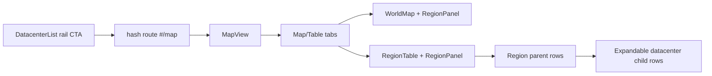

## Progress

- [x] **Phase 1 — Region navigation CTA cleanup**
  - [x] 1.1 Rename the left-rail region entry button from a build-specific CTA to a region-navigation CTA
  - [x] 1.2 Update shell/left-rail tests so the button semantics and routing match the new intent
- [x] **Phase 2 — Region screen tab split**
  - [x] 2.1 Refactor `MapView` to render separate Map and Table tabs with shared selected-region state
  - [x] 2.2 Update `MapView` styles and tests for tab switching, selection persistence, and region panel rendering per tab
- [ ] **Phase 3 — Expandable datacenter rows in table view**
  - [ ] 3.1 Extend `RegionTable` to accept datacenters and render expandable child rows beneath regions that already host datacenters
  - [ ] 3.2 Add responsive styling and focused table tests for nested rows, toggling, and region-selection behavior
- [ ] **Phase 4 — Verification and wrap-up**
  - [ ] 4.1 Run targeted web tests and typecheck for the touched region/rail components
  - [ ] 4.2 Mark the plan complete and note any deferred region-screen polish follow-ups

## Overview

The current web UI makes the bottom-left rail button look like a direct build action even though it really navigates to the region screen. Once the player gets there, the map and sortable economics table are shown together, which makes the screen feel busier than it needs to be.

This plan renames the rail CTA to match its actual destination, then refactors the region screen into separate Map and Table tabs. The table tab will also gain expandable child rows so players can see which datacenters already exist in a region without leaving the comparison view.

## Architecture



Key decisions:
- The left-rail CTA becomes a **region navigation affordance**, not a build-specific affordance, because opening `#/map` is its canonical behavior.
- `MapView` keeps a **single shared `selectedRegionId`** so map markers, table rows, and region panels stay synchronized even when the player switches tabs.
- Table-row expansion is **UI-local state in `RegionTable`**; it should not leak into game state.
- Child datacenter rows remain presentation-only and derive their content from existing selectors/props rather than introducing new game-logic rules.

Illustrative tab state:

```ts
type RegionScreenTab = "map" | "table";
```

## Phase 1 — Region navigation CTA cleanup

**Goal**: make the rail button accurately describe what it does.

### Step 1.1 — Rename the left-rail region entry CTA

- Files: `packages/web/src/ui/left-rail/DatacenterList.tsx`, `packages/web/src/ui/left-rail/DatacenterList.module.css`, `packages/web/src/ui/shell/Shell.tsx`
- Replace build-specific copy like “NEW DATACENTER” with region-navigation copy that points the player to the region screen.
- Rename callback props/helpers if needed so component intent stays clear (`onOpenRegions` or equivalent).
- Acceptance: clicking the rail footer CTA still routes to `#/map`, but the UI labels it as a region-navigation action rather than a direct build action.

### Step 1.2 — Update rail/shell tests

- Files: `packages/web/src/ui/left-rail/DatacenterList.test.tsx`, `packages/web/src/ui/shell/Shell.test.tsx` if needed
- Update assertions so the new button title/text/behavior are covered.
- Acceptance: targeted rail/shell tests pass with the renamed CTA.

## Phase 2 — Region screen tab split

**Goal**: reduce region-screen clutter by showing map and economics table in separate tabs.

### Step 2.1 — Add tab state to `MapView`

- Files: `packages/web/src/ui/map/MapView.tsx`
- Introduce UI-local tab state with `map` as the default active tab.
- Render a tablist that switches between the map experience and the table experience while keeping `selectedRegionId` and build-modal behavior shared.
- Acceptance: the region screen shows one primary view at a time, with both tabs using the same selected region.

### Step 2.2 — Update styles and behavior tests for the tabbed region screen

- Files: `packages/web/src/ui/map/MapView.module.css`, `packages/web/src/ui/map/MapView.test.tsx`
- Add tab styling consistent with the existing neon control-room theme.
- Cover switching tabs, preserving region selection across tabs, and continuing to show the region panel in the active tab.
- Acceptance: targeted `MapView` tests pass and the tabbed layout remains responsive.

## Phase 3 — Expandable datacenter rows in table view

**Goal**: let players inspect region occupancy directly from the economics table.

### Step 3.1 — Render expandable child rows for regions with datacenters

- Files: `packages/web/src/ui/map/RegionTable.tsx`, `packages/web/src/ui/map/MapView.tsx`
- Pass datacenter data into `RegionTable` and group datacenters by region.
- Add an expand/collapse affordance on region rows that have datacenters, and render child rows beneath the parent region row when expanded.
- Acceptance: regions with datacenters can expand to reveal their facilities without breaking row selection or sorting.

### Step 3.2 — Add table styles and focused tests

- Files: `packages/web/src/ui/map/RegionTable.module.css`, `packages/web/src/ui/map/RegionTable.test.tsx`, `packages/web/src/ui/map/MapView.test.tsx` if needed
- Style the nested rows so parent and child hierarchy are obvious on desktop and mobile.
- Add tests for expansion toggles, visible child datacenters, and keeping region selection callback behavior intact.
- Acceptance: table tests pass and the hierarchy is readable at narrow widths.

## Phase 4 — Verification and wrap-up

**Goal**: verify the touched region UI and leave the plan in a fully resumable state.

### Step 4.1 — Run targeted verification

- Files: n/a
- Run the relevant web tests plus `typecheck` for the touched components.
- Acceptance: targeted commands pass for `DatacenterList`, `MapView`, `RegionTable`, and the web workspace.

### Step 4.2 — Complete the plan

- Files: `.agents/plans/036-region-screen-tabs-and-expandable-table.md`
- Tick completed checkboxes, set `status: completed`, and note any intentionally deferred polish items.
- Acceptance: the plan file accurately reflects the shipped implementation.

## References

- [Root AGENTS.md](../../AGENTS.md)
- [web AGENTS.md](../../packages/web/AGENTS.md)
- [018-map-based-region-selector.md](./018-map-based-region-selector.md)
- `packages/web/src/ui/left-rail/DatacenterList.tsx`
- `packages/web/src/ui/map/MapView.tsx`
- `packages/web/src/ui/map/RegionTable.tsx`

## Changelog

- 2026-05-17 — created.
