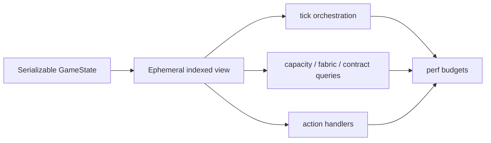

## Progress

- [ ] **Phase 1 — Measurement baseline**
  - [x] 1.1 Add deterministic large-state fixture builders for performance tests
  - [ ] 1.2 Add benchmark coverage for tick, capacity, fabric, and contract-fit paths
  - [ ] 1.3 Record baseline budgets and regression thresholds
- [ ] **Phase 2 — State lookup and contract-view reuse**
  - [ ] 2.1 Introduce ephemeral indexed game-state views
  - [ ] 2.2 Reuse a single normalized contract list inside reducers and ticks
  - [ ] 2.3 Replace repeated region/datacenter scans in action handlers
- [ ] **Phase 3 — Tick hot-path optimisation**
  - [ ] 3.1 Collapse repeated live-contract and assigned-demand scans during `tick()`
  - [ ] 3.2 Cache per-datacenter opex inputs within a tick
  - [ ] 3.3 Preserve deterministic maintenance and ledger behavior under benchmarks
- [ ] **Phase 4 — Capacity and fabric query optimisation**
  - [ ] 4.1 Add reusable capacity summaries for all datacenters in one pass
  - [ ] 4.2 Optimise fabric capacity summaries to avoid nested pool recomputation
  - [ ] 4.3 Optimise open-market contract fit summaries across all visible offers
- [ ] **Phase 5 — Data-shape and allocation cleanup**
  - [ ] 5.1 Reduce capacity and usage aggregation allocation churn
  - [ ] 5.2 Audit save-state memory footprint and duplicated compatibility views
  - [ ] 5.3 Document performance invariants for future game-logic changes

## Overview

The core game logic is deterministic and pure, but several hot paths currently trade simplicity for repeated linear scans, short-lived arrays, and derived object allocation. This plan captures a performance optimisation pass focused on large saves with many regions, datacenters, racks, contracts, and fabric-linked capacity pools. The goal is to improve runtime and memory behavior without changing persisted state shape unless explicitly justified and migrated. Optimisations should be guided by reproducible benchmarks before implementation, then protected by regression budgets.

## Architecture



Key decisions:
- Keep `GameState` JSON-serializable and plain; any indexes should be ephemeral query/tick helpers, not persisted `Map` fields.
- Prefer batching derived answers once per operation over adding broad memoization that risks stale deterministic state.
- Optimise first around measured hot paths: monthly `tick()`, all-datacenter capacity summaries, fabric pool summaries, contract assignment-fit queries, and high-frequency reducer actions.
- Preserve current public API behavior; new lower-level helpers should be exported only when they are useful as shared authoritative gameplay queries.

Illustrative helper shape:

```ts
interface IndexedGameStateView {
  datacenterById: ReadonlyMap<DatacenterId, Datacenter>;
  regionById: ReadonlyMap<RegionId, Region>;
  contracts: readonly Contract[];
  liveContracts: readonly Contract[];
}
```

## Performance Analysis Findings

- `packages/game-logic/src/sim/tick.ts` repeatedly reconstructs and filters contracts within one monthly tick. `contractsFromState()` is invoked while building maintenance state, again for each datacenter opex calculation via `selectLiveContracts(contractsFromState(...))`, and again for reliability comparison, creating avoidable arrays, maps, and filters.
- `packages/game-logic/src/sim/tick.ts` performs region lookup with `state.datacenters.find()` followed by `state.map.regions.find()` for each datacenter. This makes monthly opex and tax loops scan region/datacenter arrays repeatedly.
- `packages/game-logic/src/economy/opex.ts` computes assigned contract demand per datacenter by reducing all live contracts, then allocates rack activity candidates from placements to calculate billed power. In `tick()`, this can become `datacenters × liveContracts` plus rack scans.
- `packages/game-logic/src/entities/fabric.ts` normalizes contracts in `summarizeFabricCapacityForDatacenter()` and then computes local/member summaries by repeatedly scanning live contracts and datacenter arrays. `summarizeDistinctCapacityPools()` calls this per pool anchor, compounding the cost.
- `packages/game-logic/src/query/contracts.ts` computes open-market fit summaries by mapping over all open contracts, then all datacenters, then fabric capacity summaries and distinct pools. This can become quadratic or worse as contract-market and datacenter counts grow.
- `packages/game-logic/src/entities/datacenter.ts` has separate `datacenterUsage()`, `datacenterCapacity()`, `datacenterInstalledCapacity()`, `datacenterCommittedContractDemand()`, `datacenterRackActivityCandidates()`, and maintenance-summary loops over the same placements. These are individually clear but create avoidable repeated scans and object allocations when multiple summaries are requested together.
- `packages/game-logic/src/entities/datacenter.ts` resolves upgrade state by walking track definitions and node arrays; infrastructure, economics, validation, placement checks, and upgrade views can re-resolve the same tracks within a single operation.
- `packages/game-logic/src/state/reduce.ts` uses repeated array scans for datacenter, region, and placement lookup during high-frequency actions such as rack placement, rack removal, rack moves, maintenance staffing changes, and contract cancellation.
- `packages/game-logic/src/contracts/lifecycle.ts` keeps compatibility by merging canonical and legacy contract arrays in `contractsFromState()`. The merge builds temporary arrays, a `Map`, a `Set`, and normalized copies each call, so callers should avoid invoking it more than once per operation.
- There is no dedicated benchmark or profiling suite for large deterministic game states, so performance changes currently cannot be compared against budgets.

## Phase 1 — Measurement baseline

**Goal**: make performance measurable before changing algorithms or data shapes.

### Step 1.1 — Add deterministic large-state fixture builders

- Files: `packages/game-logic/src/**/performance fixtures or test utilities`, `packages/game-logic/src/state/newGame.ts` as needed.
- Add fixture helpers that create large deterministic states with configurable region, datacenter, rack, contract, and fabric sizes.
- Keep fixtures in test/benchmark-only files so runtime state remains unchanged.
- Acceptance: fixture generation is deterministic for the same seed and can produce small, medium, and stress profiles without using `Math.random()`.

### Step 1.2 — Add benchmark coverage for tick, capacity, fabric, and contract-fit paths

- Files: `packages/game-logic/package.json`, benchmark files under `packages/game-logic/src` or a package-local benchmark folder.
- Measure `tick()`, `summarizeNetworkCapacityFromState()`, `summarizeDistinctCapacityPoolsFromState()`, `summarizeOpenMarketContractFits()`, and common reducer actions.
- Include memory/allocation observations where the runtime toolchain supports them.
- Acceptance: a package-local benchmark command runs without changing game state semantics and prints comparable timings for the chosen profiles.

### Step 1.3 — Record baseline budgets and regression thresholds

- Files: `packages/game-logic/docs/CORE_LOOP.md`, `packages/game-logic/docs/ARCHITECTURE.md`, or a package-local performance note.
- Document baseline measurements from the current implementation.
- Define initial budget targets for optimised hot paths and acceptable variance.
- Acceptance: future agents can run the same command and compare results against recorded baselines.

## Phase 2 — State lookup and contract-view reuse

**Goal**: remove repeated linear lookups and repeated contract normalization within one operation while keeping persisted state serializable.

### Step 2.1 — Introduce ephemeral indexed game-state views

- Files: `packages/game-logic/src/query` or a new internal helper under `packages/game-logic/src/state`.
- Add a pure helper that derives maps for datacenters, regions, and normalized contract buckets from a `GameState`.
- Keep indexes ephemeral and scoped to one reducer, tick, or query invocation.
- Acceptance: helper tests prove lookups match current array-based behavior and no `Map` fields are added to persisted `GameState`.

### Step 2.2 — Reuse a single normalized contract list inside reducers and ticks

- Files: `packages/game-logic/src/contracts/lifecycle.ts`, `packages/game-logic/src/sim/tick.ts`, `packages/game-logic/src/state/reduce.ts`.
- Refactor callers to compute `contractsFromState()` once per operation and pass the result to downstream helpers.
- Avoid changing legacy compatibility semantics in `contractsFromState()`.
- Acceptance: existing contract lifecycle, reducer, and tick tests pass; benchmark output shows fewer contract-normalization calls per tick/action.

### Step 2.3 — Replace repeated region/datacenter scans in action handlers

- Files: `packages/game-logic/src/state/reduce.ts`, `packages/game-logic/src/entities/fabric.ts`.
- Use scoped indexes for `BuildDatacenter`, `PlaceRack`, `RemoveRack`, `MoveRack`, `SetMaintenanceStaff`, `FabricLink`, and `CancelContract`.
- Preserve current error messages and failure ordering where tests or consumers depend on them.
- Acceptance: reducer tests pass and benchmarks for high-frequency actions improve or remain neutral.

## Phase 3 — Tick hot-path optimisation

**Goal**: reduce per-month work in the canonical simulation loop without changing deterministic gameplay outcomes.

### Step 3.1 — Collapse repeated live-contract and assigned-demand scans during `tick()`

- Files: `packages/game-logic/src/sim/tick.ts`, `packages/game-logic/src/economy/opex.ts`.
- Build live contracts and per-datacenter assigned demand once per tick.
- Pass precomputed demand to opex/power helpers instead of reducing all live contracts for every datacenter.
- Acceptance: tick determinism tests still pass and large-state tick benchmarks show fewer contract scans.

### Step 3.2 — Cache per-datacenter opex inputs within a tick

- Files: `packages/game-logic/src/sim/tick.ts`, `packages/game-logic/src/economy/opex.ts`, `packages/game-logic/src/entities/datacenter.ts`.
- Reuse per-datacenter usage, infrastructure, upgrade economics, and rack-power summaries between opex, tax, and revenue where possible.
- Keep cache lifetime scoped to one `tick()` call.
- Acceptance: opex/revenue tests pass and benchmark allocations decrease or remain neutral.

### Step 3.3 — Preserve deterministic maintenance and ledger behavior under benchmarks

- Files: `packages/game-logic/src/sim/tick.test.ts`, benchmark files.
- Add stress coverage that compares optimized tick results against pre-optimization invariants for seeded states.
- Verify ledger entry ids, RNG state progression, repair status transitions, reliability updates, and contract finalization remain stable.
- Acceptance: tests prove deterministic state equality for representative seeded scenarios.

## Phase 4 — Capacity and fabric query optimisation

**Goal**: make shared query helpers scale with large maps, fabrics, racks, and markets.

### Step 4.1 — Add reusable capacity summaries for all datacenters in one pass

- Files: `packages/game-logic/src/entities/datacenter.ts`, `packages/game-logic/src/query/datacenters.ts`.
- Provide a batched summary helper that computes installed, usable, committed, available, usage, and maintenance data in fewer placement/contract passes.
- Keep existing single-datacenter helpers as wrappers when public API compatibility requires them.
- Acceptance: existing query tests pass and all-datacenter capacity benchmarks avoid repeated contract scans.

### Step 4.2 — Optimise fabric capacity summaries to avoid nested pool recomputation

- Files: `packages/game-logic/src/entities/fabric.ts`, `packages/game-logic/src/query/datacenters.ts`.
- Precompute datacenter summaries, region fabric member sets, and datacenter indexes once per query.
- Compute distinct capacity pools directly instead of recursively calling per-datacenter fabric summary helpers.
- Acceptance: fabric tests pass and fabric summary benchmarks scale close to datacenters plus contracts rather than datacenters multiplied by contracts.

### Step 4.3 — Optimise open-market contract fit summaries across all visible offers

- Files: `packages/game-logic/src/query/contracts.ts`.
- Reuse datacenter indexes, region eligibility sets, distinct capacity pools, and per-datacenter available capacity across all open market contracts.
- Preserve detailed candidate output and region-affinity behavior.
- Acceptance: contract query tests pass and open-market fit benchmarks improve for large markets.

## Phase 5 — Data-shape and allocation cleanup

**Goal**: reduce memory churn and document constraints so future features do not reintroduce the same hotspots.

### Step 5.1 — Reduce capacity and usage aggregation allocation churn

- Files: `packages/game-logic/src/entities/datacenter.ts`, `packages/game-logic/src/entities/fabric.ts`, `packages/game-logic/src/query/datacenters.ts`.
- Audit reducers that allocate a new `Capacity` object for each rack/contract and replace with safe local accumulators where readability remains acceptable.
- Avoid sharing mutable `EMPTY_CAPACITY` objects across returned state.
- Acceptance: tests pass and allocation-sensitive benchmarks show lower object churn in aggregation-heavy paths.

### Step 5.2 — Audit save-state memory footprint and duplicated compatibility views

- Files: `packages/game-logic/src/types.ts`, `packages/game-logic/src/contracts/lifecycle.ts`, `packages/game-logic/src/save/serialize.ts`.
- Measure the size impact of carrying canonical `contracts` plus compatibility `contractMarket` and `activeContracts` views.
- Decide whether to keep duplicated views, derive them only at boundaries, or plan a versioned migration.
- Acceptance: any proposed persisted-state change includes migration notes, compatibility risk, and save/load tests before implementation.

### Step 5.3 — Document performance invariants for future game-logic changes

- Files: `packages/game-logic/AGENTS.md`, `packages/game-logic/docs/ARCHITECTURE.md`, `packages/game-logic/docs/CORE_LOOP.md`.
- Document when to use batched helpers, scoped indexes, and derived query views.
- Add guidance that `contractsFromState()` and fabric/capacity summary helpers should not be repeatedly called inside nested loops.
- Acceptance: package guidance points future contributors toward benchmarked helpers and warns against known recomputation traps.

## References

- [`packages/game-logic/AGENTS.md`](../../packages/game-logic/AGENTS.md)
- [`packages/game-logic/docs/ARCHITECTURE.md`](../../packages/game-logic/docs/ARCHITECTURE.md)
- [`packages/game-logic/docs/CORE_LOOP.md`](../../packages/game-logic/docs/CORE_LOOP.md)
- [`035-shared-gameplay-query-surface.md`](./archive/035-shared-gameplay-query-surface.md)
- [`036-datacenter-upgrade-framework.md`](./archive/036-datacenter-upgrade-framework.md)

## Changelog

- 2026-05-17 — Created from a performance review of the core simulation, reducer, capacity/fabric query, contract lifecycle, and save compatibility paths.
