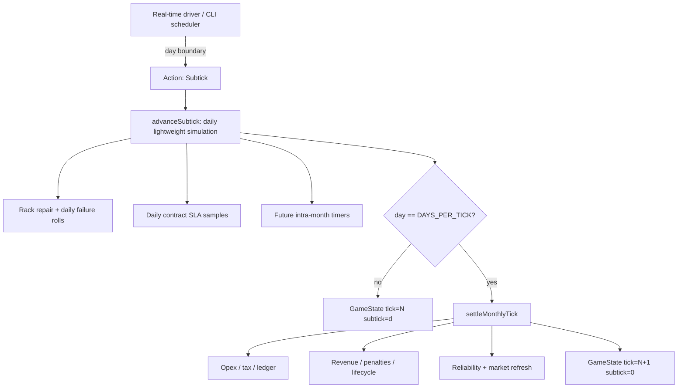
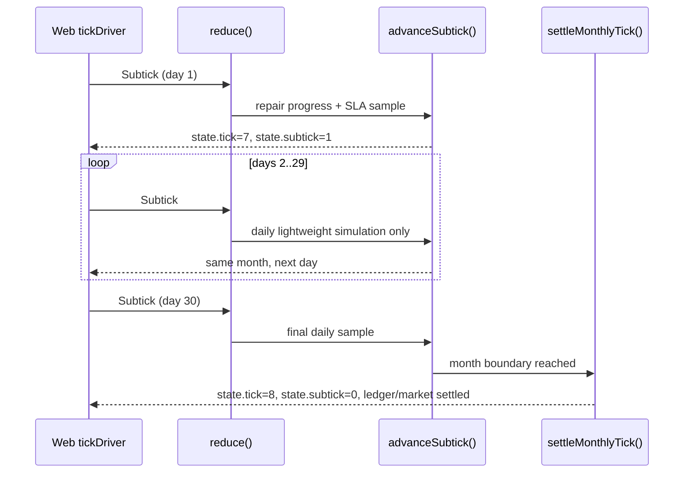
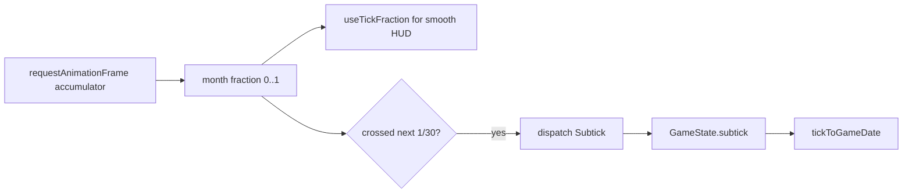

## Progress

- [ ] **Phase 1 — Canonical time model and compatibility scaffolding**
  - [x] 1.1 Add subtick vocabulary, constants, and persisted state
  - [x] 1.2 Split the monthly tick pipeline from intra-month advancement
  - [ ] 1.3 Add reducer actions and compatibility semantics for `Tick`
- [ ] **Phase 2 — Daily rack maintenance and repair simulation**
  - [ ] 2.1 Move rack repair progress onto daily subticks
  - [ ] 2.2 Convert rack failure probability from monthly rolls to daily hazard rolls
  - [ ] 2.3 Retune repair duration constants for 2–3 day outages
- [ ] **Phase 3 — Day-level contract SLA accounting**
  - [ ] 3.1 Add contract SLA target and current-window data model
  - [ ] 3.2 Sample contract service health once per subtick
  - [ ] 3.3 Settle revenue, penalties, lifecycle, and reliability from SLA windows at month end
- [ ] **Phase 4 — Build on existing web tick-fraction clocking**
  - [ ] 4.1 Update the web tick driver to dispatch day subticks from the existing month accumulator
  - [ ] 4.2 Extend game-time helpers and UI selectors for authoritative day state plus animation fraction
  - [ ] 4.3 Surface rack repair ETAs and contract SLA progress in web UI
- [ ] **Phase 5 — CLI daemon, command, and event support**
  - [ ] 5.1 Update daemon scheduling and events for lightweight subtick advancement
  - [ ] 5.2 Update CLI status/detail commands to show calendar day and SLA/repair progress
  - [ ] 5.3 Preserve script compatibility for one-shot monthly advancement
- [ ] **Phase 6 — Persistence, docs, tests, and performance guardrails**
  - [ ] 6.1 Migrate saves and update public package docs
  - [ ] 6.2 Add deterministic simulation and replay tests across subtick/month boundaries
  - [ ] 6.3 Add performance tests or assertions proving monthly-only work stays monthly

## Overview

`tick` currently means one in-game month, and the monthly tick pipeline evaluates many expensive or coarse-grained systems: maintenance, opex, contract revenue/penalties, tax, lifecycle finalization, reliability updates, ledger entries, and market refresh. That is a good unit for month-end financial settlement, but it is too coarse for events that should last only a few days, especially rack repairs and contract SLA availability.

This plan introduces **subticks** as deterministic, day-level simulation steps inside each monthly tick. A subtick should handle only lightweight intra-month work such as repair progress, daily rack failures, SLA uptime sampling, and small event timers. Month-end `tick` settlement remains monthly, so the game can gain day-level fidelity without running all opex, tax, market, and ledger logic 30× more often.

The web package already has a `tickFraction`/`useTickFraction()` path that animates the visible day within a month without full store updates. This plan builds on that idea: the existing month accumulator should become the source of both smooth visual fraction and authoritative day-boundary `Subtick` actions.

## Architecture





### Proposed time vocabulary

- Keep `GameState.tick` as the number of **completed months**. This preserves the existing contract duration, ledger, market expiry, and public terminology where `tick` is intentionally monthly.
- Add `GameState.subtick` as the number of **completed days within the current month**, `0..DAYS_PER_TICK - 1`.
- Keep a simplified 30-day month (`DAYS_PER_TICK = 30`) as the initial canonical conversion, matching existing `packages/web/src/store/gameTime.ts` assumptions.
- Add a public helper for current time views so consumers do not hand-roll conversions:

```ts
export type Subtick = number;

export interface GameTimeView {
  tick: Tick;              // completed months
  subtick: Subtick;        // completed days in the current month, 0..29
  dayOfMonth: number;      // 1..30, derived for display
  monthFraction: number;   // subtick / DAYS_PER_TICK
}

export type Action =
  | { type: "Subtick" }
  | { type: "Tick" } // compatibility: advance to the next month boundary
  | /* existing actions */;
```

### Why not simply make `tick = 1 day`?

Making every tick a day would be simpler conceptually but would blur two different categories of simulation work:

1. **Lightweight intra-month work** — rack repair counters, daily failure rolls, SLA uptime samples, construction timers, incident timers.
2. **Heavy month-end work** — opex, tax, revenue/penalties, contract completion/cancellation, reliability score changes, ledger writes, market expiry/backfill.

If `tick` became daily, the code would need either to run all heavy month-end work 30× more often or to add conditionals everywhere such as “only do this every 30th daily tick.” That would make the core loop harder to reason about and increase CPU, ledger churn, UI/store notification volume, test fixture churn, and replay size. Keeping monthly `tick` and adding day-level `subtick` gives a clearer contract: **subticks update volatile operational state; ticks settle finances and market state**.

This also protects current save semantics and user mental models. Existing durations like `termMonths`, `expiresAtTick`, `startedAtTick`, and monthly payments remain month-based. Only systems that actually need daily fidelity opt into subtick evaluation.

### Relationship to existing `tickFraction`

The current web clock already keeps a real-time accumulator and publishes a `fraction` from `0..1` through `tickFractionStore` so HUD widgets can show an advancing day. That should become the frontend bridge into the authoritative model:



The important distinction is that `tickFraction` remains an **animation aid**, while `GameState.subtick` becomes the **authoritative simulation day**. UI components should render from `state.tick + state.subtick` and may add the current fractional remainder only for smooth progress bars/date animation.

### Initial subtick consumers

- **Rack repair**: repair progress advances by days. A rack can be down for 2–3 days and return mid-month instead of staying down until the next month-end evaluation.
- **SLA measurement**: contracts sample whether assigned capacity met demand each day. A 90% SLA can tolerate roughly 3 failed days in a 30-day month; a 95% SLA is stricter. Short outages no longer automatically fail a whole month.
- **Rack failures**: monthly failure probability converts to an equivalent daily hazard so failures can happen on day 4 or day 22 rather than only at month boundary.

### Future subtick consumers to design for

The subtick loop should be generic enough to support later systems without another time-model rewrite:

- **Construction and delivery lead times**: datacenters, racks, generators, cooling retrofits, or fiber links can take N days to arrive/complete.
- **Incident response events**: power brownouts, fiber cuts, cooling alarms, DDoS bursts, or supplier outages can last hours/days and affect SLA windows without immediately changing monthly books.
- **Staff scheduling and queues**: maintenance staff could repair one rack at a time, triage critical racks first, or have shift-based daily throughput.
- **Battery/generator fuel and thermal dynamics**: backup power/fuel burn and heat buildup/cooldown are naturally sub-month systems.
- **Bandwidth bursts and demand spikes**: short-term overages can accumulate into monthly bandwidth bills or SLA risk.
- **Contract ramp-up/cutover windows**: newly accepted contracts might start after a few days, or migrations might produce temporary dual-running costs.
- **Research, procurement, or hiring timers**: unlocks and staff availability can complete mid-month while payroll remains monthly.
- **Notifications and UX countdowns**: day-precise warnings for “rack repairs tomorrow,” “offer expires in 4 days,” or “SLA breach no longer recoverable this month.”

## Phase 1 — Canonical time model and compatibility scaffolding

**Goal**: add a durable day-within-month concept without changing gameplay outcomes yet.

### Step 1.1 — Add subtick vocabulary, constants, and persisted state

- Files: `packages/game-logic/src/types.ts`, `packages/game-logic/src/balance/maintenance.ts`, `packages/game-logic/src/state/newGame.ts`, `packages/game-logic/src/save/serialize.ts`
- Add a `Subtick` type alias/brand and `GameState.subtick` persisted field.
- Centralize `DAYS_PER_TICK` / `SUBTICKS_PER_TICK` as the canonical month length and re-export it from the public API.
- Initialize new games with `subtick: 0`.
- Add save migration from the current save version to populate missing `subtick: 0` and preserve existing month-based `tick`.
- Acceptance: `npm run typecheck -w @datacenter-tycoon/game-logic` passes; save round-trip tests cover old saves with no `subtick`.

### Step 1.2 — Split the monthly tick pipeline from intra-month advancement

- Files: `packages/game-logic/src/sim/tick.ts`, `packages/game-logic/src/sim/subtick.ts` (new), `packages/game-logic/src/sim/index.ts`
- Extract the current heavy monthly `tick()` body into a clearly named internal helper such as `settleMonthlyTick(state)`.
- Keep public `tick(state)` available, but make it mean “advance to the next month boundary and run one monthly settlement.”
- Add an empty/no-op `advanceSubtick(state)` scaffold that increments `subtick` and invokes `settleMonthlyTick` only when the day counter reaches `DAYS_PER_TICK`.
- Acceptance: all existing game-logic tests still pass before any daily behavior is moved into the subtick loop.

### Step 1.3 — Add reducer actions and compatibility semantics for `Tick`

- Files: `packages/game-logic/src/state/reduce.ts`, `packages/game-logic/src/state/reduce.test.ts`, `packages/game-logic/src/sim/tick.test.ts`
- Add `{ type: "Subtick" }` to the `Action` union and route it to `advanceSubtick()`.
- Keep `{ type: "Tick" }` as a compatibility action for tests, CLI scripts, and API clients that advance one full month at a time.
- Define `Tick` from mid-month as “run remaining subticks through month end, then settle exactly one monthly tick.”
- Add tests for `Subtick` day increments, month rollover, and `Tick` compatibility from both `subtick: 0` and `subtick > 0`.
- Acceptance: reducer tests prove one month equals exactly `DAYS_PER_TICK` subticks and exactly one month-end ledger/market settlement.

## Phase 2 — Daily rack maintenance and repair simulation

**Goal**: move rack health changes into the day-level loop while preserving deterministic randomness.

### Step 2.1 — Move rack repair progress onto daily subticks

- Files: `packages/game-logic/src/sim/maintenance.ts`, `packages/game-logic/src/sim/subtick.ts`, `packages/game-logic/src/entities/datacenter.ts`
- Add `repairProgressPerSubtick(maintenanceStaff)` or rename existing helpers so day-based progress is explicit.
- Update repairing racks during `advanceSubtick()` instead of monthly settlement.
- Ensure completing a repair omits `repairProgressDays` from persisted state, matching the current optional-field rule.
- Update maintenance views to show `repairSpeedDaysPerDay`/`repairSpeedDaysPerSubtick` while preserving or deprecating current `repairSpeedDaysPerTick` copy as needed for consumers.
- Acceptance: tests show a rack with a 3-day repair target returns to `healthy` after 3 subticks, not after a full monthly tick.

### Step 2.2 — Convert rack failure probability from monthly rolls to daily hazard rolls

- Files: `packages/game-logic/src/sim/maintenance.ts`, `packages/game-logic/src/sim/subtick.ts`, `packages/game-logic/src/sim/maintenance.test.ts`
- Add a helper such as `rackDailyFailureChance(monthlyChance)` using `1 - (1 - monthlyChance) ** (1 / DAYS_PER_TICK)`.
- Roll failures once per healthy rack per subtick using the seeded PRNG only; never use wall-clock time or `Math.random()`.
- Store `lastFailureAtTick` plus a new `lastFailureAtSubtick` or a small `GameTimePoint` if UI needs day-precise history.
- Ensure repairing racks cannot roll new failures until repaired.
- Acceptance: tests validate hazard conversion and prove identical seed + action history yields identical daily failure days.

### Step 2.3 — Retune repair duration constants for 2–3 day outages

- Files: `packages/game-logic/src/balance/maintenance.ts`, `packages/game-logic/src/sim/maintenance.test.ts`, `packages/game-logic/src/entities/datacenter.test.ts`
- Use the `game-balance-tuning` skill before changing numeric constants.
- Replace the current month-scale repair target with day-scale values that make typical rack repairs last 2–3 days, with difficulty and maintenance staff multipliers still applied from balance constants.
- Keep all tunable numbers in `packages/game-logic/src/balance/`; do not inline repair-duration numbers in simulation code.
- Update user-facing wording from “days/tick” to “days/day” or a clearer ETA such as “~2 days remaining.”
- Acceptance: balance-sensitive tests document easy/hard repair ranges and the game remains deterministic.

## Phase 3 — Day-level contract SLA accounting

**Goal**: stop treating one temporary outage as an automatic full-month contract failure.

### Step 3.1 — Add contract SLA target and current-window data model

- Files: `packages/game-logic/src/types.ts`, `packages/game-logic/src/contracts/generator.ts`, `packages/game-logic/src/contracts/contracts.test.ts`, `packages/game-logic/src/save/serialize.ts`
- Add a serializable SLA target to contracts, initially constrained to values like `80 | 90 | 95` percent.
- Add current-month SLA counters, either on each live contract or in a dedicated per-month accumulator, for `sampledDays`, `servedDays`, and `failedDays`.
- Generate SLA targets deterministically from seeded contract generation, likely tied to tier/urgency/payment so stricter SLAs pay more.
- Migrate existing contracts to a default SLA target, probably 90%, and initialize missing counters safely.
- Acceptance: generated contracts include stable SLA targets; old saves deserialize with valid SLA fields.

### Step 3.2 — Sample contract service health once per subtick

- Files: `packages/game-logic/src/contracts/sla.ts` (new), `packages/game-logic/src/economy/opex.ts`, `packages/game-logic/src/sim/subtick.ts`, `packages/game-logic/src/entities/datacenter.ts`
- Extract or reuse the same capacity-vs-demand logic currently used by `tickRevenue()` so SLA sampling and revenue settlement do not diverge.
- For every live contract each subtick, record whether the assigned datacenter/fabric had enough healthy capacity for the total committed live demand.
- Avoid duplicating gameplay rules in web/CLI; export read-only SLA progress views from `game-logic` for presentation.
- Define how partial months are measured: newly accepted contracts should only count days after acceptance/start, and completed/cancelled contracts should stop sampling.
- Acceptance: tests cover one rack being down for 2 days under 80%, 90%, and 95% SLAs and prove only the stricter windows fail when appropriate.

### Step 3.3 — Settle revenue, penalties, lifecycle, and reliability from SLA windows at month end

- Files: `packages/game-logic/src/economy/opex.ts`, `packages/game-logic/src/contracts/lifecycle.ts`, `packages/game-logic/src/contracts/reliability.ts`, `packages/game-logic/src/sim/tick.ts`
- Replace current month-end instant capacity evaluation for revenue/penalties with SLA-window settlement.
- If `servedDays / sampledDays >= slaTargetPercent`, pay the monthly contract revenue and count the month as fulfilled.
- If the SLA target is missed, charge the penalty, increment breach streak, and emit a breached SLA outcome for reliability.
- Reset current-month SLA counters after settlement for contracts that remain live.
- Keep auto-cancel and term-completion checks monthly, after the SLA settlement result is known.
- Acceptance: tests prove 2–3 days of downtime no longer necessarily breaches a 30-day month, but sustained downtime still breaches and can auto-cancel after the configured streak.

## Phase 4 — Build on existing web tick-fraction clocking

**Goal**: turn the existing visual month fraction into authoritative day advancement without causing 60fps global store churn.

### Step 4.1 — Update the web tick driver to dispatch day subticks from the existing month accumulator

- Files: `packages/web/src/store/tickDriver.ts`, `packages/web/src/store/tickDriver.test.ts`, `packages/web/src/store/storeContext.tsx`
- Keep the existing `SPEED_INTERVALS_MS` as “milliseconds per month” so game speed feels unchanged.
- Derive `dayStepMs = monthStepMs / DAYS_PER_TICK` and dispatch `{ type: "Subtick" }` on each crossed day boundary.
- Keep the existing `onFrame` path for smooth animation; do not dispatch actions every animation frame.
- Cap catch-up subticks per frame similarly to current tick catch-up to avoid a huge burst after background-tab throttling.
- Acceptance: tests prove speed 1 still completes one month in 10 seconds, now via 30 `Subtick` dispatches and one month rollover.

### Step 4.2 — Extend game-time helpers and UI selectors for authoritative day state plus animation fraction

- Files: `packages/web/src/store/gameTime.ts`, `packages/web/src/store/tickFractionStore.ts`, `packages/web/src/store/selectors.ts`, related tests
- Replace web-local time constants with public constants from `@datacenter-tycoon/game-logic` where possible.
- Update `tickToGameDate()` to accept `tick`, `subtick`, and optional intra-subtick animation fraction, while keeping a compatibility overload if useful.
- Preserve `useTickFraction()` or rename it only if the migration cost is justified; its role is still visual month/day interpolation.
- Ensure components that do not need day animation continue subscribing only to normal game state.
- Acceptance: TopBar and contract remaining-time tests pass using authoritative `state.subtick` plus animation fraction.

### Step 4.3 — Surface rack repair ETAs and contract SLA progress in web UI

- Files: `packages/web/src/ui/dc-view/DatacenterView.tsx`, `packages/web/src/ui/contracts/ActiveList.tsx`, `packages/web/src/ui/contracts/MarketList.tsx`, web selector tests
- Show repair progress as days remaining or expected repair date, sourced from `game-logic` query/view helpers.
- Show active contract SLA target, current served/failed day counts, and “recoverable / at risk / missed” copy from `game-logic` views.
- Update market cards to explain stricter SLA targets and their likely payout/penalty implications.
- Avoid UI-local SLA math; web selectors should be thin wrappers over exported core helpers.
- Acceptance: component tests verify day-level repair and SLA labels update after `Subtick` actions.

## Phase 5 — CLI daemon, command, and event support

**Goal**: make the CLI and daemon understand subticks without breaking existing scripts.

### Step 5.1 — Update daemon scheduling and events for lightweight subtick advancement

- Files: `packages/cli/src/daemon/runtime.ts`, `packages/cli/src/daemon/server.ts`, daemon/client tests
- Decide whether daemon speed remains “monthly ticks per second” or becomes “months per second” in wording; keep wire compatibility if possible.
- Schedule `Subtick` actions at `monthInterval / DAYS_PER_TICK`, and emit a lightweight `subtick` event only to subscribers that ask for it.
- Continue emitting the existing `tick` event only when `state.tick` changes at month boundary.
- Avoid sending full state snapshots for every subtick unless explicitly requested, to keep terminal and JSON-RPC traffic reasonable.
- Acceptance: daemon tests show a month boundary emits one `tick` event and intermediate day changes can be observed without monthly ledger churn.

### Step 5.2 — Update CLI status/detail commands to show calendar day and SLA/repair progress

- Files: `packages/cli/src/commands/status.ts`, `packages/cli/src/commands/dc-maint.ts`, `packages/cli/src/commands/contracts.ts`, presenter tests
- Add calendar/day output to status while keeping raw tick values available in `--json` for scripts.
- Update maintenance output from “days/tick” to day-level repair ETA.
- Add contract detail fields for SLA target and current month served/failed days.
- Source all derived SLA/repair views from `@datacenter-tycoon/game-logic` queries.
- Acceptance: CLI command tests cover human output and JSON payloads for mid-month states.

### Step 5.3 — Preserve script compatibility for one-shot monthly advancement

- Files: `packages/cli/src/commands/tick.ts`, `packages/cli/src/client/client.ts`, CLI tests
- Keep `dct tick N` meaning “advance N months” unless a new explicit `dct subtick`/`dct day` command is added.
- If adding day advancement, use a new noun/verb such as `dct day 3` or `dct subtick 3` rather than changing existing command semantics.
- Ensure RPC clients that dispatch `{ type: "Tick" }` still advance one month and receive a response with the new `subtick` field where relevant.
- Acceptance: existing CLI tick tests remain semantically valid; new tests cover optional day advancement.

## Phase 6 — Persistence, docs, tests, and performance guardrails

**Goal**: lock in the new time model and prevent subticks from accidentally becoming daily monthly ticks.

### Step 6.1 — Migrate saves and update public package docs

- Files: `packages/game-logic/src/save/serialize.ts`, `packages/game-logic/README.md`, `packages/game-logic/docs/CORE_LOOP.md`, `packages/game-logic/docs/ARCHITECTURE.md`, `.agents/plans/README.md`
- Bump `SAVE_VERSION` for `subtick`, contract SLA fields, and any new accumulator fields.
- Document the two-layer loop: subtick for daily operational state, tick for monthly financial settlement.
- Update “Time is integer ticks” guidance in `packages/game-logic/AGENTS.md` if implementation changes that rule.
- Add plan README guidance for future work touching time, repairs, SLA, or daily simulation.
- Acceptance: docs clearly explain when to add code to `advanceSubtick()` versus monthly `settleMonthlyTick()`.

### Step 6.2 — Add deterministic simulation and replay tests across subtick/month boundaries

- Files: `packages/game-logic/src/sim/subtick.test.ts`, `packages/game-logic/src/sim/tick.test.ts`, `packages/game-logic/src/integration.test.ts`, save tests
- Test that 30 subticks from month start equals one compatible monthly `Tick` for month-level outcomes where no mid-month decisions are made.
- Test a mid-month repair affects later days in the same month and can save an SLA window.
- Test save/load from mid-month resumes with identical later failures, repairs, SLA outcomes, ledger entries, and market offers.
- Acceptance: `npm run test -w @datacenter-tycoon/game-logic` and `npm run typecheck -w @datacenter-tycoon/game-logic` pass.

### Step 6.3 — Add performance tests or assertions proving monthly-only work stays monthly

- Files: `packages/game-logic/src/sim/subtick.test.ts`, `packages/web/src/store/tickDriver.test.ts`, optionally a small benchmark script
- Add instrumentation-friendly tests that prove opex/tax/ledger/market refresh are called only at month boundary, not every subtick.
- Ensure web catch-up caps prevent dispatch storms after background throttling.
- Keep `Subtick` helpers pure and cheap: no market generation, no ledger append, no monthly tax, no UI-specific logic.
- Acceptance: tests or benchmark notes demonstrate the reason for subticks: 30 daily updates do not mean 30 monthly settlements.

## References

- [Root AGENTS.md](../../AGENTS.md)
- [game-logic AGENTS.md](../../packages/game-logic/AGENTS.md)
- [web AGENTS.md](../../packages/web/AGENTS.md)
- [cli AGENTS.md](../../packages/cli/AGENTS.md)
- [game-logic core loop](../../packages/game-logic/docs/CORE_LOOP.md)
- [Reliability Score & Contract SLA Progression](./archive/021-reliability-score-and-contract-slas.md)
- [Rack Usage-Based Billing](./archive/022-rack-usage-based-billing.md)
- [Rack Failure Probability Surfacing](./archive/029-rack-failure-probability-surfacing.md)

## Changelog

- 2026-05-17 — created.
