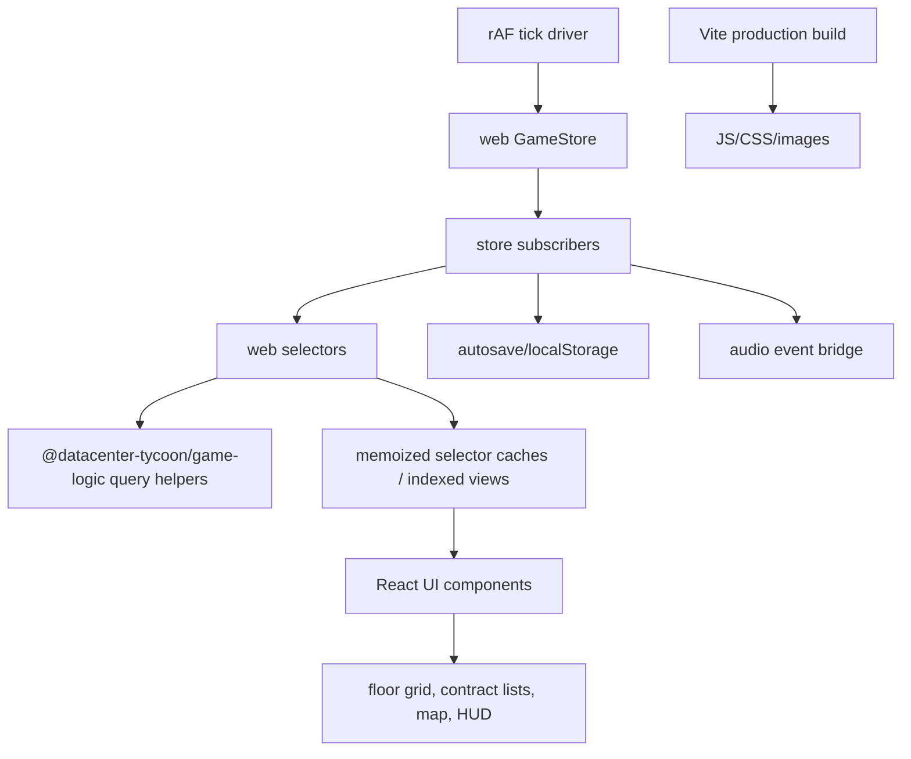

## Progress

- [x] **Phase 1 — Measurement and budgets**
  - [x] 1.1 Add a repeatable performance baseline
  - [x] 1.2 Define bundle, save-size, and render-frequency budgets
  - [x] 1.3 Add targeted regression coverage for selector stability
- [ ] **Phase 2 — Selector and subscription churn**
  - [x] 2.1 Add selector-level memoization for expensive aggregate views
  - [ ] 2.2 Replace repeated linear lookups with indexed selector helpers
  - [ ] 2.3 Reduce work performed by every store subscriber on each tick
- [ ] **Phase 3 — Contract UI render-path optimisation**
  - [ ] 3.1 Move active-contract row derivation out of the render loop
  - [ ] 3.2 Stabilize market-contract card props and child components
  - [ ] 3.3 Collapse duplicate historical-contract scans
- [ ] **Phase 4 — Floor grid and visual primitive optimisation**
  - [ ] 4.1 Memoize rack placement lookup and slot coordinate lists
  - [ ] 4.2 Reduce large grid DOM and mobile/desktop duplicate work
  - [ ] 4.3 Replace repeated decorative element allocation in rack/progress primitives
  - [ ] 4.4 Reduce costly rack tile paint effects
- [ ] **Phase 5 — Persistence, assets, and startup cost**
  - [ ] 5.1 Debounce and size-audit autosave writes
  - [ ] 5.2 Limit synchronous localStorage reads during startup/session switches
  - [ ] 5.3 Optimise large image assets and route-level payloads
- [ ] **Phase 6 — Final validation and follow-up guardrails**
  - [ ] 6.1 Re-run web typecheck, tests, build, and query-boundary audit
  - [ ] 6.2 Document measured before/after results
  - [ ] 6.3 Add follow-up issues for non-trivial architectural work

## Overview

This plan captures a performance audit of the React web UI and turns the findings into a phased optimisation roadmap. The current UI correctly keeps game rules in `@datacenter-tycoon/game-logic`, but several selectors and components rebuild derived arrays, maps, and DOM subtrees on every store update. Because the game advances through regular `Tick` dispatches and `useGameSelector` caches only by `GameState` object identity, selectors that return fresh objects can force avoidable React work every game month. The plan prioritises measurable improvements to render stability, algorithmic complexity, localStorage jank, and production payload size without moving gameplay logic into the web package.

## Architecture

Key findings from the audit:

- `useGameSelector` caches selector output only while the `GameState` object reference is unchanged (`packages/web/src/store/useStore.ts:42-65`). Any `Tick` produces a new state object through `reduce` and `tick` (`packages/game-logic/src/state/reduce.ts:427-428`, `packages/game-logic/src/sim/tick.ts:111-207`), so selectors that allocate fresh arrays/maps/objects can re-render subscribers every game month.
- Expensive aggregate selectors rebuild contract, capacity, opex, rack-power, and resource-usage views on each call (`packages/web/src/store/selectors.ts:474-502`, `packages/web/src/store/selectors.ts:663-750`).
- Several UI render paths repeat linear searches or full-array scans inside list/grid rendering (`packages/web/src/ui/contracts/ActiveList.tsx:87-102`, `packages/web/src/ui/contracts/CompletedList.tsx:23-24`, `packages/web/src/ui/floor/Grid.tsx:37-41`).
- Store subscribers for autosave and audio run on every dispatch and can do synchronous serialization, localStorage writes, aggregate selectors, and Set/Map construction (`packages/web/src/store/persist.ts:137-158`, `packages/web/src/store/audioEvents.ts:18-105`).
- The production web build currently emits a large start-screen banner and sizeable main JS/CSS chunks: `game-banner-001` is about 1.07 MB, main JS is about 402.80 kB / 131.21 kB gzip, and main CSS is about 135.19 kB / 21.13 kB gzip from `npm run build -w @datacenter-tycoon/web` on 2026-05-17.

Optimisation principles:

- Keep authoritative gameplay derivation in `game-logic`; web optimisations should memoize/query/index existing canonical answers, not reimplement rules.
- Prefer selector-level structural sharing before component-level `React.memo`, so multiple components benefit from stable references.
- Keep per-frame `useTickFraction()` usage intentionally narrow; only components needing day-level precision should subscribe to the 60fps fraction store (`packages/web/src/store/tickFractionStore.ts:16-43`).
- Measure before and after each phase, and avoid adding runtime dependencies unless they are justified by a measured win.

## Phase 1 — Measurement and budgets

**Goal**: establish repeatable evidence so optimisation work can be prioritized and reviewed without guessing.

### Step 1.1 — Add a repeatable performance baseline

- Files: `packages/web/src/**`, `packages/web/package.json`, optional test utilities under `packages/web/src`.
- Capture baseline scenarios for: start screen load, first game shell render, active contracts page, market contracts page, large datacenter floor grid, map/table screen, save/load cycle, and one high-speed tick burst.
- Use existing tooling first: production Vite build output, React Profiler/manual browser profile notes, and Vitest micro-bench style tests where practical.
- Acceptance: baseline notes list render counts, key commit durations, save payload size, and build asset sizes for the scenarios above.

### Step 1.2 — Define bundle, save-size, and render-frequency budgets

- Files: `packages/web/package.json`, `packages/web/src/**/*.test.ts(x)`, documentation in this plan or a future web performance note.
- Define initial warning budgets for main JS gzip, main CSS gzip, largest image asset, serialized save payload size, and target re-render counts during a tick.
- Prefer simple checks that can run in CI using existing npm/Vitest/Vite tooling.
- Acceptance: budgets are documented and at least the bundle/image budget can be checked from production build artifacts.

### Step 1.3 — Add targeted regression coverage for selector stability

- Files: `packages/web/src/store/selectors.test.ts`, `packages/web/src/store/gameStore.test.ts`, related selector tests.
- Add tests for selectors expected to preserve references when inputs are unchanged or unrelated state changes.
- Cover aggregate selectors that feed many components: market contract views, active/historical contract views, resource usage, opex, rack power, and fabric summaries.
- Acceptance: tests fail against accidental fresh allocation for unchanged inputs and pass with the intended memoized selectors.

## Phase 2 — Selector and subscription churn

**Goal**: reduce recomputation and React invalidation caused by selectors and always-on subscribers.

### Step 2.1 — Add selector-level memoization for expensive aggregate views

- Files: `packages/web/src/store/selectors.ts`, `packages/web/src/store/selectors.test.ts`.
- Memoize `selectMarketContractViews`, `selectAssignedContractViews`, `selectCapacity`, `selectOpexBreakdown`, `selectRackPowerSummary`, and `selectResourceUsage` against the smallest stable input slices available.
- Avoid rebuilding `fitSummaryById`, `candidateByDcId`, per-datacenter result arrays, and accumulator objects when relevant inputs did not change.
- Preserve canonical game-logic helper usage for contract fits, capacity, opex, fabric, maintenance, move, and upgrade views.
- Acceptance: selector tests prove stable references for unrelated state changes; contracts, power, resource, and fabric UI behavior remains unchanged.

### Step 2.2 — Replace repeated linear lookups with indexed selector helpers

- Files: `packages/web/src/store/selectors.ts`, consumers in `packages/web/src/ui/**`.
- Introduce memoized lookup helpers for datacenters by id and regions by id.
- Use those helpers instead of repeated `Array.find` in selectors such as `selectDatacenter`, `selectAssignedContractViews`, `selectOpexBreakdown`, `selectDatacenter*Summary`, and UI consumers that currently scan arrays.
- Keep helper outputs read-only and internal to web selectors unless another package needs the same derived answer, in which case add it to `game-logic`.
- Acceptance: common selector paths avoid O(datacenters × contracts) lookups where a single indexed map is sufficient.

### Step 2.3 — Reduce work performed by every store subscriber on each tick

- Files: `packages/web/src/store/audioEvents.ts`, `packages/web/src/store/persist.ts`, `packages/web/src/store/gameStore.ts`, related tests.
- Gate audio calculations so `selectResourceUsage`, `selectCapacity`, Set creation, and historical-contract maps run only when the underlying inputs for ambient/SFX actually change.
- Debounce or schedule autosave work so tick dispatches do not synchronously serialize and write on the critical render path.
- Consider store-subscription metadata or a lightweight “last action” signal if it can be added without breaking the simple external-store model.
- Acceptance: high-speed ticks do less synchronous subscriber work while SFX, ambient audio, and autosave semantics remain correct.

## Phase 3 — Contract UI render-path optimisation

**Goal**: make contract screens scale with larger markets, active contract counts, and datacenter counts.

### Step 3.1 — Move active-contract row derivation out of the render loop

- Files: `packages/web/src/ui/contracts/ActiveList.tsx`, `packages/web/src/store/selectors.ts`, tests under `packages/web/src/ui/contracts` or `packages/web/src/store`.
- Replace per-row `datacenters.find`, `regions.find`, `activeContracts.filter`, and `[...recentOutcomes].reverse().find` with precomputed maps/counts.
- Attribute opex using canonical data and avoid calling `tickOpex` repeatedly in the component render loop when the same per-DC value can be shared.
- Keep time/fraction math local only where day-level display needs it.
- Acceptance: active contract cards render the same labels/margins/SLA hints with O(contracts + datacenters + regions) derivation instead of repeated nested scans.

### Step 3.2 — Stabilize market-contract card props and child components

- Files: `packages/web/src/ui/contracts/MarketList.tsx`, `packages/web/src/store/selectors.ts`, `packages/web/src/ui/contracts/MarketList.test.tsx`.
- Memoize or selector-precompute `DcSelector` eligible/blocked options instead of filtering each time the selector panel renders.
- Stabilize `RequirementsRow`, `AffinitySummary`, and `CapacityComparison` inputs; wrap presentational children in `React.memo` only after selector outputs are stable enough to make it useful.
- Avoid re-running `contractDealScore` in multiple components if the score is already included in a stable market-view model.
- Acceptance: market cards preserve behavior and region-affinity copy while avoiding repeated derived arrays for unchanged contracts.

### Step 3.3 — Collapse duplicate historical-contract scans

- Files: `packages/web/src/ui/contracts/CompletedList.tsx`, optional selector tests.
- Replace separate completed/cancelled `.filter()` passes with a single pass or selector-provided history summary.
- Keep the history list presentation unchanged.
- Acceptance: completed/cancelled/history counts are correct with one derivation pass.

## Phase 4 — Floor grid and visual primitive optimisation

**Goal**: reduce work and DOM/paint cost for datacenter floor views, which can become the densest UI surface as facilities grow.

### Step 4.1 — Memoize rack placement lookup and slot coordinate lists

- Files: `packages/web/src/ui/floor/Grid.tsx`, `packages/web/src/ui/floor/Grid.test.tsx`.
- Memoize the `"row,position" → placement` lookup currently rebuilt each render.
- Memoize row/position coordinate arrays so desktop and phone layouts do not recreate identical slot arrays on every render.
- Ensure memo keys reflect datacenter identity, placements, rows, and positions-per-row.
- Acceptance: grid tests still pass and unchanged datacenter props preserve lookup/coordinate references across unrelated renders.

### Step 4.2 — Reduce large grid DOM and mobile/desktop duplicate work

- Files: `packages/web/src/ui/floor/Grid.tsx`, `packages/web/src/ui/floor/Slot.tsx`, `packages/web/src/ui/floor/*.module.css`.
- Profile large floor plans and determine whether CSS Grid, windowing, row virtualization, or hidden-layout avoidance gives the best measured win.
- Ensure only the active layout mode renders slots; preserve phone accessibility labels and desktop row/column labels.
- Consider a coarse “large facility” mode that groups empty slots or renders only visible rows if future datacenter specs exceed current grid sizes.
- Acceptance: large datacenter floor views have lower DOM node counts or lower commit durations with unchanged slot actions and keyboard/touch behavior.

### Step 4.3 — Replace repeated decorative element allocation in rack/progress primitives

- Files: `packages/web/src/ui/floor/RackTile.tsx`, `packages/web/src/theme/primitives/ProgressBar.tsx`, related tests.
- Hoist or memoize blade stripe arrays, tier pip arrays, and progress segment arrays.
- Consider CSS-only segmented progress where the segment count does not need individual DOM nodes.
- Keep accessibility semantics on `ProgressBar` intact.
- Acceptance: rack tiles and progress bars render identical visuals with fewer per-render allocations.

### Step 4.4 — Reduce costly rack tile paint effects

- Files: `packages/web/src/ui/floor/RackTile.module.css`, related visual regression/manual checks.
- Replace `filter: brightness()` in `rackBoot` with opacity/transform-only animation.
- Review inset shadows and repeated high-cost effects on repairing/active rack states.
- Respect reduced-motion preferences if animation changes are introduced.
- Acceptance: rack tiles keep the neon visual language while avoiding avoidable filter-based paint work.

## Phase 5 — Persistence, assets, and startup cost

**Goal**: reduce main-thread stalls and network payload that are visible at startup, save/load, and long-running sessions.

### Step 5.1 — Debounce and size-audit autosave writes

- Files: `packages/web/src/store/persist.ts`, `packages/web/src/store/persist.test.ts`, `packages/game-logic/src/save/**` only if canonical serialization changes are needed.
- Measure serialized save size as datacenters, racks, ledger entries, and contracts grow.
- Debounce or idle-schedule `writeSave` while preserving immediate saves for important non-tick actions.
- Add safeguards or warnings for oversized save/index data and localStorage quota failures.
- Acceptance: autosave remains reliable, tests cover tick and non-tick save timing, and save size is observable in development or tests.

### Step 5.2 — Limit synchronous localStorage reads during startup/session switches

- Files: `packages/web/src/App.tsx`, `packages/web/src/store/persist.ts`, `packages/web/src/ui/start/StartScreen.tsx`, tests.
- Avoid repeated index reads from `getLatestSaveInfo()` during session replacement where the latest save info is already known or can be updated from write metadata.
- Keep load/new-game UX unchanged.
- Acceptance: start screen and session switching perform fewer synchronous localStorage operations with identical visible behavior.

### Step 5.3 — Optimise large image assets and route-level payloads

- Files: `assets/images/game-banner-001.jpg`, `packages/web/public/**`, `packages/web/src/ui/start/StartScreen.tsx`, Vite configuration if needed.
- Convert or add responsive variants for the 1.07 MB start banner and large logo/OG assets where appropriate.
- Ensure the start banner does not bloat routes after the player enters the game; keep dev-only theme playground lazy-loaded.
- Review CSS chunk size and split opportunities only if build measurements show user-visible benefit.
- Acceptance: production build reports a smaller largest image asset and no regressions to start-screen branding.

## Phase 6 — Final validation and follow-up guardrails

**Goal**: verify that performance improvements are safe, measured, and maintainable.

### Step 6.1 — Re-run web typecheck, tests, build, and query-boundary audit

- Files: no specific file ownership; validation commands only.
- Run `npm run typecheck -w @datacenter-tycoon/web`.
- Run `npm run test -w @datacenter-tycoon/web`.
- Run `npm run build -w @datacenter-tycoon/web`.
- Run `npm run audit:query-boundary` if any contract/capacity/maintenance/move/upgrade UI selectors changed.
- Acceptance: all applicable commands pass, or unrelated pre-existing failures are documented with logs.

### Step 6.2 — Document measured before/after results

- Files: this plan, PR description, or a dedicated future web performance note if the data becomes lengthy.
- Record before/after bundle sizes, render counts, key profiler observations, and save-size measurements.
- Link measurements to the phases/PRs that changed them.
- Acceptance: reviewers can see which optimisations produced measurable impact.

### Step 6.3 — Add follow-up issues for non-trivial architectural work

- Files: this plan or GitHub issues, depending on project workflow.
- Split any unresolved large work into follow-ups, such as full grid virtualization, deeper `game-logic` query caching, or save-format migration.
- Keep this plan focused on web UI performance rather than unrelated economy/gameplay changes.
- Acceptance: remaining work has clear ownership and does not block merging completed low-risk improvements.

## References

- Root architecture and planning guidance: `AGENTS.md:52-58`, `AGENTS.md:84-94`.
- Web package rules: `packages/web/AGENTS.md:16-30`, especially the `game-logic` query boundary and responsive/mobile constraints.
- Selector and subscription audit points: `packages/web/src/store/useStore.ts:42-65`, `packages/web/src/store/selectors.ts:474-502`, `packages/web/src/store/selectors.ts:663-750`, `packages/web/src/store/persist.ts:137-158`, `packages/web/src/store/audioEvents.ts:18-105`.
- UI audit points: `packages/web/src/ui/contracts/ActiveList.tsx:87-102`, `packages/web/src/ui/contracts/MarketList.tsx:205-334`, `packages/web/src/ui/floor/Grid.tsx:37-154`, `packages/web/src/ui/floor/RackTile.tsx:94-105`, `packages/web/src/theme/primitives/ProgressBar.tsx:52-62`.
- Build baseline captured with `npm run build -w @datacenter-tycoon/web` on 2026-05-17 after installing workspace dependencies.

## Changelog

- 2026-05-18 — Completed Phase 2.1 with memoized aggregate selectors for contracts, fabric, capacity, opex, rack power, and resource usage.
- 2026-05-18 — Added selector stability regression coverage and selector-level structural-sharing caches.
- 2026-05-18 — Added build-checked warning budgets for JS, CSS, image, save-size, and tick render scenarios.
- 2026-05-18 — Added a repeatable Vitest-based performance baseline harness and baseline notes.
- 2026-05-17 — Created from a static web UI performance audit.
