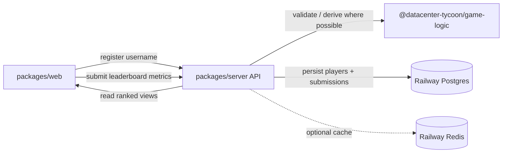
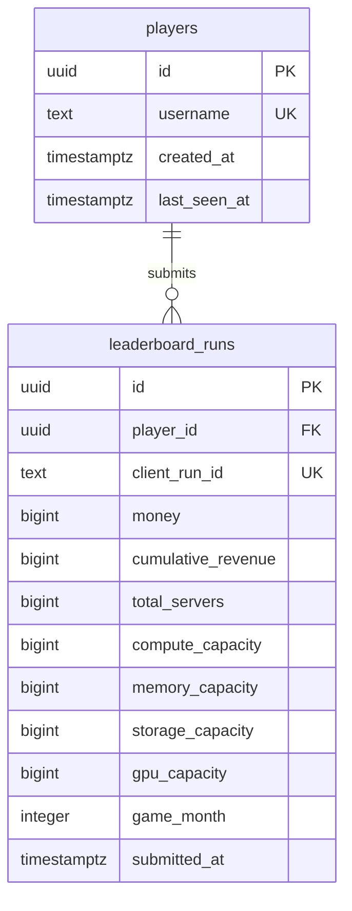

## Progress

- [x] **Phase 1 — Backend API foundation**
  - [x] 1.1 Choose and scaffold the server HTTP boundary
  - [x] 1.2 Add health, version, and environment validation endpoints
  - [x] 1.3 Add server test utilities for API requests
- [x] **Phase 2 — Player identity without passwords**
  - [x] 2.1 Model username registration and anonymous player ids
  - [x] 2.2 Implement username availability and registration endpoints
  - [x] 2.3 Wire frontend startup/play flow to register a username
- [x] **Phase 3 — Leaderboard persistence**
  - [x] 3.1 Add Postgres schema and migration workflow
  - [x] 3.2 Implement leaderboard submission storage
  - [x] 3.3 Implement leaderboard query endpoints
- [x] **Phase 4 — Metric derivation and validation**
  - [x] 4.1 Define accepted leaderboard metric payloads
  - [x] 4.2 Derive or validate totals with `game-logic` helpers where possible
  - [x] 4.3 Add abuse-resistant submission rules
- [ ] **Phase 5 — Railway deployment infrastructure**
  - [ ] 5.1 Add Railway service configuration for the server
  - [ ] 5.2 Add Postgres provisioning and environment documentation
  - [ ] 5.3 Decide whether Redis is required for leaderboard caching
- [ ] **Phase 6 — Operations, CI, and documentation**
  - [ ] 6.1 Add server CI coverage for build, typecheck, tests, and migrations
  - [ ] 6.2 Document local development and Railway deployment
  - [ ] 6.3 Add release-readiness checks for the first backend launch

## Overview

Datacenter Tycoon currently has a placeholder `@datacenter-tycoon/server` package, but no persistent backend for sharing scores. This plan introduces the first production-oriented backend slice: username registration when a user starts playing on the frontend, submission of top-level leaderboard metrics, leaderboard reads, and Railway deployment configuration. The backend should not store passwords, support cross-device session restore, or persist full game-state snapshots in this first iteration. It should keep transport thin, treat client input as untrusted, and reuse `@datacenter-tycoon/game-logic` for validation or derived gameplay answers where practical.

## Architecture





Key decisions:

- Use the existing `packages/server` workspace as the backend home; do not add a new package.
- Store only durable top-level leaderboard facts, not full save files or complete game snapshots.
- Treat usernames as lightweight player identity. The frontend may store the returned player id locally, but the backend does not issue passwords or promise account restoration on another device.
- Use Postgres as the source of truth for players and leaderboard submissions. Add Redis only if query load or ranking latency requires a cache; the first implementation should work correctly without Redis.
- Keep validation conservative: reject malformed, negative, or impossible-looking metrics, and prefer server-side derivation from accepted summaries or deterministic replay data when available.

Illustrative API shape:

```ts
type LeaderboardMetricKey =
  | "money"
  | "cumulativeRevenue"
  | "totalServers"
  | "computeCapacity"
  | "memoryCapacity"
  | "storageCapacity"
  | "gpuCapacity";

interface LeaderboardSubmission {
  playerId: string;
  clientRunId: string;
  metrics: Record<LeaderboardMetricKey, number>;
  gameMonth: number;
}
```

## Phase 1 — Backend API foundation

**Goal**: turn the placeholder server package into a testable HTTP service without implementing persistence yet.

### Step 1.1 — Choose and scaffold the server HTTP boundary

- Files: `packages/server/package.json`, `packages/server/src/index.ts`, new files under `packages/server/src/server/`.
- Select the smallest appropriate HTTP stack for Node 22 and TypeScript ESM.
- Keep the entrypoint thin: load configuration, create the server app, and start listening only when run directly.
- Acceptance: `npm run build -w @datacenter-tycoon/server`, `npm run typecheck -w @datacenter-tycoon/server`, and `npm run test -w @datacenter-tycoon/server` pass.

### Step 1.2 — Add health, version, and environment validation endpoints

- Files: `packages/server/src/config.ts`, `packages/server/src/routes/health.ts`, `packages/server/src/index.test.ts`.
- Add `GET /healthz` for liveness and `GET /version` exposing server and game-logic versions.
- Validate required environment variables at startup, with database-related variables optional until Phase 3.
- Acceptance: endpoint tests cover healthy startup and missing required configuration errors.

### Step 1.3 — Add server test utilities for API requests

- Files: `packages/server/src/test-utils/`, `packages/server/src/**/*.test.ts`.
- Add reusable helpers for constructing the app without binding a network port.
- Ensure tests can inject fake configuration and fake persistence dependencies.
- Acceptance: route tests use the helpers and do not require real Postgres, Redis, or Railway services.

## Phase 2 — Player identity without passwords

**Goal**: let a frontend player claim a username for the current browser/device without implementing password authentication or cross-device restore.

### Step 2.1 — Model username registration and anonymous player ids

- Files: `packages/server/src/players/`, `packages/server/src/types.ts`.
- Define username normalization, length limits, allowed characters, and case-insensitive uniqueness.
- Generate opaque server-side player ids and return them to the client after registration.
- Acceptance: unit tests cover valid usernames, rejected usernames, duplicate normalization, and generated id shape.

### Step 2.2 — Implement username availability and registration endpoints

- Files: `packages/server/src/routes/players.ts`, persistence interfaces under `packages/server/src/players/`.
- Add `GET /players/availability?username=...`.
- Add `POST /players` to register a username and return `{ playerId, username }`.
- Return stable, user-friendly error codes for invalid or unavailable usernames.
- Acceptance: API tests cover successful registration, duplicate usernames, invalid input, and persistence failures.

### Step 2.3 — Wire frontend startup/play flow to register a username

- Files: `packages/web/src/**`, `packages/web/AGENTS.md` if new frontend conventions are needed.
- Add a username prompt before or during game start when no local player id exists.
- Store only the returned player id and username in browser-local storage for the current device.
- Keep gameplay usable if the backend is unavailable by clearly surfacing that online leaderboard submission is disabled.
- Acceptance: web tests cover first-time registration, already-registered local identity, and backend-unavailable fallback.

## Phase 3 — Leaderboard persistence

**Goal**: persist players and top-level leaderboard submissions in Postgres, then expose ranked read APIs.

### Step 3.1 — Add Postgres schema and migration workflow

- Files: `packages/server/src/db/`, `packages/server/migrations/`, `packages/server/package.json`.
- Add a migration command suitable for local development and Railway deploys.
- Create `players` and `leaderboard_runs` tables with indexes for username lookup, per-player run history, and leaderboard ranking metrics.
- Keep schema values primitive and JSON-serializable; avoid storing full game snapshots.
- Acceptance: migrations run against a local Postgres database and are covered by integration-test setup documentation.

### Step 3.2 — Implement leaderboard submission storage

- Files: `packages/server/src/leaderboard/`, `packages/server/src/routes/leaderboard.ts`.
- Add `POST /leaderboard/runs` to store one top-level run summary per client run id.
- Persist money, cumulative revenue, total servers, capacity totals, game month, player id, and submitted timestamp.
- Enforce idempotency for duplicate client run ids from the same browser.
- Acceptance: tests cover successful insert, idempotent retry, unknown player id, invalid metrics, and database errors.

### Step 3.3 — Implement leaderboard query endpoints

- Files: `packages/server/src/routes/leaderboard.ts`, `packages/server/src/leaderboard/queries.ts`.
- Add `GET /leaderboard?metric=money&period=all-time&limit=...`.
- Return rank, username, selected metric value, submitted timestamp, and supporting summary metrics.
- Support ranking by money, total capacity, total servers, and cumulative revenue at minimum.
- Acceptance: query tests prove deterministic ordering, limit handling, tie-breaking, and metric validation.

## Phase 4 — Metric derivation and validation

**Goal**: make leaderboard submissions useful without trusting arbitrary client data more than necessary.

### Step 4.1 — Define accepted leaderboard metric payloads

- Files: `packages/server/src/leaderboard/types.ts`, `packages/game-logic/src/query/` if shared metric extraction is needed.
- Define the exact metric names, numeric bounds, integer requirements, and total-capacity representation.
- Decide whether total capacity is stored as per-resource columns plus a derived display score, or a separate aggregate value.
- Acceptance: server and frontend share one typed payload shape or generated contract, and tests reject unknown or missing metrics.

### Step 4.2 — Derive or validate totals with `game-logic` helpers where possible

- Files: `packages/game-logic/src/query/`, `packages/server/src/leaderboard/validation.ts`.
- Add or reuse read-only helpers in `game-logic` for total servers, capacity totals, money, and cumulative revenue summaries.
- Have the frontend submit values produced by those helpers rather than duplicating metric reducers in UI code.
- Use the same helpers server-side for any submitted summary format that can be recomputed without full snapshot storage.
- Acceptance: game-logic tests cover the shared summary helper and server tests prove submissions generated by the helper are accepted.

### Step 4.3 — Add abuse-resistant submission rules

- Files: `packages/server/src/leaderboard/validation.ts`, `packages/server/src/rate-limit/` if needed.
- Reject negative values, unsafe integers, impossible month values, and submissions that go backwards for the same client run where monotonicity is expected.
- Add simple rate limiting if anonymous clients can otherwise spam registrations or submissions.
- Avoid promising anti-cheat guarantees until deterministic replay verification or signed run summaries are designed.
- Acceptance: tests cover rejection paths and documentation states the trust model clearly.

## Phase 5 — Railway deployment infrastructure

**Goal**: make the backend deployable to Railway with Postgres as the production database and Redis only if justified.

### Step 5.1 — Add Railway service configuration for the server

- Files: `railway.toml` or package-level Railway config if the repository standardizes there, `packages/server/package.json`.
- Configure install, build, migration, and start commands for the `@datacenter-tycoon/server` workspace.
- Ensure the service binds to Railway's provided `PORT`.
- Acceptance: Railway can build the server from the monorepo without building unrelated deploy artifacts.

### Step 5.2 — Add Postgres provisioning and environment documentation

- Files: `packages/server/README.md`, `.env.example` or `packages/server/.env.example`.
- Document required variables such as `DATABASE_URL`, `PORT`, CORS origins, and any migration command.
- Describe how to attach a Railway Postgres service and use its connection URL.
- Acceptance: a developer can run the server locally against Postgres and deploy it on Railway using the documented variables.

### Step 5.3 — Decide whether Redis is required for leaderboard caching

- Files: `packages/server/docs/` or `packages/server/README.md`, optional Redis integration files if adopted.
- Start with Postgres leaderboard queries and measure whether indexes are enough for expected traffic.
- If Redis is added, use it as a cache or sorted-set projection only; Postgres remains the source of truth.
- Document cache invalidation, fallback behavior, and Railway Redis environment variables.
- Acceptance: either no Redis code is added with a documented rationale, or Redis-backed tests prove rankings fall back to Postgres when Redis is unavailable.

## Phase 6 — Operations, CI, and documentation

**Goal**: make the backend maintainable after launch.

### Step 6.1 — Add server CI coverage for build, typecheck, tests, and migrations

- Files: root `package.json`, package scripts, existing CI workflow files if backend-specific coverage is missing.
- Ensure server build, typecheck, unit tests, and migration checks run in CI.
- Use a service Postgres container for integration tests only if tests cannot remain dependency-injected.
- Acceptance: CI exercises the server package and fails on broken migrations or API contracts.

### Step 6.2 — Document local development and Railway deployment

- Files: `packages/server/README.md`, root `README.md` if it has package setup notes.
- Document local install, environment variables, database setup, migrations, development server, and test commands.
- Include Railway deployment steps and rollback considerations.
- Acceptance: documentation includes copy-pasteable commands and distinguishes local-only values from Railway-provided values.

### Step 6.3 — Add release-readiness checks for the first backend launch

- Files: `packages/server/README.md`, plan follow-up notes if needed.
- Verify CORS, request size limits, rate limits, logging, health checks, migration order, and database backups before public use.
- Add a small manual smoke-test checklist for registering a username, submitting a run, and viewing leaderboard entries from the frontend.
- Acceptance: the backend is deployable, observable enough for first use, and has a documented path for rollback or disabling online leaderboard submission.

## References

- [`packages/server/AGENTS.md`](../../packages/server/AGENTS.md)
- [`packages/server/package.json`](../../packages/server/package.json)
- [`packages/server/src/index.ts`](../../packages/server/src/index.ts)
- [`package.json`](../../package.json)
- [Railway Deployments](https://docs.railway.com/guides/deployments)
- [Railway Postgres](https://docs.railway.com/guides/postgresql)
- [Railway Redis](https://docs.railway.com/guides/redis)

## Manual rollout checklist (not yet executed)

- [ ] Create the Railway project/service for `@datacenter-tycoon/server`.
- [ ] Add a Railway Postgres service and attach its `DATABASE_URL` to the server.
- [ ] Configure production environment variables (`PORT`, `DATABASE_URL`, CORS origin list, and any rate-limit settings introduced by this plan).
- [ ] Run the production migration command against Railway Postgres before enabling public traffic.
- [ ] Point `api.dctycoon.arnav.tech` DNS to the Railway-provided domain.
- [ ] Add `api.dctycoon.arnav.tech` as a custom domain in Railway and wait for TLS issuance.
- [ ] Verify `/healthz`, `/version`, player registration, leaderboard submission, and leaderboard reads against the Railway URL.
- [ ] Update the web frontend production environment to use `https://api.dctycoon.arnav.tech`.
- [ ] Decide whether to enable the backend publicly immediately or keep leaderboard submission disabled behind a frontend flag.

## Changelog

- 2026-05-18 — Created initial backend leaderboard foundation plan.
- 2026-05-18 — Started implementation and added a manual post-code rollout checklist.
- 2026-05-18 — Added monotonic leaderboard updates, rate limiting, and an explicit trust-model note for backend submissions.
