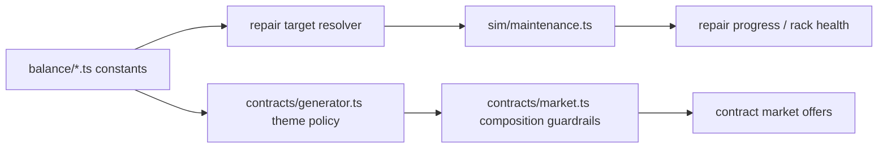

## Progress

- [x] **Phase 1 — Baseline audit and balance targets**
  - [x] 1.1 Audit current repair and contract-market balance levers
  - [x] 1.2 Lock target repair windows and market-composition floors
  - [x] 1.3 Record validation baseline and known local blockers
- [x] **Phase 2 — Rack-aware repair duration model**
  - [x] 2.1 Replace the single repair baseline with rack-kind-aware repair targets
  - [x] 2.2 Thread rack-aware repair targets through simulation and query helpers
  - [x] 2.3 Expand maintenance regression tests for normal-vs-GPU repairs and staffing effects
- [x] **Phase 3 — Deterministic market-composition guardrails**
  - [x] 3.1 Add explicit unrestricted/global-offer floor rules during market fill
  - [x] 3.2 Add explicit non-GPU-offer floor rules for late-game markets
  - [x] 3.3 Keep GPU offers present without letting late-game demand become purely GPU-only
- [x] **Phase 4 — Balance versioning, tests, and docs**
  - [x] 4.1 Bump `BALANCE_VERSION` and update balance-sensitive assertions
  - [x] 4.2 Update generator/market tests for unrestricted and non-GPU floor guarantees
  - [x] 4.3 Add changelog/docs notes explaining the rebalance rationale
- [ ] **Phase 5 — Verification and wrap-up**
  - [x] 5.1 Run targeted game-logic validation commands
  - [ ] 5.2 Run CodeQL review and resolve localized findings
  - [ ] 5.3 Update this plan to reflect completed work and remaining follow-ups

## Overview

The current repair and contract-market tuning overshoots in two ways. Repair durations were originally moved down to very short outages, but the model is still a single shared baseline instead of reflecting that GPUs usually take materially longer to repair than other rack types. Meanwhile, the contract market currently relies on theme weights alone, which can leave players underserved by unrestricted/global offers and can let late-game GPU demand crowd out normal compute, memory, and storage work.

This plan rebalances those systems inside `@datacenter-tycoon/game-logic` only, preserving determinism and keeping all tuning constants in balance modules. The goal is to make repairs feel more believable, reward maintenance staffing, and keep the market diverse enough that players are not boxed into only region-constrained or GPU-heavy contracts later in a run.

## Architecture



```mermaid
flowchart TD
    ExistingOffers[Retained offers] --> Fill[fillMarketOffers()]
    Fill --> GlobalFloor{enough unrestricted?}
    GlobalFloor -->|no| GenerateGlobal[generate unrestricted candidate]
    GlobalFloor -->|yes| MixCheck{enough non-GPU?}
    GenerateGlobal --> MixCheck
    MixCheck -->|no| GenerateNonGpu[generate non-GPU candidate]
    MixCheck -->|yes| StandardGenerate[normal theme generation]
    GenerateNonGpu --> StandardGenerate
    StandardGenerate --> Result[Deterministic refreshed market]
```

Key decisions:

- Repair duration should be derived from rack kind (or spec kind), not a single global baseline, while keeping maintenance staff as a speed multiplier rather than a direct duration override.
- GPU racks should remain materially slower to repair than compute/memory/storage racks, but not so slow that one failure stalls a whole quarter.
- Contract variety should be enforced at market-fill time with explicit floors, because theme weights alone cannot guarantee a player-friendly mix across all seeds and late-game difficulty levels.
- Late-game GPU demand should increase, but non-GPU themes must remain part of the candidate pool so normal datacenter builds still have viable work.
- All market-shaping changes must stay on the seeded RNG path and preserve deterministic output for the same state and action history.

Illustrative helper shape:

```ts
interface ContractGenerationConstraints {
  requireUnrestricted?: boolean;
  requireNonGpu?: boolean;
}

function repairDurationDaysForRack(rackKind: RackKind, difficulty: Difficulty): number;
function generateContractWithConstraints(
  rng: Rng,
  difficulty: number,
  constraints: ContractGenerationConstraints,
): Contract;
```

## Phase 1 — Baseline audit and balance targets

**Goal**: document the current levers, define concrete targets, and capture any existing validation blockers before deeper code changes.

### Step 1.1 — Audit current repair and contract-market balance levers

- Files: `packages/game-logic/src/balance/maintenance.ts`, `packages/game-logic/src/sim/maintenance.ts`, `packages/game-logic/src/contracts/generator.ts`, `packages/game-logic/src/contracts/market.ts`, related tests.
- Confirm how repair duration, maintenance staffing, theme availability, affinity weights, and market refill currently work.
- Record which helpers already centralize the relevant policy so the rebalance stays localized.
- Acceptance: plan architecture and later steps reference the authoritative modules instead of duplicating rules elsewhere.

### Step 1.2 — Lock target repair windows and market-composition floors

- Files: `packages/game-logic/src/balance/maintenance.ts`, `packages/game-logic/src/contracts/generator.ts`, `packages/game-logic/src/contracts/market.ts`.
- Decide target baseline repair ranges for compute/memory/storage vs GPU racks, with difficulty scaling applied after rack-kind tuning.
- Decide minimum unrestricted/global offer share and minimum non-GPU share for later-stage markets.
- Keep these targets represented as tunable balance constants instead of inline literals in simulation or market code.
- Acceptance: all new numeric knobs live in `packages/game-logic/src/balance/` or clearly policy-owned modules and can be explained in tests/docs.

### Step 1.3 — Record validation baseline and known local blockers

- Files: this plan, optionally docs/changelog notes if validation caveats remain relevant.
- Capture the current local validation baseline before implementation.
- Note pre-existing blockers discovered during setup so later validation failures can be distinguished from rebalance regressions.
- Acceptance: the implementation log makes clear which failures were already present before code changes.

## Phase 2 — Rack-aware repair duration model

**Goal**: make repair time believable by rack type while preserving daily repair progress and maintenance staffing benefits.

### Step 2.1 — Replace the single repair baseline with rack-kind-aware repair targets

- Files: `packages/game-logic/src/balance/maintenance.ts`, `packages/game-logic/src/balance/index.ts`.
- Introduce separate base repair targets for non-GPU rack kinds and GPU racks, keeping all tuning in balance modules.
- Add any helper needed to resolve a base target from `RackKind`.
- Keep existing repair-speed constants unless balancing evidence shows they also need tuning.
- Acceptance: repair-duration policy can answer different baseline targets for GPU and non-GPU racks without branching on magic numbers in simulation code.

### Step 2.2 — Thread rack-aware repair targets through simulation and query helpers

- Files: `packages/game-logic/src/sim/maintenance.ts`, `packages/game-logic/src/query/datacenters.ts`, any affected exports/tests.
- Update `repairDurationDays(...)` and repair progression helpers so they can derive the correct duration from a rack’s kind.
- Preserve maintenance-staff speedups exactly as an acceleration over the base duration.
- Update any ETA/query helpers that still assume one global repair target.
- Acceptance: repairing GPU racks take longer than standard racks at the same staffing level, and more maintenance staff still shortens both.

### Step 2.3 — Expand maintenance regression tests for normal-vs-GPU repairs and staffing effects

- Files: `packages/game-logic/src/sim/maintenance.test.ts`, optionally `packages/game-logic/src/query/datacenters.test.ts`.
- Add tests for non-GPU racks repairing within a few days and GPU racks taking around the intended 8–10+ day window at baseline staffing.
- Add tests proving added maintenance staff lowers time-to-repair for both classes.
- Update any assertions that still assume a single `BASE_REPAIR_DAYS`.
- Acceptance: tests lock in rack-type differences, difficulty scaling, and staffing improvements.

## Phase 3 — Deterministic market-composition guardrails

**Goal**: ensure the contract market reliably includes enough unrestricted and non-GPU work without losing late-game GPU opportunities.

### Step 3.1 — Add explicit unrestricted/global-offer floor rules during market fill

- Files: `packages/game-logic/src/contracts/market.ts`, `packages/game-logic/src/contracts/generator.ts`.
- Add deterministic fill-time checks so each refreshed market contains a minimum number or share of unrestricted offers.
- Prefer generating constrained candidates through generator helpers rather than mutating finished contracts after the fact.
- Preserve existing retained-offer behavior and seeded RNG ordering as much as possible.
- Acceptance: market refreshes consistently include unrestricted offers across representative seeds and ticks.

### Step 3.2 — Add explicit non-GPU-offer floor rules for late-game markets

- Files: `packages/game-logic/src/contracts/generator.ts`, `packages/game-logic/src/contracts/market.ts`.
- Add a policy that keeps some generated offers at `gpuFlops === 0` even when difficulty is high and GPU themes are unlocked.
- Ensure this floor is applied during market fill, not just early-game theme availability.
- Acceptance: later-stage markets still surface meaningful compute/memory/storage contracts alongside GPU work.

### Step 3.3 — Keep GPU offers present without letting late-game demand become purely GPU-only

- Files: `packages/game-logic/src/contracts/generator.ts`, `packages/game-logic/src/contracts/contracts.test.ts`.
- Review theme-availability and theme-selection rules so GPU demand remains common later but does not dominate the entire market.
- Adjust theme filtering or candidate constraints carefully so high-difficulty markets still feel advanced.
- Acceptance: high-difficulty samples contain both GPU and non-GPU offers, with GPU clearly present but not exclusive.

## Phase 4 — Balance versioning, tests, and docs

**Goal**: make the rebalance explicit, regression-tested, and discoverable for future contributors.

### Step 4.1 — Bump `BALANCE_VERSION` and update balance-sensitive assertions

- Files: `packages/game-logic/src/economy/constants.ts`, `packages/game-logic/src/catalog/catalog.test.ts`, any other balance-version references.
- Increment the balance version because this rebalance changes gameplay outcomes for existing saves/replays.
- Update tests that assert the balance version directly.
- Acceptance: balance versioning reflects the new tuning baseline.

### Step 4.2 — Update generator/market tests for unrestricted and non-GPU floor guarantees

- Files: `packages/game-logic/src/contracts/contracts.test.ts`, optionally `packages/game-logic/src/query/contracts.test.ts`.
- Add deterministic regression coverage for unrestricted/global availability and late-game non-GPU offer floors.
- Ensure tests validate the refreshed market mix, not just isolated single-contract generation.
- Acceptance: the contract suite fails if a future rebalance removes unrestricted or non-GPU market presence.

### Step 4.3 — Add changelog/docs notes explaining the rebalance rationale

- Files: `CHANGELOG.md` if missing, or the repository’s canonical changelog location; optionally `packages/game-logic/README.md`.
- Record why repairs and market composition changed, including the player-facing goals behind the new tuning.
- Keep the note concise and balance-focused.
- Acceptance: future contributors can understand the rationale without reconstructing it from commits alone.

## Phase 5 — Verification and wrap-up

**Goal**: verify the targeted package as far as the current environment allows, run security review, and leave the plan resumable.

### Step 5.1 — Run targeted game-logic validation commands

- Files: none (validation only).
- Run `npm run typecheck -w @datacenter-tycoon/game-logic` and `npm run test -w @datacenter-tycoon/game-logic`.
- If local environment or pre-existing workspace issues block validation, capture the exact failure in progress updates/final notes.
- Acceptance: successful runs are recorded, or blocking failures are clearly identified as pre-existing vs newly introduced.

### Step 5.2 — Run CodeQL review and resolve localized findings

- Files: any localized fixes required by CodeQL.
- Run `codeql_checker` after the implementation settles.
- Fix any localized true positives introduced or exposed by the rebalance.
- Acceptance: CodeQL is rerun after fixes, or remaining findings are documented if they are non-local/unrelated.

### Step 5.3 — Update this plan to reflect completed work and remaining follow-ups

- Files: this plan, `.agents/plans/README.md`.
- Tick completed steps, keep `updated` current, and set `status` to `completed` only when every phase is done.
- If follow-up work is deferred, leave the remaining unchecked steps as the next starting point.
- Acceptance: a later agent can resume from the first unchecked step without re-discovering context.

## References

- [Root AGENTS.md](../../AGENTS.md)
- [game-logic AGENTS.md](../../packages/game-logic/AGENTS.md)
- [021-reliability-score-and-contract-slas.md](./archive/021-reliability-score-and-contract-slas.md)
- [034-contract-region-affinity.md](./archive/034-contract-region-affinity.md)
- [037-subticks.md](./037-subticks.md)
- [planning skill](../skills/planning/SKILL.md)
- [game-balance-tuning skill](../skills/game-balance-tuning/SKILL.md)

## Changelog

- 2026-05-18 — created and started after auditing current repair and contract-market balance levers.
- 2026-05-18 — implemented rack-kind-aware repair targets, deterministic unrestricted/non-GPU market floors, updated tests, and recorded the `BALANCE_VERSION` 6 rationale.
