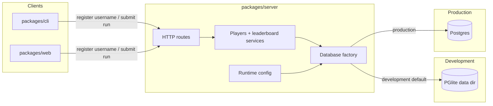
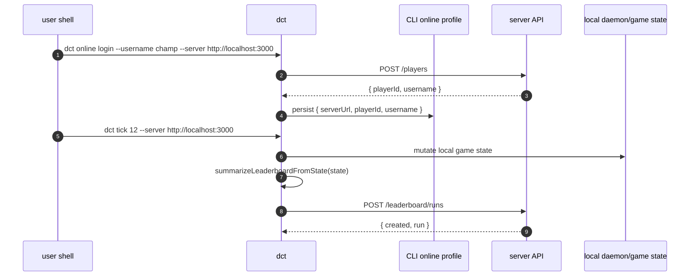

## Progress

- [x] **Phase 1 — Configuration and integration boundaries**
  - [x] 1.1 Define server database-mode configuration and startup rules
  - [x] 1.2 Define CLI online profile storage and `--server` precedence
  - [x] 1.3 Centralize web API base-URL resolution for dev and production
- [x] **Phase 2 — Server database abstraction and PGlite development mode**
  - [x] 2.1 Introduce a database adapter boundary shared by repositories and migrations
  - [x] 2.2 Add direct PGlite support for file-backed development storage
  - [x] 2.3 Make migration and health-check flows provider-aware
- [x] **Phase 3 — CLI online identity and leaderboard submission**
  - [x] 3.1 Add CLI online profile persistence and HTTP client helpers
  - [x] 3.2 Add CLI commands for registering, inspecting, and clearing online identity
  - [x] 3.3 Submit leaderboard summaries from CLI commands and the interactive TUI
- [x] **Phase 4 — Web development and production API targeting**
  - [x] 4.1 Add environment-aware web API configuration for localhost dev and real-server production
  - [x] 4.2 Keep startup and leaderboard-sync UX resilient under online/offline conditions
- [x] **Phase 5 — Local dev workflow, testing, and docs**
  - [x] 5.1 Add combined local-dev scripts for server + web
  - [x] 5.2 Add automated coverage for PGlite dev mode, CLI `--server`, and web localhost wiring
  - [x] 5.3 Update server, web, and CLI documentation for dev/prod online flows

## Overview

Datacenter Tycoon already has a backend for username registration and leaderboard submissions, and the web client already knows how to use it when `VITE_API_BASE_URL` is configured. What is still missing is parity for the CLI, a friction-free local-development story, and a clear runtime split between development and production database providers. This plan adds a durable online identity flow for the CLI, lets CLI runs submit leaderboard summaries to a configurable server URL, makes the web app target localhost automatically in development, and makes the backend default to a persistent file-backed PGlite database in development while keeping production on real Postgres.

The goal is to make the following scenarios boring and reliable:

1. `dct ... --server http://localhost:3000` can register a username and sync leaderboard scores.
2. `npm run dev:server` works locally without requiring a separately installed Postgres daemon.
3. `npm run dev:web` talks to the local backend during development.
4. Production web builds point at the real deployed API.
5. Production server runtime uses Postgres, while local development uses PGlite by default.

## Architecture





Key decisions:

- Keep `@datacenter-tycoon/game-logic` as the source of truth for leaderboard-summary derivation. Both web and CLI should submit metrics produced by `summarizeLeaderboardFromState(...)` rather than maintaining separate reducers.
- Do **not** move online HTTP code into `game-logic`; networking is not game rules.
- Keep the server route/service layering intact. The new database-provider work should happen behind a small queryable database adapter rather than leaking PGlite branches into route handlers.
- Use **direct PGlite integration** in Node development mode, not a separate socket sidecar. PGlite documents support `npm install @electric-sql/pglite`, filesystem persistence via `new PGlite('./path/to/datadir')`, and `query(text, params)` style execution compatible with the current repository shape.
- Store CLI online identity separately from save-game JSON. Player identity is cross-run user configuration; save files remain gameplay state.
- `--server` must be an override, not the only configuration path. The CLI should be scriptable for one-off targets while also remembering a previously registered server+identity combination.
- Preserve today’s offline resilience: failure to reach the online backend must not block local gameplay in either web or CLI.

Illustrative configuration shapes:

```ts
export interface ServerDatabaseConfig {
  mode: "postgres" | "pglite";
  databaseUrl?: string;
  pgliteDataDir?: string;
}

export interface CliOnlineProfile {
  serverUrl: string;
  playerId: string;
  username: string;
}

export interface ResolvedOnlineTarget {
  serverUrl: string | null;
  source: "flag" | "profile" | "env" | "disabled";
}
```

Resolution rules to implement:

- **Server runtime**
  - `production` → require Postgres / `DATABASE_URL`.
  - `development` → use Postgres when `DATABASE_URL` is explicitly set; otherwise default to PGlite persisted on disk.
  - `test` → keep current dependency-injected/in-memory test setup unless a test explicitly asks for PGlite.
- **CLI server URL**
  - `--server <url>` for the current process wins.
  - Otherwise use stored online profile URL.
  - Otherwise use an optional environment variable (if introduced for scripting).
  - Otherwise online sync is disabled.
- **Web server URL**
  - In development, default to `http://localhost:3000` unless overridden.
  - In production, use the configured real API URL; leaving it empty intentionally keeps the current “offline/local-only” fallback available as a controlled rollout/rollback lever.

## Phase 1 — Configuration and integration boundaries

**Goal**: make the runtime rules explicit before changing implementation so server, web, and CLI all resolve their online dependencies consistently.

### Step 1.1 — Define server database-mode configuration and startup rules

- Files: `packages/server/src/config.ts`, `packages/server/src/index.ts`, `packages/server/src/types.ts`, new `packages/server/src/db/database.ts`.
- Add a typed server database config describing provider mode and required settings.
- Encode the intended defaults:
  - production requires Postgres;
  - development defaults to PGlite when `DATABASE_URL` is absent;
  - tests keep using dependency injection/in-memory repositories unless explicitly opting into file-backed DB coverage.
- Decide and document the exact env surface (for example `DATABASE_URL`, optional `PGLITE_DATA_DIR`, and optional explicit provider override if needed).
- Acceptance: config unit tests cover production-without-Postgres failure, development defaulting to PGlite, and development Postgres override when `DATABASE_URL` is present.

### Step 1.2 — Define CLI online profile storage and `--server` precedence

- Files: `packages/cli/src/argv.ts`, `packages/cli/src/cli.ts`, `packages/cli/src/paths.ts`, new files under `packages/cli/src/online/`.
- Add `--server` to the CLI global flag list and help text.
- Extend the CLI path resolver with a durable config path for online identity/profile data separate from the save file.
- Define the persisted profile shape (`serverUrl`, `playerId`, `username`) and URL-resolution precedence (`--server` > stored profile > optional env > disabled).
- Decide the command surface for onboarding and inspection, e.g. `dct online login`, `dct online status`, `dct online logout`, and optional `dct online submit` for explicit/manual sync.
- Acceptance: argv/profile tests prove flag parsing, help text, config-path resolution, and precedence rules.

### Step 1.3 — Centralize web API base-URL resolution for dev and production

- Files: `packages/web/src/online/players.ts`, `packages/web/src/online/leaderboard.ts`, new `packages/web/src/online/config.ts`, `packages/web/vite.config.ts`.
- Move API base-URL resolution into one shared helper instead of letting `players.ts` own it implicitly.
- Make development default to localhost without requiring manual code edits.
- Keep production URL configuration explicit so deployments point at the real backend, while still allowing the existing “backend disabled” fallback when the environment intentionally omits the URL.
- Acceptance: unit tests cover explicit env override, development localhost fallback, and production-mode resolution behavior.

## Phase 2 — Server database abstraction and PGlite development mode

**Goal**: make the backend run against a persistent local database in development without breaking the existing repository/service layering or production Postgres usage.

### Step 2.1 — Introduce a database adapter boundary shared by repositories and migrations

- Files: new `packages/server/src/db/database.ts`, `packages/server/src/db/migrator.ts`, `packages/server/src/players/postgres-repository.ts`, `packages/server/src/leaderboard/repository.ts`, relevant tests.
- Replace direct `pg`-typed assumptions at the repository/migration boundary with a small queryable adapter interface used by both Postgres and PGlite implementations.
- Keep SQL in the repositories and migrations; only the connection/bootstrap concerns should differ by provider.
- Add adapter lifecycle helpers so startup and tests can open/close the chosen provider cleanly.
- Acceptance: repository and migrator tests can execute against the abstract database interface without branching in route/service code.

### Step 2.2 — Add direct PGlite support for file-backed development storage

- Files: `packages/server/package.json`, `packages/server/src/index.ts`, `packages/server/src/config.ts`, new provider implementation under `packages/server/src/db/`.
- Install `@electric-sql/pglite` and wire a development-time database implementation backed by a filesystem data directory.
- Pick a stable default dev path (for example under `packages/server/.data/` or another ignored local-data directory) and document how to override it.
- Ensure startup logs and `/healthz` make the active database mode visible so developers can confirm whether they are on PGlite or Postgres.
- Acceptance: with no `DATABASE_URL` in development, `npm run dev:server` starts successfully, persists data across restarts, and reports a configured database mode in health/version output.

### Step 2.3 — Make migration and health-check flows provider-aware

- Files: `packages/server/src/db/migrate.ts`, `packages/server/src/db/check-migrations.ts`, `packages/server/src/routes/health.ts`, `packages/server/README.md`, `packages/server/.env.example`.
- Update migration commands so they operate against whichever provider the current config resolves to.
- Keep production migration behavior Postgres-compatible and explicit.
- Add tests that exercise migrations against a temporary PGlite data directory and preserve the existing Postgres migration check path.
- Acceptance: migration scripts and health endpoint tests cover both the development PGlite path and the production/Postgres path.

## Phase 3 — CLI online identity and leaderboard submission

**Goal**: let the CLI opt into the same online player identity and leaderboard-submission flow that already exists for the web client.

### Step 3.1 — Add CLI online profile persistence and HTTP client helpers

- Files: new `packages/cli/src/online/players.ts`, `packages/cli/src/online/leaderboard.ts`, `packages/cli/src/online/profile.ts`, updates to `packages/cli/src/paths.ts`.
- Implement thin HTTP helpers for player registration and leaderboard submission shaped like the web client, but adapted for Node/CLI usage.
- Reuse `summarizeLeaderboardFromState(...)` from `@datacenter-tycoon/game-logic` to build submission payloads.
- Persist the registered identity and target server URL in a separate CLI config file.
- Acceptance: unit tests cover profile round-trip, request construction, structured error mapping, and disabled/offline behavior.

### Step 3.2 — Add CLI commands for registering, inspecting, and clearing online identity

- Files: `packages/cli/src/cli.ts`, `packages/cli/src/argv.ts`, new `packages/cli/src/commands/online.ts`, related tests.
- Add a noun-first online command surface such as:
  - `dct online login --username <name> [--server <url>]`
  - `dct online status [--json]`
  - `dct online logout`
  - optional `dct online submit` for an explicit one-shot sync command.
- Ensure `--server` works both for online commands and as a global override for other commands/TUI sessions that may auto-sync.
- Return script-friendly JSON when `--json` is set.
- Acceptance: command tests prove successful registration against a test server, profile reuse, logout behavior, and error surfaces for invalid usernames/unreachable servers.

### Step 3.3 — Submit leaderboard summaries from CLI commands and the interactive TUI

- Files: relevant mutating command handlers under `packages/cli/src/commands/`, `packages/cli/src/tui/app.ts`, new `packages/cli/src/online/sync.ts`.
- Add a shared CLI sync helper that:
  - reads the active game snapshot after a successful state-changing operation;
  - skips submission until the run has actually progressed;
  - debounces duplicate submissions using the serialized leaderboard payload signature;
  - treats online failures as warnings/status messages rather than fatal gameplay errors.
- Keep networking at the CLI client/TUI layer rather than embedding it into daemon core gameplay runtime.
- Acceptance: CLI integration tests prove that `dct ... --server http://127.0.0.1:<port>` can submit a run after ticking, and that an unreachable server does not break local command execution or TUI play.

## Phase 4 — Web development and production API targeting

**Goal**: make the web app talk to localhost during local development and to the real API in production, without hand-editing source files.

### Step 4.1 — Add environment-aware web API configuration for localhost dev and real-server production

- Files: `packages/web/src/online/config.ts`, `packages/web/vite.config.ts`, optional web env/example files, deployment docs.
- Make local development default to `http://localhost:3000` while still allowing `VITE_API_BASE_URL` overrides.
- Ensure production deployments provide the real backend URL through environment configuration rather than source edits.
- Preserve the ability to intentionally disable online submission by omitting the production variable for rollback scenarios.
- Acceptance: running `npm run dev:web` alongside `npm run dev:server` uses the local backend without code changes; production docs specify the real API variable explicitly.

### Step 4.2 — Keep startup and leaderboard-sync UX resilient under online/offline conditions

- Files: `packages/web/src/App.tsx`, `packages/web/src/online/*.test.ts`, `packages/web/src/App.test.tsx`.
- Update tests and status-copy expectations so the web onboarding flow still behaves well when localhost is unavailable, when a production URL is set, and when online sync is intentionally disabled.
- Avoid regressing the current “local play continues even if registration/submission fails” behavior.
- Acceptance: web tests cover dev localhost success, network failure fallback, and production URL override.

## Phase 5 — Local dev workflow, testing, and docs

**Goal**: make the multi-package online stack easy to run, verify, and maintain.

### Step 5.1 — Add combined local-dev scripts for server + web

- Files: root `package.json`, optional repo-level docs.
- Add an ergonomic root script such as `npm run dev:online` to launch the local server and web app together for leaderboard work, while keeping `npm run dev:server` and `npm run dev:web` available independently.
- If a new helper like `concurrently` is introduced, keep its usage repo-local and documented.
- Acceptance: one documented command starts the online dev loop, and the frontend talks to the local backend immediately.

### Step 5.2 — Add automated coverage for PGlite dev mode, CLI `--server`, and web localhost wiring

- Files: `packages/server/src/**/*.test.ts`, `packages/cli/src/**/*.test.ts`, `packages/web/src/**/*.test.ts`, possibly new e2e helpers.
- Add server tests that boot the app in development mode without `DATABASE_URL` and assert PGlite-backed persistence behavior.
- Add CLI tests that exercise the real `--server http://localhost:<port>` flag path against a locally bound test server.
- Add web tests that verify dev-mode localhost resolution and explicit production overrides.
- Acceptance: `npm run test -w @datacenter-tycoon/server`, `npm run test -w @datacenter-tycoon/cli`, and `npm run test -w @datacenter-tycoon/web` all cover the new scenarios.

### Step 5.3 — Update server, web, and CLI documentation for dev/prod online flows

- Files: `packages/server/README.md`, `packages/server/.env.example`, `packages/cli/README.md`, `packages/web/AGENTS.md` only if conventions need clarification, root `README.md` if it documents dev workflows.
- Document:
  - local server startup with default PGlite storage;
  - optional local Postgres override via `DATABASE_URL`;
  - production requirement for Postgres;
  - CLI online registration and `--server` usage;
  - web dev localhost behavior and production API URL configuration.
- Include copy-pasteable commands for the exact scenarios the user asked to test.
- Acceptance: docs allow a new developer to run the local online stack and understand the production DB/URL split without reading implementation code.

## References

- [`AGENTS.md`](../../AGENTS.md)
- [`packages/cli/AGENTS.md`](../../packages/cli/AGENTS.md)
- [`packages/server/AGENTS.md`](../../packages/server/AGENTS.md)
- [`packages/web/AGENTS.md`](../../packages/web/AGENTS.md)
- [`038-backend-leaderboard-foundation.md`](./archive/038-backend-leaderboard-foundation.md)
- [`packages/web/src/online/players.ts`](../../packages/web/src/online/players.ts)
- [`packages/web/src/online/leaderboard.ts`](../../packages/web/src/online/leaderboard.ts)
- [`packages/server/src/index.ts`](../../packages/server/src/index.ts)
- [`packages/server/src/db/migrator.ts`](../../packages/server/src/db/migrator.ts)
- [PGlite docs — install and overview](https://github.com/electric-sql/pglite/blob/main/docs/docs/index.md)
- [PGlite docs — filesystem persistence](https://github.com/electric-sql/pglite/blob/main/docs/docs/filesystems.md)
- [PGlite docs — query API](https://github.com/electric-sql/pglite/blob/main/docs/docs/api.md)

## Changelog

- 2026-05-29 — Created plan for CLI online identity, localhost dev wiring, and PGlite/Postgres runtime modes.
- 2026-05-29 — Note: server-stack assumptions in this plan have been superseded by `043-server-migration-to-bun-elysia-and-drizzle.md`. Future CLI/web integration work should target the Bun + Elysia + Drizzle backend that now exists, while preserving the same broad `/players` and `/leaderboard` API responsibilities.
- 2026-05-29 — Marked step 1.1 complete because the Bun + Elysia + Drizzle migration in plan `043` already delivered typed dev/prod database-mode config, PGlite development defaults, and coverage for production/postgres requirements.
- 2026-05-29 — Completed step 1.2 by adding `--server` as a documented global CLI flag, reserving the noun-first `online` command surface, defining durable online-profile path resolution, and codifying `--server` > profile > `DCT_SERVER_URL` > disabled precedence in CLI tests.
- 2026-05-29 — Completed step 1.3 by extracting a shared web online-config helper that trims explicit API URLs, defaults development to `http://localhost:3000`, and preserves the existing production offline fallback when no API URL is configured.
- 2026-05-29 — Completed step 2.1 by introducing a shared server database adapter with query/exec/transaction helpers, routing repository and migration code through that boundary, and adding explicit adapter-backed migration/repository tests.
- 2026-05-29 — Completed step 2.2 by adding closable runtime service lifecycles, auto-bootstrapping file-backed PGlite on development startup, and proving persistence across runtime reopen cycles in server dependency tests.
- 2026-05-29 — Completed step 2.3 by making migration target resolution reuse server config rules, surfacing consistent provider metadata through health/startup paths, expanding provider-specific health/migration tests, and clarifying migrate/check-migrations docs for Postgres vs file-backed PGlite.
- 2026-05-29 — Completed step 3.1 by adding CLI online-profile read/write/clear helpers, Node-side player registration and leaderboard submission clients, shared game-logic leaderboard payload construction, and unit coverage for profile round-trips, request shaping, and disabled/offline error mapping.
- 2026-05-29 — Completed step 3.2 by wiring a noun-first `dct online` command router for login/status/logout, persisting identities through the dedicated profile path, and covering successful registration, profile reuse, logout, invalid-username, and unreachable-server flows in CLI command tests.
- 2026-05-29 — Completed step 3.3 by adding a shared CLI leaderboard-sync helper with persisted duplicate-signature debouncing, wiring automatic post-mutation submissions and manual `dct online submit`, propagating selected game/server overrides into the TUI command palette, and covering successful/duplicate/offline sync behavior in CLI command, sync, tick, and TUI tests.
- 2026-05-29 — Completed phase 4 by tightening web API mode resolution around explicit dev-vs-production signals, adding a web `.env.example` for real-server configuration, and expanding App/config tests to cover localhost dev targeting, production overrides, offline fallback, and intentionally disabled online registration builds.
- 2026-05-29 — Completed phase 5 by adding a root `npm run dev:online` helper, validating the online stack through the server/cli/web test suites, and documenting the local-vs-production online workflow across the root, server, web, and CLI READMEs.
