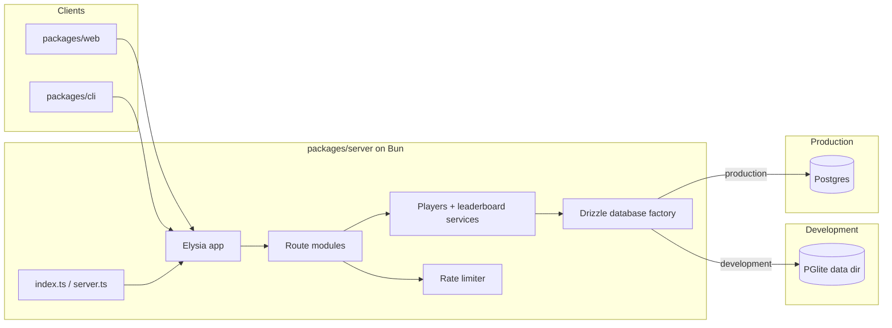
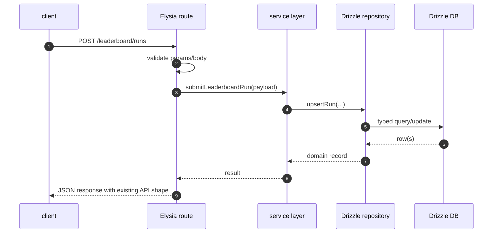

## Progress

- [ ] **Phase 1 — Compatibility baseline and migration decisions**
  - [x] 1.1 Inventory the current server contract and freeze compatibility expectations
  - [ ] 1.2 Choose the Bun/Drizzle driver strategy for production Postgres and development PGlite
  - [ ] 1.3 Define the cutover boundaries so transport and persistence can migrate independently
- [ ] **Phase 2 — Bun runtime foundation**
  - [ ] 2.1 Convert server package scripts, entrypoints, and CI commands to Bun-compatible execution
  - [ ] 2.2 Migrate the server test harness from `node:test` to `bun:test` while preserving request-level coverage
  - [ ] 2.3 Keep monorepo root workflows working while the server package runs on Bun internally
- [ ] **Phase 3 — Elysia transport migration**
  - [ ] 3.1 Introduce an Elysia app factory with shared config, CORS, and error handling
  - [ ] 3.2 Port health and version endpoints to Elysia without changing their response contract
  - [ ] 3.3 Port player and leaderboard endpoints with request validation and rate limiting
  - [ ] 3.4 Remove the custom Node HTTP adapter once Elysia reaches parity
- [ ] **Phase 4 — Drizzle schema and repository migration**
  - [ ] 4.1 Model the existing Postgres schema in Drizzle tables and relations
  - [ ] 4.2 Add a Drizzle database factory for Bun Postgres and PGlite
  - [ ] 4.3 Rewrite player and leaderboard repositories to use Drizzle instead of raw `pg` SQL
  - [ ] 4.4 Adopt a Drizzle-led migration workflow without losing compatibility with existing databases
- [ ] **Phase 5 — Development and production database modes**
  - [ ] 5.1 Reintroduce the dev/prod database-mode rules on top of Drizzle
  - [ ] 5.2 Make health/startup output expose runtime, framework, and active database provider
  - [ ] 5.3 Support persistent file-backed PGlite in development and external Postgres in production
- [ ] **Phase 6 — Client compatibility, rollout, and documentation**
  - [ ] 6.1 Verify that web and planned CLI integrations continue to work against the migrated API
  - [ ] 6.2 Add integration coverage for Bun + Elysia + Drizzle across dev and production-like modes
  - [ ] 6.3 Update docs, deployment instructions, and follow-on plans to reflect the new stack

## Overview

Today the server package uses a custom fetch-style router layered over Node’s HTTP server and talks to Postgres via hand-written SQL through `pg`; it does **not** currently use a third-party HTTP framework or an ORM. This plan migrates the server package to run on **Bun**, use **Elysia** as the web framework, and use **Drizzle ORM** for schema definition, typed queries, and migrations. The migration must preserve the existing public API contract for `/healthz`, `/version`, `/players`, and `/leaderboard` so the web app — and the planned CLI online sync work in plan `042` — continue to function without coordinated client rewrites.

The migration is intentionally staged so we do not mix transport, runtime, and persistence rewrites in one opaque change. The end state is a Bun-run backend with Elysia route modules, Drizzle schema/migrations, file-backed **PGlite** in local development, and real **Postgres** in production.

## Architecture





Key decisions:

- **Keep the API contract stable during the migration.** Paths, JSON shapes, status codes, and stable error codes should remain compatible with the current web client and the planned CLI sync work.
- **Preserve service-layer business rules.** Username rules, leaderboard monotonicity checks, summary derivation, and rate-limit semantics should not be reimplemented inside Elysia handlers.
- **Use Bun as the server runtime, not necessarily as the monorepo package manager.** The repo can keep npm workspaces while the `server` workspace itself uses `bun run` / `bun test` internally.
- **Use Elysia for transport concerns only.** Route grouping, schema validation, CORS, request parsing, and error formatting belong there; core player/leaderboard behavior remains in `src/players/` and `src/leaderboard/`.
- **Use Drizzle as the persistence boundary.** Schema definitions become typed code, repositories move from raw SQL strings toward typed Drizzle queries, and future migrations should be driven by Drizzle’s migration workflow.
- **Keep development and production database providers split by environment.** Development should default to file-backed PGlite; production should require real Postgres.
- **Prefer incremental parity over a big-bang rewrite.** Each phase should leave the server in a runnable, testable state.

Illustrative target shapes:

```ts
export interface ServerDatabaseConfig {
  mode: "postgres" | "pglite";
  postgresUrl?: string;
  pgliteDataDir?: string;
}

export interface ServerRuntimeInfo {
  runtime: "bun";
  framework: "elysia";
  databaseMode: "postgres" | "pglite" | "disabled";
}
```

```ts
// packages/server/src/db/schema.ts
import { bigint, integer, pgTable, text, timestamp } from "drizzle-orm/pg-core";

export const players = pgTable("players", {
  id: text("id").primaryKey(),
  username: text("username").notNull(),
  normalizedUsername: text("normalized_username").notNull(),
  createdAt: timestamp("created_at", { withTimezone: true }).notNull(),
  lastSeenAt: timestamp("last_seen_at", { withTimezone: true }).notNull(),
});
```

```ts
// packages/server/src/server/app.ts
import { Elysia } from "elysia";

export const createServerApp = (deps: AppDependencies) =>
  new Elysia()
    .get("/healthz", () => ({ status: "ok" }))
    .post("/players", ({ body }) => registerPlayer(deps, body));
```

## Phase 1 — Compatibility baseline and migration decisions

**Goal**: lock down what must stay the same and decide the Bun/Elysia/Drizzle integration strategy before code starts moving.

### Step 1.1 — Inventory the current server contract and freeze compatibility expectations

- Files: `packages/server/src/routes/*.ts`, `packages/server/src/routes/*.test.ts`, `packages/server/src/index.test.ts`, new `packages/server/src/contracts/` or `packages/server/src/test-utils/contracts.ts`.
- Record the current API contract for:
  - `GET /healthz`
  - `GET /version`
  - `GET /players/availability`
  - `POST /players`
  - `GET /leaderboard`
  - `POST /leaderboard/runs`
- Capture stable error-code expectations, CORS behavior, rate-limit behavior, and response status codes in focused request-level tests.
- Explicitly mark which details are transport contracts versus internal implementation details that are free to change.
- Acceptance: request-level contract tests fail if the Bun/Elysia migration changes response shapes, status codes, or error codes unintentionally.

### Step 1.2 — Choose the Bun/Drizzle driver strategy for production Postgres and development PGlite

- Files: plan notes in this file, `packages/server/package.json`, future `packages/server/drizzle.config.ts`.
- Confirm the exact Drizzle driver split:
  - **production/staging**: Bun-run server talking to Postgres through either `drizzle-orm/bun-sql` or another Bun-compatible Postgres driver if operational constraints require it;
  - **development**: `drizzle-orm/pglite` with file-backed PGlite.
- Evaluate deployment constraints (Railway connection strings, SSL, transactions, prepared statements, migration tooling, and local testing ergonomics) before locking the production driver.
- Keep the decision explicit so later steps do not need to branch across multiple competing DB clients.
- Acceptance: the plan records one production driver choice and one dev driver choice, with rationale and no unresolved ambiguity before implementation begins.

### Step 1.3 — Define the cutover boundaries so transport and persistence can migrate independently

- Files: `packages/server/src/types.ts`, `packages/server/src/index.ts`, `packages/server/src/players/service.ts`, `packages/server/src/leaderboard/service.ts`, new `packages/server/src/server/dependencies.ts` if useful.
- Identify seams that allow a phased migration:
  - route handlers can switch from the custom router to Elysia while services stay unchanged;
  - repositories can switch from `pg` to Drizzle while service signatures stay unchanged.
- Formalize the dependency graph so transport/runtime changes do not force an immediate persistence rewrite in the same commit.
- Acceptance: a short architecture note or dependency helper makes it obvious how to test Elysia handlers with injected fake services and Drizzle repositories independently.

## Phase 2 — Bun runtime foundation

**Goal**: make the server package runnable and testable on Bun before replacing major internals.

### Step 2.1 — Convert server package scripts, entrypoints, and CI commands to Bun-compatible execution

- Files: `packages/server/package.json`, root `package.json`, `packages/server/README.md`, CI docs/config if present.
- Replace `tsx watch src/index.ts`, `node --test --import tsx`, and `node dist/index.js` assumptions with Bun-native equivalents.
- Decide whether the server package still emits `dist/` via `tsc`, uses `bun run` directly in production, or supports both for deployment flexibility.
- Update root scripts so `npm run dev:server`, `npm run test:server`, and `npm run build:server` still work from the monorepo root, even if the server workspace internally invokes Bun.
- Acceptance: a developer can run the server package locally through Bun, and the existing monorepo commands still work as documented.

### Step 2.2 — Migrate the server test harness from `node:test` to `bun:test` while preserving request-level coverage

- Files: `packages/server/src/**/*.test.ts`, `packages/server/src/test-utils/app.ts`, `packages/server/package.json`.
- Convert test imports and any Node-runner-specific assumptions to Bun’s test runner.
- Keep the fetch-based request testing style so route tests remain close to the current implementation and easy to compare before/after the Elysia swap.
- Ensure coverage and CI output remain available, even if the exact reporting toolchain changes.
- Acceptance: the full server test suite passes under `bun test`, and request-level tests still exercise the app without binding a real port unless a test explicitly needs it.

### Step 2.3 — Keep monorepo root workflows working while the server package runs on Bun internally

- Files: root `package.json`, `packages/server/package.json`, root docs.
- Preserve the current developer ergonomics where other packages can continue using npm workspaces from the root.
- Add any necessary runtime detection or wrapper scripts so server-specific Bun requirements are obvious and fail fast when Bun is missing.
- Decide whether CI installs Bun only for the server workspace or standardizes it at the repo level.
- Acceptance: root-level development commands continue to work, and the repo documents exactly when Bun is required.

## Phase 3 — Elysia transport migration

**Goal**: replace the custom router and Node HTTP adapter with Elysia while preserving API behavior.

### Step 3.1 — Introduce an Elysia app factory with shared config, CORS, and error handling

- Files: new `packages/server/src/server/app.ts`, `packages/server/src/index.ts`, `packages/server/src/config.ts`, new server plugin/helpers as needed.
- Create a single Elysia app factory that receives injected dependencies for tests and startup.
- Move global concerns into Elysia setup:
  - CORS configuration;
  - shared JSON error formatting;
  - request validation hooks;
  - runtime metadata exposure.
- Map current custom `HttpError` behavior onto Elysia’s error handling so existing error payloads stay stable.
- Acceptance: the Elysia app can be instantiated in tests and handles 404/validation/internal errors in a way compatible with current client expectations.

### Step 3.2 — Port health and version endpoints to Elysia without changing their response contract

- Files: `packages/server/src/routes/health.ts`, `packages/server/src/routes/health.test.ts`, `packages/server/src/index.ts`.
- Re-express `GET /healthz` and `GET /version` as Elysia routes or grouped plugins.
- Keep the current JSON payloads, then extend them carefully later with runtime/framework/database fields once compatibility tests are updated intentionally.
- Acceptance: health/version route tests pass unchanged against the Elysia app.

### Step 3.3 — Port player and leaderboard endpoints with request validation and rate limiting

- Files: `packages/server/src/routes/players.ts`, `packages/server/src/routes/leaderboard.ts`, `packages/server/src/players/service.ts`, `packages/server/src/leaderboard/service.ts`, related tests.
- Move body/query parsing and validation into Elysia route schemas where appropriate.
- Keep service-layer calls, error-code mapping, and rate-limit semantics stable.
- Ensure leaderboard submission continues to use canonical gameplay-derived summary payload validation rather than client-trusting shortcuts.
- Acceptance: all existing player/leaderboard request tests pass against Elysia, including invalid JSON, invalid usernames, duplicate names, and rate-limited cases.

### Step 3.4 — Remove the custom Node HTTP adapter once Elysia reaches parity

- Files: `packages/server/src/server/node-http.ts`, old routing types/helpers, imports across tests and startup.
- Delete obsolete transport scaffolding only after Elysia has full route parity and the test suite no longer depends on the old app shape.
- Keep any reusable JSON/error helper logic only if it still provides value around Elysia.
- Acceptance: the server package no longer depends on `node:http` startup glue or the bespoke route-matching layer.

## Phase 4 — Drizzle schema and repository migration

**Goal**: replace raw SQL/`pg` repository code with Drizzle while keeping domain and API semantics intact.

### Step 4.1 — Model the existing Postgres schema in Drizzle tables and relations

- Files: new `packages/server/src/db/schema.ts`, optional `packages/server/src/db/relations.ts`, `packages/server/migrations/001_leaderboard_foundation.sql`, new `packages/server/drizzle.config.ts`.
- Translate the current `players` and `leaderboard_runs` schema into Drizzle table definitions, including:
  - primary keys;
  - uniqueness constraints;
  - foreign keys;
  - indexed leaderboard ranking fields;
  - timestamp columns.
- Decide how historical SQL migration `001_leaderboard_foundation.sql` maps to Drizzle’s migration source of truth.
- Acceptance: a Drizzle schema exists that faithfully represents the current database layout and can generate equivalent future migrations.

### Step 4.2 — Add a Drizzle database factory for Bun Postgres and PGlite

- Files: new `packages/server/src/db/client.ts`, `packages/server/src/db/database.ts`, `packages/server/src/config.ts`, `packages/server/src/types.ts`.
- Build a typed DB factory that returns:
  - a production/staging Drizzle client connected to Postgres under Bun;
  - a development Drizzle client connected to file-backed PGlite;
  - test-friendly variants that can use temporary PGlite data or injected fakes.
- Centralize lifecycle management (open/close) so startup, tests, and migrations all use the same configuration rules.
- Acceptance: startup code can ask for one database abstraction and does not need to know whether it is talking to Postgres or PGlite.

### Step 4.3 — Rewrite player and leaderboard repositories to use Drizzle instead of raw `pg` SQL

- Files: `packages/server/src/players/postgres-repository.ts` or renamed replacements, `packages/server/src/leaderboard/repository.ts`, repository tests.
- Replace raw SQL string execution with Drizzle query builders and explicit row-to-domain mapping.
- Preserve domain behavior:
  - username normalization and uniqueness handling;
  - monotonic leaderboard updates;
  - idempotent `(playerId, clientRunId)` upserts;
  - deterministic leaderboard ordering.
- Keep repository interfaces stable where possible so the service layer changes minimally.
- Acceptance: repository tests and request-level contract tests pass against Drizzle-backed persistence in both dev-like and prod-like configurations.

### Step 4.4 — Adopt a Drizzle-led migration workflow without losing compatibility with existing databases

- Files: `packages/server/drizzle.config.ts`, `packages/server/src/db/migrate.ts`, `packages/server/src/db/check-migrations.ts`, migration directories, docs.
- Choose a safe migration transition strategy, for example:
  - keep `001_leaderboard_foundation.sql` as the historical baseline;
  - introduce Drizzle migration metadata for all new changes from this point forward;
  - add a one-time bootstrap/baseline procedure for already-provisioned databases if Drizzle requires its own migration ledger.
- Ensure migrations work for both:
  - file-backed PGlite in local development;
  - external Postgres in production/staging.
- Acceptance: a clean database can be initialized through the new migration workflow, and an existing database can be adopted without destructive re-bootstrap.

## Phase 5 — Development and production database modes

**Goal**: restore the desired runtime behavior of local PGlite development and production Postgres on top of the new stack.

### Step 5.1 — Reintroduce the dev/prod database-mode rules on top of Drizzle

- Files: `packages/server/src/config.ts`, `packages/server/src/index.ts`, `packages/server/.env.example`, tests.
- Encode the environment rules explicitly:
  - `production` requires Postgres;
  - `development` defaults to file-backed PGlite when no Postgres URL is provided;
  - `test` uses temporary or injected DBs unless a test explicitly needs persistence.
- Ensure the configuration surface is simple and typed.
- Acceptance: config tests cover production-without-Postgres failure, development PGlite defaulting, and explicit Postgres override.

### Step 5.2 — Make health/startup output expose runtime, framework, and active database provider

- Files: `packages/server/src/routes/health.ts`, `packages/server/src/index.ts`, tests.
- Extend operational visibility so a developer can immediately see:
  - runtime = Bun;
  - framework = Elysia;
  - database mode/provider = PGlite or Postgres.
- Add these fields in a backwards-compatible way or update compatibility tests intentionally if the health payload contract changes.
- Acceptance: smoke tests and docs make it trivial to verify that the intended runtime stack is active.

### Step 5.3 — Support persistent file-backed PGlite in development and external Postgres in production

- Files: `packages/server/src/db/client.ts`, `packages/server/src/index.ts`, docs, ignore files if needed.
- Choose and document a default local data directory for PGlite.
- Ensure local data persists across server restarts.
- Ensure production startup rejects accidental PGlite usage and requires the correct Postgres configuration.
- Acceptance: local dev can start with no separate Postgres daemon, while production-like configuration connects cleanly to a real Postgres instance.

## Phase 6 — Client compatibility, rollout, and documentation

**Goal**: make the migration safe for dependent clients and easy for future contributors to understand.

### Step 6.1 — Verify that web and planned CLI integrations continue to work against the migrated API

- Files: `packages/web/src/online/*.ts`, `packages/cli/src/online/*.ts` once implemented, integration tests, plan `042` references.
- Confirm that web leaderboard registration/submission helpers still work without payload or endpoint changes.
- Validate that the `042` CLI online-sync plan can continue against the migrated server with no server-side API drift.
- Acceptance: at least one browser/client integration path and one CLI-oriented test path exercise the migrated API successfully.

### Step 6.2 — Add integration coverage for Bun + Elysia + Drizzle across dev and production-like modes

- Files: `packages/server/src/**/*.test.ts`, optional integration-test helpers.
- Add tests that boot the real Elysia app and exercise:
  - PGlite-backed development mode;
  - Postgres-backed production-like mode where feasible;
  - migration initialization;
  - rate limiting and error formatting.
- Keep unit tests fast, but add enough end-to-end coverage to catch framework/runtime-specific regressions.
- Acceptance: server tests cover the migrated stack, not just isolated domain helpers.

### Step 6.3 — Update docs, deployment instructions, and follow-on plans to reflect the new stack

- Files: `packages/server/README.md`, `packages/server/AGENTS.md`, root `package.json` docs/comments if any, `.agents/plans/042-online-identity-cli-sync-and-dev-db-modes.md` if server assumptions need revision, `.agents/plans/README.md`.
- Update setup docs for Bun-based local development, Drizzle migrations, PGlite local persistence, and Postgres production deployment.
- Revise package guidance so future contributors no longer assume the old custom router or raw `pg` setup.
- If plan `042` still contains Node/raw-SQL server assumptions, add a changelog note or successor reference so the online-sync work builds on the migrated stack.
- Acceptance: a new contributor can read the docs and correctly understand that the server runs on Bun, uses Elysia, and persists through Drizzle.

## References

- [`AGENTS.md`](../../AGENTS.md)
- [`packages/server/AGENTS.md`](../../packages/server/AGENTS.md)
- [`042-online-identity-cli-sync-and-dev-db-modes.md`](./042-online-identity-cli-sync-and-dev-db-modes.md)
- [`038-backend-leaderboard-foundation.md`](./archive/038-backend-leaderboard-foundation.md)
- [`packages/server/src/server/app.ts`](../../packages/server/src/server/app.ts)
- [`packages/server/src/server/node-http.ts`](../../packages/server/src/server/node-http.ts)
- [`packages/server/src/routes/health.ts`](../../packages/server/src/routes/health.ts)
- [`packages/server/src/routes/players.ts`](../../packages/server/src/routes/players.ts)
- [`packages/server/src/routes/leaderboard.ts`](../../packages/server/src/routes/leaderboard.ts)
- [`packages/server/src/players/postgres-repository.ts`](../../packages/server/src/players/postgres-repository.ts)
- [`packages/server/src/leaderboard/repository.ts`](../../packages/server/src/leaderboard/repository.ts)
- [`packages/server/migrations/001_leaderboard_foundation.sql`](../../packages/server/migrations/001_leaderboard_foundation.sql)
- [Elysia documentation](https://elysiajs.com/)
- [Drizzle ORM documentation](https://orm.drizzle.team/)
- [Bun documentation](https://bun.sh/docs)
- [PGlite support in Drizzle](https://orm.drizzle.team/docs/get-started-postgresql#pglite)

## Changelog

- 2026-05-29 — Created plan for migrating the server from the custom Node router + raw `pg` stack to Bun, Elysia, and Drizzle.
- 2026-05-29 — Completed step 1.1 by freezing the current HTTP contract in request-level tests and documenting which transport details must remain stable during the migration.
