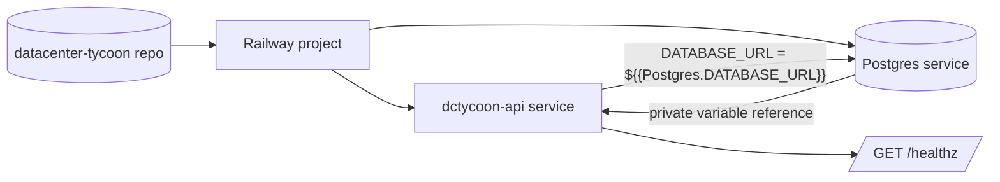

## Progress

- [x] **Phase 1 — Deployment configuration readiness**
  - [x] 1.1 Verify Railway auth/project state and server deployment requirements
  - [x] 1.2 Document Railway deployment commands and required variables in server docs
- [ ] **Phase 2 — Railway project and services**
  - [ ] 2.1 Create or link the Railway project/environment
  - [ ] 2.2 Create the `dctycoon-api` service and Postgres database service
- [ ] **Phase 3 — Private database wiring and deploy**
  - [ ] 3.1 Set `DATABASE_URL` on `dctycoon-api` from the Postgres private service variable
  - [ ] 3.2 Set production runtime variables and deploy `dctycoon-api`
- [ ] **Phase 4 — Verification and handoff**
  - [ ] 4.1 Verify health, migrations, and deployment logs
  - [ ] 4.2 Record final Railway service details and operational notes

## Overview

Deploy the Bun/Elysia `@datacenter-tycoon/server` package to Railway as a service named `dctycoon-api`. The deployment must also provision a Railway Postgres database and make that database available to the API as `DATABASE_URL`. Railway should use its private service network/database variable (`${{Postgres.DATABASE_URL}}`) rather than a public proxy URL so API-to-database traffic stays inside Railway.

## Architecture



Key decisions:
- Keep `railway.toml` at the repository root because this is a shared monorepo deployment; it already builds the game logic and server workspace before starting the server.
- Use Railway config-as-code for build/deploy commands and Railway service variables for runtime secrets/configuration.
- Use the Postgres service's private `DATABASE_URL` reference (`${{Postgres.DATABASE_URL}}`), not a public database URL such as `DATABASE_PUBLIC_URL`.
- The server already fails fast in production without `DATABASE_URL` and `CORS_ALLOWED_ORIGINS`, so production variables must be set before deploy verification.

Important commands:

```bash
railway init --name datacenter-tycoon --json
railway add --service dctycoon-api --json
railway add --database postgres --json
railway variable set --service dctycoon-api NODE_ENV=production
railway variable set --service dctycoon-api 'DATABASE_URL=${{Postgres.DATABASE_URL}}'
railway variable set --service dctycoon-api CORS_ALLOWED_ORIGINS=<frontend-origin-list>
railway up --service dctycoon-api
railway service logs --service dctycoon-api
```

## Phase 1 — Deployment configuration readiness

**Goal**: confirm the repository and local Railway CLI are ready, then capture the deploy procedure in versioned documentation.

### Step 1.1 — Verify Railway auth/project state and server deployment requirements

- Files: none; inspect `railway.toml`, `packages/server/package.json`, and `packages/server/src/config.ts`.
- Confirm Railway CLI authentication with `railway whoami` and whether the repo is already linked with `railway status`.
- Confirm the existing `railway.toml` build, migration, start, and healthcheck commands match the server package scripts.
- Acceptance: Railway CLI is authenticated; required deploy variables are known (`DATABASE_URL`, `NODE_ENV`, `CORS_ALLOWED_ORIGINS`); any project-link gap is noted before service creation.

### Step 1.2 — Document Railway deployment commands and required variables in server docs

- File: `packages/server/README.md`
- Add a Railway deployment section covering project creation/linking, service creation, Postgres creation, private `DATABASE_URL` variable reference, deploy, healthcheck, and logs.
- Explicitly warn to use `${{Postgres.DATABASE_URL}}` instead of public database URLs.
- Acceptance: `packages/server/README.md` includes copy-pasteable Railway commands and production variable guidance.

## Phase 2 — Railway project and services

**Goal**: create the actual Railway resources needed by the server.

### Step 2.1 — Create or link the Railway project/environment

- Files: Railway project metadata only.
- If no project is linked, create `datacenter-tycoon` in the authenticated Railway workspace or link to an existing intended project.
- Verify the linked project and environment with `railway status --json`.
- Acceptance: local repo is linked to the intended Railway project and production environment.

### Step 2.2 — Create the `dctycoon-api` service and Postgres database service

- Files: Railway project services only.
- Create the API service with exact name `dctycoon-api`.
- Create a Railway Postgres database service.
- Verify both services with `railway service list --json`.
- Acceptance: Railway service list includes `dctycoon-api` and a Postgres service.

## Phase 3 — Private database wiring and deploy

**Goal**: configure runtime variables and deploy the API against Railway Postgres.

### Step 3.1 — Set `DATABASE_URL` on `dctycoon-api` from the Postgres private service variable

- Files: Railway service variables only.
- Set `DATABASE_URL=${{Postgres.DATABASE_URL}}` on `dctycoon-api`.
- Verify the variable exists without exposing secret values.
- Acceptance: `dctycoon-api` has a `DATABASE_URL` variable that references the Postgres service's private URL.

### Step 3.2 — Set production runtime variables and deploy `dctycoon-api`

- Files: Railway service variables/deployments only.
- Set `NODE_ENV=production`.
- Set `CORS_ALLOWED_ORIGINS` to the approved frontend origin list supplied by the project owner; use a temporary explicit origin only if needed for initial smoke testing and record it for follow-up.
- Deploy with `railway up --service dctycoon-api`.
- Acceptance: Railway accepts the deploy and starts a deployment using the root `railway.toml` commands.

## Phase 4 — Verification and handoff

**Goal**: prove the deployment is healthy and leave durable operational notes.

### Step 4.1 — Verify health, migrations, and deployment logs

- Files: Railway deployment/logs only.
- Check deployment status and logs for successful `preDeployCommand` migrations and server startup.
- Generate or identify the public API domain if needed, then verify `GET /healthz`.
- Acceptance: `/healthz` returns successfully and logs show the server using `db=postgres/bun-sql`.

### Step 4.2 — Record final Railway service details and operational notes

- File: `packages/server/README.md`
- Record the Railway project name, API service name, database service name, healthcheck path, and key follow-up notes.
- Do not commit secret values.
- Acceptance: README contains non-secret production deployment details sufficient for future maintainers.

## References

- [Root AGENTS.md](../../AGENTS.md)
- [Server AGENTS.md](../../packages/server/AGENTS.md)
- [Railway Config as Code](https://docs.railway.com/config-as-code)
- [Railway Config as Code Reference](https://docs.railway.com/config-as-code/reference)
- [Railway Monorepo Guide](https://docs.railway.com/guides/monorepo)
- [Railway PostgreSQL](https://docs.railway.com/databases/postgresql)
- [Railway Variables Reference](https://docs.railway.com/reference/variables)
- [Railway Private Networking](https://docs.railway.com/guides/private-networking)

## Changelog

- 2026-05-30 — completed Step 1.2: expanded the server README with Railway project/service/database commands, private Postgres `DATABASE_URL` wiring, deploy, logs, domain, and healthcheck guidance.
- 2026-05-30 — completed Step 1.1: Railway CLI is authenticated as the expected user, the repo is not yet linked to a Railway project, and the existing root `railway.toml` matches the server workspace build/migrate/start/healthcheck scripts.
- 2026-05-30 — created.
