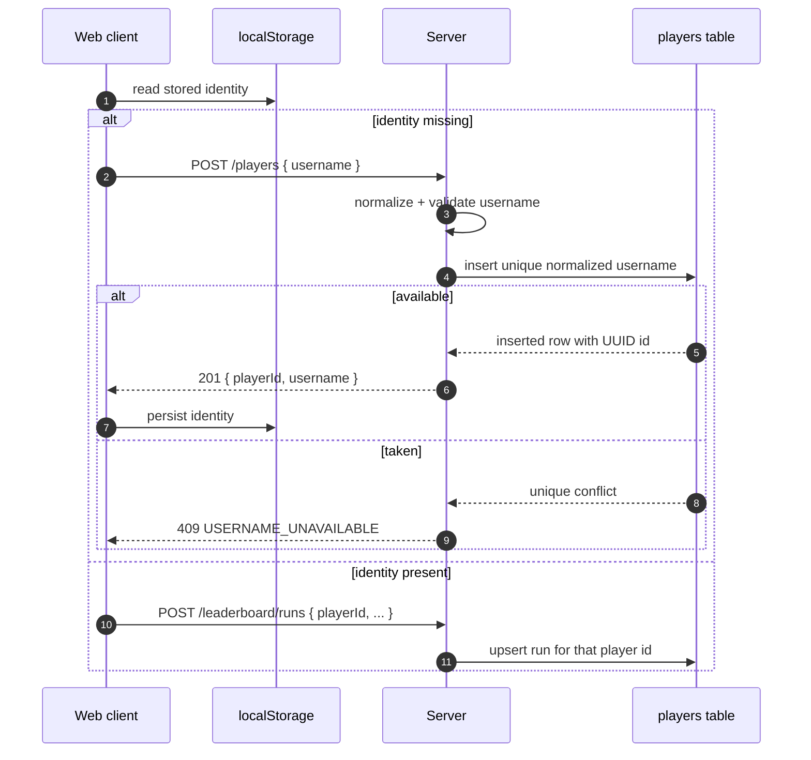

## Progress

- [x] **Phase 1 — Server identity contract tightening**
  - [x] 1.1 Preserve permanent normalized-username uniqueness with explicit conflict semantics
  - [x] 1.2 Switch generated player ids to UUIDs while keeping the existing `playerId` API field name
  - [x] 1.3 Update server tests and transport-contract expectations
- [x] **Phase 2 — Web startup registration and local identity reuse**
  - [x] 2.1 Keep startup registration keyed off missing local identity and improve duplicate-name UX copy
  - [x] 2.2 Persist and reuse the returned UUID-backed identity from local storage for future leaderboard submissions
  - [x] 2.3 Update web tests for registration, conflict handling, and reuse flow
- [x] **Phase 3 — Documentation and compatibility notes**
  - [x] 3.1 Document claimed-username behavior and UUID reuse in server/web docs
  - [x] 3.2 Record compatibility expectations for existing stored ids and database rows

## Overview

The backend/web leaderboard identity flow already implements most of the desired shape: username normalization, conflict-on-duplicate registration, and client-side identity persistence. This plan tightens that flow so it matches the intended product contract more explicitly: a normalized username is claimed once, registration returns a UUID-backed player identity, and future score submissions reuse that identity from local storage.

The main behavioral target is: if one user claims `John Doe123`, another attempt such as ` John   Doe123 ` or `john doe123` must be rejected with a conflict response, while the original client can keep updating leaderboard runs by sending the same stored player UUID.

## Architecture



Key decisions:

- Keep username normalization as the authority for uniqueness. Case and repeated/leading/trailing whitespace must not create distinct leaderboard names.
- Keep the public response field name `playerId` for compatibility, but make its generated value a plain UUID rather than the current prefixed opaque id.
- Keep local gameplay resilient if the backend is unavailable; the new work should improve conflict/identity semantics, not remove offline tolerance unless product requirements change later.
- No schema migration is required for the `players.id` column because it is already stored as text; existing ids can remain valid while new registrations receive UUID values.

Illustrative contract:

```ts
interface PlayerRegistrationResponse {
  playerId: string; // UUID string
  username: string;
}
```

## Phase 1 — Server identity contract tightening

**Goal**: make the backend identity semantics explicitly match the claimed-username + reusable-UUID model.

### Step 1.1 — Preserve permanent normalized-username uniqueness with explicit conflict semantics

- Files: `packages/server/src/players/identity.ts`, `packages/server/src/players/service.ts`, repository tests/routes tests as needed.
- Confirm and, where helpful, tighten normalization rules so `John Doe123` and `John   Doe123` collide.
- Ensure duplicate registration continues to surface `409` with `USERNAME_UNAVAILABLE` and user-friendly copy.
- Acceptance: duplicate registration tests cover whitespace/case normalization and still return conflict semantics.

### Step 1.2 — Switch generated player ids to UUIDs while keeping the existing `playerId` API field name

- Files: `packages/server/src/players/identity.ts`, any server tests/docs that assert id shape.
- Change new player-id generation from the current prefixed custom format to `crypto.randomUUID()`.
- Leave leaderboard submission/query payload field names unchanged so the rest of the app can keep using `playerId` as the property name.
- Acceptance: newly registered users receive UUID-shaped ids and existing persistence/repository tests continue to pass.

### Step 1.3 — Update server tests and transport-contract expectations

- Files: `packages/server/src/routes/players.test.ts`, `packages/server/src/http-contract.test.ts`, related fixtures/docs.
- Update assertions that currently hard-code the old `player_<hex>` format.
- Preserve the stable HTTP semantics: `201` on create, `409` on duplicate, `400` on invalid usernames.
- Acceptance: `npm run test -w @datacenter-tycoon/server` passes with the new UUID expectations.

## Phase 2 — Web startup registration and local identity reuse

**Goal**: ensure the browser flow clearly reflects “claim once, then reuse UUID”.

### Step 2.1 — Keep startup registration keyed off missing local identity and improve duplicate-name UX copy

- Files: `packages/web/src/App.tsx`, `packages/web/src/online/players.ts`, `packages/web/src/ui/start/StartScreen.tsx`.
- Preserve the existing startup rule: when no local identity exists, the app attempts username registration before starting a run.
- Improve duplicate-name messaging so conflicts clearly tell the player to choose another name instead of surfacing raw backend wording.
- Acceptance: frontend tests cover conflict handling and show a clear user-facing error.

### Step 2.2 — Persist and reuse the returned UUID-backed identity from local storage for future leaderboard submissions

- Files: `packages/web/src/store/playerIdentity.ts`, `packages/web/src/App.tsx`, leaderboard submission helpers if needed.
- Keep storing the returned registration identity locally and continue to drive leaderboard submissions from that stored `playerId`.
- Ensure the start screen and subsequent submissions reuse the same stored identity without re-registering.
- Acceptance: first registration stores the UUID-backed identity; later starts submit using the same identity without another `/players` request.

### Step 2.3 — Update web tests for registration, conflict handling, and reuse flow

- Files: `packages/web/src/App.test.tsx`, optionally `packages/web/src/online/*.test.ts`.
- Replace old test fixtures that assume the prefixed id format with UUID examples.
- Add/adjust a test for duplicate username conflict copy on the start screen.
- Acceptance: `npm run test -w @datacenter-tycoon/web` passes.

## Phase 3 — Documentation and compatibility notes

**Goal**: make the intended identity model obvious to future contributors and operators.

### Step 3.1 — Document claimed-username behavior and UUID reuse in server/web docs

- Files: `packages/server/AGENTS.md`, `packages/server/README.md`, optionally `packages/web/AGENTS.md` if conventions need clarifying.
- Clarify that usernames are permanently claimed by normalized value and registration returns a reusable UUID-backed `playerId`.
- Keep the current trust-model note that possession of the id is sufficient for updates for now.
- Acceptance: docs match implemented behavior and mention conflict semantics explicitly.

### Step 3.2 — Record compatibility expectations for existing stored ids and database rows

- Files: plan changelog and/or server docs.
- Note that existing `player_...` ids remain valid because the DB/API treat `playerId` as an opaque string, while new registrations receive UUIDs.
- Acceptance: a future contributor can tell whether a migration is required (it is not) and why mixed old/new ids are acceptable.

## References

- [`AGENTS.md`](../../AGENTS.md)
- [`packages/server/AGENTS.md`](../../packages/server/AGENTS.md)
- [`packages/web/AGENTS.md`](../../packages/web/AGENTS.md)
- [`042-online-identity-cli-sync-and-dev-db-modes.md`](./042-online-identity-cli-sync-and-dev-db-modes.md)
- [`archive/038-backend-leaderboard-foundation.md`](./archive/038-backend-leaderboard-foundation.md)
- [`packages/server/src/players/identity.ts`](../../packages/server/src/players/identity.ts)
- [`packages/server/src/routes/players.ts`](../../packages/server/src/routes/players.ts)
- [`packages/web/src/App.tsx`](../../packages/web/src/App.tsx)
- [`packages/web/src/store/playerIdentity.ts`](../../packages/web/src/store/playerIdentity.ts)

## Changelog

- 2026-05-31 — Created follow-up plan for claimed usernames and reusable player UUIDs.
- 2026-05-31 — Completed step 1.1 by tightening duplicate-registration coverage around case/whitespace normalization and standardizing user-friendly conflict copy for claimed usernames.
- 2026-05-31 — Completed step 1.2 by switching new player-id generation to plain UUIDs while preserving the existing `playerId` API field name and opaque-string treatment elsewhere.
- 2026-05-31 — Completed step 1.3 by updating server transport-contract and route tests to expect UUID-shaped registration ids while preserving existing HTTP status/error semantics.
- 2026-05-31 — Completed step 2.1 by keeping first-run registration gated on missing local identity, adding clearer claimed-name conflict copy, and updating start-screen guidance to explain uniqueness.
- 2026-05-31 — Completed step 2.2 by hardening local identity persistence around trimmed non-empty opaque `playerId` strings and continuing to reuse the stored identity for future run submissions.
- 2026-05-31 — Completed step 2.3 by updating web fixtures to UUID-style player ids, adding explicit claimed-name conflict coverage, and expanding local identity persistence tests.
- 2026-05-31 — Completed step 3.1 by documenting normalized username claiming, reusable UUID-backed `playerId` registration, and browser-local identity reuse conventions in the server/web docs.
- 2026-05-31 — Completed step 3.2 by documenting mixed old/new `playerId` format compatibility and the lack of any schema migration requirement for existing player rows.
