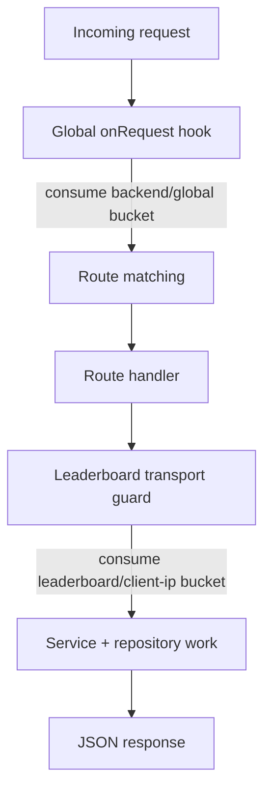

## Progress

- [x] **Phase 1 — Research and server config updates**
  - [x] 1.1 Capture the Elysia rate-limiting approach and choose lifecycle-hook integration points
  - [x] 1.2 Add backend-global rate-limit config and tighten leaderboard submission defaults to 1 req/sec per IP
- [x] **Phase 2 — Elysia hook and route enforcement**
  - [x] 2.1 Apply a global 10 req/sec backend limit in the Elysia app lifecycle
  - [x] 2.2 Apply a 1 req/sec per-IP limit on `POST /leaderboard/runs`
- [x] **Phase 3 — Tests and docs**
  - [x] 3.1 Add/update request-level tests for global and per-IP throttling behavior
  - [x] 3.2 Update docs/config examples to reflect the new limits and mixed hook strategy

## Overview

The backend already has a shared in-memory fixed-window rate limiter and route-level throttling for registration/submission endpoints. This change tightens abuse resistance for leaderboard spam by setting `POST /leaderboard/runs` to 1 request per second per client IP, and adds a global backend limit of 10 requests per second across all routes.

Research note: Elysia’s own lifecycle docs position `onRequest` as the right place for early cross-cutting logic like rate limiting, while route-specific guards can live either in route middleware or as tiny transport checks at the top of the affected handler. Because this codebase already has a tested in-memory limiter abstraction and only needs single-instance in-memory enforcement for now, the best fit is to keep that limiter, implement the backend-wide throttle in `onRequest`, and keep the endpoint-specific leaderboard throttle as a thin transport guard rather than introduce a new third-party plugin dependency.

## Architecture

Key decisions:

- Use **Elysia `onRequest`** for the backend-wide throttle because it runs before body parsing and route execution.
- Use a **tiny leaderboard-specific transport guard** at the top of `POST /leaderboard/runs` because it is specific to one endpoint and already fits the existing thin-route structure.
- Keep the existing `InMemoryFixedWindowRateLimiter` and config-driven rules; no Redis or extra plugin dependency is needed for this first-launch single-instance deployment.
- Continue deriving the client key from proxy headers with Bun `server.requestIP(request)` as a fallback when available.

## Phase 1 — Research and server config updates

**Goal**: encode the chosen Elysia lifecycle strategy in config and defaults.

### Step 1.1 — Capture the Elysia rate-limiting approach and choose lifecycle-hook integration points

- Files: this plan, implementation notes in docs if needed.
- Record that `onRequest` is the chosen global hook and that endpoint-specific throttles remain small transport guards near the affected route.
- Acceptance: plan/docs explain why hooks are preferred over adding a new plugin in this codebase.

### Step 1.2 — Add backend-global rate-limit config and tighten leaderboard submission defaults to 1 req/sec per IP

- Files: `packages/server/src/config.ts`, `packages/server/.env.example`, config tests/docs.
- Add config for the backend-global limit with defaults of `1000ms` / `10 requests`.
- Change leaderboard submission defaults to `1000ms` / `1 request` while keeping env overrides available.
- Acceptance: config parsing/typecheck passes and defaults are covered by tests/docs.

## Phase 2 — Elysia hook and route enforcement

**Goal**: enforce both limits at the correct lifecycle boundaries.

### Step 2.1 — Apply a global 10 req/sec backend limit in the Elysia app lifecycle

- Files: `packages/server/src/server/elysia-app.ts`, `packages/server/src/rate-limit/fixed-window.ts` if helper changes are needed.
- Add an `onRequest` hook that consumes a shared global bucket before route execution.
- Acceptance: the 11th request inside one second receives `429 RATE_LIMITED` regardless of route.

### Step 2.2 — Apply a 1 req/sec per-IP limit on `POST /leaderboard/runs`

- Files: `packages/server/src/routes/leaderboard.ts`, helper modules if needed.
- Enforce the leaderboard submission throttle as a route-local transport guard keyed by client IP.
- Acceptance: two rapid submissions from the same IP produce `201` then `429`, while a different IP can still submit.

## Phase 3 — Tests and docs

**Goal**: lock in the new behavior for contributors and operators.

### Step 3.1 — Add/update request-level tests for global and per-IP throttling behavior

- Files: `packages/server/src/routes/leaderboard.test.ts`, `packages/server/src/http-contract.test.ts`, `packages/server/src/index.test.ts`, possibly helper tests.
- Add coverage for the global backend limit and the stricter leaderboard per-IP limit.
- Acceptance: `npm run test -w @datacenter-tycoon/server` passes.

### Step 3.2 — Update docs/config examples to reflect the new limits and mixed hook strategy

- Files: `packages/server/README.md`, `packages/server/AGENTS.md`, `.env.example`, plan changelog.
- Document the new env vars/defaults and note that rate limiting now combines an Elysia global hook with endpoint-local leaderboard enforcement.
- Acceptance: docs match the implementation and mention the 10 req/sec global + 1 req/sec leaderboard defaults.

## References

- [packages/server/AGENTS.md](../../packages/server/AGENTS.md)
- [packages/server/src/server/elysia-app.ts](../../packages/server/src/server/elysia-app.ts)
- [packages/server/src/routes/leaderboard.ts](../../packages/server/src/routes/leaderboard.ts)
- [packages/server/src/rate-limit/fixed-window.ts](../../packages/server/src/rate-limit/fixed-window.ts)
- [packages/server/src/config.ts](../../packages/server/src/config.ts)
- https://elysiajs.com/essential/life-cycle
- https://elysiajs.com/plugins/overview

## Changelog

- 2026-05-31 — Created plan for global backend and stricter leaderboard per-IP throttling using Elysia lifecycle hooks.
- 2026-05-31 — Completed all phases by adding `BACKEND_RATE_LIMIT_*` config defaults (10 req/sec), tightening leaderboard submission defaults to 1 req/sec per IP, enforcing the backend-wide throttle in Elysia `onRequest`, and covering the new behavior with request-level tests and docs.
