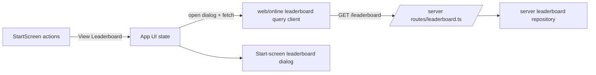

## Progress

- [x] **Phase 1 — Leaderboard data client**
  - [x] 1.1 Add a web leaderboard query client and response types for `GET /leaderboard`
  - [x] 1.2 Add focused tests for successful fetches and structured API failures
- [x] **Phase 2 — Start-screen leaderboard dialog UI**
  - [x] 2.1 Extend the start screen with a leaderboard button and dialog shell
  - [x] 2.2 Render loading, error, empty, and populated leaderboard states in a compact modal layout
  - [x] 2.3 Add/adjust component styling for the new action row and dialog
- [x] **Phase 3 — App wiring and integration coverage**
  - [x] 3.1 Wire dialog open/close and leaderboard loading into `App.tsx`
  - [x] 3.2 Add app-level tests covering start-screen leaderboard interactions

## Overview

The web start screen currently lets players begin a new run or load an existing one, but it does not expose the online leaderboard unless gameplay has already started. This plan adds a third entrypoint on the start screen so players can preview rankings before committing to a run. The implementation should stay thin on the frontend by reusing the existing server `GET /leaderboard` API and by keeping the dialog small, read-only, and resilient to offline/error states.

## Architecture



Key decisions:
- Reuse the existing backend leaderboard read endpoint rather than adding a new API surface.
- Keep the new dialog entirely in frontend UI state; no gameplay state belongs in it.
- Start with a single default leaderboard view (`money`, `all-time`, compact limit) and reserve metric switching for a later enhancement unless the implementation stays small.
- Surface structured API failures in a lightweight dialog state instead of blocking the rest of the start flow.

Illustrative client shape:

```ts
interface LeaderboardListResult {
  metric: "money" | "cumulativeRevenue" | "totalServers" | "computeCapacity" | "memoryCapacity" | "storageCapacity" | "gpuCapacity";
  period: "all-time";
  limit: number;
  entries: Array<{
    rank: number;
    username: string;
    value: number;
    gameMonth: number;
    submittedAt: string;
  }>;
}
```

## Phase 1 — Leaderboard data client

**Goal**: expose a typed frontend helper for reading the leaderboard before any UI wiring begins.

### Step 1.1 — Add the leaderboard query client

- File: `packages/web/src/online/leaderboard.ts`
- Extend the existing online leaderboard module with typed list-query/request helpers for `GET /leaderboard`.
- Reuse the current API base URL resolution and structured error handling approach.
- Keep the client focused on the current start-screen use case with defaultable query params.
- Acceptance: the helper can fetch and validate a leaderboard payload from the existing backend contract.

### Step 1.2 — Add query-client tests

- File: `packages/web/src/online/leaderboard.test.ts`
- Add tests for a successful leaderboard fetch and for surfaced API failures.
- Keep parity with existing submission tests by asserting request URL and payload/error mapping.
- Acceptance: `npm run test -w @datacenter-tycoon/web -- leaderboard` passes.

## Phase 2 — Start-screen leaderboard dialog UI

**Goal**: add a compact, readable modal dialog reachable from the start screen without entering gameplay.

### Step 2.1 — Extend the start screen action surface

- Files: `packages/web/src/ui/start/StartScreen.tsx`, `packages/web/src/ui/start/StartScreen.module.css`
- Add a `View Leaderboard` action alongside the existing start actions.
- Add props for dialog visibility state and event handlers needed by the start screen.
- Preserve the existing new/load/play behavior and responsive layout.
- Acceptance: the start screen renders a clearly discoverable leaderboard button in both saved-game and no-save states.

### Step 2.2 — Render the leaderboard dialog states

- Files: `packages/web/src/ui/start/StartScreen.tsx`, `packages/web/src/ui/start/StartScreen.module.css`
- Add a small modal/dialog that shows a title, close affordance, and compact leaderboard rows.
- Render loading, empty, offline/error, and populated states.
- Format money-oriented values and supporting metadata (rank, username, month/date) clearly without crowding the panel.
- Acceptance: the dialog is keyboard-dismissable, visually contained, and informative in all states.

### Step 2.3 — Add supporting styles

- File: `packages/web/src/ui/start/StartScreen.module.css`
- Add styles for the new action row, modal surface, table/list rows, and responsive behavior.
- Keep the visual treatment consistent with the start screen theme and touch-target rules from `packages/web/AGENTS.md`.
- Acceptance: desktop and mobile layouts remain usable and visually coherent.

## Phase 3 — App wiring and integration coverage

**Goal**: connect the dialog to app state and lock in behavior with app-level tests.

### Step 3.1 — Wire leaderboard loading into the app controller

- File: `packages/web/src/App.tsx`
- Add UI state for dialog open/close, fetch lifecycle, and fetched entries.
- Trigger leaderboard loading when the dialog opens, avoiding unnecessary duplicate fetches during a single open session.
- Keep leaderboard browsing independent from registration/new-game/load-game flows.
- Acceptance: opening the dialog from the start screen fetches and displays leaderboard data without starting a session.

### Step 3.2 — Add app-level interaction tests

- File: `packages/web/src/App.test.tsx`
- Add tests that cover opening the leaderboard dialog, successful rendering of entries, and error handling.
- Ensure existing start-flow tests continue to pass without behavioral regressions.
- Acceptance: targeted app tests pass and demonstrate the new start-screen leaderboard behavior.

## References

- `AGENTS.md`
- `packages/web/AGENTS.md`
- `packages/server/src/routes/leaderboard.ts`
- `packages/web/src/online/leaderboard.ts`

## Changelog

- 2026-05-31 — created.
- 2026-05-31 — completed implementation: added a start-screen leaderboard button, compact dialog, typed GET `/leaderboard` client, and web test coverage.
