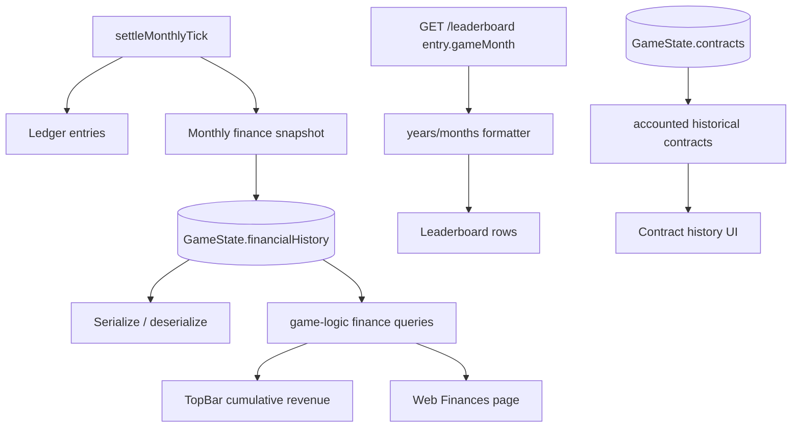

## Progress

- [x] **Phase 1 — Lightweight HUD and leaderboard polish**
  - [x] 1.1 Add a reusable cumulative-revenue selector for web UI
  - [x] 1.2 Show total cumulative revenue in the top bar beside cash
  - [x] 1.3 Format leaderboard run duration as years and months instead of raw months
  - [x] 1.4 Add focused web tests for the new HUD value and leaderboard duration copy
- [x] **Phase 2 — Persisted monthly finance history in game logic**
  - [x] 2.1 Add a serialized monthly finance snapshot model to `GameState`
  - [x] 2.2 Initialize and append finance snapshots during new-game and monthly settlement flows
  - [x] 2.3 Add finance query helpers for history, latest snapshot, and cumulative revenue
  - [x] 2.4 Migrate older saves by backfilling finance history from ledger entries
  - [x] 2.5 Add game-logic tests for snapshots, migration, and leaderboard summary parity
- [x] **Phase 3 — Global finances screen with charts**
  - [x] 3.1 Add a global `#/finances` route and navigation entry next to regions/contracts/datacenters
  - [x] 3.2 Build the finances page summary cards and month table
  - [x] 3.3 Add an SVG cash-history line chart
  - [x] 3.4 Add an SVG monthly revenue/OpEx/net bar chart
  - [x] 3.5 Add responsive styles and web tests for the finances page
- [ ] **Phase 4 — Contract history cleanup**
  - [x] 4.1 Add a game-logic query for player-accounted historical contracts that excludes unaccepted expired offers
  - [x] 4.2 Update web contract history selectors and UI footer copy to use the filtered history
  - [ ] 4.3 Add regression tests proving market-expired offers are stored but hidden from the history screen
- [ ] **Phase 5 — Validation and documentation pass**
  - [ ] 5.1 Update public API/docs where new game-logic exports are introduced
  - [ ] 5.2 Run targeted game-logic and web validation commands
  - [ ] 5.3 Update this plan with completion notes

## Overview

Players currently see current cash and last-month P&L in the HUD, but they cannot see total revenue earned over the run or inspect a saved history of financial performance. The leaderboard dialog also exposes run length as a raw month count, and the contract history screen includes expired offers that the player never accepted. This plan adds cumulative revenue to the persistent HUD, stores monthly finance snapshots in the game state, exposes a new global Finances screen with cash and P&L charts, formats leaderboard duration as years/months, and filters unaccepted expired offers out of visible contract history while keeping the underlying data intact.

## Architecture



Key decisions:
- The persisted finance history belongs in `@datacenter-tycoon/game-logic` because it is save data and is derived from deterministic monthly settlement, not from frontend rendering.
- The existing ledger remains the source of transaction-level detail. `financialHistory` is a monthly snapshot/index optimized for charts and save/load continuity.
- Cumulative revenue should be derived consistently from revenue ledger entries and exposed via shared game-logic helpers so the top bar, finance page, and leaderboard summary do not drift.
- Charts should be implemented as lightweight SVG React components, not by adding a charting dependency.
- Contract history filtering should be added as a shared game-logic query so web/CLI consumers can consistently distinguish accepted/accounted history from unaccepted market expirations.

Illustrative persisted model:

```ts
export interface FinancialSnapshot {
  tick: Tick;
  cash: Money;                 // closing cash after this month/tick is settled
  revenue: Money;              // positive contract revenue booked for this month
  opex: Money;                 // positive operating cost, including tax
  penalty: Money;              // positive SLA penalties booked this month
  capex: Money;                // positive capex spend since the previous snapshot
  netOperating: Money;         // revenue - opex - penalty
  netCashFlow: Money;          // cash - previousSnapshot.cash
  cumulativeRevenue: Money;    // all-time positive revenue through this tick
}
```

Snapshot convention:
- New games start with a tick-0 baseline snapshot: cash = starting cash, all monthly flow fields = 0, cumulativeRevenue = 0.
- `settleMonthlyTick()` appends exactly one snapshot for each advanced month after ledger entries and cash are finalized.
- CapEx can happen between monthly settlements. The next monthly snapshot should include capex ledger entries since the previous snapshot so cash charts reconcile with player actions.

## Phase 1 — Lightweight HUD and leaderboard polish

**Goal**: deliver the simplest visible improvements first without changing save shape.

### Step 1.1 — Add a reusable cumulative-revenue selector for web UI

- Files: `packages/web/src/store/selectors.ts`, possibly `packages/game-logic/src/query/leaderboard.ts` until the finance query module from Phase 2 exists.
- Add `selectCumulativeRevenue(state)` that uses the existing `summarizeCumulativeRevenue(state.ledger)` helper from game logic.
- Keep this selector read-only and derived from the ledger so it works for existing saves before `financialHistory` exists.
- Acceptance: selector returns the sum of positive `revenue` ledger entries and ignores `opex`, `penalty`, `capex`, and `adjustment` entries.

### Step 1.2 — Show total cumulative revenue in the top bar beside cash

- Files: `packages/web/src/ui/topbar/TopBar.tsx`, `packages/web/src/ui/topbar/TopBar.module.css`.
- Add a HUD block near `CASH` labelled `TOTAL REV` or `REVENUE` that displays cumulative run revenue.
- Use the existing compact money formatter and color treatment consistent with the current monthly revenue block.
- Verify the top bar remains readable on desktop and wraps/scrolls no worse than it does today on smaller widths.
- Acceptance: while playing, the top bar shows both current cash and all-time cumulative revenue.

### Step 1.3 — Format leaderboard run duration as years and months

- Files: `packages/web/src/ui/start/LeaderboardDialog.tsx`, optionally a small formatter helper near the component.
- Replace the `Month N` / raw-month copy for leaderboard entries with a helper that converts `gameMonth` into elapsed duration:
  - `0` → `0 months`
  - `1` → `1 month`
  - `12` → `1 year`
  - `13` → `1 year 1 month`
  - `23` → `1 year 11 months`
  - `24` → `2 years`
- Use this helper wherever leaderboard rows expose run length, especially the cumulative revenue tab details.
- Acceptance: no user-visible leaderboard entry displays `23 months` or `Month 23`; it displays `1 year 11 months`.

### Step 1.4 — Add focused web tests for the new HUD value and leaderboard duration copy

- Files: `packages/web/src/ui/topbar/TopBar.test.tsx`, `packages/web/src/ui/start/LeaderboardDialog.test.tsx` if present, otherwise `packages/web/src/App.test.tsx` or a new component test.
- Add a `TopBar` test with revenue ledger entries to assert cumulative revenue is shown.
- Add a leaderboard dialog test with `gameMonth: 23` to assert `1 year 11 months` is rendered.
- Acceptance: `npm run test -w @datacenter-tycoon/web -- TopBar LeaderboardDialog` passes, or the equivalent targeted Vitest invocation passes for the touched tests.

## Phase 2 — Persisted monthly finance history in game logic

**Goal**: add deterministic, serialized monthly finance snapshots to the core game state without requiring the web UI yet.

### Step 2.1 — Add a serialized monthly finance snapshot model to `GameState`

- File: `packages/game-logic/src/types.ts`.
- Add `FinancialSnapshot` with the fields shown in the Architecture section.
- Add `financialHistory: FinancialSnapshot[]` to `GameState` and `PersistedGameState` via the existing `GameState` shape.
- Keep the shape plain JSON: numbers, arrays, no `Map`, no dates, no class instances.
- Acceptance: TypeScript callers can access `state.financialHistory`, and the field is part of serialized state.

### Step 2.2 — Initialize and append finance snapshots during new-game and monthly settlement flows

- Files: `packages/game-logic/src/state/newGame.ts`, `packages/game-logic/src/sim/tick.ts`.
- Initialize `financialHistory` with a tick-0 baseline snapshot in `newGame()`.
- In `settleMonthlyTick()`, append one snapshot for `nextTick` after computing revenue, OpEx, penalties, tax, finalized cash, and ledger entries.
- Compute monthly values from the same rounded values used for cash/ledger updates to avoid one-cent drift.
- Include capex spend since the previous snapshot by scanning ledger entries between the previous snapshot tick and `nextTick`.
- Acceptance: advancing one monthly tick adds exactly one finance snapshot whose cash equals `nextState.player.cash` and whose revenue/OpEx match that tick's ledger entries.

### Step 2.3 — Add finance query helpers for history, latest snapshot, and cumulative revenue

- Files: `packages/game-logic/src/query/finance.ts`, `packages/game-logic/src/query/index.ts`, `packages/game-logic/src/index.ts` via existing barrels.
- Add helpers such as:
  - `selectFinancialHistoryFromState(state)`
  - `selectLatestFinancialSnapshotFromState(state)`
  - `summarizeCumulativeRevenueFromLedger(ledger)` or move/re-export the existing `summarizeCumulativeRevenue()` from a finance-focused module.
- Update `summarizeLeaderboardFromState()` to use the finance helper for cumulative revenue so all consumers share one definition.
- Acceptance: web can import finance helpers from `@datacenter-tycoon/game-logic`; leaderboard summary still returns identical cumulative revenue for existing test states.

### Step 2.4 — Migrate older saves by backfilling finance history from ledger entries

- File: `packages/game-logic/src/save/serialize.ts`.
- Bump `SAVE_VERSION`.
- Extend the legacy persisted state type so `financialHistory` may be missing.
- Add a migration/defaulting helper that backfills a baseline and grouped monthly snapshots from existing ledger entries:
  - infer starting cash as `currentCash - sum(ledger.amount)`;
  - group ledger entries by tick;
  - accumulate cash and cumulative revenue in ascending tick order;
  - ensure the final snapshot cash matches `state.player.cash` even if legacy data is sparse.
- Keep canonical contract compatibility-view rehydration unchanged.
- Acceptance: deserializing a pre-finance save succeeds and returns a `GameState` with a non-empty `financialHistory` array.

### Step 2.5 — Add game-logic tests for snapshots, migration, and leaderboard summary parity

- Files: `packages/game-logic/src/sim/tick.test.ts`, `packages/game-logic/src/save/serialize.test.ts`, `packages/game-logic/src/query/finance.test.ts`, `packages/game-logic/src/query/leaderboard.test.ts`.
- Assert new-game baseline snapshot contents.
- Assert monthly snapshot contents for a revenue/OpEx month and for a penalty month if there is an existing convenient fixture.
- Assert migration backfills history from a save missing `financialHistory`.
- Assert `summarizeLeaderboardFromState().metrics.cumulativeRevenue` still equals the finance helper result.
- Acceptance: `npm run test -w @datacenter-tycoon/game-logic` passes.

## Phase 3 — Global finances screen with charts

**Goal**: expose the saved finance history to players as a first-class global screen reachable while playing.

### Step 3.1 — Add a global `#/finances` route and navigation entry next to regions/contracts/datacenters

- Files: `packages/web/src/router/hashRouter.ts`, `packages/web/src/router/hashRouter.test.ts`, `packages/web/src/ui/shell/Shell.tsx`, `packages/web/src/ui/left-rail/DatacenterList.tsx`, `packages/web/src/ui/left-rail/DatacenterList.module.css`, `packages/web/src/ui/left-rail/DatacenterList.test.tsx`.
- Add a `finances` route to the hash router.
- Add a visible navigation action labelled `Finances` in the left rail near the existing Contracts and Regions actions.
- Render a new `FinancesPage` from `Shell` when the route is active.
- Acceptance: clicking the Finances nav action changes the hash to `#/finances` and displays the finances screen without selecting a datacenter.

### Step 3.2 — Build the finances page summary cards and month table

- Files: `packages/web/src/ui/finances/FinancesPage.tsx`, `packages/web/src/ui/finances/FinancesPage.module.css`, `packages/web/src/store/selectors.ts`.
- Add web selectors that expose finance history and latest summary from game-logic helpers.
- Render summary cards for current cash, cumulative revenue, last-month revenue, last-month OpEx/penalty, and last-month net operating profit/loss.
- Render a compact historical table with month/date, cash, revenue, OpEx, penalty, capex, net operating, and cumulative revenue.
- Use `tickToGameDate()` / `formatGameDateShort()` for month labels rather than raw ticks.
- Acceptance: a run with at least two snapshots shows both summary cards and rows ordered newest-first or oldest-first consistently with chart labels.

### Step 3.3 — Add an SVG cash-history line chart

- Files: `packages/web/src/ui/finances/CashHistoryChart.tsx`, `packages/web/src/ui/finances/FinancesPage.module.css`.
- Implement a lightweight responsive SVG line chart over `financialHistory[].cash`.
- Include axes/labels or min/max/current annotations sufficient to read the trend.
- Handle edge cases: empty history, a single point, flat values, negative cash.
- Acceptance: the chart renders without third-party dependencies and updates as monthly snapshots are appended.

### Step 3.4 — Add an SVG monthly revenue/OpEx/net bar chart

- Files: `packages/web/src/ui/finances/MonthlyPnlChart.tsx`, `packages/web/src/ui/finances/FinancesPage.module.css`.
- Implement monthly bars for revenue above the baseline and OpEx/penalty below the baseline, with net profit/loss visually distinguished.
- Include a legend for revenue, OpEx/penalty, and net.
- Use the latest N months if the history grows too wide, while keeping the table as the complete history or a separately scrollable list.
- Acceptance: positive months and loss months are visually distinguishable, and chart labels use game calendar months.

### Step 3.5 — Add responsive styles and web tests for the finances page

- Files: `packages/web/src/ui/finances/*.test.tsx`, `packages/web/src/ui/shell/Shell.test.tsx`, relevant CSS modules.
- Add component tests for summary card values, table rows, and chart empty/single-point rendering.
- Add a shell/router test for navigation to the finances screen.
- Ensure phone layouts use scrollable panels and 44px+ nav touch targets per `packages/web/AGENTS.md`.
- Acceptance: `npm run test -w @datacenter-tycoon/web -- finances Shell hashRouter` passes, or equivalent targeted Vitest tests pass.

## Phase 4 — Contract history cleanup

**Goal**: hide unaccepted expired offers from the player-facing history while preserving them in saved game state.

### Step 4.1 — Add a game-logic query for player-accounted historical contracts that excludes unaccepted expired offers

- Files: `packages/game-logic/src/query/contracts.ts`, `packages/game-logic/src/query/contracts.test.ts`.
- Add a helper such as `selectAccountedHistoricalContractsFromState(state)` that returns historical contracts whose `lifecycleState` is not `market_expired`.
- Keep `selectHistoricalContractsFromState()` unchanged for consumers that need full raw history including expired offers.
- Document the distinction in the helper comment: accounted history is for accepted contracts that produced revenue and/or SLA outcomes, while market-expired offers are retained but hidden from player history.
- Acceptance: tests prove a state with `completed`, `cancelled`, and `market_expired` contracts returns only completed/cancelled from the new helper.

### Step 4.2 — Update web contract history selectors and UI footer copy to use the filtered history

- Files: `packages/web/src/store/selectors.ts`, `packages/web/src/ui/contracts/CompletedList.tsx`, `packages/web/src/ui/contracts/CompletedList.test.tsx`.
- Replace the historical list used by `CompletedList` with the new accounted-history helper.
- Remove `Expired offers` from the visible footer counts, or move it to a non-primary debug/test-only assertion if needed.
- Update empty-state copy if the only historical records are unaccepted expired offers.
- Acceptance: the contract history screen shows completed/cancelled accepted contracts, does not show `OFFER EXPIRED` cards, and the saved state still retains market-expired contracts.

### Step 4.3 — Add regression tests proving market-expired offers are stored but hidden from the history screen

- Files: `packages/web/src/ui/contracts/CompletedList.test.tsx`, `packages/web/src/store/selectors.test.ts`, optionally `packages/game-logic/src/save/serialize.test.ts` if a save round-trip fixture is useful.
- Update the existing test that currently expects expired unaccepted offers to render.
- Add a selector/component test where `historySummary.totalCount === 0` even though `state.contracts` contains a `market_expired` contract.
- Add/keep an assertion that raw game state still contains the expired offer after save/load if coverage does not already exist.
- Acceptance: targeted web tests pass and prove the new filtering behavior.

## Phase 5 — Validation and documentation pass

**Goal**: finish the cross-package change cleanly and make future agents aware of the new finance APIs.

### Step 5.1 — Update public API/docs where new game-logic exports are introduced

- Files: `packages/game-logic/README.md`, potentially `packages/game-logic/docs/CORE_LOOP.md` if monthly settlement documentation describes ledger/cash outputs.
- Document `financialHistory` and any public finance query helpers added in Phase 2.
- If `CORE_LOOP.md` lists month-end side effects, add finance snapshot append order after ledger/cash settlement.
- Acceptance: docs match the implemented snapshot lifecycle and exported helper names.

### Step 5.2 — Run targeted game-logic and web validation commands

- Commands:
  - `npm run test -w @datacenter-tycoon/game-logic`
  - `npm run typecheck -w @datacenter-tycoon/game-logic`
  - `npm run test -w @datacenter-tycoon/web`
  - `npm run typecheck -w @datacenter-tycoon/web`
  - `npm run audit:query-boundary`
- Fix any regressions found by these commands.
- Acceptance: all relevant commands complete successfully, or any known unrelated failure is documented in the plan changelog and final handoff.

### Step 5.3 — Update this plan with completion notes

- File: `.agents/plans/049-finance-history-and-leaderboard-polish.md`.
- Check off completed steps/phases as implementation proceeds.
- Set `status: completed` only after every phase is checked.
- Add a changelog entry summarizing implementation and validation results.
- Acceptance: a future agent can read the checklist and know exactly what is done.

## References

- `AGENTS.md`
- `packages/game-logic/AGENTS.md`
- `packages/web/AGENTS.md`
- `.agents/plans/047-start-screen-leaderboard-dialog.md`
- `.agents/plans/048-start-screen-leaderboard-metric-tabs.md`
- `packages/game-logic/src/types.ts`
- `packages/game-logic/src/sim/tick.ts`
- `packages/game-logic/src/save/serialize.ts`
- `packages/game-logic/src/query/leaderboard.ts`
- `packages/game-logic/src/query/contracts.ts`
- `packages/web/src/ui/topbar/TopBar.tsx`
- `packages/web/src/ui/start/LeaderboardDialog.tsx`
- `packages/web/src/ui/contracts/CompletedList.tsx`
- `packages/web/src/router/hashRouter.ts`

## Changelog

- 2026-05-31 — created.
