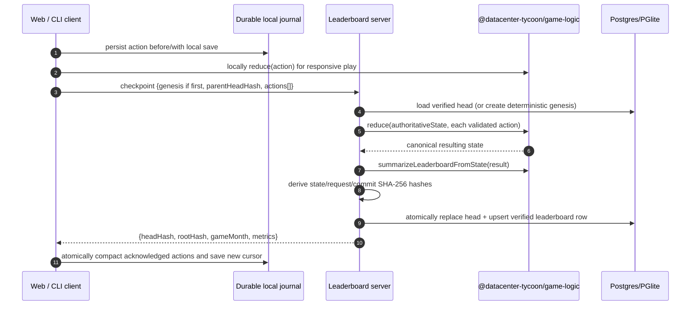
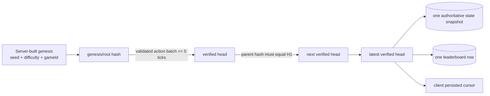

## Progress

- [x] **Phase 1 — Verification contract and deterministic replay primitives**
  - [x] 1.1 Specify the verified-run protocol, trust model, and compatibility policy
  - [x] 1.2 Make leaderboard genesis reconstructible by the server
  - [x] 1.3 Add a shared, tested replay projection for leaderboard verification
- [ ] **Phase 2 — Server-side authoritative checkpointing**
  - [ ] 2.1 Persist one rolling verified head per player/run and add the migration
  - [ ] 2.2 Validate, replay, hash, and atomically commit submissions
  - [ ] 2.3 Publish only verified runs and retire the raw-summary write path
- [ ] **Phase 3 — Durable client action journals and sync**
  - [ ] 3.1 Add a durable verification cursor and pending-action journal to web saves
  - [ ] 3.2 Replace web summary sync with bounded verified-checkpoint sync
  - [ ] 3.3 Add equivalent journaled verification support to the CLI daemon and online sync
- [ ] **Phase 4 — Rollout, adversarial tests, and operations**
  - [ ] 4.1 Define legacy/offline eligibility behavior and user-facing status
  - [ ] 4.2 Add end-to-end, race, retry, and tamper-resistance coverage
  - [ ] 4.3 Document protocol configuration, limits, and residual risks

## Overview

The current `POST /leaderboard/runs` accepts client-computed metrics and a client-selected month. Although it rejects malformed and regressive summaries, a caller can still submit a fabricated late-game state/summary directly. This plan replaces that trust boundary with server-authoritative replay: a client sends only a deterministic genesis descriptor, its previous server-issued head hash, and the actions taken since that head; the server reconstructs/reuses the authoritative state, runs those actions through `@datacenter-tycoon/game-logic`, derives the leaderboard metrics itself, and advances the run only when the batch covers at most a configurable number of completed monthly ticks (initially 5).

This is intentionally a **rolling checkpoint chain**, not a full backend save-history service. The backend retains exactly one authoritative game snapshot and one hash head per `(playerId, clientRunId)` and overwrites them transactionally on each accepted checkpoint. The resulting head is transitively verified from genesis, but old snapshots/actions cannot be browsed after replacement. This prevents direct fictitious-state/metric submissions; it cannot make a browser or CLI client literally bulletproof against account-token theft, automation, a modified client that sends *valid* actions, or a bug in the authoritative rules.

## Architecture





### Why a hash chain alone is insufficient

A client can hash a fabricated state just as easily as a real state. A hash chain gives ordering/tamper-evidence only after an authority has accepted an item; it does not establish that the client-supplied genesis, actions, or metrics obey game rules. OWASP’s Game Security Framework describes the game client as completely untrusted and the server as the trusted authority, while allowing local prediction followed by asynchronous server validation. The selected design follows that model: the server never accepts a final `GameState`, `metrics`, or `gameMonth` as evidence, and it derives all three after replay.

The Git-like portion is therefore useful as an optimistic-concurrency and lineage commitment, not as the anti-cheat mechanism itself:

```ts
interface VerifiedRunCheckpointRequest {
  playerId: string;
  clientRunId: string;              // the gameId
  // Required only while this run has no server head.
  genesis?: {
    seed: number;
    difficulty: Difficulty;
    rulesetId: string;
  };
  // null only for the first checkpoint from genesis.
  parentHeadHash: string | null;
  actions: unknown[];              // parsed to the allowed Action subset on the server
}

interface VerifiedRunCheckpointResponse {
  created: boolean;
  rootHash: string;
  headHash: string;
  gameMonth: number;
  metrics: LeaderboardMetrics;     // server-derived, informational only
}
```

The server creates the root from a canonical server-built initial state. For every accepted batch it calculates, rather than trusts:

```text
rootHash   = SHA-256(canonical({ protocolVersion, rulesetId, genesisDescriptor, genesisState }))
stateHash  = SHA-256(canonical(serverPersistedResultState))
requestHash = SHA-256(canonical({ parentHeadHash, normalizedActions }))
headHash   = SHA-256(canonical({ rootHash, parentHeadHash, requestHash, stateHash }))
```

Only server-normalized data enters those hashes. `canonical(...)` must be a deliberately specified stable JSON serializer (sorted object keys, JSON primitives only), not an incidental client `JSON.stringify` order. The server stores `rootHash`, `headHash`, `stateHash`, and the most recent `requestHash`; clients only retain the response cursor and pending actions.

### Verification invariants

1. **No trusted score fields.** The HTTP request has no client `metrics`, `money`, `cumulativeRevenue`, `gameMonth`, or final state. The server calls `summarizeLeaderboardFromState` after replay.
2. **Known genesis and deterministic randomness.** A first request has `parentHeadHash: null`; the server constructs `newGame(seed, { difficulty, gameId, playerName: registeredUsername })`. Contract-market generation, failures, and every other simulation random decision must consume only the persisted `rngState`; after genesis the server uses its own stored snapshot (including `rngState` and generated contracts), never a client snapshot. Thus an `AcceptContract` action can only reference the contract the server generated in that exact prior state. Custom `startingCash` and any client snapshot are ineligible for verified leaderboard runs. Client-selected seeds remain allowed in this minimal scope; server-issued seeds are a separate fairness/seed-shopping decision.
3. **Contiguous lineage.** A later request must name exactly the currently stored head hash. A transaction/CAS prevents two branches from advancing the same head.
4. **Bounded progress.** `result.tick - previous.tick` must be in `0..maxTickDelta`; default `maxTickDelta = 5`. `Subtick` is replayed too because it influences failures and SLA. Cap request bytes and action count independently to prevent expensive zero-tick spam.
5. **Action validity.** Parse the full discriminated `Action` union with primitive/string length/integer bounds, reject presentation-only actions, and replay each remaining action through `reduce`. Any parse or reducer failure rejects the entire batch without changing the head.
6. **Exactly-once recovery.** Store the last accepted parent/request digest with the head. Repeating the identical last request returns its already committed response, so a lost response can be retried. The client must persist its cursor and pending batch with its save before compacting it after an acknowledgement.
7. **Ruleset compatibility.** Bind a deliberately versioned verifier/ruleset id to genesis. The first minimal release supports only the current verifier id; a future gameplay rules change must either retain a matching verifier or start a new verified-leaderboard season. Do not silently replay a historical run with changed rules.
8. **Explicit verification status and verified-only rankings.** Every leaderboard row has `verificationStatus: "unverified" | "verified"`. The normal ranked leaderboard includes only `verified` rows with a verified head. Existing raw-summary rows are retained and explicitly marked `unverified`, but do not retain a rank in the verified leaderboard.

### Scope and non-goals

- Keep the current anonymous `playerId` model for this plan. It is a bearer identifier, not authentication; separate real account/auth work is required to prevent identity theft or cross-device races.
- Do not add browser secrets, client-side signatures, obfuscation, anti-debugging, or a blockchain. A secret embedded in a client can be extracted; a client signature only proves possession of that client material.
- Do not persist a full append-only history, action archive, or every submitted snapshot. Retain one head snapshot per run plus compact hashes required for concurrency/idempotency.
- Do not promise that a human, rather than a script, performed valid actions. The guarantee is that the displayed score is reachable under the server’s current authoritative game rules from the declared genesis and uninterrupted accepted checkpoints.

## Phase 1 — Verification contract and deterministic replay primitives

**Goal**: establish a small, versioned, deterministic protocol before changing public leaderboard behavior.

### Step 1.1 — Specify the verified-run protocol, trust model, and compatibility policy

- Files: this plan, new `packages/server/docs/leaderboard-verification.md`, `packages/server/src/config.ts`, `packages/server/.env.example`.
- Define protocol/ruleset identifiers, `LEADERBOARD_VERIFICATION_MAX_TICK_DELTA` defaulting to `5`, maximum action count, and maximum request-body bytes. Keep body/action limits explicitly configurable, with conservative defaults selected from real 5-month play traces.
- Define the request/response fields, null-genesis rule, server error codes (`INVALID_VERIFIED_RUN`, `UNKNOWN_RUN_HEAD`, `STALE_RUN_HEAD`, `RUN_RULESET_UNSUPPORTED`, `RUN_TICK_GAP_EXCEEDED`, `RUN_REPLAY_REJECTED`), idempotent retry semantics, and server-side stable JSON/hash format.
- State that deployment requires HTTPS and that a `playerId` alone is not authentication.
- Fix the rollout policy: retain every existing raw leaderboard row, migrate/mark it `unverified`, and exclude it from the verified ranked leaderboard. New accepted replay checkpoints set `verificationStatus: "verified"`. A pre-existing save may only become eligible if it can submit an unbroken journal from genesis within the configured gap (normally only a fresh run can).
- Acceptance: documentation includes worked genesis, normal continuation, stale-branch, 6-tick-gap, and lost-response examples; config tests cover defaults and invalid environment values.

### Step 1.2 — Make leaderboard genesis reconstructible by the server

- Files: `packages/game-logic/src/state/newGame.ts`, `packages/game-logic/src/state/newGame.test.ts`, `packages/game-logic/src/state/index.ts`, `packages/game-logic/src/index.ts`, `packages/game-logic/README.md`.
- Add a narrow public way for a verifier to supply the game id when creating a new game (for example an optional `gameId` in `NewGameOptions`); preserve current random-id behavior for normal callers.
- Add a verifier-facing constructor/helper that accepts only seed, difficulty, game id, and the registered display name. It must deliberately omit `startingCash` so the server always gets the difficulty catalog’s canonical opening cash.
- Test that independently created verifier genesis states are structurally deterministic for the same descriptor and that custom-starting-cash games cannot be represented as verified genesis.
- Acceptance: game-logic typecheck/tests pass; server can reconstruct the identical scoring-relevant opening state without accepting a client snapshot.

### Step 1.3 — Add a shared, tested replay projection for leaderboard verification

- Files: new `packages/game-logic/src/verification/` (or `src/state/replay.ts`), `packages/game-logic/src/index.ts`, focused tests.
- Export a small pure helper to apply an already validated sequence of gameplay-affecting `Action` values and return the resulting state; do not put HTTP parsing, hashing, Node APIs, or persistence in `game-logic`.
- Define/export the verification action subset. Include economy/contract/fabric/maintenance/upgrade actions plus `Tick` and `Subtick`; exclude audio, pause, and speed actions because they have no simulation effect. Preserve the exact existing reducer semantics for included actions.
- Add deterministic tests spanning contract generation (including accepting a server-generated offer), rack failures, daily subticks, a mid-month `Tick`, and a five-month batch; verify that server replay and client reducer produce the same canonical leaderboard summary and `rngState`. Include a negative test showing that an invented/stale contract id is rejected during replay.
- Acceptance: no gameplay rules are duplicated in `server`; replay uses `newGame`, `reduce`, and `summarizeLeaderboardFromState` from `game-logic` only.

## Phase 2 — Server-side authoritative checkpointing

**Goal**: accept only bounded, contiguous, replay-valid action batches and store a single verified head atomically with the public leaderboard summary.

### Step 2.1 — Persist one rolling verified head per player/run and add the migration

- Files: `packages/server/src/db/schema.ts`, `packages/server/src/db/relations.ts`, new `packages/server/migrations/002_verified_leaderboard_heads.sql`, `packages/server/src/db/test-database.ts`, repository tests.
- Add `verified_leaderboard_run_heads`, keyed uniquely by `(player_id, client_run_id)`, containing: ruleset id, genesis descriptor/root hash, current head hash, current state hash, serialized authoritative persisted game state, current game month, revision/updated timestamp, and prior-head/last-request digest fields needed for exact retry detection.
- Keep only this row’s snapshot; do **not** create historical checkpoint/action tables. Add a foreign key to `players` and an index/constraint appropriate for head lookup and concurrent compare-and-swap.
- Add a non-null `verification_status` column to `leaderboard_runs`, defaulting existing rows to `unverified`; new server-replayed commits set it to `verified`. Make ranking require both `verification_status = 'verified'` and its verified head, so legacy raw rows remain retained/inspectable but cannot be ranked as verified.
- Add migration `002` to the existing `packages/server/migrations/` runner (not an unapplied Drizzle-only migration). Update the PGlite test helper to load all ordered baseline migrations rather than hardcoding `001`.
- Acceptance: migration checks pass; fresh PGlite/Postgres schema creates the head table and status column; applying `002` preserves every old row as `unverified`, while newly replayed rows are `verified` and rankable.

### Step 2.2 — Validate, replay, hash, and atomically commit submissions

- Files: new `packages/server/src/leaderboard/verification.ts`, `packages/server/src/leaderboard/types.ts`, `packages/server/src/leaderboard/validation.ts`, `packages/server/src/leaderboard/repository.ts`, `packages/server/src/leaderboard/service.ts`, `packages/server/src/server/errors.ts`, unit tests.
- Replace raw summary parsing with strict verified-checkpoint parsing. Fully validate every action variant and bound strings, numbers, array size, and body size before replay. Reject fields that are no longer part of the API rather than silently accepting client metrics.
- For a first request, build genesis from the descriptor and registered player; for a continuation, load and deserialize the one authoritative stored snapshot. Require the supplied parent hash to match the stored current head.
- Replay only the validated action subset, reject any replay exception, enforce tick delta `<= maxTickDelta`, and derive the summary using `summarizeLeaderboardFromState`.
- Implement canonical SHA-256 hashing in server code and calculate all root/state/request/head values only after server normalization. Never use a client-provided hash as proof.
- Commit the replacement head and leaderboard summary in one database transaction with optimistic concurrency (or row locking plus a parent-hash condition). On an exact retry of the just-accepted request, return the previous success without replaying; on another stale parent return a conflict.
- Maintain matching behavior in `InMemoryLeaderboardRepository` so route/service tests do not depend on Postgres.
- Acceptance: unit and repository tests prove first checkpoint creation, valid continuation, malformed action rejection, reducer rejection rollback, a 6-tick rejection, no trusted metric path, stale-parent rejection, concurrent-branch single winner, and exact retry recovery.

### Step 2.3 — Publish only verified runs and retire the raw-summary write path

- Files: `packages/server/src/routes/leaderboard.ts`, `packages/server/src/leaderboard/queries.ts`, `packages/server/src/leaderboard/repository.ts`, server API tests, `packages/server/README.md`.
- Keep `POST /leaderboard/runs` as the endpoint if API continuity is valuable, but change its contract completely to verified checkpoints. Serialize returned server-derived metrics and head cursor, never echo client score fields.
- Ensure the normal leaderboard read selects only `verificationStatus: "verified"` runs with a verified head and retains the existing ranking/tie-break behavior among them. Preserve status in repository/domain records so a future explicitly labelled unverified-history view is possible without reclassifying data.
- Delete/adapt raw-summary monotonic validation and tests so a direct `{ metrics, gameMonth }` body returns a clear validation error rather than being stored.
- Acceptance: route tests demonstrate that a formerly valid forged summary body is rejected and cannot appear in `GET /leaderboard`; valid replayed runs remain rankable.

## Phase 3 — Durable client action journals and sync

**Goal**: make web and CLI clients preserve enough local evidence to submit/retry each bounded checkpoint without trusting their local state.

### Step 3.1 — Add a durable verification cursor and pending-action journal to web saves

- Files: new `packages/web/src/online/verified-run.ts`, `packages/web/src/store/gameStore.ts`, `packages/web/src/store/persist.ts`, related tests.
- Define client-only verification progress: genesis descriptor, acknowledged root/head hash, acknowledged tick, and normalized pending verification actions. It is local transport metadata, not part of `GameState` or game-logic save format.
- Change the web save storage envelope so the game save and verification metadata are written/read together under the same localStorage key, while preserving backwards loading of existing `serialize(state)` payloads. Keep `GameState` JSON/save-version semantics unchanged.
- Add an action observer/enhancer at the one web dispatch boundary. For each verification action, append a clone to the pending journal before/with persistence; presentation-only actions do not enter the journal. Restore the journal when loading a save.
- On acknowledged server success, atomically write the same game state with the new cursor and compact only the acknowledged prefix. Do not lose the pending batch if a network response is lost or the browser reloads.
- Acceptance: web persistence tests cover legacy save compatibility, action-journal round trip, crash/reload before acknowledgement, lost-response retry data retention, and acknowledged compaction.

### Step 3.2 — Replace web summary sync with bounded verified-checkpoint sync

- Files: `packages/web/src/online/leaderboard.ts` (or replacement verified client), `packages/web/src/App.tsx`, `packages/web/src/online/*.test.ts`, `packages/web/src/App.test.tsx`, start/sync status UI files as needed.
- Remove `buildLeaderboardRunSubmission(state)` as the write contract. Build checkpoint requests from the durable cursor and pending action journal; use server-returned metrics only for status/debugging.
- On the first failed checkpoint, immediately show a non-dismissable **sync pending** warning with the precise remaining allowance, e.g. “Leaderboard verification is offline — reconnect before month 12 (2 of 5 months pending).” Retry with bounded exponential backoff and force an attempt as the fifth completed unacknowledged tick is reached; respect the existing rate limit rather than creating retry storms.
- Make eligibility explicit: temporary loss of connectivity does **not** immediately invalidate a run. If the service becomes reachable while the journal is still within the five-tick limit, submit/replay the buffered actions and return the run to verified status. A fresh online-enabled run can establish genesis on its first checkpoint.
- Before an online-eligible run would advance beyond the configured unacknowledged tick gap, pause its automatic clock and present an explicit choice: **wait/retry verification** or **continue locally without leaderboard verification**. Manual `Tick`/time-advance commands must receive the same confirmation. Choosing to continue, or loading an already-over-limit journal, permanently marks that local run `local-only/unverified`; it is never silently submitted as a larger batch.
- Preserve leaderboard read behavior and resilient local play when the service is unavailable.
- Acceptance: web tests prove a normal five-tick progression emits action-only checkpoints, the server response advances the cursor, fabricated local score fields are absent from requests, reconnecting inside the gap resumes verified sync, and an attempted sixth unacknowledged tick warns/pauses until the user explicitly continues locally.

### Step 3.3 — Add equivalent journaled verification support to the CLI daemon and online sync

- Files: `packages/cli/src/daemon/runtime.ts`, `packages/cli/src/daemon/server.ts`, `packages/cli/src/daemon/persist.ts`, `packages/cli/src/online/leaderboard.ts`, `packages/cli/src/online/sync.ts`, CLI tests/docs.
- Capture dispatched verification actions at the daemon/runtime boundary, including automatic `Subtick` actions, so one-shot commands, TUI commands, and the background scheduler share one journal source.
- Extend the CLI save envelope atomically with the same cursor/journal data while retaining compatibility with existing game-logic-only save files. Do not maintain a separate fragile sync-signature file as the source of verification state.
- Replace CLI summary submissions/signature dedupe with checkpoint submissions, acknowledgement compaction, retry recovery, and the same gap/ineligibility semantics as the web client.
- Keep offline errors non-fatal to local gameplay and surface an actionable status/warning in command/TUI output.
- Acceptance: CLI tests cover daemon restart, automatic subticks, manual `tick N`, exact retry after an interrupted response, valid checkpoint sync, and permanent unverified status after a gap larger than five months.

## Phase 4 — Rollout, adversarial tests, and operations

**Goal**: safely enforce the new invariant, demonstrate its security properties, and make operational limits understandable.

### Step 4.1 — Define legacy/offline eligibility behavior and user-facing status

- Files: `packages/web/src/ui/start/`, relevant CLI status/TUI renderers, `packages/server/README.md`, release notes.
- Add clear copy distinguishing **verified**, **sync pending**, **temporarily offline but still within the gap**, and **local-only/unverified** runs. While pending, show the number of completed ticks since the acknowledged checkpoint and the last eligible game month; do not tell a user a score is protected before genesis is accepted.
- During deployment, preserve all existing leaderboard rows and mark them `unverified`; never delete or silently reclassify them. Keep them out of the verified ranked leaderboard. A future explicitly labelled unverified/legacy history view is optional and out of scope for this hardening change.
- Document that clearing local verification metadata, restoring an old save, switching to a different device, or starting offline beyond the gap cannot resume a verified run under the current anonymous-identity model.
- Acceptance: UX tests/snapshots cover all four states; migration tests prove legacy rows remain stored as `unverified`, new replayed rows are `verified`, and only verified entries appear in normal ranked responses.

### Step 4.2 — Add end-to-end, race, retry, and tamper-resistance coverage

- Files: game-logic/server/web/CLI test suites; optional focused integration harness under `packages/server/src/leaderboard/`.
- Create a real deterministic action trace from genesis, submit it in multiple <=5-tick chunks, and assert the final displayed metrics equal an independently replayed `game-logic` state.
- Add adversarial cases: direct late-game metric/state payload, changed genesis after first checkpoint, forged parent hash, branch/race from one parent, reordered/edited action batch, oversized action body, invalid action member, six-tick batch, and a client final-state mismatch (which is irrelevant because final state is not accepted).
- Add regression tests for all action variants that affect simulation, including 30-day `Subtick` rollover and `Tick` from a nonzero subtick.
- Run migration tests on both PGlite and configured Postgres behavior where the repository abstraction supports it.
- Acceptance: `npm run test -w @datacenter-tycoon/game-logic`, `npm run test -w @datacenter-tycoon/server`, `npm run test -w @datacenter-tycoon/web`, `npm run test -w @datacenter-tycoon/cli`, `npm run typecheck`, and `npm run check:migrations:server` pass.

### Step 4.3 — Document protocol configuration, limits, and residual risks

- Files: `packages/server/docs/leaderboard-verification.md`, `packages/server/README.md`, `packages/cli/README.md`, `packages/web/README.md` or user-facing online docs, `.env.example` files.
- Document the rolling-head storage cost, default five-tick maximum, body/action caps, retry semantics, expected reconnect behavior, and how to rotate a ruleset/season safely.
- Explicitly document residual threats: player-id bearer theft, user automation, valid-action botting, server/game-logic exploits, and server/database compromise. Link future work such as authenticated accounts, server-issued session credentials, full replay/audit retention, or anti-automation only as separate scopes.
- Acceptance: docs state neither “hash chain” nor “verified” as a claim of human play or universal cheat prevention, and on-call/developers can diagnose each protocol error from documented remediation.

## References

- [Root AGENTS.md](../../AGENTS.md)
- [Server AGENTS.md](../../packages/server/AGENTS.md)
- [Game-logic AGENTS.md](../../packages/game-logic/AGENTS.md)
- [CLI AGENTS.md](../../packages/cli/AGENTS.md)
- [Backend Leaderboard Foundation](./archive/038-backend-leaderboard-foundation.md)
- [Online Identity, CLI Leaderboard Sync, and Development DB Modes](./042-online-identity-cli-sync-and-dev-db-modes.md)
- [Subticks](./archive/037-subticks.md)
- [Current leaderboard route](../../packages/server/src/routes/leaderboard.ts)
- [Current leaderboard repository](../../packages/server/src/leaderboard/repository.ts)
- [Current new-game factory](../../packages/game-logic/src/state/newGame.ts)
- [Current web autosave](../../packages/web/src/store/persist.ts)
- [OWASP Game Security Framework — trust boundary and asynchronous server validation](https://owasp.org/www-project-gamesec-framework/OGSF.html)
- [IETF draft: Monotonic Attestation Service — hash chaining provides ordering/completeness, genesis convention](https://datatracker.ietf.org/doc/html/draft-todd-mas-01)

## Changelog

- 2026-07-26 — Created after repository and security-model research. Chosen design is server-side deterministic replay with a rolling server-authoritative hash head; a client-only hash chain was rejected because it cannot establish that client-provided state is legitimate.
- 2026-07-26 — Updated rollout policy: preserve all existing leaderboard rows and mark them `unverified`; only newly server-replayed checkpoints become `verified` and rank in the normal leaderboard.
- 2026-07-26 — Clarified deterministic-randomness assumption: contract/failure outcomes replay from server-owned persisted `rngState` and generated contracts; client-selected seed fairness is intentionally separate from fabricated-state prevention.
