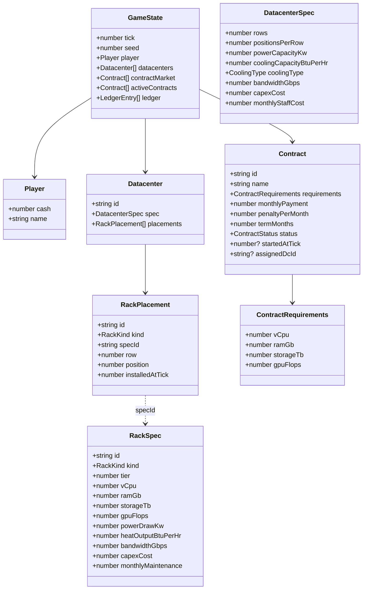
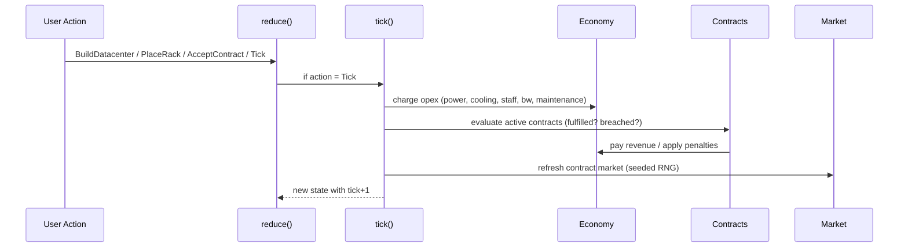
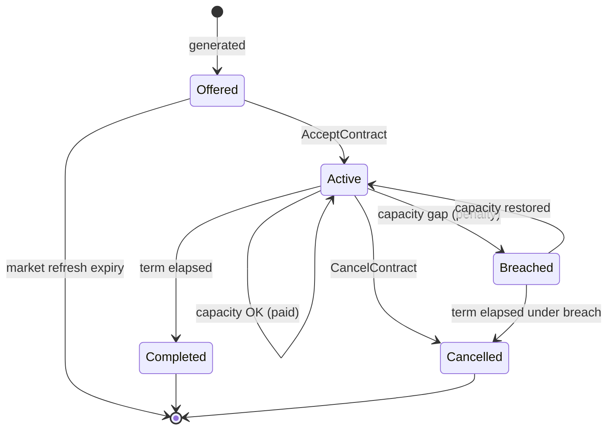

## Progress

- [x] **Phase 1 — Domain types & module scaffolding**
  - [x] 1.1 Create module layout and barrel exports
  - [x] 1.2 Define core enums and ID/branded types in `types.ts`
  - [x] 1.3 Define `Rack`, `RackSpec`, `RackPlacement` types
  - [x] 1.4 Define `Datacenter`, `DatacenterSpec`, `DatacenterGrid` types
  - [x] 1.5 Define `Contract`, `ContractRequirements`, `ContractStatus` types
  - [x] 1.6 Define top-level `GameState`, `Player`, `Money`, `Time` types
  - [x] 1.7 Re-export the public surface from `src/index.ts`

- [x] **Phase 2 — Catalogs & balance constants**
  - [x] 2.1 Author the rack catalog (C1–C3, M1–M3, S1–S3, G1–G3) in `catalog/racks.ts`
  - [x] 2.2 Author the datacenter blueprint catalog in `catalog/datacenters.ts`
  - [x] 2.3 Author economy constants (electricity price, staff salary, bandwidth $/Gbps) in `economy/constants.ts`
  - [x] 2.4 Unit tests asserting catalog invariants (positive values, sane ratios)

- [x] **Phase 3 — Capacity & resource math**
  - [x] 3.1 `rackCapacity(spec)` — pure derivation of vCPU / RAM / TB / FLOPS / kW / BTU
  - [x] 3.2 `datacenterUsage(dc)` — aggregate placed-rack power, heat, bandwidth
  - [x] 3.3 `datacenterCapacity(dc)` — aggregate available compute/memory/storage/gpu
  - [x] 3.4 `canPlaceRack(dc, spec, position)` — validate slot empty, power, cooling, bandwidth, floor space
  - [x] 3.5 Unit tests for capacity math and placement validation

- [x] **Phase 4 — Economy (capex & opex)**
  - [x] 4.1 `applyCapex(state, amount, reason)` — debit cash, append ledger entry
  - [x] 4.2 `tickOpex(dc)` — per-tick cost from power draw, cooling, staff, bandwidth, maintenance
  - [x] 4.3 `tickRevenue(state)` — sum payments for fulfilled contracts this tick
  - [x] 4.4 Unit tests for economy math (idempotent, deterministic)

- [x] **Phase 5 — Contracts**
  - [x] 5.1 `generateContract(rng, difficulty)` — seeded procedural contract w/ themed names
  - [x] 5.2 `refreshContractMarket(state)` — top up the available pool each tick
  - [x] 5.3 `acceptContract(state, contractId, dcId)` — move from market to active, set start tick
  - [x] 5.4 `evaluateContract(dc, contract)` — fulfilled / breached / underutilized
  - [x] 5.5 Contract lifecycle: active → completed (term ended) | breached (capacity gap) | cancelled
  - [x] 5.6 Unit tests covering generation determinism and lifecycle transitions

- [x] **Phase 6 — Simulation tick & RNG**
  - [x] 6.1 Implement seeded PRNG in `sim/rng.ts` (mulberry32 / sfc32)
  - [x] 6.2 Implement `tick(state)` orchestrator (opex → contract eval → revenue → market refresh → time++)
  - [x] 6.3 Determinism test: same seed + same actions → identical state after N ticks

- [x] **Phase 7 — Reducer & public API**
  - [x] 7.1 Define the `Action` discriminated union (BuildDatacenter, PlaceRack, RemoveRack, AcceptContract, CancelContract, Tick)
  - [x] 7.2 Implement `reduce(state, action): state` as a pure function
  - [x] 7.3 `newGame(seed, options?)` factory returning the initial `GameState`
  - [x] 7.4 Wire everything through `src/index.ts`

- [x] **Phase 8 — Save/load serialization**
  - [x] 8.1 `serialize(state): string` and `deserialize(json): GameState` with a `saveVersion`
  - [x] 8.2 Round-trip tests asserting structural equality
  - [x] 8.3 Schema version field + migration stub

- [x] **Phase 9 — Integration smoke test**
  - [x] 9.1 End-to-end scripted game: build DC, place racks, accept contract, run 12 ticks, assert profit
  - [x] 9.2 Document the public API in `packages/game-logic/README.md`

## Overview

This plan delivers the first playable, deterministic core of Datacenter Tycoon as pure TypeScript. The player owns one or more **datacenters** (gridded buildings with finite power/cooling/floor space), buys **racks** of varying types (C/M/S/G tiers 1–3) and places them into grid positions, and accepts time-bound **contracts** that demand vCPU / RAM / Storage / GPU FLOPS. Each monthly tick advances time, charges opex, evaluates contracts, and pays revenue for fulfilled ones. The whole thing is reducer-shaped, seedable, and JSON-serializable so frontends, the server, and tests can all share a single source of truth.

## Architecture

### Entity model



### Tick pipeline



### Contract lifecycle



### Key design decisions

- **One tick = one in-game month.** Contract terms, opex, and revenue are all monthly. Sub-monthly ticks can be added later without breaking save format.
- **Aggregate capacity, not per-rack binding.** A datacenter exposes summed `vCpu / ramGb / storageTb / gpuFlops`. Active contracts in that DC are summed and compared. We can later switch to a bin-packing or per-rack assignment model behind the same public API.
- **Hard constraints on placement.** A rack can only be placed if the slot is free *and* total `powerDrawKw ≤ dc.powerCapacityKw` *and* total `heatOutputBtuPerHr ≤ dc.coolingCapacityBtuPerHr` *and* bandwidth budget holds. Catalog values are tuned so tier-3 racks demand water cooling.
- **Pure reducer + injected seeded RNG.** No `Math.random()`, no `Date.now()`, no `fs`. Game state round-trips through JSON.
- **`datacenters: Datacenter[]` from day one** even though the early game ships with one DC — opens multi-DC expansion at zero refactor cost.
- **Catalogs are data, not classes.** Rack and DC blueprints live in `src/catalog/*.ts` as plain objects keyed by id, so balance tweaks are localized (see `game-balance-tuning` skill).

### Illustrative types

```ts
export type RackKind = "compute" | "memory" | "storage" | "gpu";
export type RackTier = 1 | 2 | 3;
export type CoolingType = "air" | "liquid";

export interface RackSpec {
  readonly id: string;            // "C1" | "G3" | …
  readonly kind: RackKind;
  readonly tier: RackTier;
  readonly vCpu: number;
  readonly ramGb: number;
  readonly storageTb: number;
  readonly gpuFlops: number;      // 0 for non-GPU
  readonly powerDrawKw: number;
  readonly heatOutputBtuPerHr: number;
  readonly bandwidthGbps: number;
  readonly capexCost: number;     // $
  readonly monthlyMaintenance: number;
}

export interface Datacenter {
  readonly id: string;
  readonly spec: DatacenterSpec;
  placements: RackPlacement[];    // mutated only via reducer
}

export interface ContractRequirements {
  vCpu: number; ramGb: number; storageTb: number; gpuFlops: number;
}

export type Action =
  | { type: "BuildDatacenter"; specId: string; dcId: string }
  | { type: "PlaceRack"; dcId: string; specId: string; row: number; position: number; placementId: string }
  | { type: "RemoveRack"; dcId: string; placementId: string }
  | { type: "AcceptContract"; contractId: string; dcId: string }
  | { type: "CancelContract"; contractId: string }
  | { type: "Tick" };

export function reduce(state: GameState, action: Action): GameState;
```

### Module layout

```
packages/game-logic/src/
├── index.ts                 # public exports
├── types.ts                 # shared domain types
├── catalog/
│   ├── racks.ts             # C1..G3 RackSpec table
│   └── datacenters.ts       # DC blueprints
├── entities/
│   ├── datacenter.ts        # capacity/usage/placement helpers
│   └── rack.ts              # rackCapacity helpers
├── economy/
│   ├── constants.ts         # $/kWh, staff salary, etc.
│   ├── capex.ts
│   └── opex.ts
├── contracts/
│   ├── generator.ts         # generateContract(rng, difficulty)
│   ├── market.ts            # refresh / accept
│   └── lifecycle.ts         # evaluate, advance, complete
├── sim/
│   ├── rng.ts               # mulberry32
│   └── tick.ts              # tick orchestrator
├── state/
│   ├── newGame.ts
│   └── reduce.ts
└── save/
    └── serialize.ts
```

## Phase 1 — Domain types & module scaffolding

**Goal**: lay down the file tree and exhaustive type definitions with zero runtime behaviour, so later phases just fill in pure functions.

### Step 1.1 — Create module layout and barrel exports

- Files: directories under `packages/game-logic/src/` per the layout above; each leaf folder gets an `index.ts` barrel.
- Add empty stub files where needed so imports resolve.
- Acceptance: `npm run typecheck -w @datacenter-tycoon/game-logic` passes with empty modules.

### Step 1.2 — Define core enums and branded types

- File: `packages/game-logic/src/types.ts`
- Add `RackKind`, `RackTier`, `CoolingType`, `ContractStatus` unions; ID brands (`DatacenterId`, `RackPlacementId`, `ContractId`); `Money = number`, `Tick = number`.
- Acceptance: types compile and are exported.

### Step 1.3 — Define `Rack`, `RackSpec`, `RackPlacement`

- File: `packages/game-logic/src/types.ts`
- Add interfaces from the Architecture section.
- Acceptance: typecheck passes; types are referenced by nothing yet.

### Step 1.4 — Define `Datacenter`, `DatacenterSpec`, grid helpers

- File: `packages/game-logic/src/types.ts`
- Add `DatacenterSpec` (rows, positionsPerRow, powerCapacityKw, coolingCapacityBtuPerHr, coolingType, bandwidthGbps, capexCost, monthlyStaffCost) and `Datacenter`.
- Acceptance: typecheck passes.

### Step 1.5 — Define `Contract`, `ContractRequirements`, `ContractStatus`

- File: `packages/game-logic/src/types.ts`
- Add `ContractStatus = "offered" | "active" | "breached" | "completed" | "cancelled"`.
- Acceptance: typecheck passes.

### Step 1.6 — Define `GameState`, `Player`, `LedgerEntry`

- File: `packages/game-logic/src/types.ts`
- Include `tick`, `seed`, `rngState`, `player`, `datacenters`, `contractMarket`, `activeContracts`, `ledger`.
- Acceptance: typecheck passes.

### Step 1.7 — Public surface

- File: `packages/game-logic/src/index.ts`
- Re-export every public type and (placeholder) function. Keep `VERSION`.
- Acceptance: `import { GameState, RackSpec, Action, reduce, tick, newGame } from "@datacenter-tycoon/game-logic"` resolves (functions can be `declare`d or stubs).

## Phase 2 — Catalogs & balance constants

**Goal**: the data-only baseline used by every subsequent system. Tuned to playable defaults; revisit later via the `game-balance-tuning` skill.

### Step 2.1 — Rack catalog

- File: `packages/game-logic/src/catalog/racks.ts`
- Export `RACK_CATALOG: Record<string, RackSpec>` with twelve entries (C1–C3, M1–M3, S1–S3, G1–G3). Tier T scales primary stat ~2× and capex ~2.2×; non-primary stats remain modest.
- Tier-3 racks must require liquid cooling (heat > any air-cooled DC's BTU/hr budget per slot).
- Acceptance: catalog imports cleanly; all numbers > 0; `kind`/`tier` consistent with `id`.

### Step 2.2 — Datacenter blueprint catalog

- File: `packages/game-logic/src/catalog/datacenters.ts`
- Export `DATACENTER_CATALOG` with at least three sizes (Garage, Warehouse, Hyperscale) varying rows × positions, kW, BTU/hr, cooling type, bandwidth, capex, staff cost.
- Acceptance: each blueprint exposes a sensible total slot count (rows × positionsPerRow) ≥ 4.

### Step 2.3 — Economy constants

- File: `packages/game-logic/src/economy/constants.ts`
- Export `ELECTRICITY_USD_PER_KWH`, `HOURS_PER_MONTH = 730`, `BANDWIDTH_USD_PER_GBPS_MONTH`, `COOLING_OVERHEAD_RATIO` (e.g. 0.3 of power), `STARTING_CASH`, `MARKET_REFRESH_SIZE`.
- Acceptance: imported in Phase 4 without changes.

### Step 2.4 — Catalog invariant tests

- File: `packages/game-logic/src/catalog/catalog.test.ts`
- Tests: every spec has positive numeric fields; non-GPU racks have `gpuFlops === 0`; tier-3 heat > tier-1 heat for same kind; ids unique.
- Acceptance: `npm run test -w @datacenter-tycoon/game-logic` green.

## Phase 3 — Capacity & resource math

**Goal**: pure functions that compute everything you can derive from `(datacenter, racks)`.

### Step 3.1 — `rackCapacity(spec)`

- File: `packages/game-logic/src/entities/rack.ts`
- Returns a `Capacity` object — for v1 just echoes `{ vCpu, ramGb, storageTb, gpuFlops }` from the spec.
- Acceptance: tests in same folder.

### Step 3.2 — `datacenterUsage(dc)`

- File: `packages/game-logic/src/entities/datacenter.ts`
- Returns `{ powerKw, heatBtuPerHr, bandwidthGbps, slotsUsed }` summed over placements (looking up `RackSpec` by `specId`).
- Acceptance: returns zeros for empty DC; numerically sums for a multi-rack DC.

### Step 3.3 — `datacenterCapacity(dc)`

- Aggregate `Capacity` across all placements.
- Acceptance: deterministic; pure; covered by tests.

### Step 3.4 — `canPlaceRack(dc, spec, row, position)`

- Returns `{ ok: true } | { ok: false; reason: "slot_taken"|"out_of_bounds"|"insufficient_power"|"insufficient_cooling"|"insufficient_bandwidth"|"cooling_type_mismatch" }`.
- `cooling_type_mismatch` blocks tier-3 racks in air-cooled DCs.
- Acceptance: each rejection reason is exercised by a test.

### Step 3.5 — Capacity test suite

- File: `packages/game-logic/src/entities/capacity.test.ts`
- Acceptance: tests pass; coverage of all branches in 3.4.

## Phase 4 — Economy

**Goal**: deterministic capex and per-tick opex, with an auditable ledger.

### Step 4.1 — `applyCapex(state, amount, reason)`

- File: `packages/game-logic/src/economy/capex.ts`
- Throws (or returns error variant) if `state.player.cash < amount`. Otherwise returns a new state with cash decremented and a `LedgerEntry` appended.
- Acceptance: tests cover success and insufficient-funds paths.

### Step 4.2 — `tickOpex(dc)`

- File: `packages/game-logic/src/economy/opex.ts`
- `power$ = (powerKw * (1 + COOLING_OVERHEAD_RATIO)) * HOURS_PER_MONTH * ELECTRICITY_USD_PER_KWH`
- `bandwidth$ = bandwidthGbps * BANDWIDTH_USD_PER_GBPS_MONTH`
- `staff$ = dc.spec.monthlyStaffCost`
- `maintenance$ = sum(spec.monthlyMaintenance for placed rack)`
- Returns `{ total, breakdown }`.
- Acceptance: tests verify formula and zero-rack DC pays staff + bandwidth only.

### Step 4.3 — `tickRevenue(state)`

- For each `active` contract whose `assignedDcId` DC capacity covers requirements, accrue `monthlyPayment`. Otherwise mark `breached` and accrue `-penaltyPerMonth`.
- Returns `{ revenue, updatedContracts }`.
- Acceptance: tests for fulfilled, breached, and recovery transitions.

### Step 4.4 — Economy tests

- File: `packages/game-logic/src/economy/economy.test.ts`
- Acceptance: green.

## Phase 5 — Contracts

**Goal**: a market of generated contracts, accept/cancel actions, and lifecycle evaluation.

### Step 5.1 — `generateContract(rng, difficulty)`

- File: `packages/game-logic/src/contracts/generator.ts`
- Picks a themed name from a small table (`["AI Model Training Job", "Small Data Storage Startup", ...]`), a primary requirement axis weighted by theme, and scales requirement magnitude + payment + term by `difficulty` (0..1).
- `monthlyPayment` is roughly proportional to total requirement "weight" with a healthy margin over expected opex.
- Acceptance: same `(rng-seed, difficulty)` always yields identical contract.

### Step 5.2 — `refreshContractMarket(state)`

- File: `packages/game-logic/src/contracts/market.ts`
- Drops expired offers, tops up to `MARKET_REFRESH_SIZE` using `state.rngState`, returns new state.
- Acceptance: deterministic; market size stable.

### Step 5.3 — `acceptContract(state, contractId, dcId)`

- File: `packages/game-logic/src/contracts/market.ts`
- Validates dcId exists; moves contract from `contractMarket` to `activeContracts`, sets `status = "active"`, `startedAtTick`, `assignedDcId`.
- Acceptance: tests for happy path + invalid dcId + already-accepted.

### Step 5.4 — `evaluateContract(dc, contract)`

- File: `packages/game-logic/src/contracts/lifecycle.ts`
- Returns `"fulfilled" | "breached"` based on whether DC capacity ≥ requirements.
- Acceptance: unit tests.

### Step 5.5 — Lifecycle advance

- Same file; `advanceContract(contract, dc, currentTick)` returns the next status: stays active, becomes breached, or transitions to `completed` after `termMonths`.
- Acceptance: lifecycle covered by table-driven tests.

### Step 5.6 — Contract tests

- File: `packages/game-logic/src/contracts/contracts.test.ts`
- Acceptance: green; determinism asserted.

## Phase 6 — Simulation tick & RNG

**Goal**: the heartbeat of the game. Pure, seeded, deterministic.

### Step 6.1 — Seeded PRNG

- File: `packages/game-logic/src/sim/rng.ts`
- Implement mulberry32; export `createRng(seed): { next(): number; state(): number }`; export `rngFromState(state)`.
- Acceptance: known-seed test vector passes.

### Step 6.2 — `tick(state)` orchestrator

- File: `packages/game-logic/src/sim/tick.ts`
- Order: (1) charge opex per DC; (2) evaluate + advance contracts; (3) credit revenue / debit penalties; (4) drop completed/cancelled contracts; (5) refresh market; (6) `tick++`.
- Acceptance: pure function — calling twice with cloned state produces equal results.

### Step 6.3 — Determinism integration test

- File: `packages/game-logic/src/sim/tick.test.ts`
- Run two `newGame(seed=42)` instances through the same scripted action sequence + N ticks. Assert deep equality.
- Acceptance: green.

## Phase 7 — Reducer & public API

**Goal**: a single entry point any frontend or server can call.

### Step 7.1 — `Action` discriminated union

- File: `packages/game-logic/src/state/reduce.ts`
- Acceptance: exhaustive `switch` enforced via `never` default.

### Step 7.2 — `reduce(state, action)`

- Each action delegates to a domain helper from earlier phases.
- `reduce(state, { type: "Tick" })` calls `tick(state)`.
- Acceptance: tests for each action type — happy path + at least one invalid input.

### Step 7.3 — `newGame(seed, options?)`

- File: `packages/game-logic/src/state/newGame.ts`
- Returns initial state: `STARTING_CASH`, no datacenters, primed contract market via `refreshContractMarket`.
- Options: `{ seed?: number; startingCash?: number; }`.
- Acceptance: same seed → same initial state.

### Step 7.4 — Public exports

- File: `packages/game-logic/src/index.ts`
- Export every public type, `reduce`, `tick`, `newGame`, `RACK_CATALOG`, `DATACENTER_CATALOG`, `serialize`, `deserialize`.
- Acceptance: re-export surface compiles.

## Phase 8 — Save/load

### Step 8.1 — `serialize` / `deserialize`

- File: `packages/game-logic/src/save/serialize.ts`
- Wrap `JSON.stringify` with a `saveVersion` field on a top-level envelope `{ saveVersion: 1, state }`.
- Acceptance: `JSON.parse(serialize(s))` deep-equals `{ saveVersion: 1, state: s }`.

### Step 8.2 — Round-trip tests

- File: `packages/game-logic/src/save/serialize.test.ts`
- Construct a non-trivial state (DC + racks + active contract), serialize, deserialize, deep-equal.
- Acceptance: green.

### Step 8.3 — Migration stub

- Same file; `migrate(envelope) → envelope` no-ops for v1 but throws on unknown versions.
- Acceptance: unknown version throws; v1 passes through.

## Phase 9 — Integration smoke test & README

### Step 9.1 — End-to-end scripted game

- File: `packages/game-logic/src/integration.test.ts`
- Scenario: `newGame(42)` → `BuildDatacenter("warehouse")` → place 4× C2 + 2× S2 → `AcceptContract` for a matching offered contract → run `Tick` × 12 → assert player cash strictly increased and contract status is `active` or `completed`.
- Acceptance: green; serves as living example.

### Step 9.2 — Document public API

- File: `packages/game-logic/README.md`
- Sections: install, quickstart code block, `Action` reference, `GameState` shape, determinism contract, save format.
- Acceptance: file present; quickstart compiles when copy-pasted.

## References

- [`AGENTS.md`](../AGENTS.md) — repo-wide architectural rules.
- [`packages/game-logic/AGENTS.md`](../packages/game-logic/AGENTS.md) — purity, determinism, serializability rules.
- [`.agents/skills/game-balance-tuning/SKILL.md`](../.agents/skills/game-balance-tuning/SKILL.md) — guardrails for catalog/economy constants in Phases 2 and 4.
- [`.agents/skills/planning/SKILL.md`](../.agents/skills/planning/SKILL.md) — the plan format itself.

## Changelog

- 2026-04-30 — created.
- 2026-04-30 — completed Phase 1 scaffolding and type definitions.
- 2026-04-30 — completed Phase 2 rack/datacenter catalogs, baseline economy constants, and catalog invariants tests.
- 2026-04-30 — completed Phase 3 capacity aggregation and rack placement validation helpers with tests.
- 2026-04-30 — completed Phase 4 capex, opex, aggregate contract revenue evaluation, and economy tests.
- 2026-05-01 — completed Phase 5 contract generation, market refresh/acceptance, lifecycle evaluation, and contract tests.
- 2026-05-01 — completed Phase 6 seeded RNG, monthly tick orchestration, and determinism tests.
- 2026-05-01 — completed Phase 7 reducer actions, initial game factory, and state tests.
- 2026-05-01 — completed Phase 8 save envelope serialization, round-trip tests, and migration stub.
- 2026-05-01 — completed Phase 9 integration smoke test and package README.
