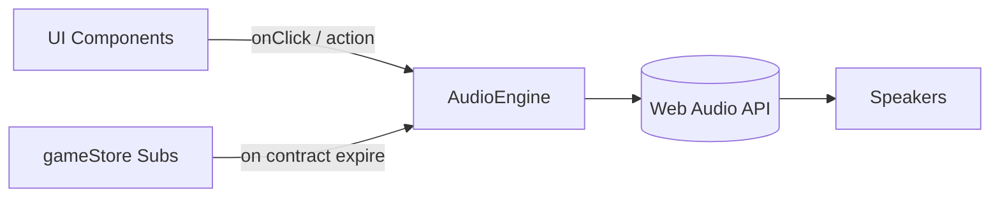

## Progress

- [x] **Phase 1 — Audio Subsystem & Synthesizer**
  - [x] 1.1 Create `AudioEngine` utility using Web Audio API (or a micro-library like ZzFX).
  - [x] 1.2 Implement sound profiles for different events (positive chime, negative buzzer, neutral blip).
  - [x] 1.3 Add a global mute toggle in the game store to allow users to disable sounds.
- [x] **Phase 2 — UI Event Integration**
  - [x] 2.1 Trigger sound on `addRack` (e.g., in `RackPicker` or `Grid`).
  - [x] 2.2 Trigger sound on `acceptContract` (e.g., in `MarketList`).
- [x] **Phase 3 — State Event Integration**
  - [x] 3.1 Subscribe to the game store to detect when an active contract expires.
  - [x] 3.2 Trigger the negative tone when an expiration event is detected.

## Overview

We need to add audio feedback for key game events like adding racks, accepting contracts, and contracts expiring. To avoid bloating the repository and the bundle with MP3 or WAV files, we will use procedural generation via the standard Web Audio API. By generating audio on the fly using oscillators (e.g., sine, square waves), we can create classic "tycoon" / retro sound effects instantly. 

## Architecture

We will implement an `AudioEngine` in the `packages/web/src/audio/` directory. This engine will initialize a singleton `AudioContext` (created upon the first user interaction to comply with browser autoplay policies). 



Key decisions:
- **Procedural Only:** No static asset files. We will use simple oscillator configurations (frequencies, attack/decay envelopes) to create synth-like bleeps and bloops. We may use a micro-library like `zzfx` for easy sound parameterization, or write a tiny custom `playTone(freq, type, duration)` function.
- **Lazy Initialization:** `AudioContext` will only be resumed/created after the user clicks on the page, respecting browser policies.
- **Opt-out:** Audio must be mutable. A setting in `gameStore` will track if sound is enabled.

### Code Example (Custom Synth approach)

```ts
// packages/web/src/audio/AudioEngine.ts

let ctx: AudioContext | null = null;

function initContext() {
  if (!ctx) ctx = new AudioContext();
  if (ctx.state === 'suspended') ctx.resume();
  return ctx;
}

export function playSound(type: 'success' | 'error' | 'click', isMuted: boolean) {
  if (isMuted) return;
  const context = initContext();
  const osc = context.createOscillator();
  const gain = context.createGain();
  
  osc.connect(gain);
  gain.connect(context.destination);
  
  // Example: simple positive chime
  if (type === 'success') {
      osc.type = 'sine';
      osc.frequency.setValueAtTime(440, context.currentTime); // A4
      osc.frequency.setValueAtTime(880, context.currentTime + 0.1); // A5
      gain.gain.setValueAtTime(0.5, context.currentTime);
      gain.gain.exponentialRampToValueAtTime(0.01, context.currentTime + 0.5);
      osc.start();
      osc.stop(context.currentTime + 0.5);
  }
  // (Other sound profiles implemented similarly)
}
```

## Phase 1 — Audio Subsystem & Synthesizer

**Goal**: Establish the basic `AudioEngine` that can generate sounds procedurally without playing them in the game yet.

### Step 1.1 — Create `AudioEngine.ts`
- File: `packages/web/src/audio/AudioEngine.ts`
- Implement a basic Web Audio API wrapper that lazily initializes an `AudioContext`.
- Add a generic `playTone` or `playSound` function capable of generating at least three types of sounds.
- Acceptance: Code compiles without errors; the utility is exported.

### Step 1.2 — Define Sound Profiles
- File: `packages/web/src/audio/AudioEngine.ts`
- Refine the sound profiles to include distinct audio shapes for: `acceptContract` (success), `expireContract` (error/loss), and `addRack` (construction/click).
- Acceptance: Sound definitions are documented and implemented via oscillator frequency and gain envelopes.

### Step 1.3 — Mute Toggle in Game Store
- File: `packages/web/src/store/gameStore.ts` & `packages/web/src/ui/topbar/` (or similar)
- Add an `audioEnabled: boolean` property to the game state (default `true`).
- Add an action to toggle this state.
- (Optional) add a small UI button in the app shell to toggle it.
- Acceptance: State exists and can be toggled.

## Phase 2 — UI Event Integration

**Goal**: Attach sounds to user-driven actions.

### Step 2.1 — Sound on `addRack`
- File: `packages/web/src/ui/floor/RackPicker.tsx` or `Grid.tsx`
- Call `playSound('addRack', audioEnabled)` when the user successfully places a new rack.
- Acceptance: Placing a rack triggers the sound.

### Step 2.2 — Sound on `acceptContract`
- File: `packages/web/src/ui/contracts/MarketList.tsx`
- Call `playSound('acceptContract', audioEnabled)` when a contract is accepted.
- Acceptance: Accepting a contract triggers the sound.

## Phase 3 — State Event Integration

**Goal**: Attach sounds to time-driven simulation events (like expirations).

### Step 3.1 — Detect Contract Expiration
- File: `packages/web/src/store/tickDriver.ts` or a new subscriber hook.
- Set up a subscription or check during the tick to identify when an active contract drops out of the active list (expires or fails).
- Acceptance: Expiration logic successfully detects the exact tick an expiration occurs.

### Step 3.2 — Trigger Expiration Sound
- File: (Same as 3.1)
- Hook up `playSound('expireContract', audioEnabled)` when the expiration is detected.
- Acceptance: When a contract expires in the simulation, the buzzer sound plays.

## References

- [Web Audio API Documentation (MDN)](https://developer.mozilla.org/en-US/docs/Web/API/Web_Audio_API)

## Changelog

- 2026-05-17 — completed and archived.
- 2026-05-01 — created.
