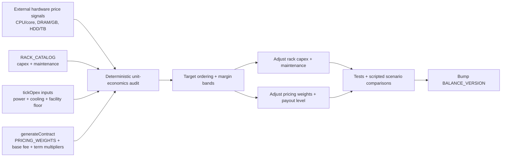

## Progress

- [x] **Phase 1 — Audit and target bands**
  - [x] 1.1 Add a deterministic economics audit that reports rack capex/unit, minimum opex/unit, and generated contract payout/unit
  - [x] 1.2 Lock target ordering and profitability bands for storage vs compute vs memory lanes
- [x] **Phase 2 — Rack capex and recurring-cost rebalance**
  - [x] 2.1 Reprice storage racks so same-tier storage racks are cheaper than same-tier memory racks while preserving monotonic progression
  - [x] 2.2 Re-tune recurring maintenance so storage remains cheapest per TB without becoming the runaway ROI lane
- [x] **Phase 3 — Contract pricing rebalance**
  - [x] 3.1 Reweight contract pricing toward vCPU and RAM, then choose the smallest payout uplift that fixes margins
  - [x] 3.2 Bump `BALANCE_VERSION` and update balance-sensitive tests
- [x] **Phase 4 — Validation and follow-through**
  - [x] 4.1 Verify starter, warehouse, and mixed-fleet economics with tests and scripted comparisons
  - [x] 4.2 Record playtest outcomes and archive the plan after the rebalance ships

## Overview

Players have reported that storage racks feel wrongly priced versus memory racks, and the current catalog backs that up: `S1/S2/S3` are all more expensive than `M1/M2/M3` on total capex sticker price even though real-world dense storage is usually much cheaper than high-memory infrastructure on a cost-per-capacity basis. At the same time, archived playtests show that early cash flow is brittle, with revenue cliffs after contract expiry and opex staying punishingly high while idle.

This plan rebalances two connected systems in `game-logic`: rack capex/recurring cost and contract payout generation. The goal is not to simulate procurement perfectly, but to make the relative ordering feel believable, keep storage from being the obviously best ROI lane, and improve average contract profitability enough that routine play is less cash-starved.

## Architecture



Key decisions:

- Use **rough industry heuristics** and relative ordering, not exact procurement modelling.
- Keep the simulation deterministic: all audit helpers and verification must be pure and seed-driven.
- Evaluate both **rack-only opex floors** and **facility-loaded floors** so we do not overfit to maintenance-only costs.
- Avoid a blind global payout bump if the audit shows one resource lane is already over-rewarded.

### Current rough findings (2026-05-24)

Internal repo calculations from the current catalogs/generator show:

| Metric | Rough current value |
| --- | --- |
| Same-tier sticker ordering | `C1 $50k < M1 $65k < S1 $80k`; `C2 $120k < M2 $160k < S2 $200k`; `C3 $280k < M3 $380k < S3 $450k` |
| Effective contract marginal payout | about **$36.2 / vCPU-month**, **$1.629 / GB-month**, **$22.63 / TB-month** |
| Cheapest rack-only opex floor | about **$4.6 / vCPU-month** on `C1`, **$0.34 / GB-month** on `M1`, **$1.5–1.6 / TB-month** on storage tiers |
| Lowest facility-loaded per-slot overhead | about **$1,550 / slot-month** in a fully-utilized `warehouse` in `sa_east` |
| Tier-1 facility-loaded floor | about **$19.1 / vCPU-month** on `C1`, **$1.24 / GB-month** on `M1`, **$5.17 / TB-month** on `S1` |

Interpretation:

- **Memory** is the tightest lane once facility overhead is considered.
- **Storage** is already the richest lane on margin/payback, so lowering storage capex without a compensating pricing pass would over-buff it.
- A **blanket +30% payout increase** is unlikely to be the best answer.
- The most promising direction is an **average uplift closer to ~20%**, weighted more toward **vCPU and RAM** than toward storage.

### External price anchors used for this plan

These are rough anchors, not hard conversion formulas:

- **Server DRAM remains expensive.** Market and reseller pages for DDR5 server RDIMMs show roughly four-figure pricing for 64GB and 128GB modules, putting enterprise memory in a much steeper cost bucket than bulk HDD storage on a per-capacity basis.
- **Bulk storage is cheap per TB.** Enterprise 18–24TB HDD pricing commonly lands around the mid-teens to low-thirties USD per TB, and a 90-bay storage server chassis starts around the mid-teens of thousands before drives, keeping all-in storage density relatively cheap per TB.
- **Compute cores are moderately expensive, but not DRAM-expensive.** High-end server CPU list prices commonly fall in the rough range of **$34–$86 per physical core** before motherboard, PSU, networking, and chassis costs are added.

Those signals point to a better in-game total sticker ordering of roughly:

```text
compute rack <= storage rack < memory rack
```

while still preserving:

```text
storage rack has the cheapest capex/TB and opex/TB
memory rack has the cheapest capex/GB only when normalized by RAM delivered
```

A useful audit shape for implementation:

```ts
interface UnitEconomicsSnapshot {
  rackId: string;
  capexPerVCpu: number;
  capexPerRamGb: number;
  capexPerStorageTb: number;
  rackOnlyOpexPerVCpu: number;
  rackOnlyOpexPerRamGb: number;
  rackOnlyOpexPerStorageTb: number;
  facilityLoadedOpexPerVCpu: number;
  facilityLoadedOpexPerRamGb: number;
  facilityLoadedOpexPerStorageTb: number;
}
```

## Phase 1 — Audit and target bands

**Goal**: make the rebalance data-driven and reproducible before changing any constants.

### Step 1.1 — Add deterministic economics audit

- Files: `packages/game-logic/src/catalog/racks.ts`, `packages/game-logic/src/catalog/datacenters.ts`, `packages/game-logic/src/catalog/regions.ts`, `packages/game-logic/src/contracts/generator.ts`, new audit test/helper under `packages/game-logic/src/`
- Add a pure helper or test-only harness that computes:
  - capex per vCPU / GB RAM / TB storage for each rack tier,
  - minimum rack-only opex per unit in the cheapest region,
  - minimum facility-loaded opex per unit using the cheapest fully-utilized datacenter slot,
  - average generated contract payout per unit from seeded contract samples.
- Keep it deterministic and cheap enough to run in CI.
- Acceptance: a single test/helper can print or assert the current economics without manual spreadsheet work.

### Step 1.2 — Lock target ordering and profitability bands

- Files: new audit test/helper, possibly `packages/game-logic/src/contracts/generator.ts` comments/constants if target bands need inline documentation
- Encode the intended rules the rebalance must satisfy:
  - same-tier storage rack capex must be **below** same-tier memory rack capex,
  - storage remains cheapest per TB on capex and recurring opex,
  - memory and compute contracts clear facility-loaded opex with healthier margins,
  - storage does not get a materially faster payback window than every other non-GPU lane.
- Acceptance: failing expectations make it obvious when future balance edits reintroduce the current skew.

## Phase 2 — Rack capex and recurring-cost rebalance

**Goal**: fix the rack catalog so sticker prices and maintenance make more intuitive sense.

### Step 2.1 — Reprice storage racks below memory racks

- File: `packages/game-logic/src/catalog/racks.ts`
- Adjust `S0`–`S3` capex downward and, if required, slightly adjust `M0`–`M3` upward so each tier satisfies the new ordering.
- Preserve monotonic tier progression and the starter-tier design rule that tier-0 remains a cheaper on-ramp from tier-1.
- Keep compute racks plausibly cheapest or near-cheapest on total sticker, with storage in the middle and memory highest.
- Acceptance:
  - `S0 < M0`, `S1 < M1`, `S2 < M2`, `S3 < M3` on `capexCost`,
  - tiers remain strictly increasing inside each family,
  - no rack becomes cheaper than a lower tier with better primary output.

### Step 2.2 — Re-tune recurring maintenance to avoid runaway storage ROI

- File: `packages/game-logic/src/catalog/racks.ts`
- Revisit `monthlyMaintenance` for storage and, if necessary, memory/compute racks after capex changes.
- If the first-pass storage capex cut proves too deep in the audit, allow a small second-pass storage capex nudge upward while preserving the Phase 2.1 ordering guarantees.
- Ensure storage stays operationally efficient per TB, but does not become the dominant “always buy this first” lane after the capex cut.
- Use the audit from Phase 1 rather than intuition-only tuning.
- Acceptance:
  - storage remains cheapest on opex/TB,
  - compute and memory payback windows are not dramatically worse than storage under the cheapest realistic facility assumptions.

## Phase 3 — Contract pricing rebalance

**Goal**: improve contract profitability without over-rewarding storage-heavy builds.

### Step 3.1 — Reweight contract pricing and pick the smallest viable uplift

- File: `packages/game-logic/src/contracts/generator.ts`
- Revisit `PRICING_WEIGHTS` and, if needed, the flat `5_000` base fee used in `monthlyPayment` generation.
- Compare at least three candidate directions using the audit harness:
  - mild uplift (~20%),
  - medium uplift (~25%),
  - aggressive uplift (~30%).
- Prefer a shape that lifts **vCPU** and **RAM** pricing more than **storage**, since storage already has the strongest current unit margins.
- If a flat uplift is used, document why it beat component-specific changes.
- Acceptance:
  - average generated payout rises enough to relieve cash pressure,
  - the chosen change lands closer to the minimum viable fix than to the maximum requested buff,
  - storage contracts do not become absurdly better than mixed compute/memory contracts.

### Step 3.2 — Bump balance version and refresh tests

- Files: `packages/game-logic/src/economy/constants.ts`, balance/economy/contract tests under `packages/game-logic/src/**/*.test.ts`
- Increment `BALANCE_VERSION` because capex, opex, and contract values are all changing.
- Update or add tests that pin the new contract/rack economics.
- Acceptance:
  - `BALANCE_VERSION` is incremented,
  - `npm run typecheck -w @datacenter-tycoon/game-logic` passes,
  - `npm run test -w @datacenter-tycoon/game-logic` passes.

## Phase 4 — Validation and follow-through

**Goal**: confirm the new balance actually improves gameplay and does not just move numbers around.

### Step 4.1 — Validate scripted scenarios

- Files: audit helper/tests, optional new scenario fixture under `packages/game-logic/src/`
- Compare at least these before/after scenarios:
  - starter garage with a mixed `C1/M1/S1` footprint,
  - storage-heavy early warehouse build,
  - mixed compute+memory build intended for OLTP / edge contracts.
- Check margin, payback, and sensitivity to a brief idle period.
- Acceptance: the post-change numbers show better early survivability without making storage the obviously optimal path.

### Step 4.2 — Record playtest outcomes and archive plan

- Files: `.agents/research/` playtest note, `.agents/plans/README.md`, archive move when complete
- Run at least one focused playtest after implementation and record whether the new pricing fixes the storage-vs-memory feel problem and reduces early cash starvation.
- Once all steps are complete, archive the plan and update the active/archived plan indexes.
- Acceptance: a follow-up note exists, and the completed plan is archived with references preserved.

## References

- [`AGENTS.md`](../../AGENTS.md)
- [`.agents/skills/planning/SKILL.md`](../skills/planning/SKILL.md)
- [`.agents/skills/game-balance-tuning/SKILL.md`](../skills/game-balance-tuning/SKILL.md)
- [`./archive/032-contract-generation-variety-and-realism.md`](./archive/032-contract-generation-variety-and-realism.md)
- [`./archive/034-global-easier-balance-pass.md`](./archive/034-global-easier-balance-pass.md)
- [`./archive/039-game-balance-repair-and-contract-mix.md`](./archive/039-game-balance-repair-and-contract-mix.md)
- Supermicro 90-bay storage server starting-price pages:
  - https://store.supermicro.com/nl_en/ssg-542b-e1cr90.html
  - https://www.supermicro.com/en/products/system/storage/4u/ssg-542b-de1cr90
- Server memory price anchors:
  - https://corewavelabs.com/ddr5-4800-rdimm-udimm-server-ram-price/
  - https://www.memorymarket.com/price/ems/100263
  - https://www.pugetsystems.com/products/rackmount-servers/2u/e202-2u/
- Server CPU/core price anchors:
  - https://wehaveservers.com/blog/performance-benchmarking/amd-epyc-vs-intel-xeon-for-dedicated-servers-2025-benchmarks/
  - https://hothardware.com/news/intel-slash-gnr-prices
- Storage price-per-TB anchors:
  - https://datacenterdisk.com/
  - https://storagediskprices.com/seagate-exos/
  - https://diskprices.com/?locale=us&condition=new&disk_types=internal_hdd,internal_ssd

## Changelog

- 2026-05-24 — Created from rack-cost research, current catalog audit, and contract unit-economics review.
- 2026-05-24 — Step 2.2 widened to permit a small second-pass storage capex nudge if the first cut over-buffs storage payback.
- 2026-05-24 — Completed with deterministic scenario validation, focused CLI playtest follow-up, and archive handoff.
