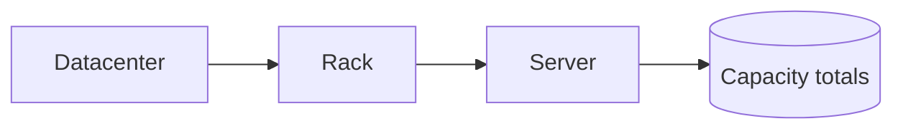
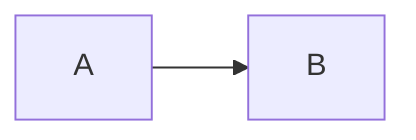

# Planning

## Overview

This skill defines **how plans are created, structured, tracked, and executed** in the Datacenter Tycoon repo. Plans are durable, numbered, version-controlled markdown files that decompose non-trivial work into **phases** (high-level milestones) and **steps** (concrete, actionable units inside each phase).

Plans are the single source of truth for "what we're going to build and how" — they outlive any single chat session. An agent picking up work months later should be able to read a plan and resume exactly where the previous agent stopped.

## When to Use

**Create a plan when**:
- The work spans multiple files, packages, or sessions.
- The user asks for a "plan", "design", "spec", "breakdown", or "roadmap".
- A feature has architectural implications (new modules, new public APIs, data-model changes).
- The task touches game-balance constants, the simulation tick, save format, or anything cross-cutting.

**Execute / update a plan when**:
- The user says "implement plan 003", "continue the plan", "next step", "mark phase 2 done", etc.
- You finish a step inside an active plan — always update its checklist and status before signing off.

**Skip planning when**:
- The change is small (one file, one obvious fix, < ~30 lines).
- The user explicitly asks for a quick edit or hotfix.

## Where Plans Live

All plans live in **`.agents/plans/`** at the repo root:

```
.agents/plans/
├── README.md           # auto-maintained index of all plans (optional)
├── 001-first-plan.md
├── 002-second-plan.md
└── 003-third-plan.md
```

Create the `.agents/plans/` directory if it does not yet exist.

## Plan File Naming

`NNN-kebab-case-slug.md` where `NNN` is a **zero-padded 3-digit sequence** number.

- `001-rack-entity-model.md` ✅
- `012-contract-fulfilment-engine.md` ✅
- `rack-model.md` ❌ (no number)
- `1-rack.md` ❌ (not zero-padded)

To find the next number: `ls .agents/plans/ | grep -E '^[0-9]{3}-' | sort | tail -1` then increment.

## Plan File Structure

Every plan file MUST have these sections in this order:

1. **YAML frontmatter** (metadata).
2. **Progress checklist** (quick-glance status).
3. **Overview / Motivation**.
4. **Architecture** (diagrams + explanation).
5. **Phases**, each containing **Steps**.
6. **References** (optional but encouraged).

### 1. YAML Frontmatter

```yaml
---
name: Rack Entity Model
description: Define the core Rack and Server data structures used across game-logic.
status: created   # one of: created | started | completed
created: 2026-04-30
updated: 2026-04-30
owner: <optional, e.g. game-logic>
---
```

**`status` lifecycle**:
- `created` — plan written, no implementation work started yet.
- `started` — at least one step is in progress or done.
- `completed` — every step in every phase is checked off.

Always bump `updated` when you change the file.

### 2. Progress Checklist (top of file, right after frontmatter)

A flat, copy-pasteable view of every phase and step using GitHub-flavored task lists. This is what a returning agent reads first.

```markdown
## Progress

- [ ] **Phase 1 — Types & scaffolding**
  - [ ] 1.1 Add `RackKind` union and `Rack` interface to `types.ts`
  - [ ] 1.2 Add `Server` interface and rack→server relationship
  - [ ] 1.3 Export from `src/index.ts`
- [ ] **Phase 2 — Capacity calculations**
  - [ ] 2.1 Implement `rackCapacity(rack)` pure function
  - [ ] 2.2 Implement `aggregateCapacity(racks)` reducer
  - [ ] 2.3 Unit tests for both
- [ ] **Phase 3 — Integration**
  - [ ] 3.1 Wire into `Datacenter` entity
  - [ ] 3.2 Update tick simulation to read aggregated capacity
```

Tick boxes (`[x]`) as work completes. A phase is only checked once **all** its steps are.

### 3. Overview / Motivation

2–6 sentences answering: *what* are we building and *why*? Link the user-facing problem.

### 4. Architecture

Explain the design. Include at least one **Mermaid diagram** when the plan introduces new modules, data flow, state machines, or entity relationships.

````markdown
## Architecture



Key decisions:
- `Rack` is a plain object, not a class (serialization rule).
- Capacity is **derived**, never stored, to keep state minimal.
````

Use the diagram type that fits:
- `flowchart` — module/data flow.
- `classDiagram` — entity relationships.
- `sequenceDiagram` — protocol/order of events (e.g. tick).
- `stateDiagram-v2` — lifecycle (e.g. contract states).
- `erDiagram` — persisted/serialized shapes.

Include **code examples** for the most important types or functions when they clarify intent:

````markdown
```ts
export interface Rack {
  id: string;
  kind: RackKind;        // 'compute' | 'memory' | 'storage' | 'gpu'
  servers: Server[];
}
```
````

### 5. Phases & Steps

Each **phase** is a named milestone that delivers a coherent chunk of value (ideally independently mergeable). Each **step** is a concrete, executable instruction — small enough that a single agent turn can finish it.

Template per phase:

```markdown
## Phase 1 — Types & scaffolding

**Goal**: introduce the data model without changing any runtime behaviour yet.

### Step 1.1 — Add `RackKind` and `Rack` interface

- File: `packages/game-logic/src/types.ts`
- Add `RackKind` union and `Rack` interface as shown in Architecture.
- Acceptance: `npm run typecheck` passes; nothing yet imports `Rack`.

### Step 1.2 — Add `Server` interface
...
```

Every step should specify:
- **File(s)** it touches.
- **What to do** (1–5 bullets).
- **Acceptance criteria** (how we know it's done — usually a passing command or a visible behaviour).

### 6. References (optional)

Links to: relevant `AGENTS.md` sections, external docs, prior art, GitHub issues, related plans (`see also: 002-foo.md`).

## How to Create a New Plan

1. **Pick a number**: `ls .agents/plans/` → next zero-padded 3-digit.
2. **Pick a slug**: short kebab-case noun phrase.
3. **Create** `.agents/plans/NNN-slug.md` using the template below.
4. **Status** starts at `created`.
5. **Show the user the plan** (or a summary) before implementing — they may want to revise phases/steps.
6. Do **not** start implementation in the same turn unless the user explicitly says "make the plan and execute it".

## How to Execute a Plan

1. **Read the entire plan file** first — frontmatter, progress, architecture, all phases.
2. **Find the first unchecked step** in the lowest unchecked phase.
3. **Implement that single step**, respecting its acceptance criteria.
4. **Update the plan**:
   - Tick the step's checkbox: `- [ ]` → `- [x]`.
   - If all steps in the phase are now ticked, tick the phase too.
   - If status was `created`, change it to `started`.
   - If every phase is complete, change status to `completed`.
   - Bump `updated` to today's date.
5. **Commit** logically (one step per commit is a fine default; one phase per commit is also fine).
6. **Stop and report progress** unless the user said to keep going.

If a step turns out to be wrong or insufficient, **edit the plan first** (add/split/remove steps, note rationale in a `## Changelog` section at the bottom), then resume. Plans are living documents.

## Plan Template (copy-paste)

````markdown
---
name: <Human-readable plan name>
description: <One-line description of what this plan delivers>
status: created
created: YYYY-MM-DD
updated: YYYY-MM-DD
---

## Progress

- [ ] **Phase 1 — <name>**
  - [ ] 1.1 <step>
  - [ ] 1.2 <step>
- [ ] **Phase 2 — <name>**
  - [ ] 2.1 <step>

## Overview

<2–6 sentences: what and why.>

## Architecture



<Key decisions, types, code examples.>

```ts
// illustrative code
```

## Phase 1 — <name>

**Goal**: <what this phase delivers>

### Step 1.1 — <imperative title>

- File: `path/to/file.ts`
- <bullet of what to do>
- Acceptance: <how we know it's done>

### Step 1.2 — <imperative title>

- File: `...`
- ...
- Acceptance: ...

## Phase 2 — <name>

...

## References

- [AGENTS.md](../AGENTS.md)
- <external links>

## Changelog

- YYYY-MM-DD — created.
````

## Anti-Patterns

- ❌ Implementing a multi-package change without writing a plan first.
- ❌ Plans without a progress checklist (the whole point is fast resumption).
- ❌ Steps that are vague ("improve performance") instead of actionable ("memoize `aggregateCapacity` in `sim/tick.ts`").
- ❌ Editing implementation without ticking the corresponding step.
- ❌ Reusing a plan number, or skipping numbers.
- ❌ Deleting a completed plan — keep it as historical record. If superseded, link the successor in `## References`.
