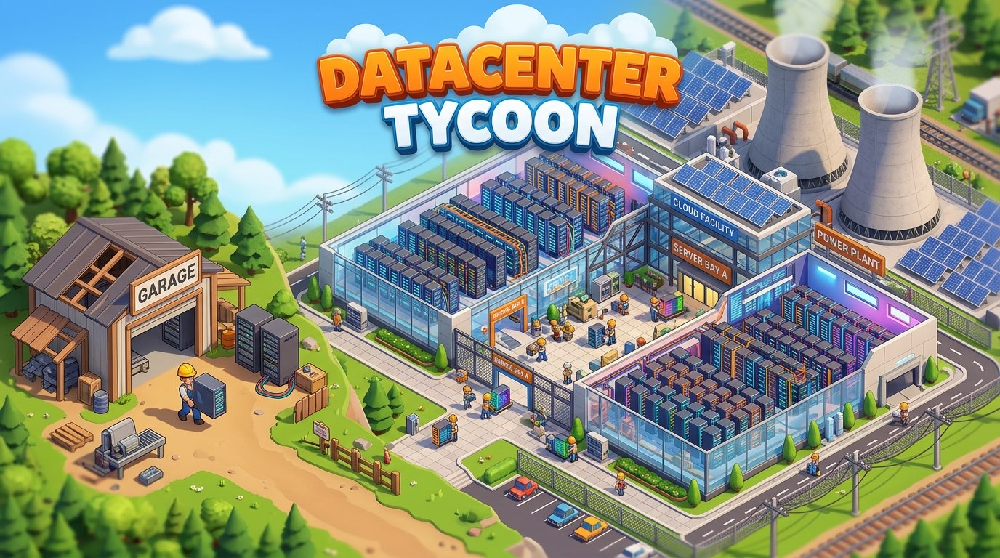

# Datacenter Tycoon

[](https://dctycoon.arnav.tech)
[](https://codecov.io/gh/championswimmer/datacenter-tycoon)



Welcome to **Datacenter Tycoon**, an idle/tycoon management game where you design, build, and operate your very own global data center empire! 

## Game Overview

In Datacenter Tycoon, you act as the CEO and lead architect of a burgeoning infrastructure provider. Your goal is to construct facilities, procure server racks, balance your budgets, and fulfill contracts from clients demanding compute, memory, storage, and GPU resources.

### How to Play

1. **Build Datacenters:** Start by constructing a datacenter facility. Each facility provides a baseline of physical space (for racks), power capacity, and cooling.
2. **Install Racks:** Populate your datacenters with specialized server racks. You can buy racks focused on:
   - **Compute (vCPUs):** For processing-heavy workloads.
   - **Memory (RAM):** For caching and memory-intensive applications.
   - **Storage (Disks):** For data archiving and databases.
   - **GPU:** For machine learning and rendering tasks.
3. **Manage Finances:**
   - **Capex (Capital Expenditure):** Building datacenters and buying hardware costs upfront capital. 
   - **Opex (Operational Expenditure):** Running datacenters incurs continuous costs for power, cooling, and maintenance. You must ensure your contract income exceeds your running costs.
4. **Fulfill Contracts:** Accept client contracts that demand specific resource capacities over time. Fulfilling these contracts earns you revenue, but failing to meet their demands will incur financial penalties.

Keep an eye on your cash flow, optimize your rack configurations, and expand your empire to become the ultimate Datacenter Tycoon!

## Developer Information

If you are a human developer or an AI coding agent looking to contribute to the codebase, please see [AGENTS.md](./AGENTS.md) for code structure, style rules, contribution guidelines, and local development setup.

## Backend leaderboard service

The first deployable backend now lives in [`packages/server`](./packages/server).

Useful commands:

```bash
npm run dev:server
npm run build:server
npm run typecheck:server
npm run test:server
npm run check:migrations:server
npm run ci:server
```

The monorepo still uses **Node + npm** at the root, but the `packages/server` workspace now expects **Bun >= 1.3.14** for server-specific runtime, migration, and test commands. If Bun is missing, the root `*:server` wrappers will fail when they delegate into the server workspace. In local development, the server now defaults to **file-backed PGlite** under `packages/server/.data/pglite` unless you explicitly set `DATABASE_URL` to point at a real Postgres instance.

Deployment notes, environment variables, Railway setup, and the release checklist are documented in [`packages/server/README.md`](./packages/server/README.md).
