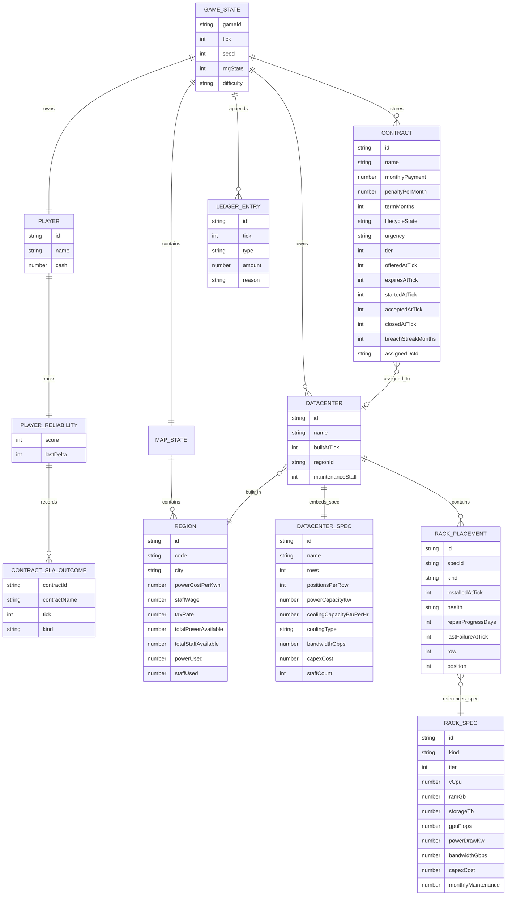
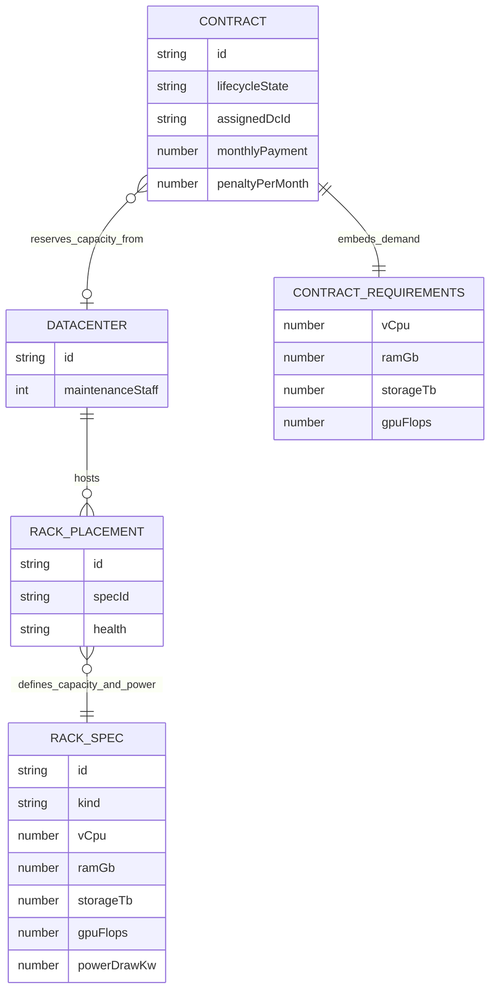

# Game Logic Architecture

This document explains how `@datacenter-tycoon/game-logic` is structured internally, which entities own which data, and how the main subsystems depend on each other.

For the monthly simulation pipeline, see [`./CORE_LOOP.md`](./CORE_LOOP.md).

## Design principles

The package is built around a few strict architectural rules:

- **`GameState` is the root aggregate**. Everything important to gameplay is persisted under it.
- **Simulation is deterministic**. All randomness flows through the seeded RNG in `src/sim/rng.ts`.
- **Catalogs are static data**. Blueprint-style definitions live in `src/catalog/`.
- **Derived views stay derived**. Capacity, rack activity, reliability outcomes, and contract buckets are recomputed from canonical state instead of being reimplemented in consumers.
- **State transitions are centralized**. Player commands go through `src/state/reduce.ts`; time progression goes through `src/sim/tick.ts`.

## Subsystem responsibilities

| Area | Files | Responsibility |
| --- | --- | --- |
| Shared types | `src/types.ts` | Canonical shapes for persisted state and derived views |
| Catalogs | `src/catalog/*` | Static datacenter, rack, and region blueprints |
| Balance | `src/balance/*` | Difficulty, maintenance, power, reliability, and easing constants |
| Entities | `src/entities/*` | Placement validation, capacity aggregation, regional resource checks |
| Contracts | `src/contracts/*` | Offer generation, acceptance, lifecycle, SLA/reliability outcomes |
| Economy | `src/economy/*` | Capex, move costs, opex, power billing, monthly revenue |
| Simulation | `src/sim/*` | RNG, map generation, maintenance/failure simulation, monthly tick orchestration |
| State | `src/state/*` | `newGame()` factory and reducer-based command handling |
| Save/load | `src/save/*` | Versioned JSON serialization |

## Dependency direction

At a high level, the package is layered like this:

1. **`types`** defines the shared language.
2. **`catalog`** and **`balance`** provide static inputs.
3. **`entities`** derives capacities/usages and validates physical constraints.
4. **`contracts`** and **`economy`** use those entity helpers to model business behavior.
5. **`sim`** orchestrates time-based changes across maintenance, contracts, economy, and RNG.
6. **`state`** is the gameplay command surface that calls into the lower layers.
7. **`save`** persists the resulting `GameState`.

In practical terms:

- `state/reduce.ts` is the command router for build/place/move/accept/cancel/tick actions.
- `sim/tick.ts` is the only place that advances time.
- `contracts/lifecycle.ts` is the canonical contract classification layer.
- `economy/opex.ts` is the canonical monthly money calculation layer.
- `entities/datacenter.ts` is the canonical physical-capacity and placement layer.

## Canonical persisted entity graph

The main persisted object graph looks like this:

### Important ownership notes

- **`GameState.contracts` is the canonical contract collection.**
  - `contractMarket` and `activeContracts` still exist in state, but they are deprecated compatibility views maintained by `withDerivedContractViews()`.
- **`Datacenter.spec` is embedded by value** when a datacenter is built.
  - This means a datacenter carries the full blueprint snapshot it was created with.
- **`RackPlacement` stores only `specId`**, and runtime helpers resolve the full rack spec from `RACK_CATALOG`.
- **`MapState.regions` is runtime data**, not a direct pointer to `REGION_CATALOG`.
  - `newGame()` calls `generateMap(seed)`, which clones base regions and applies deterministic per-seed variation.
- **`Contract.requirements` is embedded value data** (`vCpu`, `ramGb`, `storageTb`, `gpuFlops`), not a separate entity.

## Capacity and commitment relationships

The most important gameplay relationship is the one between physical rack supply and contract demand.

That relationship is implemented through a few canonical helpers:

- `datacenterInstalledCapacity(datacenter)`
  - sums all racks, regardless of health.
- `datacenterCapacity(datacenter)`
  - sums only **healthy** racks.
- `datacenterCommittedContractDemand(datacenter, contracts)`
  - sums requirements of **live** contracts assigned to that datacenter.
- `datacenterContractCapacitySummary(datacenter, contracts)`
  - computes `installed`, `usable`, `committed`, and `available` together.

This is why contract acceptance and monthly revenue are separate checks:

- **Acceptance** checks `available` capacity against live commitments.
- **Monthly revenue** checks whether the datacenter's current healthy capacity can still cover the full live demand after failures/repairs.

## Runtime command architecture

There are two main entrypoints into the model:

### 1. Player-driven actions: `reduce(state, action)`

`src/state/reduce.ts` is the command layer for:

- `BuildDatacenter`
- `PlaceRack`
- `RemoveRack`
- `MoveRack`
- `AcceptContract`
- `CancelContract`
- `SetMaintenanceStaff`
- audio/speed/pause settings
- `Tick`

The reducer does not duplicate domain rules. It delegates to lower-level helpers such as:

- `canBuildInRegion()`
- `canPlaceRack()`
- `calculateMoveCost()`
- `applyCapex()`
- `acceptContract()`
- `tick()`

### 2. Time-driven progression: `tick(state)`

`src/sim/tick.ts` is the monthly orchestrator. It is the only place that advances:

- rack failures and repairs
- opex and revenue
- contract breach/completion/cancellation
- player reliability
- contract market expiry/backfill

See [`./CORE_LOOP.md`](./CORE_LOOP.md) for the exact order.

## Module deep dives

If you need to understand a specific architectural concern, start here:

- **Root state and canonical entities**: `src/types.ts`
- **Action flow / command entrypoint**: `src/state/reduce.ts`
- **Initial world construction**: `src/state/newGame.ts`
- **Monthly orchestration**: `src/sim/tick.ts`
- **Placement and capacity rules**: `src/entities/datacenter.ts`
- **Regional build/staff constraints**: `src/entities/region.ts`
- **Contract lifecycle and selectors**: `src/contracts/lifecycle.ts`
- **Contract market generation and acceptance**: `src/contracts/market.ts`, `src/contracts/generator.ts`
- **Reliability updates**: `src/contracts/reliability.ts`
- **Opex, power billing, and revenue math**: `src/economy/opex.ts`, `src/economy/rack-activity.ts`
- **Aging and repair logic**: `src/sim/maintenance.ts`
- **Persistence shape**: `src/save/serialize.ts`

## Architectural invariants worth preserving

When editing the package, these invariants are doing a lot of work:

1. **One root source of truth**: `GameState`.
2. **One canonical contract list**: `GameState.contracts`.
3. **One command entrypoint**: `reduce()`.
4. **One time entrypoint**: `tick()`.
5. **One RNG stream**: `rngState` -> `rngFromState()` -> updated `rng.state()`.
6. **One capacity model**: derived from datacenter placements plus rack catalog specs.
7. **One monthly money model**: `tickOpex()` + `tickRevenue()` + tax pass in `tick()`.
8. **One JSON-serializable persisted state shape**.
